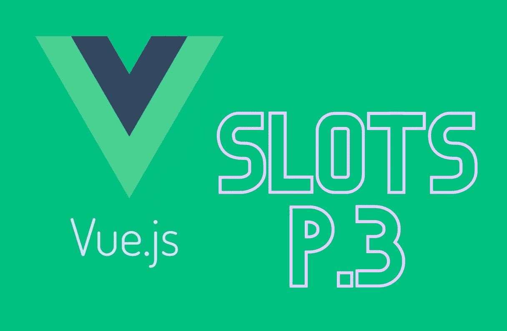
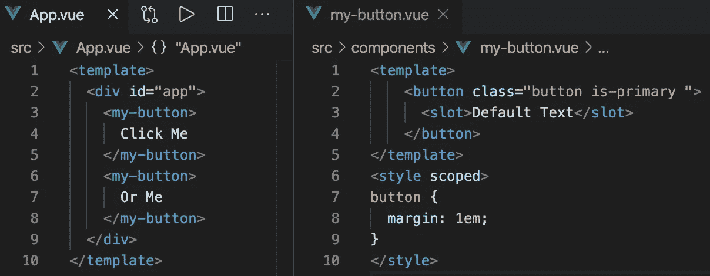
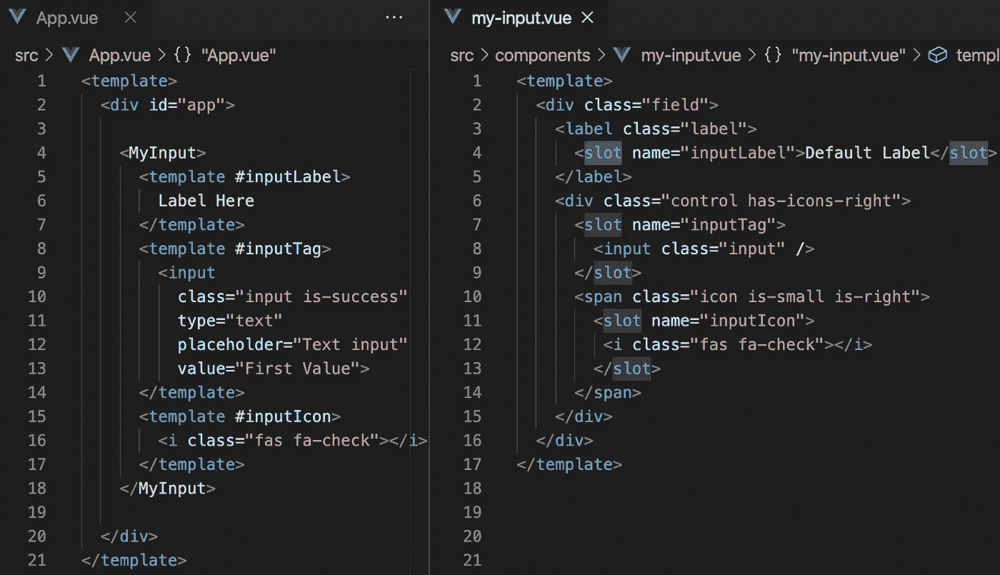
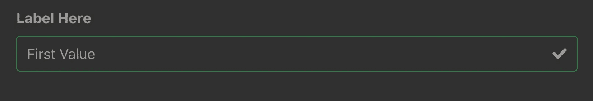
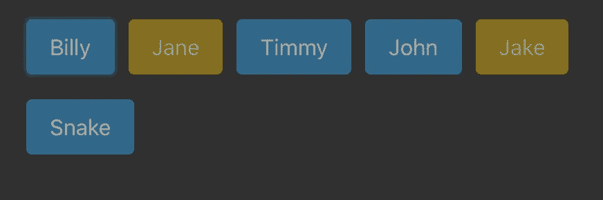
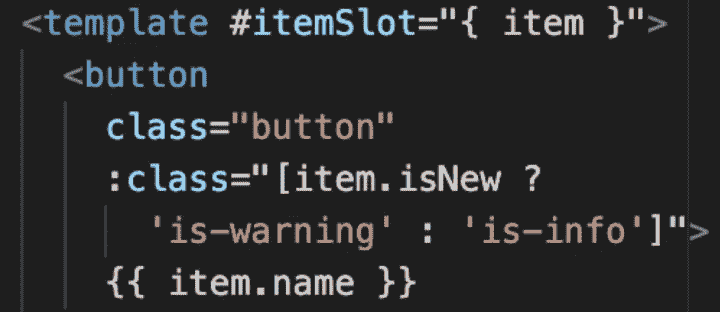

# 使用 Vue.js 插槽:第 3 部分

> 原文：<https://javascript.plainenglish.io/using-vue-js-slots-part-3-bb68888c0a22?source=collection_archive---------7----------------------->

在 Vue.js 中使用插槽构建可重用模式的一些简单和复杂的例子

本文是系列文章的一部分。参见 [*第一部分*](https://medium.com/@samotleriche/using-vue-js-slots-part-1-4813dc835ca9) *和* [*第二部分*](https://medium.com/@samotleriche/using-vue-js-slots-part-2-f4a91baa5b7d) *复习老虎机。*

既然我们已经回顾了插槽是如何工作的，甚至涵盖了作用域插槽的更复杂的方面，那么让我们来看一些真实的用例。

## 构建可重复使用的按钮

作为我们的第一个例子，我们构建并设计了一个简单的按钮。也许你想让你的按钮有统一的风格；通过这种方式，您可以简单地使用 my-button 组件，并将一个字符串传递给插槽。现在你有了一个没有太多代码的漂亮按钮。

这个老虎机的例子我们已经见过很多次了。这是对插槽的直接使用，我们只需将 HTML 输入到组件中。下面是一个稍微复杂一点的例子。在这种情况下，我们使用命名槽，以便在使用组件时将内容放入特定的位置。

The content inside each <template></template> in App.vue is sent to its respective named slot. The #inputName is shorthand for v-slot:

我们可以看到如下所示的输入字段，其中的值被正确地输入到它们的槽中。请记住，我们还在<myinput>组件中提供了默认值，这样即使我们忘记将值传递给插槽，也会显示默认值。现在我们有了一个可重用的方法来创建这个输入字段，并且它的样式可以保持更加统一。</myinput>

## 构建可重用列表组件

现在我们可以继续看一个更复杂的例子，看看 Vue.js 插槽可以实现什么。这里我们需要利用吃角子老虎道具。要查看这些是如何工作的，请参见之前的文章[这里](https://medium.com/javascript-in-plain-english/using-vue-js-slots-part-2-f4a91baa5b7d)。

我们可以看到我们已经创建了一个可重用的列表组件。我们能够将任何对象数组作为普通属性传递给 GenList 组件，然后我们能够用我们希望如何格式化传递下来的数组中的每个单独的项来填充这个槽(名为 itemSlot)。在本例中，我们将每个项目制作成一个按钮，项目名称位于中心。

因为我们使用了插槽道具，所以我们能够使用插入插槽的模板中的项目。本质上，我们已经实现了它，现在我们有一个可重用的方法来列出一个对象数组，并传递我们想要的列表项格式化的精确方式。

通常情况下，如果没有 slot props，这是无法实现的，因为当您使用{{ item.name }}时，它将查找在具有名称 item 的组件的数据或 props 中声明的项目。

例如，左边的代码编译得很好，没有警告。最下面的{{ item.name }}显示组件中声明的项目。但是，GenList 组件中的{{ item.name }}由 slot prop 填充。

## 感谢大家的阅读！我希望你学到了新东西。

Slot props 允许你在 Vue.js 中做一些令人惊奇的事情，它们被用在大多数你可能已经使用的组件库中，比如 Vuetify 和 Bootstrap Vue。对它们如何工作有一个完整和流畅的理解将允许你更有效地使用这些库，并将使你成为一个熟练的 Vue.js 开发者。

请随意查看第[部分第 1](https://medium.com/@samotleriche/using-vue-js-slots-part-1-4813dc835ca9) 和第[部分第 2](https://medium.com/javascript-in-plain-english/using-vue-js-slots-part-2-f4a91baa5b7d) 部分，了解关于老虎机的这篇文章的精彩介绍。