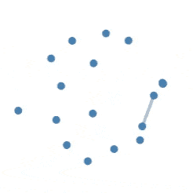
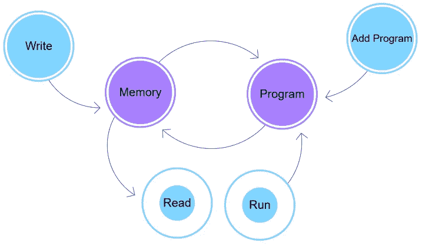
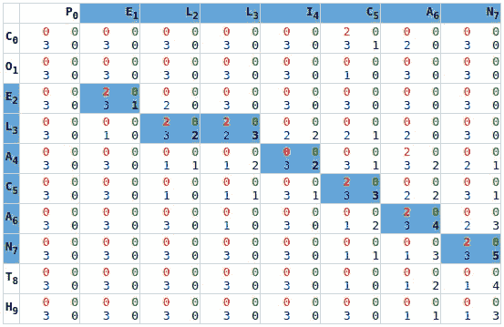
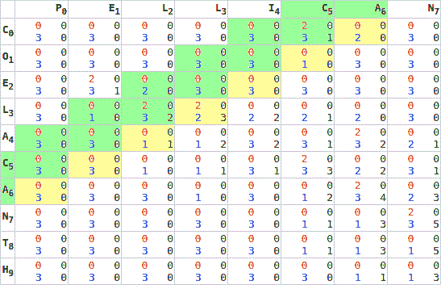
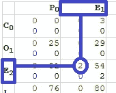
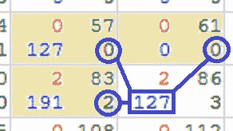
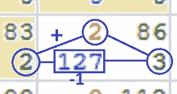
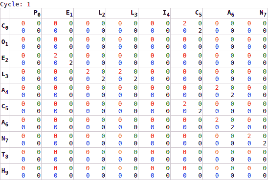
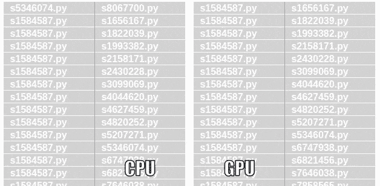

# 利用 WebGL 解决一个实际问题

> 原文：<https://javascript.plainenglish.io/using-webgl-to-solve-a-practical-problem-751c186889aa?source=collection_archive---------4----------------------->

## 虚拟程序员介绍(使用史密斯-沃特曼算法)

前一段时间，我在教 python 入门和基本的浏览器编程。在这段时间里，我写了一个应用程序来比较软件代码的片段，并在一个力导向和龙卷风图中展示了它们的相似性。我半定期(每周)运行这个软件，很早，我的解决方案出现了一个重大问题。

解决这个问题花了很长时间。一只**真的**长时间了。一个**痛苦地**漫长的时间。

我需要找到一种方法来加快处理速度。



The points are computer programs, and the orange line represents the progress of a comparison. With 36 comparisons, this takes … long enough that I get bored.

在我编写这个工具的时候，GPU 处理非常热门，每个人都在谈论这将如何加速一切。无论是什么问题，GPU 都是答案。这是一个明显的调查途径。然而，我已经决定在浏览器中编写这个工具(法律和道德约束)，浏览器不能直接访问底层硬件。

因此，如果所有酷孩子都在使用 GPU，并且这是在浏览器中编写的，我非常好奇…

看起来我正在学习 WebGL 和 GLSL。

 [## WebGL 演示

### 因为 WebGL 自然地处理 4 个内存寄存器(RGBA)，所以我们将这些用于(4？)存储位置。这也使得…

jefferey-cave.gitlab.io](https://jefferey-cave.gitlab.io/miss/webgl.html) 

> 自从写了 [M.I.S.S.](https://jefferey-cave.gitlab.io/miss/) 之后，Google 发布了 tensorflow.js，也有了 gpu.js 和 twgl.js 等其他工具。虽然我选择直接用 WebGL 编写，但这些库提供的计算抽象层通常很有用。
> 
> WebGL 不是一种计算语言……但这何时停止了冒险。

## 先决条件

在开始之前，你应该熟悉编程。演示是用普通的浏览器 JavaScript 编写的，所以没有使用特别高级的技术；然而，使用 WebGL 需要在两种语言之间切换，并编译代码。Web 编程通常不涉及那些东西。

你应该稍微熟悉的唯一编程技术是“细胞自动机”:[康威的《生命的游戏》](https://en.wikipedia.org/wiki/Conway%27s_Game_of_Life)是这方面的经典例子。50 年来，它一直是编程教师的主食，因为问题相对简单，解决方案足够复杂，可以锻炼学生的技能，而且输出也很有趣。

此外，我强烈建议去当地的办公用品商店，买一只便宜的铅笔、橡皮擦和格子纸垫。没有什么比自己解决问题更能增进理解了。

# GPU 如何加快处理速度

GPU 是与 CPU 完全不同的机制。CPU 的设计是为了给人们提供许多操作，并允许你一次运行一个。GPU 提供更少的操作，但是以一种你可以同时运行它们的方式设置它们(并行处理)。

这对我们程序员来说有几个不同的代价。

1.  就像在不同的电脑上工作一样。
2.  我们为一个写的指令，不一定存在于另一个上。

这很烦人，但是…并行处理:只要它们都运行相同的指令集，你就可以同时运行一个计算几千次。非常简单地说:

**GPU 做单个函数的并行处理。**

从技术上讲，这个函数被称为“内核”，在我的代码中我称它为“程序”。

考虑以下函数:

```
function MultiplicationTable(size=10){ 
    let table = Allocate2DArray(size);
    for(memLoc.x=0; memLoc.x < list.length; memLoc.x++){
        for(memLoc.y=0; memLoc.y < list.length; memLoc.y++){
            **table[memLoc.x][memLoc.y] = memLoc.x * memLoc.y;**
        }
    }
    return table;
}
```

GPU 上的并行处理是指同时执行相同的操作。在这种情况下，乘法是一个始终如一的过程。

我将只做一些基本的数学计算:一个`10 x 10`数组花费我们 100 个单位的处理时间。

现在考虑使用 GPU 的处理

```
function MultiplicationTable(size=10){
    let table = Allocate2DArray(size);
    table = gpu(table)
        .forEach((memLoc)=>{**return memLoc.x * memLoc.y;**});
    return table;
}
```

无论是`10x10`还是`10000x10000`，该`forEach`都花费一(1)个单位的处理时间。

我编了那个代码，它不会工作，但是它确实给了你一些我们努力工作的想法。无论我们制造多大的`table`,都需要 1 个单位的处理时间。

# 使用 GPU

GPU 在机械上不同于 CPU。

由于这种机械差异，将 GPU 视为一台完全独立的计算机是很有用的。你不仅有单独的处理单元(GPU 而不是 CPU)，它还使用单独的内存，和单独的指令集。

分离的这三个要素意味着我们需要经历三个主要阶段来利用它们:



1.  在 GPU 空间发送指令(编译)
2.  与 GPU 空间交换内存(传输—读/写)
3.  执行指令(执行)

管理这三个阶段是使用 WebGL 最困难和复杂的部分。仅仅为了与另一个空间交换信息，就需要处理大量的细节。

部分原因是 GPU 和 WebGL 中的`G`代表“图形”。我们正在尝试使用一些为处理图像而设计的东西来进行一般的计算。需要管理的细节围绕着定义图像的元素；这意味着我们需要经历一个用图像来描述原始数据的过程。

通过创建将为我们描述数据的助手函数，简化了这一过程。

## psGPU

在`WebGL.html`中，就设置了这样一个助手类，叫做`psGPU [[webgl.html:158](https://gitlab.com/jefferey-cave/miss/blob/medium-practicalwebgl/www/webgl.html#L158-457)]`。它有几个功能来抽象掉大部分配置:

1.  `addProgram`:编译并发送一段 GLSL 代码(字符串)到 GPU 空间。`[[webgl.html:384](https://gitlab.com/jefferey-cave/miss/blob/medium-practicalwebgl/www/webgl.html#L384-456)]`
2.  `initMemory`:创建一个隐藏的图像，作为我们的处理记忆`[[webgl.html:289](https://gitlab.com/jefferey-cave/miss/blob/medium-practicalwebgl/www/webgl.html#L289-346)]`
3.  `write`:将我们的记忆(`UInt8Array`)转移到 GPU 空间`[[webgl.html:254](https://gitlab.com/jefferey-cave/miss/blob/medium-practicalwebgl/www/webgl.html#L254-264)]`
4.  `read`:将我们的记忆从 GPU 空间转移回来`[[webgl.html:241](https://gitlab.com/jefferey-cave/miss/blob/medium-practicalwebgl/www/webgl.html#L241-252)]`
5.  `run`:执行我们编译的程序`[[webgl.html:266](https://gitlab.com/jefferey-cave/miss/blob/medium-practicalwebgl/www/webgl.html#L266-287)]`

作为一个新手，这些功能对于设置 GPU 变得至关重要。我对实现一个算法非常感兴趣，内存管理的复杂性极大地分散了我想关注的复杂性。

## `pixel`

在某个时候，第二个助手类被创建，称为`pixel`。`[[webgl:96](https://gitlab.com/jefferey-cave/miss/blob/medium-practicalwebgl/www/webgl.html#L96-156)]`

通过读写交换的内存由一个字节数组组成。将图像解释为字节数组需要更多的助手。特别地，图像的每个像素被解释为 4 个字节，代表该像素的[红色、绿色、蓝色和 Alpha](https://developer.mozilla.org/en-US/docs/Web/CSS/color_value#rgba()) ( `rgba`)值。在 GPU 中，这些值由类型`vec4`表示，它是 4 个值的集合(`r`、`g`、`b`、`a`)。

为了帮助在 CPU/GPU 边界上保持一致的命名，创建了 pixel 类。pixel 类实际上只是方便将返回的`UInt8Array`映射到代表给定像素的 4 个字节，允许它们被相同的`rgba`符号引用。`[[webgl:102](https://gitlab.com/jefferey-cave/miss/blob/medium-practicalwebgl/www/webgl.html#L102-112)]`

## 绘图网格

可能最有趣的(也许“有用”是个更好的词)效用函数是`DrawGrid`。`[[webgl:828](https://gitlab.com/jefferey-cave/miss/blob/medium-practicalwebgl/www/webgl.html#L828-883)]`

因为 GPU 是为管理图像而设计的，所以检查内存变化的唯一方法就是查看图片。由于这个项目的目的与图像无关，颜色不是一种有意义的表现。这使得调试变得更加棘手。

为了有所帮助，`DrawGrid`只不过是将每个像素位置呈现为它们的底层数值。它大致相当于 JavaScript 的`console.log`，允许开发人员将一组值转储到一个可见的位置进行检查。

通过将它(和一个断点)放在内核`run`之后，可以最有效地使用它。测速的时候别忘了注释掉。

## 实际运行

一旦助手就位，定义我们的处理函数并以正确的顺序调用它们就很简单了。

1.  发送 GPU 空间中的指令
2.  与 GPU 空间交换内存
3.  执行指令

给定适当数量的助手代码，在 CPU 侧的实际代码部分*中没有留下大量要执行的指令。所有真正有趣的逻辑都应该移到 GPU 上；所有有趣的处理都应该驻留在内核定义中。*

在 CPU 端，我们将指令发送到 GPU ( `addProgram`)，然后反复发送通知执行函数(`run`)。

# 普遍的问题

比较代码的相似性是一个很好解决的问题。“比较指令序列，同时考虑到小的变化”，听起来非常类似于 DNA 比较。

在遗传学的世界里，[序列比对](https://en.wikipedia.org/wiki/Sequence_alignment)算法已经存在很长时间了( [Needleman-Wunsch](https://en.wikipedia.org/wiki/Needleman%E2%80%93Wunsch_algorithm) 大约可以追溯到 1970 年)。比较 DNA 序列的相似性，同时考虑到由于突变或交换引起的微小差异是一个共同的目标，这也是我们试图解决的问题。把这想象成软件的亲子鉴定。

就我而言，我进行了史密斯-沃特曼的比较。

理解一个算法最好的方法就是用铅笔和纸来解。在这种情况下，我花了大量的时间，从当地的便利店买了一支铅笔、一块橡皮和一沓网格纸。

取两种动物的名字:`[coelecanth](http://slideplayer.com/slide/5142106/16/images/21/Smith-Waterman-Algorithm.jpg)` [和](http://slideplayer.com/slide/5142106/16/images/21/Smith-Waterman-Algorithm.jpg) `[pellican](http://slideplayer.com/slide/5142106/16/images/21/Smith-Waterman-Algorithm.jpg)`。

从表面上看，它们看起来并不相似，然而，仔细观察(令人惊讶地)会发现它们确实排列得相当好:

```
c o **e . l e c a n** t h
p . **e l l i c a n**
```

通过编程，我们可以通过求解 Smith-Waterman 矩阵找到这种排列:



为了理解如何机械地解决上面的排列，我建议遵循维基百科上给出的[例子。我的意思不是去阅读维基百科页面，我的意思是拿出那张网格纸，为你自己复制这个例子。求解每一步，并对照示例进行验证。如果你犯了一个错误，花些时间理解你的错误，然后重新开始。](https://en.wikipedia.org/wiki/Smith%E2%80%93Waterman_algorithm#Example)

当你能自己解决一个史密斯-沃特曼问题时，你就证明你理解了它。

虽然下面详细讨论了实现，但是有必要对所涉及的两个过程中的一个有一个直观的理解；试图同时学习两者更难。如果您对如何在 GPU 上实现算法感兴趣，了解示例算法是非常有用的。如果您已经是 GPU 的大师，并且对如何实现 Smith-Watermans 感兴趣，这个非常基本的例子可能是一个很好的敲门砖。

# 放在一起

这并不容易。使用 GPU 需要我们并行思考，这需要我们以我们通常不习惯的方式思考。在线性处理中我们认为理所当然的事情对我们来说是不存在的；我们通常会避免的事情，我们为了能够使用工具而接受。

如何做到这一点的想法实际上来自我最喜欢的大学作业之一:康威的生活游戏(GoL)。在 GoL 中，每个生命形式位置根据其最近邻居的状态改变其状态。这通常在屏幕上用数值表表示的网格中解决。

这句话的关键是，每个自动机细胞都有一个独立于所有其他细胞的状态，并基于其最近邻居的值。这也很好地描述了史密斯-沃特曼。唯一真正的变化是 Smith-Watermans 只考虑左上角的相邻单元(北、西、西北)。

在能够计算值之前，需要计算这些“父”值，这代表了并行化算法的挑战之一:不能并行计算从属值。思想上的第一个突破是我在网上找到的一个动画 GIF，它展示了 SW 矩阵中数值的对角线平行化。(原参考现在已经失传到记忆深处了…如果知道的话，留下评论)

更糟糕的是，我最初优化我的算法是为了降低内存消耗。为了做到这一点，如果给定的细胞不是链的一部分，我已经最大限度地释放了与它相关的早期记忆。使用 GPU 的挑战之一是确定一种方式来安排内存，以便只对具有完整父集的元素执行计算。



Working diagonally, allows us to maintain sufficient parent cells (green) to calculate a number of child cells (yellow) in parallel. Processing this on the GPU means that all of the other cells (white) will be calculated for no reason. A reasonable trade-off.

这种对优化的关注让我忽视了一个事实，即不管矩阵的大小如何，用 GPU 评估矩阵的成本都是 1。使用 CPU 计算的原始速度需要一次评估一个单元:`width * height`处理时间。使用 GPU，每次计算所有的元素感觉像是浪费工作，但在某个时候，我的虚拟程序员大脑开始意识到这仍然只是`width **+** height`处理时间。

谁在乎浪费一堆处理*努力*当它节省那么多*时间*！？

虽然我肯定会提高效率，但与不必要地评估单元直到整个矩阵被求解的速度增加相比，这是微不足道的。

一旦接受了这种情况，就有理由创建 GPU 函数(或“内核”)`smithwaterman`，它可以求解单个二维矩阵单元`[[webgl:528](https://gitlab.com/jefferey-cave/miss/blob/medium-practicalwebgl/www/webgl.html#L528-586)]`。还创建了一个初始化程序，用于计算初始匹配值`[[webgl:687](https://gitlab.com/jefferey-cave/miss/blob/medium-practicalwebgl/www/webgl.html#L687-710)]`。

首先要注意的是整个程序作为`string`传递给`addProgram` 。这是为了让 GPU 编译代码，但不幸的是，这意味着没有语法高亮显示。它还会导致关于无效语法的非常隐晦的消息。建议您在进行更改时，尽量小一些，以确保您可以识别出语法错误发生的位置。

算法本身在实现上非常小…

## 初始化存储器

在我们开始处理值之前，我们需要将值传输到 GPU。当`addProgram`用于将代码写入 GPU 时，写入内存由`write`函数执行。我们首先获取一个适当大小的数组，然后只填充数组`[[webgl.html:735](https://gitlab.com/jefferey-cave/miss/blob/medium-practicalwebgl/www/webgl.html#L735-744)]`的**顶部**和**左侧**部分。这通过将迭代部分留给 GPU 来最小化 CPU 周期。



The initial Matrix score is done by comparing the extreme North and West values. Matches get a base score of 2 while everything else is set to 0.

我们的第一个 GPU 任务(`initializeSpace`)是比较这些匹配值的交集`[[webgl.html:687](https://gitlab.com/jefferey-cave/miss/blob/medium-practicalwebgl/www/webgl.html#L687-710)]`。对于每个单元格，我们查找最西边和最北边`[[webgl.html:700](https://gitlab.com/jefferey-cave/miss/blob/medium-practicalwebgl/www/webgl.html#L700-701)]`的值，并为匹配分配`2`点，为不匹配分配`0`点`[[webgl.html:707](https://gitlab.com/jefferey-cave/miss/blob/medium-practicalwebgl/www/webgl.html#L707)]`。该分数存储在`red`通道中。

值得注意的是，GPU 是根据分数值(`float`)进行处理的:一切都是 1 的一部分。因此，虽然分数是整数值`0`和`2`，但它们必须按比例消耗。这些值实际上是作为`0.0/255.0`和`2.0/255.0`传递给函数的，这使得它们很容易在`UInt8`和`float`之间转换。

这是一件需要记住的重要事情。出于该算法的目的:

*一切 GPU 端都是把数字当做浮点数，但是返回的内存是整数。*

## 求解矩阵

Smith-Waterman 构建了一个代表“最佳”匹配的价值链。在这种情况下，“最佳”被定义为具有最高运行分数的邻居。

第一步是查找最近的邻居，这需要我们确定这些邻居有多近。GPU 是按照分数值来思考的(`float`)，而我们是按照离散值来思考的(`int`)。我们需要计算一个内存位置(一个像素)的分数大小`[[webgl.html:544](https://gitlab.com/jefferey-cave/miss/blob/medium-practicalwebgl/www/webgl.html#L544)]`。完成后，我们可以查找当前单元格的值(`here`)及其最近的邻居(`nw`、`n`、`w` ) `[[webgl.html:548](https://gitlab.com/jefferey-cave/miss/blob/medium-practicalwebgl/www/webgl.html#L548-551)]`)。

一旦我们确定了重要的邻国，我们就可以开始评估它们的价值。这是通过检查所有三个来查看哪个分数最高，并将其临时存储在`blue`通道`[[webgl.html:562](https://gitlab.com/jefferey-cave/miss/blob/medium-practicalwebgl/www/webgl.html#L562-565)]`上来完成的。



Looking at the nearest neighbours (yellow) we can determine the direction of the match. In this case horizontal (127) is the best match. Values are stored as fractions of 255 (255/2 → 127).

知道哪个分数最高，允许我们确定哪个方向形成了链；对每个方向进行测试，看它是否形成所需的链。在分数相等的情况下，应该优先选择对角线比赛，因为水平和垂直比赛代表一个跳跃；水平和垂直关系可以任意解决。方向性由`1-north`、`2-west`、`3-northwest`的枚举表示，存储在`blue`通道`[[webgl.html:568](https://gitlab.com/jefferey-cave/miss/blob/medium-practicalwebgl/www/webgl.html#L568-576)]`上。

知道了链条的方向，我们现在可以计算出运行总数。链的运行分数被添加到本地匹配分数；从逻辑上讲，这是在记录方向之后进行的，但是，由于每个单元只有 4 个存储位置，所以在我们最终确定方向`[[webgl.html:565](https://gitlab.com/jefferey-cave/miss/blob/medium-practicalwebgl/www/webgl.html#L565)]`之前，从`blue` 通道上存储的临时值中提取。我们还对必须执行跳过操作(非对角线方向)`[[webgl.html:579](https://gitlab.com/jefferey-cave/miss/blob/medium-practicalwebgl/www/webgl.html#L579)]`的链应用“跳过”惩罚(-1 分)。



Having identified the parent, we can add the running score, to the local score, and apply any skip penalties. In this case (`2+2-1`), which then gets stored on the current alpha channel.

一旦计算完成，这些值将永久保存在`alpha`通道`[[webgl.html:584](https://gitlab.com/jefferey-cave/miss/blob/medium-practicalwebgl/www/webgl.html#L584)]`的当前单元格中。值得回顾的是，每个单元有 4 个存储单元，以及我们是如何分配它们的:

*   `red`:本地匹配分数
*   `green`:未使用(留作将来使用)
*   `blue`:链条方向
*   `alpha`:连锁评分



This diagram shows the calculation wave as it moves across the matrix. Green values represent cells with sufficient information to solve, yellow values represent values that have settled into their final state, and white values are ones that are indeterminate. Every cell is calculated on every cycle. Using this pattern, we can reduce the number of required cycles from ``x*y`` to ``x+y``.

如前所述，只执行一次这个过程是不够的。当我们计算每个单元的链分数时，没有足够的信息供最后一个单元完成其链计算，直到它的邻居完成其计算。为了解决这个问题，我们多次运行 GPU 处理:首先计算所需的最坏情况周期数`[[webgl.html:518](https://gitlab.com/jefferey-cave/miss/blob/medium-practicalwebgl/www/webgl.html#L518)]`，然后向 GPU a 循环发送处理信号`[[webgl.html:752](https://gitlab.com/jefferey-cave/miss/blob/medium-practicalwebgl/www/webgl.html#L752-755)]`。GPU 处理的每一次迭代都将已完成计算的“浪潮”向前推进一步。

一旦这个循环完成，并且这个波的尖端到达我们矩阵的右下角，计算的第一阶段就完成了。最重要的是，它是在`x+y`个周期内完成的，而不是`x*y`个周期。虽然测试样本太小，无法获取准确读数(在大多数浏览器中分辨率为 1 毫秒)，但`animals`样本从 10 毫秒增加到 1 毫秒以下，而`lorem`样本从 5.5 秒增加到 1 毫秒左右，没有为`identical`、`longchain`或`gilbertsulivan` `[[webgl.html:477](https://gitlab.com/jefferey-cave/miss/blob/medium-practicalwebgl/www/webgl.html#L477-501)]`获取初始读数。

即使考虑到显著的测量误差，这也是一个显著的进步！



We can see a significant improvement in speed in just the first 30 seconds of processing.

# 结论

我再也找不到来源了，但是网络上对图形处理器最好的浏览之一来自一个会议谈话的视频

> 如果你觉得这是一个肮脏的黑客攻击，那是因为它是。
> 
> —如果您知道该视频，请留言

其中一些肯定有肮脏黑客的感觉，例如，在所有提及`RGBA`的地方工作感觉很奇怪。WebGL 是为图形设计的，而不是计算。对于喜欢冒险的人来说，这给了他们一种兴奋和挑战的感觉。

我发现这让我回到了我在“c”工作的(非常短暂的)日子，那里的记忆操作更近了一点。符合`vec4`记忆(`rgba`)真的会鼓励你想出新的方法来使用(和滥用)你使用记忆的方式，或者重新使用记忆，或者将多余的`bit`信息压缩到未完全使用的`byte`中(其中大部分已经被重构出例子)。

虽然几十年来我一直喜欢康威的生活游戏，但我从未想过我会为细胞自动机找到一个实用的目的。注意到这个问题和 GoL 之间的相似性后，我现在想重温一次在 JavaScript 中实现雾化颗粒分散模型的个人尝试(我的已经不见了，[这个非常酷](https://omrelli.ug/smoke.js/))。

最后，对我来说，最有教育意义的部分是铅笔和网格纸的价值。很多调试都围绕着用铅笔求解网格，然后将手工求解的矩阵与程序的解进行比较。

用手解决史密斯-沃特曼问题也像做一个巨大的数独或填字游戏……有点好玩。

# 下一步

1.  在浏览器中打开
2.  点击`F12`
3.  插入断点
4.  开始逐句通过代码

在这种情况下，我实际上建议先保存一个本地副本，以便您可以做一些小的更改来查看效果。

通过在 GPU 上实现该算法，我看到了显著的性能提升:速度提高了大约 5000 倍。然而，我越是思考这个问题，我就越能找到改进的方法。

另一方面…

这个工具是作为满足个人需求的个人实用工具编写的。在人们对 [M.I.S.S.](https://jefferey-cave.gitlab.io/miss/) 更感兴趣之前，很可能没有理由实现性能提升。

这已经够快了……就目前而言。

## 环

我怀疑我在循环中调用`run`是低效的。很可能，将循环作为 GPU 代码的一部分来实现会更好。但是，有两个原因我没有这样做:

1.  当前的实现允许定期读取数据，允许可视化的进度条(橙色连接器)。
2.  输入和输出内存是在执行之前声明的。在辅助函数中，每次运行后，输入内存和输出内存都会交换。我不知道如何在单次执行的情况下做到这一点。

这些问题似乎都不是不可克服的。

## 链式分辨率

史密斯-沃特曼呼吁分两个阶段

1.  建造锁链
2.  解开锁链

这篇文章有意忽略了史密斯-沃特曼的第二阶段；从内存中读取链的代码。M.I.S.S .中的当前实现使用纯 CPU JavaScript 来解析链。然而，最近在办公室的一次讨论让我重新思考这是如何做到的，并启发我重写链解析函数以更多地使用 GPU。

我鼓励读者看看 GPU 函数`chain` `[[webgl.html:588](https://gitlab.com/jefferey-cave/miss/blob/medium-practicalwebgl/www/webgl.html#L588-685)]`来看看它的实现。它使用了与已经讨论过的`[[webgl.html:763](https://gitlab.com/jefferey-cave/miss/blob/medium-practicalwebgl/www/webgl.html#L763-768)]`非常相似的技术。

## 内存消耗

在内存中建立一个二维矩阵意味着`height` **乘以** `width`。这将取决于你的投入而快速增长。此外，随着令牌数量的增长，代表它们的数字有超过 65535 (2 字节)的风险。

我对代码进行的最初验证测试之一是对`[E.Coli](https://www.ncbi.nlm.nih.gov/nuccore/CU651637.1?report=fasta)`和`[Y.Pestarius](https://www.ncbi.nlm.nih.gov/nuccore/AE009952.1?report=fasta)` `[[bigcompares.zip](https://gitlab.com/jefferey-cave/miss/blob/medium-practicalwebgl/www/samples/bigcompares.zip)]`的基因组进行比较。不幸的是，这消耗了内存，8TB 的阵列超出了我的笔记本电脑的能力。

我很想看到一个实现，将巨大的矩阵切割成一系列更小的*`16000x16000``2GB`？).这将确保它们永远不会消耗超过可用的内存，并且永远不会生成大于 2 字节的令牌标识符。*

*对于给定的区块，令牌可以被映射到不超过`UInt16`的索引。瓷砖可以独立解决(并行，如果你有一个以上的 GPU)，只存储他们的内部链和边缘。在链解析过程中，边可以被“缝合”在一起。*

*这是一个有趣的想法，我很乐意看到有人来执行它…*

# *进一步阅读*

*不幸的是，这大部分是在大约 2 年前作为个人项目完成的，所以我使用的许多参考资料和教程已经消失在时间的迷雾中(在我的例子中，“时间的迷雾”大约是 20 分钟)*

## *助手功能*

*如果这是你想要扩展的，我强烈建议你研究一下我的助手函数。有很多…事情…正在进行*

## *史密斯-沃特曼公司*

*最初，我只是尝试了 Java 实现的一个端口。不幸的是(或者幸运的是)，我移植的努力，加上我缺乏理解，导致了非功能性代码的混乱。调试的努力创造了我的理解，但导致的东西看起来一点也不像开始时的样子。*

*   *GitHub: [CheckSims](https://github.com/Checksims/checksims)*

*我的大部分知识来自于简单地浏览维基百科上给出的例子，以及我自己的例子。*

*   *维基百科:[史密斯-沃特曼](https://en.wikipedia.org/wiki/Smith%E2%80%93Waterman_algorithm)*
*   *维基百科:[康威的人生游戏](https://en.wikipedia.org/wiki/Cellular_automaton)*

*通过用 PoJS(普通的旧 JavaScript)编写代码来理解算法，而不增加 GPU 的复杂性。现在，我更好地理解了 GPU，我认为这将是更容易的解决方案…马后炮是 20/20，所以谁真的知道。*

## *WebGL*

*[WebGL 基础](https://webglfundamentals.org/):是我学习如何使用 WebGL 的主要教程*

*[Mozilla Developer Network](https://developer.mozilla.org/en-US/docs/Web/API/WebGL_API/Tutorial/Getting_started_with_WebGL) :是所有与浏览器相关的事实上的标准参考，包括 WebGL 的教程和通用参考。*

## *图书馆*

*WebGL 相对较新，而 [WebCL](https://www.khronos.org/webcl/) (Web 计算语言)仍然是一项正在进行中的工作。幸运的是，已经开发了相当多的库来使 WebGL 在计算上更加友好。*

*   *[tensorflow.js](https://www.tensorflow.org/js) :谷歌著名的机器学习库…用 JavaScript 实现*
*   *[TWGL](https://github.com/greggman/twgl.js) : `psGPU`本意是变成`TWGL`是什么。如果我要再次解决这个问题，我会使用这个库。*

**更多内容请看*[***plain English . io***](http://plainenglish.io)*