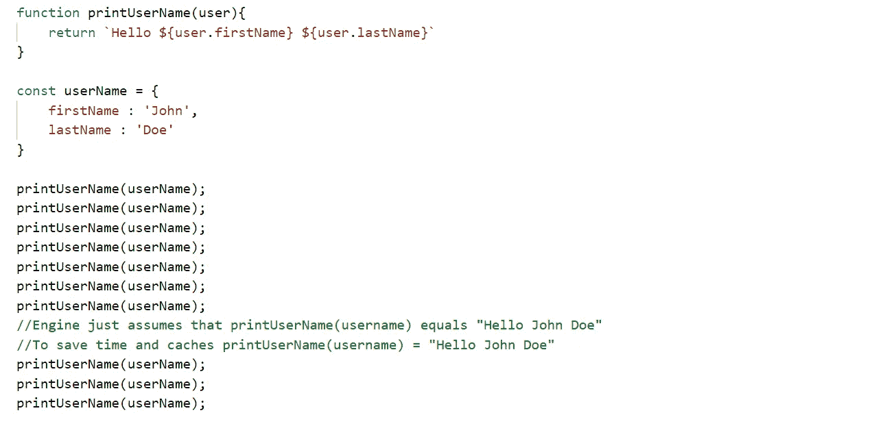

# JavaScript 中的 V8 引擎和内联缓存

> 原文：<https://javascript.plainenglish.io/v8-engine-and-inline-caching-in-javascript-fef80054a551?source=collection_archive---------1----------------------->

## 在 JavaScript 领域，内联缓存是一个很少讨论的话题，但是编写优化的代码是非常重要的。

在我们开始什么是内联缓存之前，我们需要知道为什么我们需要内联缓存。是的，我们需要缓存来加快速度，这我们都知道。好了，下一部分是内联缓存是如何发挥作用的？内联缓存的历史可以追溯到 Google V8 引擎。

第一个 JavaScript 引擎名为 SpiderMonkey，是为 Netscape Navigator 构建的，它只是一个读取和执行源代码的解释器。2004 年，当谷歌推出一款新应用时；谷歌地图。对于 JavaScript 和各地的开发者来说，这是一个游戏改变者。一个非常非常缓慢的游戏改变者。由于 JavaScript 引擎只是费力地处理所有这些代码，浏览器陷入了困境。

Photo by [Junior Teixeira](https://www.pexels.com/@junior-teixeira-1064069?utm_content=attributionCopyText&utm_medium=referral&utm_source=pexels) from [Pexels](https://www.pexels.com/photo/semi-opened-laptop-computer-turned-on-on-table-2047905/?utm_content=attributionCopyText&utm_medium=referral&utm_source=pexels)

> 为了克服这种缓慢，谷歌建立了自己的引擎——V8，现在为 Chrome 和 Node.js 提供动力。在 V8 之前，JavaScript 更像是一种解释语言，但谷歌将该语言从解释语言改为 JIT 编译语言。V8 有 2 个编译器，全代码和曲轴。Full-Codegen 将 JavaScript 直接解析为机器代码，不需要中间语言，允许它更快地开始执行。一个叫做曲轴的 JIT 编译器为热方法产生优化的代码。这意味着在同一个 V8 程序中，不同级别的优化代码同时并存。
> **曲轴才是速度真正的来源。**

现在我们继续我们的主题，即**内联缓存**。对于内联缓存，我们来看一个代码片段。

Inline Caching

我们来分析一下上面的代码是做什么的。我们创建一个函数，它接受一个参数并返回模板字符串。接下来，我们创建一个带有关键字——名字和姓氏——的用户名对象。现在，我们用 UserName 对象的参数多次调用函数 printUserName。

因此，V8 引擎或许多其他 JavaScript 引擎所做的是，首先它们像您所期望的那样正常运行函数。但是，经过一段时间后，当函数被重复调用时，他们会认为或表现得很聪明，只是将重复的函数调用等同于函数返回的内容，以节省时间并提高效率或速度。在这种情况下，它们等于

> **printUserName(用户名)=“你好 John Doe”**

这被称为内联缓存。因此，这整个内联缓存的要点是，在知道引擎或编译器将如何处理代码的情况下，编写更好、更高效的代码。我们应该编写代码，让机器知道我们想做什么。