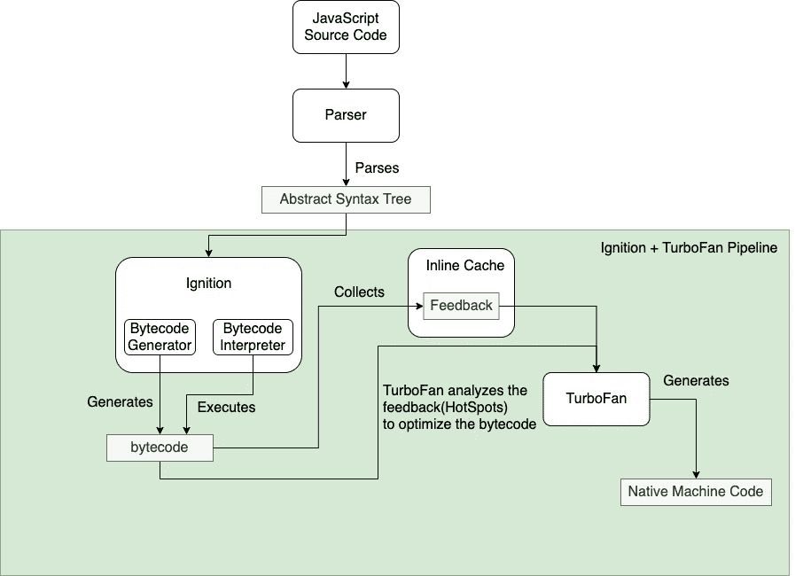
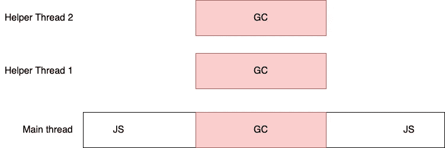
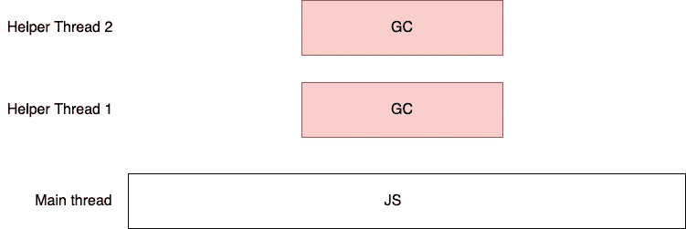

# 面向 Node.js 开发人员的 V8 概览

> 原文：<https://javascript.plainenglish.io/v8-for-node-js-developers-at-a-glance-129d7777456?source=collection_archive---------4----------------------->

# 什么是 JavaScript 引擎？

简而言之，JavaScript 引擎是执行 JavaScript 源代码的运行时。JavaScript 引擎应该具有以下组件:

**解析器**

解析器将 JavaScript 源代码编译成抽象语法树，在一些引擎中，解析器还将抽象语法树转换成一段中间字节码。

**翻译**

解释器接受、解释并执行由解析器生成的中间字节码。

**JIT 编译器**

JIT 编译器尽可能快地将中间字节码转换成机器码。

**垃圾收集器**

垃圾收集器负责垃圾收集。

**剖析器**

分析器收集引擎中的信息，以帮助提高引擎的性能和效率。

以下是一些流行的 JavaScript 引擎:

*   [V8](https://v8.dev/) ，谷歌的杰作，它支持基于 Chromium 的浏览器和 Node.js。
*   [苹果公司的 JavaScriptCore](https://github.com/WebKit/webkit/tree/master/Source/JavaScriptCore) ，用于基于 Webkit 的浏览器，如 Safari。
*   [Chakra](https://github.com/microsoft/ChakraCore) ，来自微软，由较新版本的 Internet Explorer 使用。
*   [蜘蛛猴](https://developer.mozilla.org/en-US/docs/Mozilla/Projects/SpiderMonkey)，由 Mozilla 开发，火狐使用。

# V8 简介

V8 是用 C++编写的 JavaScript 引擎，由 Google 开源。它运行在 Linux、macOS 和 Windows 上，是 Chrome 和 Node.js 的引擎。

V8 有 4 个关键部件:

## 句法分析程序

它将 JavaScript 源代码解析成抽象的语法树。

## 点火，翻译

它有两个关键组件:**字节码生成器**将抽象语法树转换成字节码，而**字节码解释器**解释(执行)字节码。

当 Ignition 执行字节码时，通过内联缓存收集一些反馈，比如字节码执行的次数。如果同一个字节码被多次执行，就会被标记为 **HotSpot** 并发送给涡扇做进一步优化。

## 涡扇发动机，JIT 优化编译器

涡扇将 HotSpot 字节码编译成机器码并存储。下次执行字节码时，会用机器码替换原来的字节码，大大提高了字节码执行的有效性。

此外，当涡扇确定一段字节码不再是热点时，它会执行一个去优化过程，丢弃优化后的机器码，然后返回点火。

整个工作流程如下所示:

## 奥里诺科河，垃圾收集器(GC)

V8 中以前的 GC 机制采用了简单的顺序停止世界(STW)方法，这对于一些关键任务应用程序来说是一场灾难。

Orinoco 没有放弃 STW 机制，而是采用了更聪明的方法来提高 GC 性能。它使用并行、并发和增量技术来显著减少主线程中垃圾收集的负担。

## 平行的

主线程和多个助手线程同时处理 GC 任务，因此总的停止时间缩短了。

## 同时发生的

主线程只执行 JavaScript，辅助线程在后台处理所有垃圾收集工作。

## 增加的

JavaScript 在主线程中间歇执行，垃圾收集工作被分成更小的片段。

