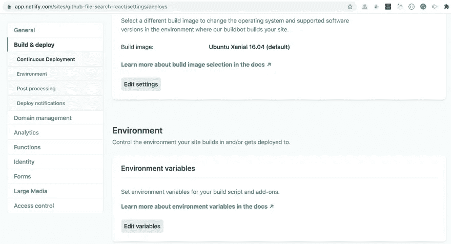

# React 和 Node.js 中处理环境变量的各种方式

> 原文：<https://javascript.plainenglish.io/various-ways-of-handling-environment-variables-in-react-and-node-js-5b9ce13aa7b1?source=collection_archive---------2----------------------->

## 了解使用环境变量保护应用程序数据的方法


Photo by [Fotis Fotopoulos](https://unsplash.com/@ffstop?utm_source=medium&utm_medium=referral) on [Unsplash](https://unsplash.com?utm_source=medium&utm_medium=referral)

使用环境变量对于保护您的私人信息非常重要。

它可能包含您的 API 密钥、数据库凭证或任何其他私有信息。总是建议使用环境变量来保证信息的安全，并且你不应该直接在你的代码中写它们。

此外，您需要确保将环境变量文件名添加到您的`.gitignore`文件中，这样当您将代码推送到存储库时，它不会被添加到您的 Git 存储库中。

让我们看看使用环境变量的各种方法

# 使用创建 React 应用程序

## 带单。环境文件:

如果你正在使用 create-react-app，那么要在你的应用程序中使用环境变量，你需要在你的项目的根目录下创建一个`.env`文件，每个变量名以`REACT_APP_`开头

Create React App 将确保在`.env`文件中声明的变量将在你的应用程序中可用，如果你以`REACT_APP_`开始命名它的话

例如，如果您的`.env`文件如下所示:

```
REACT_APP_CLIENT_ID=abcd2whdkd
REACT_APP_API_KEY=3edcb4f9dd472ds4b47914ddcfb1791e1e1ab
```

然后，您可以使用`process.env.REACT_APP_CLIENT_ID`和`process.env.REACT_APP_API_KEY`在 React 应用程序中直接访问变量

演示:[https://codesandbox.io/s/env-vars-create-react-app-mr0rl](https://codesandbox.io/s/env-vars-create-react-app-mr0rl)

## 有多个。环境文件:

如果您有多个`.env`文件，比如分别用于生产、UAT 和开发环境的`.env.prod`、`.env.uat`、`.env.dev`，那么只使用`REACT_APP_`作为环境变量名将不起作用。

假设您在应用程序中使用 firebase 数据库，并且您的 firebase 配置如下所示:

对于开发环境:

```
const config = {
  apiKey: 'AIdfSyCrjkjsdscbbW-pfOwebgYCyGvu_2kyFkNu_-jyg',
  authDomain: 'seventh-capsule-78932.firebaseapp.com',
  databaseURL: 'https://seventh-capsule-78932.firebaseio.com',
  projectId: 'seventh-capsule-78932',
  storageBucket: 'seventh-capsule-78932.appspot.com',
  messagingSenderId: '3471282249832',
  appId: '1:3472702963:web:38adfik223f24323fc3e876'
};
```

对于生产环境:

```
const config = {
  apiKey: 'AIzaSyCreZjsdsbbbW-pfOwebgYCyGvu_2kyFkNu_-jyg',
  authDomain: 'seventh-capsule-12345.firebaseapp.com',
  databaseURL: 'https://seventh-capsule-12345.firebaseio.com',
  projectId: 'seventh-capsule-12345',
  storageBucket: 'seventh-capsule-12345.appspot.com',
  messagingSenderId: '3479069249832',
  appId: '1:3477812963:web:38adfik223f92323fc3e876'
};
```

但是您不应该直接在您的应用程序中编写这些代码，因为任何人都可以将上面的配置复制粘贴到他们的应用程序中，并且可以操作您的 firebase 数据，所以您应该为 config 对象的每个属性创建一个环境变量并使用它。

如果您为生产环境创建一个`.env.prod`文件，它将如下所示:

```
REACT_APP_API_KEY=AIzaSyCreZjsdsbbbW-pfOwebgYCyGvu_2kyFkNu_-jyg
REACT_APP_AUTH_DOMAIN=seventh-capsule-12345.firebaseapp.com
REACT_APP_DATABASE_URL=https://seventh-capsule-12345.firebaseio.com
REACT_APP_PROJECT_ID=seventh-capsule-12345
REACT_APP_STORAGE_BUCKET=seventh-capsule-12345.appspot.com
REACT_APP_MESSAGING_SENDER_ID=3479069249832
REACT_APP_APP_ID=1:3477812963:web:38adfik223f92323fc3e876
```

您的`.env.dev`文件将如下所示:

```
REACT_APP_API_KEY=AIdfSyCrjkjsdscbbW-pfOwebgYCyGvu_2kyFkNu_-jyg
REACT_APP_AUTH_DOMAIN=seventh-capsule-78932.firebaseapp.com
REACT_APP_DATABASE_URL=https://seventh-capsule-78932.firebaseio.com
REACT_APP_PROJECT_ID=seventh-capsule-78932
REACT_APP_STORAGE_BUCKET=seventh-capsule-78932.appspot.com
REACT_APP_MESSAGING_SENDER_ID=3471282249832
REACT_APP_APP_ID=1:3472702963:web:38adfik223f24323fc3e876
```

要访问这些特定于环境的文件，请使用以下命令安装`env-cmd` npm 软件包:

```
yarn add env-cmd ORnpm install env-cmd
```

然后将`package.json`文件的`script`部分改为使用`env-cmd`命令

```
"scripts": {
 "start": "env-cmd -f .env.dev react-scripts start",
 "start-prod": "env-cmd -f .env.prod react-scripts start",
 "build": "react-scripts build",
 "test": "react-scripts test --env=jsdom",
 "eject": "react-scripts eject"
},
```

所以现在，当你从终端运行`yarn start`或`npm start`命令时，它将从`.env.dev`文件加载环境变量，当你从终端运行`yarn start-prod`或`npm start-prod`命令时，它将从`.env.prod`文件加载环境变量。

如果您使用的是`env-cmd` npm 包，您甚至可以创建一个`.env-cmdrc`，并将一个文件中的所有环境变量声明为一个 JSON 对象，如下所示:

```
{
    "dev": {
        "REACT_APP_API_KEY": "AIdfSyCrjkjsdscbbW-pfOwebgYCyGvu_2kyFkNu_-jyg",
        "REACT_APP_AUTH_DOMAIN": "seventh-capsule-78932.firebaseapp.com",
        "REACT_APP_DATABASE_URL": "https://seventh-capsule-78932.firebaseio.com",
        "REACT_APP_PROJECT_ID": "seventh-capsule-78932",
        "REACT_APP_STORAGE_BUCKET": "seventh-capsule-78932.appspot.com",
        "REACT_APP_MESSAGING_SENDER_ID": "3471282249832",
        "REACT_APP_APP_ID": "1:3472702963:web:38adfik223f24323fc3e876"
    },
    "prod": {
       "REACT_APP_API_KEY": "AIzaSyCreZjsdsbbbW-pfOwebgYCyGvu_2kyFkNu_-jyg",
        "REACT_APP_AUTH_DOMAIN": "seventh-capsule-12345.firebaseapp.com",
        "REACT_APP_DATABASE_URL": "https://seventh-capsule-12345.firebaseio.com",
        "REACT_APP_PROJECT_ID": "seventh-capsule-12345",
        "REACT_APP_STORAGE_BUCKET": "seventh-capsule-12345.appspot.com",
        "REACT_APP_MESSAGING_SENDER_ID": "3479069249832",
        "REACT_APP_APP_ID": "1:3477812963:web:38adfik223f92323fc3e876"
    }
}
```

然后使用-e 标志指定在您的`package.json`文件中引用哪个环境，如下所示:

```
"scripts": {
 "start": "env-cmd -e dev react-scripts start",
 "start-prod": "env-cmd -e prod react-scripts start",
 "build": "react-scripts build",
 "test": "react-scripts test --env=jsdom",
 "eject": "react-scripts eject"
},
```

现在，当您从终端运行`yarn start`或`npm start`命令时，它将从`.env-cmdrc`文件加载特定于 dev 的环境变量，当您从终端运行`yarn start-prod`或`npm start-prod`命令时，它将从`.env-cmdrc`文件加载特定于 prod 的环境变量。

# 使用 Node.js

## 有多个。环境文件:

如果您使用 Node.js，那么您可以使用同一个`env-cmd` npm 包来访问环境变量和更改`package.json`文件中的脚本，如下所示

```
"scripts": {
 "start": "env-cmd -f .env.dev node index.js",
 "start-prod": "env-cmd -f .env.prod node index.js"
},
```

如果您想直接从终端运行`env-cmd`命令，而不是`yarn start`命令，那么您需要使用`env-cmd`包的完整路径，如下所示:

```
./node_modules/.bin/env-cmd -f .env.dev node index.js AND./node_modules/.bin/env-cmd -f .env.prod node index.js
```

## 带单。环境文件:

如果您只有一个`.env`文件，那么您仍然可以使用`env-cmd` npm 包，但是如果您不想将`env-cmd`添加到`package.json`中，那么您可以使用以下命令安装`dotenv` npm 包:

```
yarn add dotenvORnpm install dotenv
```

然后在主 Node.js 文件中使用`dotenv`包的`config`方法，如下所示:

```
// index.js filerequire('dotenv').config();const API_URL = process.env.API_URL;
console.log(API_URL); // [http://localhost:5000](http://localhost:5000)
```

如果您的`.env`文件如下所示:

```
API_URL=http://localhost:5000
```

然后，要执行该文件，您只需从终端运行以下命令:

```
node index.js
```

或者在 package.json 文件的`scripts`部分添加这个命令。

> *这是我的首选方式，如果我不需要单独的* `*.env*` *文件，只需添加一个对* `*config*` *方法的调用，环境变量在* `*index.js*` *文件中可用，也可用于在* `*config*` *方法调用后导入到* `*index.js*` *文件中的所有文件。*

由于我们没有将`.env`文件推送到 GitHub，要在部署到生产的应用程序中使用环境变量，您需要从托管提供商提供的部署部分的 UI 中添加环境变量。

所有的主机提供商都提供了从 UI 添加环境变量的选项。

例如，如果您使用 Netlify 来部署应用程序，那么您需要转到 Site settings => Build & deploy 并滚动一点，您将看到一个添加环境变量的选项，如下所示



Adding environment variables from UI

*确保在添加环境变量后重新部署站点，这样您的应用程序将使用那些新添加的环境变量。*

**别忘了直接在你的收件箱** [**这里订阅我的每周简讯，里面有惊人的技巧、窍门和文章。**](https://yogeshchavan.dev/)