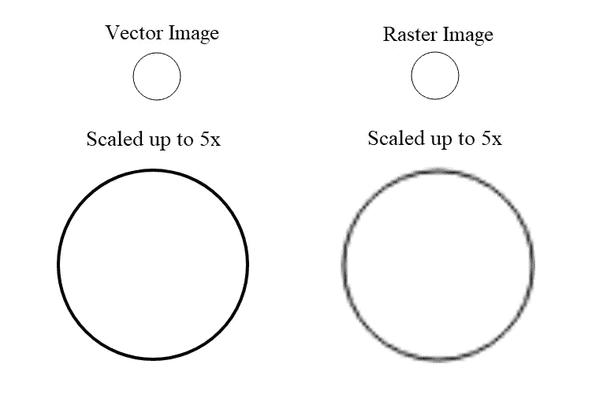

# 网络矢量图形

> 原文：<https://javascript.plainenglish.io/vector-graphics-for-the-web-cdea7406aca2?source=collection_archive---------7----------------------->


Map of Africa by [Truston Ailende](https://trustonailende.com/)

在 web 上工作时，有两种类型的图像格式可供您使用:

1.  光栅图形:它们由像素组成。像素越多，分辨率越高。
2.  矢量图形:他们使用数学公式来创建一个二维图像。图形数据用数学公式描述。

本文将介绍矢量图形以及如何使用 JavaScript 处理它们。

矢量图形可以通过编写代码来创建。Inkscape 和 Illustrator 等程序也以默认格式使用它们。

以上面显示的非洲地图为例。它是由代表一个国家的单独路径组成的复合形状。有了这些知识，我们可以对任何规模的单个国家进行转换。只要我们统一地进行变换，我们就可以无失真地调整图像的大小。

# SVG 规范

SVG 是一种用 XML 描述矢量图形的语言。SVG 是 W3C 的一个规范，可以很好地处理 HTML、CSS 和 JavaScript。

下面是一个 SVG 文档的基本框架。xlmns 指定文档的名称空间。

```
<svg xmlns=”[http://www.w3.org/2000/svg](http://www.w3.org/2000/svg)"> 

</svg>
```

为了画一个圆，我们在文档中指定圆的属性。所以我们的文档变成了:

```
<svg xmlns=”[http://www.w3.org/2000/svg](http://www.w3.org/2000/svg)"> 
 <circle cx=”40" cy=”40" r=”30" stroke=”#000" stroke-width=”1" fill=”#FFF” />
</svg>
```

将上述内容保存在 circle.svg 文档中并在浏览器中查看，将会绘制如下所示的圆:


Drawn Circle

# SVG 优势

## 分辨率独立性



Vector Graphics are Resolution Independent

无论如何调整大小，可缩放矢量图形(SVG)都不会失去分辨率。

## 交互性

您可以通过样式化和脚本化向 SVG 添加超链接和动画。SVG 有一个可导航的 DOM，允许创建交互式元素。

## 搜索引擎友好

SVG 由 XML 文本文件组成。因此，您可以添加关键字描述和链接，使内容更容易被搜索引擎识别。

# 向您的网页添加 SVG

## 使用图像标签

SVG 文档可以像 HTML 中的常规图像一样嵌入到图像标签中。下面显示了一个示例:

```

```

这种方法的缺点是 SVG 不是交互式的。

## 使用对象标签

如果您想让 SVG 具有交互性，这是最好的选择。这样做的代码如下所示:

```
<object type=”image/svg+xml” data=”circle.svg”></object>
```

## 使用内嵌 SVG

在这种方法中，生成 svg 的代码放在网页的 body 标记之间。

# 浏览器采用


Browser Support for SVG

在[我能使用](https://caniuse.com/#feat=svg)网站上，除了 Internet Explorer，大多数现代浏览器都非常支持 SVG。

# 使用 SVG 的 JavaScript 工具

## 拉斐尔斯

[RaphaelJS](http://raphaeljs.com/) 是一个 JavaScript 库，允许你使用 JavaScript 处理矢量图形。它就像一个创建 SVG 的接口，而不必用 SVG 编写代码。

把它想象成 jQuery。如果没有像 jQuery 这样的包装器为 JavaScript 提供一个抽象层，你将不得不编写原始的 JavaScript 来在 web 上做任何事情。如果您想到编写 JavaScript 是多么乏味，并且将它乘以 10，那么您就会对 SVG 的难度有所了解。

RaphaelJS 是一个矢量图形库，用于在浏览器中绘制对象。它支持 IE8 及以下版本的 SVG。

## JustGage

[JustGage](https://toorshia.github.io/justgage/) 是一个方便的 JavaScript 插件，用于生成漂亮的&干净的量规并制作动画。它基于 RaphaelJS 矢量绘图库，所以它完全独立于分辨率和自我调整。

哦，是的，因为它是纯 SVG，所以它几乎可以在任何浏览器上工作-
IE6+，Chrome，Firefox，Safari，Opera，Android 等。

## 快照. svg

Snap.svg 是由 RaphaelJS 库的创建者开发的。与支持 IE8 和更低版本的 RaphaelJS 不同，Snap.svg 是为现代浏览器设计的，因此支持最新的 svg 功能，如遮罩、剪辑、图案、全渐变、组等。

# D3.js

[D3.js](https://d3js.org) 是一个基于数据操作文档的 JavaScript 库。D3 帮助您使用 HTML、SVG 和 CSS 将数据变得生动。D3 对 web 标准的重视使您可以获得现代浏览器的全部功能，而无需将自己束缚于专有框架，将强大的可视化组件和数据驱动的 DOM 操作方法结合起来。

# 结论

在前端 web 开发领域，有大量的工具用于创建交互式 web 应用程序。这些工具包括 HTML5、CSS3、SVG 和 WebGL。

SVG 的主要优点是，它允许您在调整图形大小时不损失分辨率地创建图形。对你来说，这可能看起来没什么，但在响应式设计的世界里，这代表着一个巨大的机会。

## **用简单英语写的 JavaScript**

你知道我们有三份出版物和一个 YouTube 频道吗？在[**plain English . io**](https://plainenglish.io/)找到一切的链接！