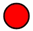
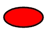
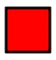

# 用 RaphaelJS 的矢量图形

> 原文：<https://javascript.plainenglish.io/vector-graphics-with-raphaeljs-3355e82b0fd3?source=collection_archive---------11----------------------->


Photo by [Tobias Tullius](https://unsplash.com/@tobiastu?utm_source=medium&utm_medium=referral) on [Unsplash](https://unsplash.com?utm_source=medium&utm_medium=referral)

RaphaelJS 是一个 JavaScript 库，它提供了一个用于操作 SVG 的 [API](https://dev.opera.com/articles/raphael-javascript-api-for-svg/) ，以及对 Internet Explorer 的 SVG 支持。它通过使用 VML 在 Internet Explorer 中模拟 SVG 来实现后者。

SVG 是一种用 XML 描述矢量图形的语言。SVG 是 W3C 的一个规范，可以很好地处理 HTML、CSS 和 JavaScript。

# 设置

RaphaelJS 是一个 JavaScript 库，所以设置它只需要通过链接在代码中连接到它。

下面的代码将在点(50，50)绘制一个半径为 50 像素的圆。

```
<html>
 <head>
 <title>Circle</title>
 </head>
 <body>
 <div id=”container”></div>
 <script src=”[https://cdnjs.cloudflare.com/ajax/libs/raphael/2.1.0/raphael-min.js](https://cdnjs.cloudflare.com/ajax/libs/raphael/2.1.0/raphael-min.js)"></script>
 <script>
 paper = Raphael(‘container’, 100, 100);
 var circle = paper.circle(50, 50, 50);
 </script>
 </body>
</html>
```

包含一个 div 元素，库将在其中进行绘制。

`paper = Raphael(‘container’, 100, 100);` 创建一个画布对象，在其上进行绘制。您必须首先这样做，因为将来从这个实例调用绘图方法时，所有这些方法都将被绑定到这个画布上。

函数`Raphael()`中的第一个参数是 HTML 元素的 id，你想在这个元素中开始绘图。

`var circle = paper.circle(50, 50, 25);` 用`id=”container”`创建一个 RaphaelJS SVG 对象，这是一个距离纸的左上 50 像素的圆。

# 拉斐尔元素

RaphaelJS 支持 3 种元素:形状、图像和文本。本文将介绍如何在 RaphaelJS 中绘制形状。

创建 paper 对象后，为了使用 Raphael 元素，您必须:

1.  创建一个拉斐尔元素
2.  操纵元素的样式
3.  使用 JavaScript 向元素添加事件。

## **画圆**

从 RaphaelJS 文档中画圆的代码是 Paper.circle(x，y，r ),其中 x 是圆的 x 坐标，y 是圆的 y 坐标，r 是半径。

上面设置部分的代码已经显示了如何在纸的点 50，50 处画一个半径为 25 的圆。

给圆添加属性很简单。要用黑色笔画一个红色的圆，我们使用如下所示的代码:

```
<script>
 paper = Raphael(‘container’, 100, 100);
 var circle = paper.circle(50, 50, 25);
 var attributes = {
 fill: “#FF0000”,
 stroke: ‘#000’,
 “stroke-width”: 3,
 “stroke-linejoin”: “round”,
 };
 circle.attr(attributes);
</script>
```

生成的图像如下所示:



Circle with a Black Border

## **画椭圆**

从 RaphaelJS 文档中绘制椭圆的代码是 Paper.ellipse(x，y，rx，ry ),其中 x 是中心的 x 坐标，y 是中心的 y 坐标，rx 是水平半径，ry 是垂直半径。

绘制椭圆的代码如下所示:

```
<script>
 paper = Raphael(‘container’, 100, 100);
 var ellipse = paper.ellipse(50, 50, 40, 20);
 var attributes = {
 fill: “#FF0000”,
 stroke: ‘#000’,
 “stroke-width”: 3,
 “stroke-linejoin”: “round”,
 };
 ellipse.attr(attributes);
</script>
```

生成的椭圆如下所示:



Ellipse with a Black Border

## **绘制矩形**

从 RaphaelJS 文档中绘制矩形的代码是 Paper.rect(x，y，width，height，[r])，其中 x 是左上角的 x 坐标，y 是左上角的 y 坐标，width 是矩形的宽度，height 是矩形的高度。

[r]是可选的，如果矩形有圆角，它代表矩形的半径。

```
<script>
 paper = Raphael(‘container’, 100, 100);
 var rectangle = paper.rect(10, 10, 50, 50);
 var attributes = {
 fill: “#FF0000”,
 stroke: ‘#000’,
 “stroke-width”: 3,
 “stroke-linejoin”: “round”,
 };
 rectangle.attr(attributes);
</script>
```

生成的矩形如下所示:



Rectangle with a Black Border

# 结论

RaphaelJS 库是一个非常通用的浏览器绘图库。自从 2008 年发布以来，它已经成为一个在浏览器中创建矢量图形的简单库。

## **用简单英语写的 JavaScript**

你知道我们有三份出版物和一个 YouTube 频道吗？在[T3【plain English . io找到一切的链接！](https://plainenglish.io/)