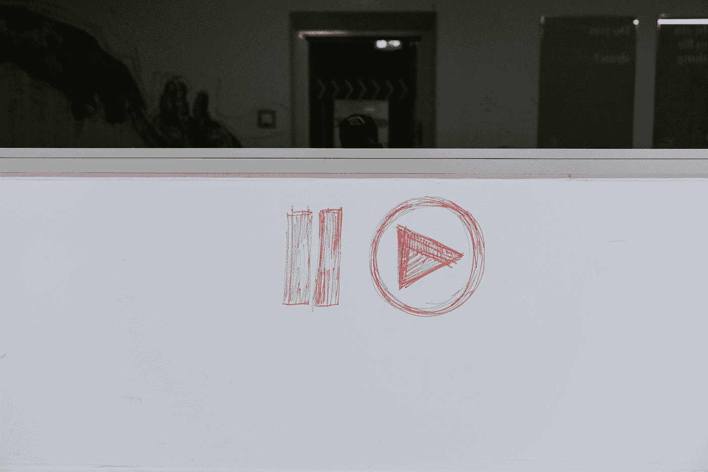

# 如何像网飞一样自动播放/暂停视频

> 原文：<https://javascript.plainenglish.io/video-pause-play-like-netflix-8570f903e0ff?source=collection_archive---------9----------------------->

## 交叉点观察器和页面可见性 API 使之成为可能

Photo by [🇨🇭 Claudio Schwarz | @purzlbaum](https://unsplash.com/@purzlbaum?utm_source=medium&utm_medium=referral) on [Unsplash](https://unsplash.com?utm_source=medium&utm_medium=referral)

这篇文章并没有解释网飞是如何实现这个特性的，但是我们可以通过出色的交叉点观察器 API 和页面可见性 API 轻松实现这个特性。

让我告诉你它将会是什么——如果你去过网飞，他们在他们的浏览页面顶部有一个主要的视频部分，它会自动开始播放。他们自动播放和暂停，让用户体验无缝。他们做得很好的两件事是-

1.当您滚动过视频预览部分时，它会暂停并在向上滚动时恢复。

2.当用户切换到另一个选项卡时，视频暂停，当您返回到浏览部分时，视频继续播放。

第一个可以通过交叉点观察器 API 实现，第二个可以通过页面可见性 API 实现。让我们看看下面的实现。

## 我们正在使用的示例

这将是一个简单的香草 JavaScript 应用程序，我们有一个视频和一些随机文本。你可以在代码沙箱中看到它。目前它没有实现上述功能，视频继续播放(请单击播放控件播放视频，并取消静音以收听音频)。

我不得不在这里使用视频控件，因为据我所知，默认情况下我们不能自动播放带音频的视频。有人请让我知道这是否可以实现。

# 交叉点观察器 API

如果你不知道这个 API 是如何工作的，请看看我以前的一篇[文章](https://medium.com/javascript-in-plain-english/intersection-observer-928a0ce309)，这篇文章通过例子深入探讨了它的功能。

> 基本上，这个 API 提供了一种简单的方法来观察和注册当页面上的元素进入视图时触发的回调。

我们将抓取视频元素并用观察者 API 观察它。

下面是我们在上面所做的:

*   从页面中选择的视频元素。
*   创建了交叉点观察器 API 的实例，并遍历了感兴趣的条目。然后，我们检查视频是否与视口不相交，如果不相交，我们暂停它，否则我们播放它。
*   最后观察了视频元素。

这里是沙盒:[https://code sandbox . io/s/video-with-intersection-observer-gt6mk](https://codesandbox.io/s/video-with-intersection-observer-gt6mk)

## 结果:

尝试将页面滚动到视频部分，视频将暂停，一旦向上滚动将继续播放。实现了第一步。现在让我们讨论第二个目标。

# 页面可见性 API

先说一些基础的。这个 API 用于检测空闲的浏览器标签。使用[页面可见性 API](https://developer.mozilla.org/en-US/docs/Web/API/Page_Visibility_API) ，我们可以检测到用户何时没有查看我们的网站/与我们的网站进行交互，以帮助他们节省宝贵的计算资源！

页面可见性 API 是在 2011 年引入的，它包括几个添加到文档对象中的功能:

*   **document.hidden** :一个只读属性，当选项卡/窗口隐藏时返回 true
*   **document.visibilityState** :只读属性，返回表示选项卡/窗口状态的字符串值:“隐藏“|”可见“|”先决条件”
*   **visibilitychange** :每当选项卡/窗口的可见性改变时发出的事件

对于我们的场景，我们将监听文档上的 **visibilityChange** 事件，并决定需要采取什么行动。

它只是这样做——当文档被隐藏/切换标签时暂停视频，否则播放它。

沙盒:[https://code sandbox . io/s/video-with-page-visibility-API-yzbm 6](https://codesandbox.io/s/video-with-page-visibility-api-yzbm6)

# 两个 API 一起

以下是全部代码:

唯一的变化是这里增加了 **playState** 变量，确保视频状态保持一致。如果我们没有此布尔检查，您可以通过执行以下操作来查看此[沙箱](https://codesandbox.io/s/playpause-inconsitency-pnx0t)中发生的问题:

*   滚动视频。由于交叉点观察器 API，视频现在应该暂停
*   切换到另一个选项卡。由于页面可见性检查，视频应保持暂停。
*   切换回沙盒标签，你会注意到视频恢复。这不是我们想要的行为，因为我们只想在视口中播放它。因此我们需要支票。

下面是最终的工作沙箱:[https://code sandbox . io/s/video-with-intersection-observer-gt6mk](https://codesandbox.io/s/video-with-intersection-observer-gt6mk)

我还创建了一个网飞的基本克隆。在这里你可以看到相同的功能实现:[https://netflixx-8b384.firebaseapp.com/](https://netflixx-8b384.firebaseapp.com/)

# 资源

 [## 如何用页面可见性 API 检测空闲的浏览器标签

### 你有没有想过背景标签/窗口是否使用电池电源，或者宝贵的 CPU 时间？使用页面可见性…

鳄鱼. io](https://alligator.io/js/page-visibility-api/)  [## 交叉点观察器 API

### 交叉点观察器 API 提供了一种异步观察目标元素交叉点变化的方法…

developer.mozilla.org](https://developer.mozilla.org/en-US/docs/Web/API/Intersection_Observer_API)  [## 交叉观察者

### 导航风格和惰性加载变得容易

medium.com](https://medium.com/javascript-in-plain-english/intersection-observer-928a0ce309) 

## 简单英语的 JavaScript

喜欢这篇文章吗？如果有，通过 [**订阅获取更多类似内容解码，我们的 YouTube 频道**](https://www.youtube.com/channel/UCtipWUghju290NWcn8jhyAw) **！**