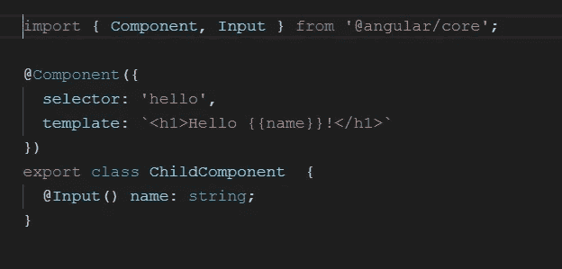
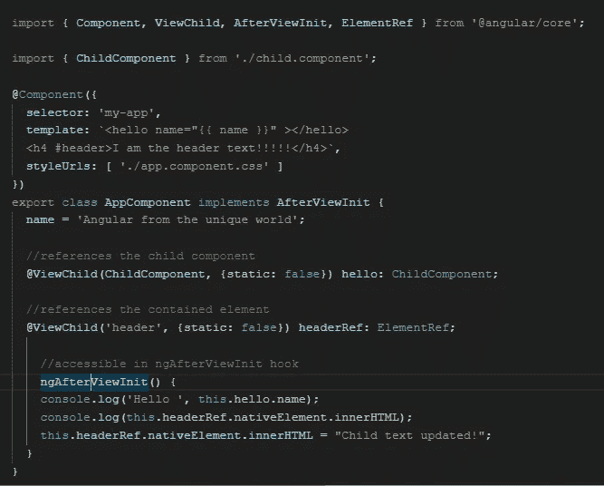
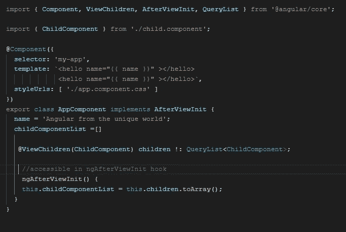

# 角度中的@ViewChild 和@ViewChildren

> 原文：<https://javascript.plainenglish.io/viewchild-and-viewchildren-in-angular-6dc0934d2cf9?source=collection_archive---------2----------------------->

*@ViewChild* 和*@ view child*是配置视图查询的属性装饰器。在这两种情况下，视图查询都是在调用**ngafterview it**回调之前设置的。

@ViewChild 提供对视图 DOM 中匹配选择器的第一个元素或指令的访问。这个装饰器可以接受下面提到的三个元数据属性:

> **选择器** —用于查询的指令类型或名称。
> 
> **read** — True 从查询的元素中读取不同的标记。
> 
> **静态** — True 表示在变更检测运行之前解析查询结果

**@ViewChildren** 提供来自视图 DOM 的元素或指令的 **QueryList** 。@ViewChildren 只能取前两个元数据属性，即**选择器**和**读取**。

在下面的代码图中，我们使用两个装饰器属性从父组件访问子组件/元素。

child.component.ts

app.component.ts with @ViewChild example

app.component.ts with @ViewChildren example

就这样，我们结束了！！！:)