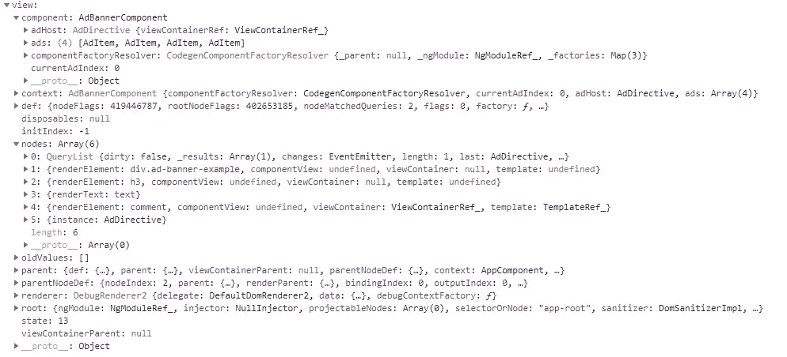
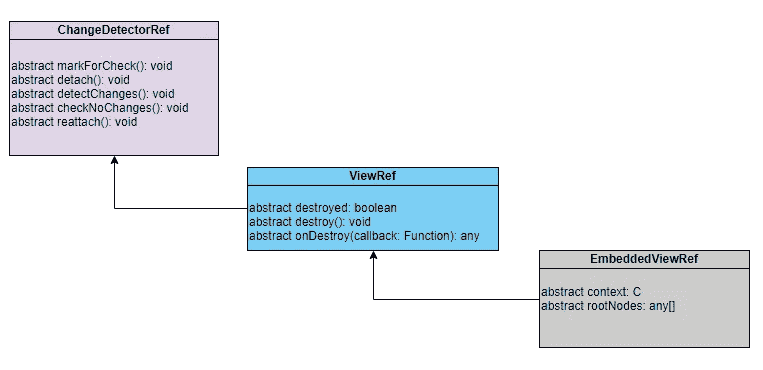

# 了解角度视图

> 原文：<https://javascript.plainenglish.io/views-in-angular-390c3906b988?source=collection_archive---------1----------------------->


Photo by [Paul Skorupskas](https://unsplash.com/@pawelskor?utm_source=unsplash&utm_medium=referral&utm_content=creditCopyText) on [Unsplash](https://unsplash.com/s/photos/view?utm_source=unsplash&utm_medium=referral&utm_content=creditCopyText)

**什么是视图？**

可以一起创建和销毁的最小显示元素组。

响应于用户动作，视图中元素的属性可以动态改变；视图中元素的结构(数量和顺序)不能。可以通过在视图容器中插入、移动或删除嵌套视图来更改元素的结构。— [*根据*](https://angular.io/guide/glossary#view) *角度文件。*

视图基本上是由视图节点组成的数据结构，视图节点保存对相应 DOM 元素的引用。每个组件都有一个与之关联的组件视图。

变化检测循环在视图上运行，当 angular 在组件视图状态中发现变化时，DOM 中相应的节点元素会再次呈现。

下面是一个视图的结构:



组件模板中的元素被添加为**节点**数组。上面的视图在其模板中有 5 个节点。**组件**属性保存相关组件的状态。

与视图相关的类别:

**changeedetorref—**角度视图的基类，提供变化检测功能。该类提供了与更改检测相关的各种方法。

**ViewRef —** 代表一个角度视图，特别是由一个组件定义的主视图。这个类扩展了**changededetorref。**除了从父类继承的方法，它还提供了与组件/组件视图相关的方法。

**EmbeddedViewRef —** 表示视图容器中的角度[视图](https://angular.io/guide/glossary#view)。一个[嵌入视图](https://angular.io/guide/glossary#view-tree)可以从一个组件引用，而不是从其模板定义它的宿主组件引用，或者它可以由一个`[TemplateRef](https://angular.io/api/core/TemplateRef)`独立定义。

**ViewContainerRef —** 表示一个容器，其中可以将一个或多个视图附加到一个组件。它可以包含*宿主视图*(通过用`createComponent()`方法实例化一个组件创建)，以及*嵌入视图*(通过用`createEmbeddedView()`方法实例化一个`[TemplateRef](https://angular.io/api/core/TemplateRef)`创建)。

一个视图容器实例可以包含其他视图容器，创建一个[视图层次](https://angular.io/guide/glossary#view-tree)。



View Classes Hierarchy

# 视图类型

视图有两种类型:**嵌入式**和**主机**

嵌入视图链接到模板，而主体视图链接到构件。

**创建嵌入式视图**

在下面的例子中，我们从组件模板中插入的模板创建一个嵌入式视图。

`<ng-container></ng-container>`标签被用作嵌入视图的视图容器(通过使用@ViewChild 查询将其作为 view container 读取)。它充当锚定元素，视图将在其下方插入到组件模板中。

容器的 **createEmbeddedView()** 方法被传递模板引用来创建视图。

```
import { Component, AfterViewInit, ViewChild,
ViewContainerRef, TemplateRef } from '@angular/core';@Component({
  selector: 'app-embedded-view',
  template: `
  <h1>Application Content</h1>
  <ng-container #vc></ng-container> 
  <h3>End of Application</h3> <ng-template #tpl>
    <h1>Template Header</h1>
  </ng-template>
  `
})
export class EmbeddedViewComponent implements AfterViewInit {
  @ViewChild("tpl", { read: TemplateRef }) tpl: TemplateRef<any>;
  @ViewChild("vc", { read: ViewContainerRef }) container: ViewContainerRef; constructor() { } ngAfterViewInit() {
    this.container.createEmbeddedView(this.tpl);
  }
}
```

**创建主机视图**

主体视图与构件相关。它们是在动态创建组件时创建的。下面的**动态组件**是使用其工厂动态创建的。

使用注入到组件构造函数中的**componentffactoryresolver 实例**来解析工厂。

最后，通过使用容器的 **createComponent()** 方法并传递 **DynamicComponent** 工厂，组件视图被添加到视图容器中。

```
@Component({
  template: `<h1>I am dynamically used component element.</h1>`
})export class DynamicComponent { }import { AfterViewInit, Component, ViewChild,
ViewContainerRef, ComponentFactoryResolver } from '@angular/core';
import { DynamicComponent} from './dynamic.component';@Component({
  selector: 'app-host-view',
  template: `
  <h1>Host View example</h1>
  <ng-container #container></ng-container>
  `,
  entryComponents: [ DynamicComponent]
})
export class HostViewComponent implements AfterViewInit {
  @ViewChild("container", { read: ViewContainerRef }) ctr: ViewContainerRef; constructor(private resolver: ComponentFactoryResolver) { } ngAfterViewInit() {
    const factory = this.resolver.resolveComponentFactory(DynamicComponent);
    this.ctr.createComponent(factory);
  }
}
```

应该确保要动态创建的组件应该被添加到 **entryComponents** 数组中，以便在编译时创建组件的工厂。

> 谢谢你的时间…:)