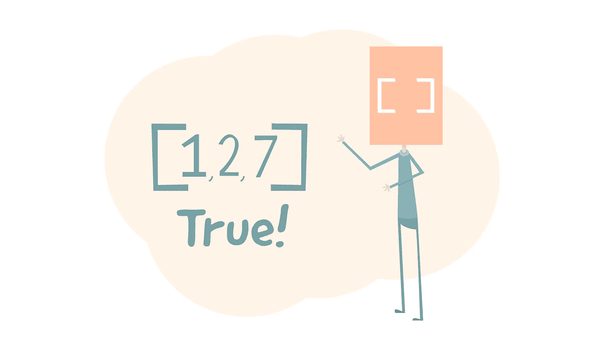

# 直观解释:JavaScript Array.isArray()

> 原文：<https://javascript.plainenglish.io/visual-explanation-javascript-array-isarray-e66799712aac?source=collection_archive---------7----------------------->


今天，我们将学习 JavaScript 数组类下的一个新方法。isArray()。

Array.isArray()方法的作用是检查输入是否是一个数组。如果是一个数组，这个方法将为真。否则，如果它不是一个数组，它将返回 **false** 。让我们来演示一下这种方法是如何工作的。

见见艾萨里先生:


他将接受各种输入，并确定它们是否是一个数组，因此，他的脸。如果我们输入一个数字。

```
Array.isArray(4);
```


数字 4 本身是一个整数，不是一个数组。所以它会返回一个 false。

如果我们输入一个字符串会怎么样:

```
Array.isArray("eat");
```


和上一个例子一样，字符串“eat”不是一个数组。它只是一个字符串，所以该方法将返回 false。数字、字符串、对象、函数、芝士蛋糕、漏气的轮胎，如果不是数组，该方法将返回 false。让我们看看这个例子:

```
Array.isArray([1, 2, 7]);
```



因为[1，2，7]是一个数组，所以该方法将返回 True。这是 Array.isArray()方法工作的基础。

要了解其他数组方法的更多信息，可以访问以下文章:

[](https://medium.com/@endubueze00/visual-explanation-javascript-array-of-cf3ecd98368b) [## 直观解释:JavaScript Array.of()

### 今天我们要学习数组类下的一个 Javascript 方法，叫做 Array.of()。

medium.com](https://medium.com/@endubueze00/visual-explanation-javascript-array-of-cf3ecd98368b) [](https://medium.com/@endubueze00/visual-explanation-javascript-array-from-b4198b05b064) [## 直观解释:JavaScript Array.from()

### 今天我们将会看到一个来自 Array 对象的方法，那就是 Array.from()方法。Array.from()…

medium.com](https://medium.com/@endubueze00/visual-explanation-javascript-array-from-b4198b05b064)