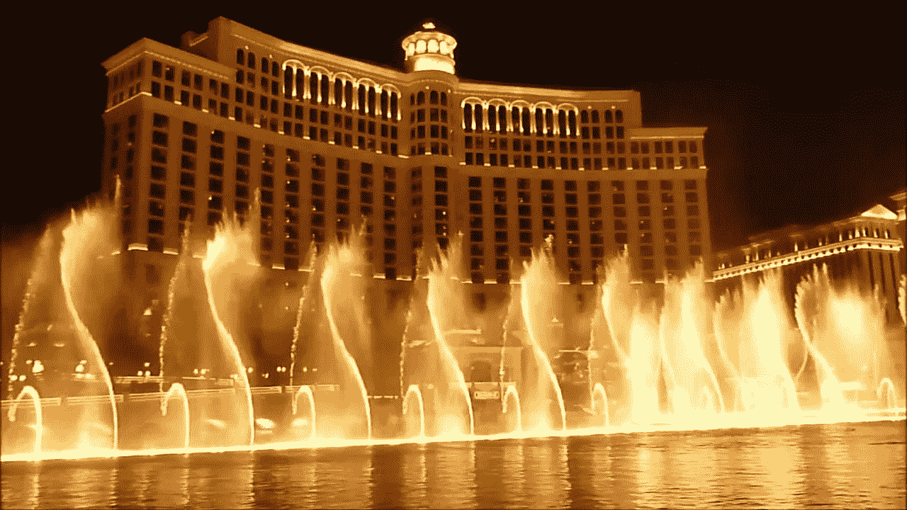

# 视觉音乐:从贝拉焦的喷泉中学到什么

> 原文：<https://javascript.plainenglish.io/visual-music-what-to-learn-from-bellagios-fountains-8ec4f41a2017?source=collection_archive---------13----------------------->

## 一口大小的学习:巴比伦的粒子系统

# 音乐和视觉

贝拉焦的喷泉是最著名的标志性场景之一。在炎热的夏夜，你一定会对天空中舞动的巨大水柱留下深刻的印象，飞行的薄雾中的小水滴可能会带着令人愉快的寒意落在你的脸上。

当伊史蒂芬·索德伯格重拍《十一罗汉》时，他在这个标志性的背景下拍摄了最后一幕。音乐碰巧也是德彪西的。

Fountains of Bellagio, Ocean’s Eleven final scenes (Steven Soderbergh 2001)

根据*拉斯维加斯评论杂志的采访，*有超过 5000 个喷嘴直接喷水，每个都有精确的时间控制。空气中形成的图案是根据音乐预先编程的。从技术上讲，音乐和水的模式是同步的，系统没有声音响应。

# 巴比伦中的粒子系统. js

Babylon.js 有一个强大的粒子系统，而且相当好用。此前，我们在太空中制作了声音响应结构和粒子。

 [## 音频活动:一个可视化古典音乐的技术练习

### 德彪西阿拉贝斯克№ 1 在巴比伦. js

medium.com](https://medium.com/@reddotblues/audio-active-a-technical-exercise-on-visualizing-classical-music-a164d49be1a8) 

让我们看看如何通过学习贝拉焦的喷泉来提高。

我们使用一排球体作为粒子源，这与水喷嘴的排列非常相似。水喷嘴不能移动，我们的粒子源可以很容易地在空间移动。

# 色彩的和谐

水通过反射、折射和与周围环境融合在一起。让我们重写背景的随机颜色*透明色*，并调整粒子的颜色。

粒子系统中的颜色现在由两种颜色混合而成。我们可以使用其中一种颜色的背景色，这意味着我们正在将颜色与背景混合。

# 音乐动感

贝拉焦的表演是根据音乐的节奏和发展来调整的。现在，我们的中心曲线形状只由一些振荡器决定。让我们引入一些声音的影响，我们通过将 FFT 结果传递到 *Dense2* 类中的*曲线点*来实现。

# 粒子排放

通过喷嘴的水量根据音乐的变化进行编程。我们可以使用 FFT 的结果动态调整粒子*发射率*。

有了这些变化，Dense2 类看起来像这样。

节目的录制片段。

Github 项目可以下载。试一试，并实时看到整个作品。我鼓励你移动相机找到最佳角度。

 [## 冰/音乐冲动

### GitHub 是超过 5000 万开发人员的家园，他们一起工作来托管和审查代码、管理项目和构建…

github.com](https://github.com/icezee/musical-impulse) 

正如你所看到的，音乐中的细微差别还没有在我们的结果中体现出来。我们需要为真正的视觉音乐作品做更多的工作。敬请关注。

这个故事是实时制作视觉音乐的一部分。你可以在下面了解更多。希望你喜欢它。

 [## 实时制作视觉音乐

### Babylon.js 中一系列小范围学习的初学者指南

medium.com](https://medium.com/@reddotblues/making-visual-music-in-real-time-ccd6e7a2b4fe) 

干杯。

## 简单英语的 JavaScript

你知道我们有三份出版物和一个 YouTube 频道吗？在 [**寻找一切的链接 plainenglish.io**](https://plainenglish.io/) ！