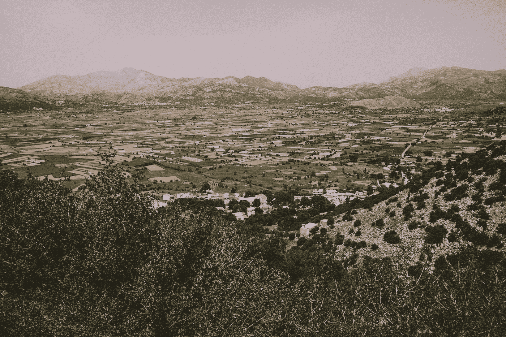

# Vue 3 —基本过渡

> 原文：<https://javascript.plainenglish.io/vue-3-basic-transitions-56d4d08cde8a?source=collection_archive---------17----------------------->



Photo by [Mitchell Orr](https://unsplash.com/@mitchorr?utm_source=medium&utm_medium=referral) on [Unsplash](https://unsplash.com?utm_source=medium&utm_medium=referral)

**Vue 3 处于测试阶段，可能会有变化。**

Vue 3 是 Vue 前端框架的最新版本。

它建立在 Vue 2 的普及性和易用性之上。

在这篇文章中，我们将看看如何用 Vue 3 添加过渡。

# 过渡

我们可以用各种组件向我们的 Vue 应用添加过渡

`transition`组件帮助我们添加由`v-if`触发的进入和离开转换。

过渡模式让我们改变过渡的顺序。

可以用`transition-group`组件添加多个组件的过渡。

我们可以用`watchers`在一个 app 里过渡到不同的状态。

# 基于类别的动画和过渡

我们可以通过绑定到一个类来添加转换。

例如，我们可以写:

```
<!DOCTYPE html>
<html lang="en">
  <head>
    <title>App</title>
    <script src="https://unpkg.com/vue@next"></script>
    <style>
      .shake {
        animation: shake 1s cubic-bezier(0.31, 0.07, 0.39, 0.97) both;
        transform: translate3d(0, 0, 0);
        backface-visibility: hidden;
        perspective: 1000px;
      } @keyframes shake {
        10%,
        90% {
          transform: translate3d(-1px, 0, 0);
        } 20%,
        80% {
          transform: translate3d(2px, 0, 0);
        } 30%,
        50%,
        70% {
          transform: translate3d(-4px, 0, 0);
        } 40%,
        60% {
          transform: translate3d(4px, 0, 0);
        }
      }
    </style>
  </head>
  <body>
    <div id="app">
      <div :class="{ shake: on }">
        <button @click="on = !on">toggle</button>
        <p v-if="on">hello world!</p>
      </div>
    </div>
    <script>
      const app = Vue.createApp({
        data() {
          return {
            on: false
          };
        }
      });
      app.mount("#app");
    </script>
  </body>
</html>
```

为我们的 div 添加抖动过渡效果。

我们有`translate3d`来添加左右摇晃，

负是左，正是右。

`shake`类有`shake`过渡。

`cubic-bezier`是缓动功能，使过渡非线性。

`transform`将 div 保持在原位。

当`on`为`true`时，我们应用`shake`类，因此当我们单击切换按钮将`on`设置为`true`时，我们将看到元素抖动。

# 带有样式绑定的过渡

我们还可以添加带有样式绑定的过渡。

例如，我们可以写:

```
<!DOCTYPE html>
<html lang="en">
  <head>
    <title>App</title>
    <script src="https://unpkg.com/vue@next"></script>
  </head>
  <body>
    <div id="app">
      <div
        @mousemove="onMouseMove"
        :style="{ backgroundColor: `rgb(${x}, 80, 50)` }"
        class="movearea"
      >
        <p>x: {{x}}</p>
      </div>
    </div>
    <script>
      const app = Vue.createApp({
        data() {
          return {
            x: 0
          };
        },
        methods: {
          onMouseMove(e) {
            this.x = e.clientX;
          }
        }
      });
      app.mount("#app");
    </script>
  </body>
</html>
```

当鼠标移动时，就会调用`onMouseMove`方法。

这将获得鼠标的 x 坐标，并将其设置为`this.x`状态。

然后我们用`x`通过改变`rgb`的第一个值来设置背景色。

因此，当我们移动鼠标时，背景颜色会发生变化。

# 表演

CSS 动画比使用 JavaScript 改变元素的位置有更好的性能。

每次用 JavaScript 重绘都是一个昂贵的操作，所以我们尽可能地消除它们。

CSS 动画也更快，因为浏览器有硬件加速功能。

类似`perspective`、`backface-visibility`和`transform: translateZ(x)`的属性将触发浏览器的硬件加速功能。


Photo by [Patrick Hendry](https://unsplash.com/@worldsbetweenlines?utm_source=medium&utm_medium=referral) on [Unsplash](https://unsplash.com?utm_source=medium&utm_medium=referral)

# 结论

Vue 让我们用 CSS 和类或样式绑定来激活我们的元素。

喜欢这篇文章吗？如果是这样，通过 [**订阅解码获得更多类似内容，我们的 YouTube 频道**](https://www.youtube.com/channel/UCtipWUghju290NWcn8jhyAw) **！**