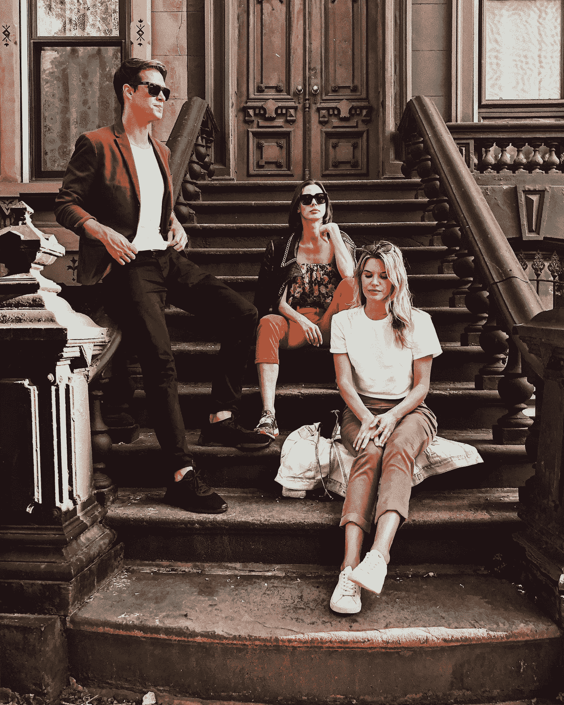

# Vue 3 —内嵌样式和 v-if

> 原文：<https://javascript.plainenglish.io/vue-3-inline-styles-and-v-if-19bc40b78855?source=collection_archive---------4----------------------->


Photo by [Paul Gilmore](https://unsplash.com/@paulgilmore_?utm_source=medium&utm_medium=referral) on [Unsplash](https://unsplash.com?utm_source=medium&utm_medium=referral)

Vue 3 处于测试阶段，可能会有变化。

Vue 3 是 Vue 前端框架的最新版本。

它建立在 Vue 2 的普及性和易用性之上。

在本文中，我们将研究内联式绑定和 v-if。

# 绑定内联样式

将内联样式绑定到元素有多种方法。

一种方法是向`:style`指令传递一个对象。

例如，我们可以写:

```
<!DOCTYPE html>
<html lang="en">
  <head>
    <title>App</title>
    <script src="https://unpkg.com/vue@next"></script>
  </head>
  <body>
    <div id="app">
      <div :style="{ color, fontSize: `${fontSize}px` }">
        hello
      </div>
    </div>
    <script>
      const vm = Vue.createApp({
        data() {
          return {
            color: "red",
            fontSize: 30
          };
        }
      }).mount("#app");
    </script>
  </body>
</html>
```

我们在用`data`方法返回的对象中有`color`和`fontSize`属性。

然后我们在对象中使用它作为`:style`指令的值。

所以‘hello’应该是红色的，大小 30px。

我们可以用一个对象来代替它，使模板更短。

例如，我们可以写:

```
<!DOCTYPE html>
<html lang="en">
  <head>
    <title>App</title>
    <script src="https://unpkg.com/vue@next"></script>
  </head>
  <body>
    <div id="app">
      <div :style="styleObj">
        hello
      </div>
    </div>
    <script>
      const vm = Vue.createApp({
        data() {
          return {
            styleObj: {
              color: "red",
              fontSize: "30px"
            }
          };
        }
      }).mount("#app");
    </script>
  </body>
</html>
```

还有一个数组语法允许我们向同一个元素添加多个样式对象。

例如，我们可以写:

```
<!DOCTYPE html>
<html lang="en">
  <head>
    <title>App</title>
    <script src="https://unpkg.com/vue@next"></script>
  </head>
  <body>
    <div id="app">
      <div :style="[baseStyles, overridingStyles]">
        hello
      </div>
    </div>
    <script>
      const vm = Vue.createApp({
        data() {
          return {
            baseStyle: {
              color: "red",
              fontSize: "30px"
            },
            overridingStyles: {
              color: "green"
            }
          };
        }
      }).mount("#app");
    </script>
  </body>
</html>
```

我们将`baseStyles`和`overridingStyles`放在一个数组中。

`overridingStyles`中的样式将完全覆盖`baseStyle`中的样式。

因此，我们得到的文本是绿色的，它的默认大小。

如果需要特定于浏览器的前缀，它们会被自动添加。

我们也可以用一个数组为一个样式属性提供一个数组值。

例如，我们可以写:

```
<!DOCTYPE html>
<html lang="en">
  <head>
    <title>App</title>
    <script src="https://unpkg.com/vue@next"></script>
  </head>
  <body>
    <div id="app">
      <div :style="{ display: ['-webkit-box', '-ms-flexbox', 'flex'] }">
        hello
      </div>
    </div>
    <script>
      const vm = Vue.createApp({
        data() {
          return {};
        }
      }).mount("#app");
    </script>
  </body>
</html>
```

数组中有`flex`的所有变体。

# 条件渲染

我们可以用`v-if`指令添加条件渲染。

例如，我们可以写:

```
<!DOCTYPE html>
<html lang="en">
  <head>
    <title>App</title>
    <script src="https://unpkg.com/vue@next"></script>
  </head>
  <body>
    <div id="app">
      <button @click="on = !on">toggle</button>
      <h1 v-if="on">hello world!</h1>
    </div>
    <script>
      const vm = Vue.createApp({
        data() {
          return {
            on: true
          };
        }
      }).mount("#app");
    </script>
  </body>
</html>
```

我们用在`data`中返回的对象返回了`on`属性，所以我们可以用它和`v-if`一起有条件地呈现 h1 元素。

此外，我们有一个在`true`或`false`之间切换`on`的按钮，这样当我们单击该按钮时，我们将看到 h1 切换开和关。



Photo by [Chris Murray](https://unsplash.com/@seemurray?utm_source=medium&utm_medium=referral) on [Unsplash](https://unsplash.com?utm_source=medium&utm_medium=referral)

# 结论

可以用`:style`指令添加内联样式。

它接受一个对象或一个数组。

我们可以使用`v-if`有条件地呈现一个元素。

喜欢这篇文章吗？如果有，通过 [**订阅获取更多类似内容解码，我们的 YouTube 频道**](https://www.youtube.com/channel/UCtipWUghju290NWcn8jhyAw) **！**