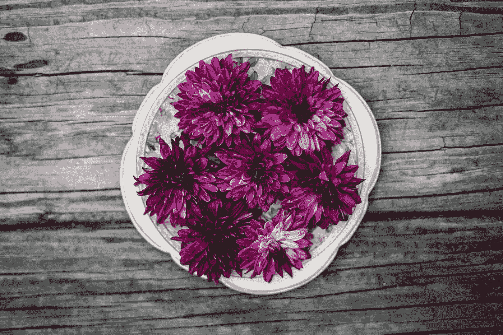

# vue 3-道具类型和非道具属性继承

> 原文：<https://javascript.plainenglish.io/vue-3-prop-types-and-non-prop-attributes-inheritance-a4d1a5540108?source=collection_archive---------5----------------------->


Photo by [The Creative Exchange](https://unsplash.com/@thecreative_exchange?utm_source=medium&utm_medium=referral) on [Unsplash](https://unsplash.com?utm_source=medium&utm_medium=referral)

**Vue 3 处于测试阶段，可能会发生变化。**

Vue 3 是 Vue 前端框架的最新版本。

它建立在 Vue 2 的流行和易用性之上。

在本文中，我们将了解如何使用 Vue 3 检查正确的数据类型和控制非正确的属性继承。

# 类型检查

我们可以用道具的`type`属性进行数据类型检查。

它可以采用以下任何本地构造函数和工厂:

*   `String`
*   `Number`
*   `Boolean`
*   `Array`
*   `Object`
*   `Date`
*   `Function`
*   `Symbol`

此外，我们可以通过将值设置为我们自己的构造函数来检查我们自己的构造函数。

检查将由`instanceof`操作员完成。

例如，我们可以写:

```
<!DOCTYPE html>
<html lang="en">
  <head>
    <title>App</title>
    <script src="https://unpkg.com/vue@next"></script>
  </head>
  <body>
    <div id="app">
      <blog-post v-for="post of posts" :author="post.author"></blog-post>
    </div>
    <script>
      class Person {
        constructor(firstName, lastName) {
          this.firstName = firstName;
          this.lastName = lastName;
        }
      } const app = Vue.createApp({
        data() {
          return {
            posts: [{ author: new Person("james", "smith") }]
          };
        }
      });
      app.component("blog-post", {
        props: {
          author: Person
        },
        template: `<p>{{author.firstName}} {{author.lastName}}</p>`
      });
      app.mount("#app");
    </script>
  </body>
</html>
```

我们将`author`道具的类别设置为`Person`类别，以便进行核对。

由于我们的`post`条目中的`author`属性是`Person`实例，因此正确的验证应该会成功。

# 非道具属性

非专有属性是传递给组件但没有定义相应专有属性的属性。

它们包括像`class`、`style`或`id`这样的 HTML 属性。

它们将由组件继承。

例如，如果我们将`data`属性传递给一个组件:

```
<!DOCTYPE html>
<html lang="en">
  <head>
    <title>App</title>
    <script src="https://unpkg.com/vue@next"></script>
  </head>
  <body>
    <div id="app">
      <component-a data-status="foo"></component-a>
    </div>
    <script>
      const app = Vue.createApp({}); app.component("component-a", {
        template: `<p>component a</p>`
      }); app.mount("#app");
    </script>
  </body>
</html>
```

然后呈现的 HTML 将是:

```
<p data-status="foo">component a</p>
```

我们可以禁用组件自动继承属性的能力。

为此，我们可以将组件的`inheritAttrs`属性设置为`false`。

例如，我们可以写:

```
<!DOCTYPE html>
<html lang="en">
  <head>
    <title>App</title>
    <script src="https://unpkg.com/vue@next"></script>
  </head>
  <body>
    <div id="app">
      <component-a data-status="foo"></component-a>
    </div>
    <script>
      const app = Vue.createApp({}); app.component("component-a", {
        inheritAttrs: false,
        template: `<p>component a</p>`
      }); app.mount("#app");
    </script>
  </body>
</html>
```

然后呈现的 HTML 是:

```
<p>component a</p>
```

但是，我们仍然可以使用`$attrs`变量访问属性。

它包括所有不包含在组件道具或`emits`属性中的属性。

所以`$attrs`会有类似`class`、`style`、`v-on`监听器等属性。

我们可以通过`v-bind='$attrs'`将属性添加到非根组件中。

例如，我们可以写:

```
<!DOCTYPE html>
<html lang="en">
  <head>
    <title>App</title>
    <script src="https://unpkg.com/vue@next"></script>
  </head>
  <body>
    <div id="app">
      <component-a data-status="foo"></component-a>
    </div>
    <script>
      const app = Vue.createApp({}); app.component("component-a", {
        inheritAttrs: false,
        template: `
          <div>
            <p v-bind="$attrs">component a</p>
          </div>`
      }); app.mount("#app");
    </script>
  </body>
</html>
```

然后，我们通过编写以下内容得到呈现的 HTML:

```
<div><p data-status="foo">component a</p></div>
```

我们在 p 标签上有了`data-status`属性，而不是外部 div，因为我们禁用了自动继承，将`inheritAttrs`设置为`false`。

我们使用`v-bind='$attrs'`将父元素传递的属性添加到`component-a`的 p 元素中。



Photo by [ORNELLA BINNI](https://unsplash.com/@ornellabinni?utm_source=medium&utm_medium=referral) on [Unsplash](https://unsplash.com?utm_source=medium&utm_medium=referral)

# 结论

默认情况下，非属性自动从父节点继承，并将填充到根节点中。

但是，这可以关闭和自定义。

此外，我们可以为道具添加类型检查。

喜欢这篇文章吗？如果有，通过 [**订阅解码获得更多类似内容，我们的 YouTube 频道**](https://www.youtube.com/channel/UCtipWUghju290NWcn8jhyAw) **！**