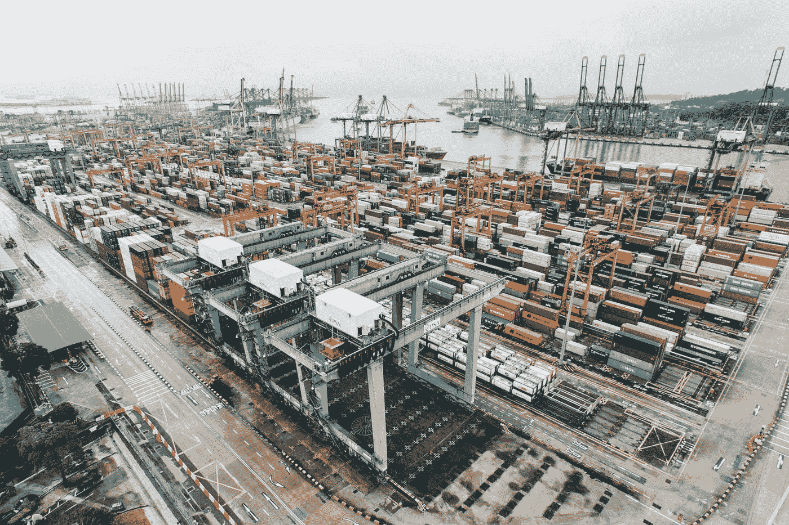

# vue 3-传送

> 原文：<https://javascript.plainenglish.io/vue-3-teleport-73d573648b38?source=collection_archive---------7----------------------->


Photo by [Axel Ahoi](https://unsplash.com/@axelahoi?utm_source=medium&utm_medium=referral) on [Unsplash](https://unsplash.com?utm_source=medium&utm_medium=referral)

**Vue 3 处于测试阶段，可能会发生变化。**

Vue 3 是 Vue 前端框架的最新版本。

它建立在 Vue 2 的流行和易用性之上。

在本文中，我们将研究如何使用`teleport`组件在 DOM 的不同位置呈现元素和组件。

# 传送

我们可以使用`teleport`组件，让我们在一个不同于其在 DOM 中通常位置的位置上渲染我们的 Vue 模板的部分

这对于创建像模态和覆盖这样的东西很方便。

我们想要在其中呈现项目的 DOM 元素必须已经存在。

否则，我们会得到一个错误。

例如，我们可以写:

```
<!DOCTYPE html>
<html lang="en">
  <head>
    <title>App</title>
    <script src="https://unpkg.com/vue@next"></script>
  </head>
  <body>
    <div id="app">
      <teleport to="#footer">
        <p>footer</p>
      </teleport>
    </div> <div id="footer"></div> <script>
      const app = Vue.createApp({}); app.mount("#app");
    </script>
  </body>
</html>
```

我们将`teleport`组件添加到我们的模板中，将`to`道具设置到选择器中，以便在其中安装内容。

因此，ID 为`footer`的 div 将保存`teleport`组件中的 p 元素。

# 与 Vue 组件一起使用

如果`teleport`有 Vue 组件，那么它将仍然是`teleport`父组件的子组件。

例如，我们可以写:

```
<!DOCTYPE html>
<html lang="en">
  <head>
    <title>App</title>
    <script src="https://unpkg.com/vue@next"></script>
  </head>
  <body>
    <div id="app">
<teleport to="#modals">
  <div>A</div>
</teleport>
<teleport to="#modals">
  <div>B</div>
</teleport>
    </div> <div id="footer"></div> <script>
      const app = Vue.createApp({}); app.component("parent-component", {
        template: `
          <h2>parent</h2>
          <teleport to="#footer">
            <child-component name="james" />
          </teleport>
        `
      }); app.component("child-component", {
        props: ["name"],
        template: `
          <div>{{ name }}</div>
        `
      }); app.mount("#app");
    </script>
  </body>
</html>
```

我们把`parent-component`放在应用程序的根模板中。

它有一个`teleport`将`to`设置为`#footer`。

因此它将在 div 中以 ID `footer`呈现。

里面有`child-component`。

这也将在 ID 为`footer`的 div 中呈现。

# 对同一目标使用多个传送点

我们可以用同一个选择器集作为他们的`to`道具值进行多次传送。

它们将按照定义的顺序呈现。

例如，如果我们有:

```
<!DOCTYPE html>
<html lang="en">
  <head>
    <title>App</title>
    <script src="https://unpkg.com/vue@next"></script>
  </head>
  <body>
    <div id="app">
      <teleport to="#footer">
        <div>foo</div>
      </teleport>
      <teleport to="#footer">
        <div>bar</div>
      </teleport>
    </div> <div id="footer"></div> <script>
      const app = Vue.createApp({}); app.mount("#app");
    </script>
  </body>
</html>
```

那么渲染的结果将是:

```
<div id="footer">
  <div>foo</div>
  <div>bar</div>
</div>
```



Photo by [chuttersnap](https://unsplash.com/@chuttersnap?utm_source=medium&utm_medium=referral) on [Unsplash](https://unsplash.com?utm_source=medium&utm_medium=referral)

# 结论

`teleport`组件允许我们在不同于 DOM 中通常位置的位置渲染 Vue 模板的部分。

喜欢这篇文章吗？如果是这样，通过 [**订阅解码得到更多类似内容，我们的 YouTube 频道**](https://www.youtube.com/channel/UCtipWUghju290NWcn8jhyAw?sub_confirmation=true) **！**