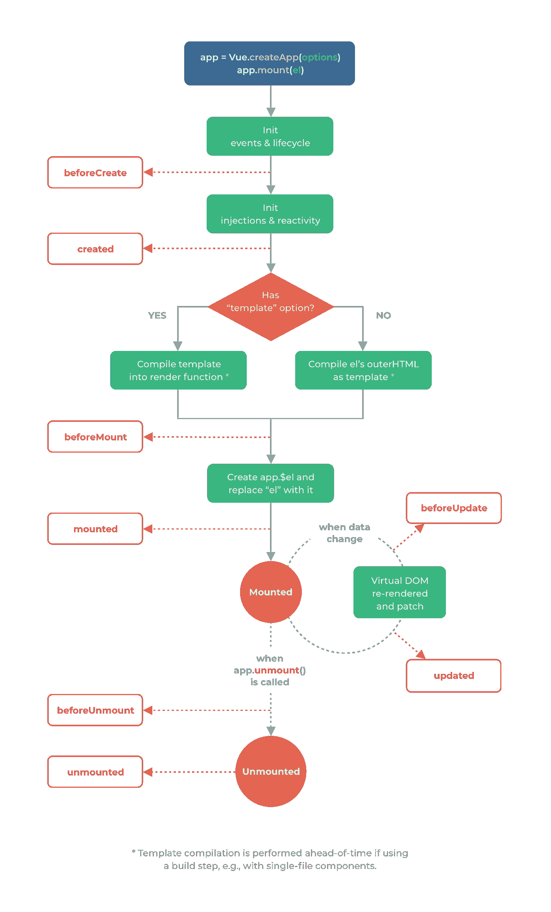

# Vue 3 — Vue 实例属性和模板

> 原文：<https://javascript.plainenglish.io/vue-3-vue-instance-properties-and-templates-6e6fb88ee61e?source=collection_archive---------7----------------------->


Photo by [Anders Wideskott](https://unsplash.com/@wideshot?utm_source=medium&utm_medium=referral) on [Unsplash](https://unsplash.com?utm_source=medium&utm_medium=referral)

Vue 3 处于测试阶段，可能会有变化。

Vue 3 是 Vue 前端框架的最新版本。

它建立在 Vue 2 的普及性和易用性之上。

在本文中，我们将看看 Vue 实例挂钩，并用 Vue 3 创建简单的模板。

# Vue 实例属性

Vue 实例有一些内置在应用程序中的属性。

`$data`属性拥有我们的 Vue 实例所拥有的数据。

例如，我们可以写:

```
<!DOCTYPE html>
<html lang="en">
  <head>
    <title>App</title>
    <script src="https://unpkg.com/vue@next"></script>
  </head>
  <body>
    <div id="app">
      {{a}}
    </div>
    <script>
      const data = { a: 1 }; const vm = Vue.createApp({
        data() {
          return data;
        }
      }).mount("#app"); console.log(vm.$data.a);
    </script>
  </body>
</html>
```

我们有`vm.$data.a`属性，它与我们在`data`方法中返回的相同。

`a`会是 1。

# 实例生命周期挂钩

Vue 实例有各种生命周期挂钩，从初始加载到被销毁。

以下是生命周期图:



Courtesy of [https://v3.vuejs.org/guide/instance.html#lifecycle-diagram](https://v3.vuejs.org/guide/instance.html#lifecycle-diagram)

当创建 Vue 实例时，它从 init 事件和生命周期阶段开始，调用 Vue 实例中的`beforeCreate`方法。

事件侦听器被附加，生命周期从这个阶段开始。

然后，它初始化注入和反应阶段，并调用`created`方法。

在这个阶段，Vue 开始监听 Vue 实例中的数据变化。

然后，根据我们的 Vue 实例中是否有模板，可能会发生两种情况中的一种。

如果有，则编译模板。

否则，它会将我们挂载的 pour Vue 实例的内容编译成 HTML。

一旦完成其中任何一个，然后运行`beforeMount`方法。

然后将`$el`属性添加到 Vue 实例中。那么元素的内容将被编译后的内容替换。

然后运行`mounted`方法。

当状态改变时，运行`beforeUpdate`。

一旦虚拟 DOM 被更新，就会运行`updated`方法。

一旦`app.unmount`被调用，意味着组件将被卸载。

然后运行`beforeUnmount`。

当它被卸载时，运行`unmounted`方法。

这些方法在我们的组件中是可选的。

如果我们想在这些生命周期阶段运行某些东西，我们只需要添加它们。

例如，我们可以写:

```
<!DOCTYPE html>
<html lang="en">
  <head>
    <title>App</title>
    <script src="https://unpkg.com/vue@next"></script>
  </head>
  <body>
    <div id="app">
      {{a}}
    </div>
    <script>
      const vm = Vue.createApp({
        data() {
          return {
            a: 1
          };
        },
        created() {
          console.log(this.a);
        }
      }).mount("#app");
    </script>
  </body>
</html>
```

将我们自己的代码添加到`created`钩子中，它在组件第一次监听状态变化时运行。

因此，`this.a`的值将被记录。

# 模板语法

Vue 使用基于 HTML 的模板语法，让我们可以绑定模板和 Vue 实例数据之间的值。

Vue 将模板编译成虚拟 DOM 渲染函数。

这使得 Vue 能够计算出改变真实 DOM 以呈现最新数据的最少的变化量。

# 插值

最基本的数据绑定是文本插值。

例如，我们可以写:

```
<!DOCTYPE html>
<html lang="en">
  <head>
    <title>App</title>
    <script src="https://unpkg.com/vue@next"></script>
  </head>
  <body>
    <div id="app">
      {{a}}
    </div>
    <script>
      const vm = Vue.createApp({
        data() {
          return {
            a: 1
          };
        }
      }).mount("#app");
    </script>
  </body>
</html>
```

然后我们看到`a`是 1，显示在屏幕上。

每次`a`变化时，该插值都会更新。

我们可以用`v-once`指令使插值只更新一次。

例如，我们可以写:

```
<!DOCTYPE html>
<html lang="en">
  <head>
    <title>App</title>
    <script src="https://unpkg.com/vue@next"></script>
  </head>
  <body>
    <div id="app">
      <div v-once>{{a}}</div>
    </div>
    <script>
      const vm = Vue.createApp({
        data() {
          return {
            a: 1
          };
        }
      }).mount("#app");
    </script>
  </body>
</html>
```

`{{a}}`即使数值改变，仍显示为 1。


Photo by [Corey Agopian](https://unsplash.com/@corey_lyfe?utm_source=medium&utm_medium=referral) on [Unsplash](https://unsplash.com?utm_source=medium&utm_medium=referral)

# 结论

Vue 实例有自己的生命周期挂钩。

我们可以添加在 Vue 实例生命周期的不同阶段运行代码所需的代码。

Vue 有一个易于使用的模板语法来呈现数据。

喜欢这篇文章吗？如果有，通过 [**订阅获取更多类似内容解码，我们的 YouTube 频道**](https://www.youtube.com/channel/UCtipWUghju290NWcn8jhyAw) **！**