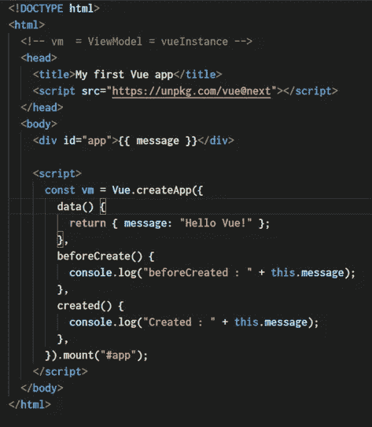
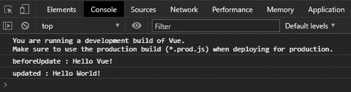

# 如何使用 Vue 生命周期挂钩

> 原文：<https://javascript.plainenglish.io/vue-lifecycle-hooks-75d296e7ef8?source=collection_archive---------5----------------------->

## 第 1 部分:创建前、装载前、更新前、卸载前

# **简介**

根据最新的[Vue 官方文档](https://v3.vuejs.org/api/options-lifecycle-hooks.html#lifecycle-hooks)显示 **Vue 的生命周期挂钩**有 **13** 。创建的每个 Vue 实例都将经历生命周期挂钩。以下是本文将解释的 Vue 的生命周期挂钩:

*   创建前和创建后
*   安装前和安装后
*   更新前和更新后
*   卸载前和卸载后

`*destroyed*`*`*beforeDestroy*`*生命周期钩子(Vue.js 3.0.0+中)已弃用。**

*在 [**第二部分**](https://medium.com/@eng5128/vue-lifecycle-hooks-part-2-16ccfd2516de) 中解释了另外 5 个 **Vue 的生命周期**钩子，其中包括激活、停用、错误捕获、渲染跟踪和渲染触发**。***

## ***创建前和创建后***

*Vue 在这两个阶段声明并知道数据属性。在渲染 Vue 组件之前，我们可以在`[created](https://v3.vuejs.org/api/options-lifecycle-hooks.html#created)`钩子中从服务器端获取数据。区别在于`[beforeCreated](https://v3.vuejs.org/api/options-lifecycle-hooks.html#beforecreate)`钩子是在实例完全初始化之前，而`created`钩子是在实例创建之后。*

**

*beforeCreate and created*

**

*Output in the browser*

## ***安装前和安装后***

*`[beforeMount](https://v3.vuejs.org/api/options-lifecycle-hooks.html#beforemount)` hook 开始编译并渲染 HTML 模板。Vue 基于我们的 HTML 代码结合数据属性创建一个模板，并使用这个模板创建真正的 HTML 代码，然后在`[mounted](https://v3.vuejs.org/api/options-lifecycle-hooks.html#mounted)`钩子中呈现为 DOM。*

**

*beforeMount and mounted*

**

*Output in the browser*

## *更新前和更新后*

*某个时间点的数据更改将触发新的生命周期。我们可以在`[beforeUpdate](https://v3.vuejs.org/api/options-lifecycle-hooks.html#beforeupdate)`钩子中的任何更新之前访问旧的 DOM，并在`[updated](https://v3.vuejs.org/api/options-lifecycle-hooks.html#updated)`钩子中显示最终的变化。*

**

*beforeUpdate and updated*

**

*Output in the browser*

**为什么* ***这个。$el.wholeText*** *是否使用？* ***这个。$el*** *已经变成了* ***文本*** *对象，因为按钮元素被添加到了 DOM 中。**

## *卸载前和卸载后*

*使用`vm.unmount('#app')`时，Vue 会触发另外两个新的生命周期。我们仍然可以在`[beforeUnmount](https://v3.vuejs.org/api/options-lifecycle-hooks.html#beforeunmount)`钩子上访问 DOM。当到达`[unmounted](https://v3.vuejs.org/api/options-lifecycle-hooks.html#unmounted)`钩子时，Vue 将删除实例，DOM 在浏览器中消失，包括子组件。但是，数据属性仍然存在，但无法访问。*

**

*beforeUnmount and unmounted*

**

*Output in the browser after 3 seconds*

# *结论*

*当到达每个生命周期挂钩时，我们可以使用断点来暂停代码。一些生命周期挂钩对于代码开发来说不是必需的，但是对它有一个基本的理解是很重要的。*

*在 [**第 2 部分**](https://medium.com/@eng5128/vue-lifecycle-hooks-part-2-16ccfd2516de) 中解释了另外 5 个 **Vue 的生命周期**钩子，包括激活、停用、错误捕获、渲染跟踪和渲染触发**。***

*谢谢你。*