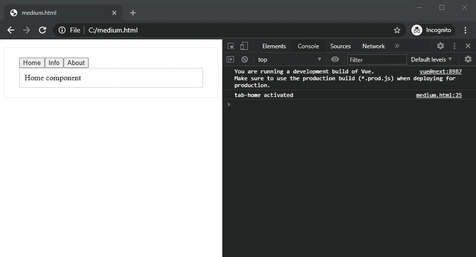
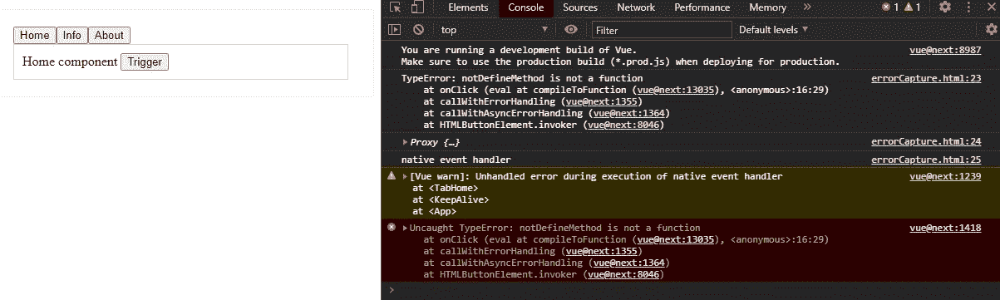
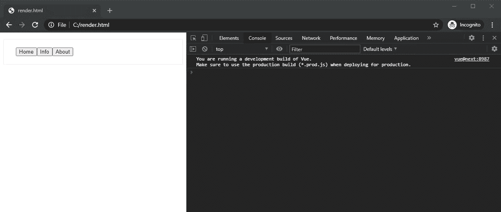
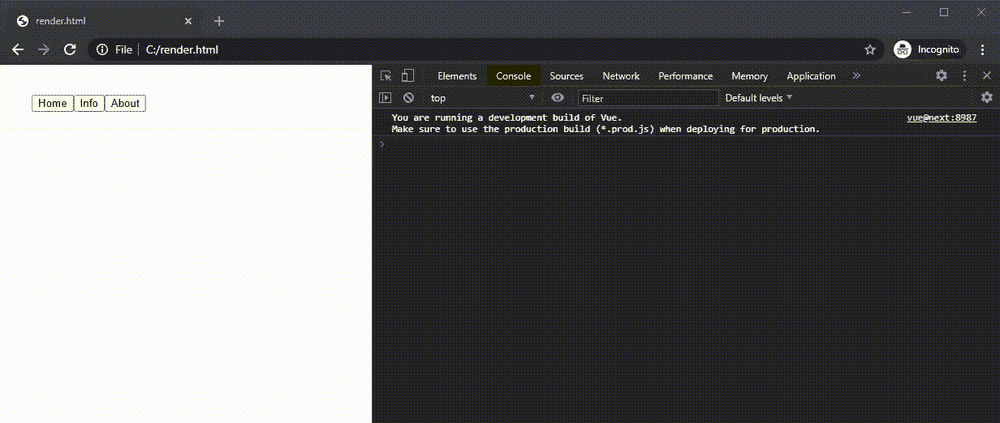
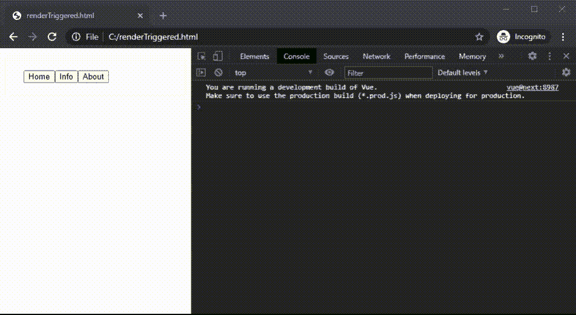

# 如何使用 Vue 生命周期挂钩

> 原文：<https://javascript.plainenglish.io/vue-lifecycle-hooks-part-2-16ccfd2516de?source=collection_archive---------6----------------------->

## 第 2 部分:激活、停用、错误捕获、渲染跟踪、渲染触发

# 介绍

让我们在本文中探索 Vue 的生命周期挂钩，包括**激活的**、**去激活的**、**错误捕获的**、**渲染跟踪的**和**渲染触发的**。Vue 3 最近刚刚发布，更新了一些很酷的特性，例如 **renderTracked** 和**render trigged**生命周期挂钩。其他生命周期挂钩在这里解释[。](https://medium.com/@eng5128/vue-lifecycle-hooks-75d296e7ef8)

## 激活和停用

当一个组件被一个动态组件 **keep-alive** 包装时，`activated`和`deactivated`生命周期钩子将被相应地调用。当切换选项卡或导航到另一个页面时，如果想要保留/维护以前的状态，这个动态组件非常有用。

*   `[activated](https://v3.vuejs.org/api/options-lifecycle-hooks.html#activated)`钩显示动态组件**如*首页组件*** 在网页上是活动的。
*   当加载另一个动态组件并且动态组件**如 *Home 组件*** 不活动时，调用`[deactivated](https://v3.vuejs.org/api/options-lifecycle-hooks.html#deactivated)`钩子。但是，当动态组件不活动时，它们的状态不会改变。

**演示场景**:创建标签组件并用保活包装。

activated and deactivated hooks (JavaScript Code)

activated and deactivated for each component

## 错误被捕获

`errorCaptured`仅由任何后代组件触发被捕获。全局错误处理器还有另一个函数`[errorHandler](https://vuejs.org/v2/api/#errorHandler)`。但是这个函数不捕获事件处理程序错误。它将在组件渲染期间捕获函数和观察器。更多信息，你可以从[这里](https://stackoverflow.com/questions/49214634/how-to-capture-vuejs-errors-from-a-single-point-inside-a-component)阅读。

`[errorCaptured](https://v3.vuejs.org/api/options-lifecycle-hooks.html#errorcaptured)`钩子接收 3 个参数:

*   显示消息的**错误**。
*   一个**组件**，它将输出一个代理对象。
*   **信息**会告诉你哪种错误，例如*渲染函数*或*本地事件处理程序*。

**演示场景**:在 **Home** 模板中创建一个带有 click 事件 **notDefinedMethod** 的按钮，但是没有在 Vue 实例中定义该方法。点击 **Home** 组件按钮时捕捉到错误。

errorCapture hook (JavaScript Code)

The output from errorCaptured hook

## 渲染跟踪和渲染触发

根据 Vue 的创造者尤雨溪的说法:

*更好的调试能力:我们可以使用新的* `*renderTracked*` *和* `*renderTriggered*` *钩子精确地跟踪和触发组件重渲染的时间和原因。*

这两个生命周期挂钩有助于通过减少不必要的组件重新呈现来提高 web 页面性能。第一次渲染时,`[renderTracked](https://v3.vuejs.org/api/options-lifecycle-hooks.html#rendertracked)`钩子将被记录一次。这个钩子**跟踪**虚拟 DOM 的重新渲染。

**演示场景**:创建标签组件并用保活包装。另一个例子是在没有保持活动的情况下创建和包装的标签组件。在**信息选项卡**输入姓名，切换到**关于选项卡**。我们将看到`[renderTracked](https://v3.vuejs.org/api/options-lifecycle-hooks.html#rendertracked)`如何在控制台上挂钩输出以及它们之间的区别。

renderTracked hook (JavaScript Code)

component wrapped with keep-alive

component wrapped without keep-alive

使用 keep-alive，它会停止重新渲染组件。在由 keep-alive 包装的组件中，`renderTracked`钩子记录了 4 次。

`[renderTriggered](https://v3.vuejs.org/api/options-lifecycle-hooks.html#rendertriggered)`钩子告诉你什么事件被触发来重新渲染一个组件。

**演示场景**:点击 Tab 组件会触发`[renderTriggered](https://v3.vuejs.org/api/options-lifecycle-hooks.html#rendertriggered)`钩子。

renderTriggered hook (JavaScript Code)

renderTriggered will be called when clicking the tabs

# 结论

当我们想要开发更大、更复杂的应用程序时，这些生命周期挂钩是有用和强大的。

这里是[完整版代码](https://github.com/Chueeng/vue-s-lifecycle)。

谢谢你。