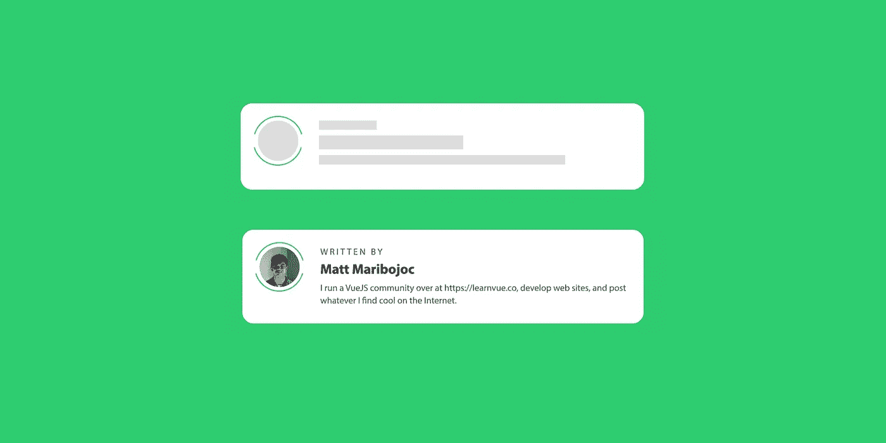
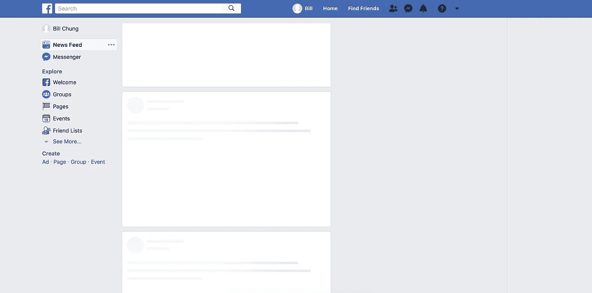
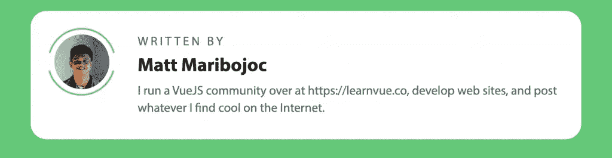
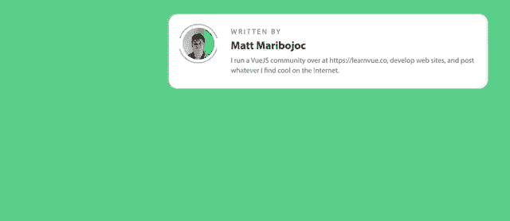
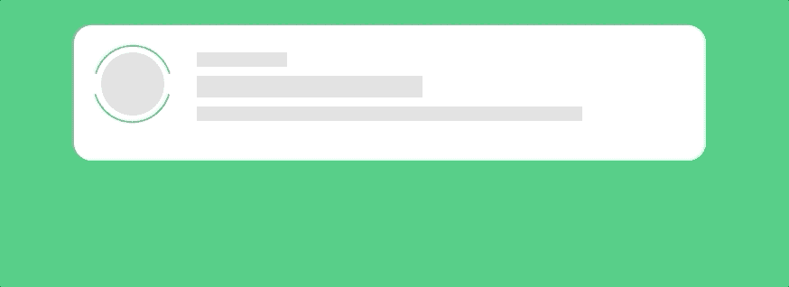

# 使用暂记组件的 Vue 框架加载屏幕—每日 Vue #4

> 原文：<https://javascript.plainenglish.io/vue-skeleton-loading-screen-using-suspense-components-daily-vue-4-e34d5291cb38?source=collection_archive---------1----------------------->



**骨架加载屏幕显示**等待加载时内容的轮廓。它提供了[更好的用户体验](https://uxdesign.cc/what-you-should-know-about-skeleton-screens-a820c45a571a)，让内容感觉比传统的加载微调器更快。

例如，像脸书和 Linkedin 这样的网站在他们的内容上使用框架加载屏幕。



在 Vue3 中，[引入了悬念组件](https://learnvue.co/2020/01/an-introduction-to-vuejs-suspense-components/)使得添加骨骼装载器变得非常容易。

对于这个例子，我使用一个异步组件、一个框架加载器和 Vue 的新悬念组件重新创建了[媒体作者部分](https://medium.com/@mattmaribojoc)。

这是我们将要构建的内容的快速截图！


激动吗？我也是——我们直接开始吧。

## 我们的骨架加载屏幕将如何工作？

当网站需要从 API 异步加载数据时，最常使用框架加载屏幕。

在 Vue3 中，我们可以通过创建一个显示我们的用户信息的**异步组件**来做到这一点——这意味着它有一个[异步设置组件](https://learnvue.co/2020/01/4-vue3-composition-api-tips-you-should-know/)。

然后，我们将创建第二个组件，显示用户信息组件的框架。我们将通过**创建不同大小的块**来表示不同的部分。

最后，使用 Vue 的**悬念**特性，我们将在等待异步组件解析的同时呈现我们的骨架组件。

这是高层次的解释——让我们开始编程，这样更有意义。

## 创建我们的个人资料卡

首先，让我们创建默认的`ProfileCard.vue`组件来显示我们的作者信息。

由于这是一个异步组件，我们需要使我们的设置方法成为一个异步方法。出于演示的目的，我们还想创建另一个异步方法，使用一个`setTimeout`来加载我们的配置文件数据。

```
import { ref } from 'vue' 

const loadUserData = async () => {
  return new Promise(resolve => {
    setTimeout(() => {
      resolve({
        name: 'Matt Maribojoc',
        pic: 'https://cdn-images-1.medium.com/fit/c/100/100/2*EcZb9cndrhTF7_d74dv2Fg.png',
        bio: 'I run a VueJS community over at https://learnvue.co, develop web sites, and post whatever I find cool on the Internet.'
      })
    }, 4000)
  })
}

export default {
  async setup () {
    const userData = ref(await loadUserData())

    return {
      userData
    }
  }
}
```

如果这对你来说看起来完全混乱，请查看我们的组合 API 教程。

让我们开始显示我们的模板。这是我使用的代码，这里有一些[链接](https://learnvue.co/wp-content/uploads/2020/04/img-border.png)到边框图像。

```
<template>
  <div class='profile-card'>
    <div class='profile-image'>
      
      
    </div>
    <div class='profile-info'> 
      <span> Written By </span>
      <h3> {{ userData.name }} </h3>
      <p> {{ userData.bio }} </p>
    </div>
  </div>
</template>
```

最后，让我们把它做成好看的样式。这些是我用过的款式。

```
<style>  
  .profile-card {
    width: 100%;
    max-width: 700px;
    margin: 0 auto;
    padding: 30px;
    box-sizing: border-box;
    border-radius: 20px;
    background-color: #fff;
    overflow: hidden;
    position: relative;
    min-height: 150px;
  }

  .profile-card .profile-image__img {
    width: 10%;
    height: auto;
    border-radius: 50%;
    position: absolute;
    top: 30px;
    left: 30px;
  }

  .profile-card .profile-image__border {
    width: calc(10% + 20px);
    height: auto;
    position: absolute;
    top: 20px;
    left: 20px;
  }

  .profile-info {
    width: 85%;
    float: right;
    padding-left: 10px;
    box-sizing: border-box;
  }

  .profile-info span {
    text-transform: uppercase;
    color: #666;
    letter-spacing: 3px;
  }

  .profile-info h3 { 
    margin: 10px 0;
    font-weight: 700;
    font-size: 1.5em;
    color: #222;
  }

  .profile-info p {
    line-height: 140%;
    color: #666;
  }
</style>
```

现在，我们的 ProfileCard 组件应该如下所示。



## 使用悬念组件呈现回退内容

现在我们有了一个异步组件，我们可以使用一个悬念组件来显示后备内容。

在其他一些组件中，我们可以使用这些代码来构建我们的悬念组件。

```
<Suspense>
      <template #default>
        <profile-card />
      </template>
      <template #fallback>
        Loading...
      </template>
</Suspense>
```

现在，如果我们运行我们的应用程序，我们将看到它显示`Loading…`几秒钟，直到我们的 ProfileCard 组件解析。



但这不是骨骼加载屏幕！所以让我们现在就开始建造吧。

## 构建我们的骨架加载屏幕

尽管这看起来可能不是最优雅的解决方案，但是控制骨骼外观的最佳方式之一是设计每个元素的样式。这就是我们要做的——用相应的大纲块替换 ProfileCard 中的每个内容块。

我们将**重用**一些布局样式，以确保我们的骨架与实际组件具有相同的轮廓。因为我们没有将样式限制在 ProfileCard 组件的范围内，所以它们也会自动样式化我们的 ProfileCardSkeleton 组件。

除了内容，我们的模板看起来基本相同。

```
<div class='profile-card'>
    <div class='profile-image'>
      
      
    </div>
    <div class='profile-info'> 
      <span />
      <h3 />
      <p />
    </div>
  </div>
```

然后，我们需要做的另一件事就是添加一些限定范围的样式来添加我们正在寻找的灰色背景。

因此，对于每个元素——在本例中是轮廓图像，span，h3 和 p——我们希望用灰色背景来替换它。

要做到这一点，我们只需给每一个它自己的高度，宽度和背景颜色。

```
<style scoped>
.profile-card .profile-image__img {
    width: 10%;
    padding-top: 10%;
    border-radius: 50%;
    background-color: #ddd;
  }

  .profile-info span {
    min-width: 100px;
    height: 16px;
    display: inline-block;
    background-color: #ddd;
  }

  .profile-info h3 {
    content: ' ';
    width: 250px;
    height: 24px;
    background-color: #ddd;
    margin: 10px 0;
  }

  .profile-info p {
    width: 80%;
    background-color: #ddd;
    height: 16px;
    line-height: 140%;
  }
</style>
```

您可以根据您的组件来调整这些值，使其看起来恰到好处。

为了将这个框架组件添加到我们的项目中，我们可以用新的组件替换我们的悬念回退内容。

```
<Suspense>
      <template #default>
        <profile-card />
      </template>
      <template #fallback>
        <profile-card-skeleton />
      </template>
    </Suspense>
```

回头看看我们的应用程序，我们会发现，这就是我们的目标。它显示了我们的内容的大致轮廓，直到我们的页面加载！


## 我们可以添加的额外功能

现在我们已经构建了一个框架加载屏幕——有很多方法可以添加到这个概念中。我们可以，

*   [为图像、标题、段落等构建可重用的](https://learnvue.co/2020/01/12-vuejs-best-practices-for-pro-developers/)框架组件
*   添加更多样式，让它感觉更灵敏
*   为更多组件创建骨架加载器

但是我们要实现的是对我们的骨架加载器的 UI 改进。我们将使背景色介于浅灰色和深灰色之间。

这是一个很好的方式来告诉用户有东西正在加载，并且会让我们的网站感觉响应更快，加载时间更短。

我们将使用 [CSS 动画](https://learnvue.co/2020/02/vuejs-animations-for-beginners/)来做到这一点。

首先，让我们创建关键帧，我们所要做的就是在两种背景色之间进行过渡。

```
@keyframes pulse-bg {
    0% { background-color: #ddd; }
    50% { background-color: #d0d0d0; }
    100% { background-color: #ddd; }
  }
```

接下来，在每个元素中，我们希望用新的动画替换背景色属性。我们可以这样做。

```
.profile-card .profile-image__img {
    width: 10%;
    padding-top: 10%;
    border-radius: 50%;
    animation: pulse-bg 1s infinite;
  }
```

最终的结果是一个非常微妙的触摸，但正是像这样的小事才能真正让你的 Vue 应用脱颖而出。



## 我们走吧！

我们现在有了一个非常好的骨架加载器组件，它使用了 Vue3 的新悬念功能。

有很多方法可以将它添加到你的项目中，我想看看你都做了些什么！

我希望这篇教程能给你一些启发，如果你有任何问题，请在回复中告诉我！

如果你有兴趣了解更多关于 Vue 3 的知识，请下载我的免费 Vue 3 备忘单，里面有一些基本知识，比如合成 API、Vue 3 模板语法和事件处理。

## **用简单英语写的 JavaScript 的一个注释:**

我们已经推出了三种新的出版物！请关注我们的新出版物: [**AI in Plain English**](https://medium.com/ai-in-plain-english) ，[**UX in Plain English**](https://medium.com/ux-in-plain-english)，[**Python in Plain English**](https://medium.com/python-in-plain-english)**——谢谢，继续学习！**