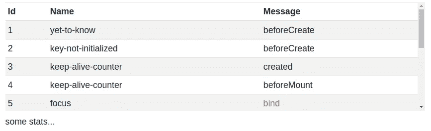

# Vue 插槽去神秘化

> 原文：<https://javascript.plainenglish.io/vue-slots-demystified-5f694975bcf9?source=collection_archive---------7----------------------->

Photo by [freestocks](https://unsplash.com/@freestocks?utm_source=unsplash&utm_medium=referral&utm_content=creditCopyText) on [Unsplash](https://unsplash.com/s/photos/wooden?utm_source=unsplash&utm_medium=referral&utm_content=creditCopyText)

Vue 实现了一个受 [Web 组件规范草案](https://github.com/w3c/webcomponents/blob/gh-pages/proposals/Slots-Proposal.md)启发的内容分发 API，使用<插槽>元素作为内容的分发出口。

[**插槽**](https://vuejs.org/v2/guide/components-slots.html)

*   **槽内容** —写在父模板中的内容。该内容将呈现在子模板分配的占位符中
*   **编译范围** —父模板中的所有内容都在父范围内编译；子模板中的所有内容都在子范围内编译。
*   **回退内容** —子模板提供的内容。如果父模板不提供显式内容，那么子模板中写的任何内容都将被呈现。
*   **命名插槽—** 客户端模板中可能有多个插槽。为了唯一地标识它们，我们需要为 ***name*** 属性提供值。
*   **作用域槽—** 通过槽属性从父模板访问子作用域中的数据的机制
*   **动态插槽名称**

如果我们根据指南或已知的语法来阅读和使用这些概念，那么理解所有这些概念对初学者来说有点困难。我们必须学会用一个真实的问题去解决。

💡想要有效的学习 JavaScript，就去读 [Vue](https://github.com/vuejs/vue) 代码库。如果你想有效地学习 Vue，阅读[Vue 化](https://github.com/vuetifyjs/vuetify)或等效的代码库。

**故事情节:**

假设，我们需要创建一个名为 v-data-table 的共享组件。通常，表组件必须提供以下功能

1.  接受标题作为道具
2.  接受物品(表格内容)作为道具
3.  提供一个格式良好的表格，将必要的样式作为最佳默认值
4.  ***允许用户(开发者)根据自己的具体需求定制具体栏目***

第四点很难实现。有了 v-slot，这将变得轻而易举。

在下表中，开发人员希望根据消息列的值自定义其文本颜色。

v-data-table output

 [## 数据表组件

### 默认情况下，标准数据表会将数据显示为简单的行。#自定义过滤器您可以覆盖默认的…

vuetifyjs.com](https://vuetifyjs.com/en/components/data-tables/) 

第 20-22 行详细介绍了**命名槽、动态槽名**和**回退内容—** 为每个标题名创建一个槽(表列)。如果用户不想自定义该列，他将不会在其客户端代码中提供该槽。

第 6-8 行允许您自定义“msg”列中的一个。其余的列将基于回退内容呈现。