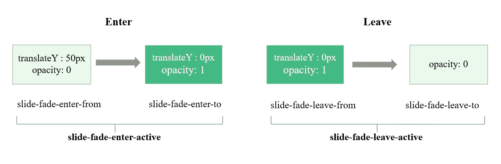

# 如何使用 Vue 转场组件

> 原文：<https://javascript.plainenglish.io/vue-transitions-component-2bd1191377cc?source=collection_archive---------12----------------------->

## Vue 提供了内置的`<transition>`组件来轻松应用过渡效果和动画 DOM

# 介绍

Vue 提供了内置的`<transition>`组件来轻松应用过渡效果和动画 DOM。它是一个特殊的组件，我们可以用它来制作介于开始和结束标签之间的任何东西的动画。

*只有* ***一个*** *元素可以与* `*<transition>*` *组件一起动画化。*

在这个`<transition>`组件中可以有多个元素，但是必须使用 ***v-if*** 或 ***v-show*** 来应用这些元素的条件。我们可以将`<transition-group>`组件用于多个组件。

## **演示场景**

使用内置的`<transition>`组件，警报通知将在 5 秒钟后出现并向上滑动。这里有一个例子:

Vue Transition — Alert Notification

根据最新的官方文档，有 6 个 [**CSS 转换类**](https://v3.vuejs.org/guide/transitions-enterleave.html#transition-classes) 用于进入/离开转换。没有必要定义所有 6 个类，这取决于过渡/动画的类型。

当使用没有名字的`<transition>`元素时，`v-`前缀是默认的**。这里的`v-`前缀被替换为`slide-fade-`前缀，例如，它将变成由`slide-fade-enter-from`和在`<transition>`元素开始标记处声明名称。**

**`<transition name="slide-fade">`**

**这样命名是有原因的。有两种不同的动画，分别是**幻灯片**用于**进入过渡**和**淡出**用于**离开过渡**用于本演示场景—警报通知。**

****

**How Transition Classes work**

**有六个类别适用于进入/离开过渡。**

1.  **`slide-fade-enter-from`:进入开始状态。在插入元素之前添加，在插入元素之后移除一帧。**它由** `**appear**` **属性触发。****
2.  **`slide-fade-enter-active`:用`v-enter-from`添加到元素中，当转场/动画结束时移除。定义了进入过渡的持续时间、延迟和缓和曲线。**举例来说，转场延迟约 5 秒开始动画。****
3.  **`slide-fade-enter-to`:进入结束状态。在元素插入后增加一帧(同时`v-enter-from`被移除)，当过渡/动画结束时移除。**
4.  **`slide-fade-leave-from`:离开开始状态。触发离开过渡时立即添加，一帧后移除。**点击“x”按钮触发。****
5.  **`slide-fade-leave-active`:与`slide-fade-enter-active`概念相同。**
6.  **`slide-fade-leave-to`:结束状态离开。在离开过渡被触发后增加一帧(同时`v-leave-from`被移除)，当过渡/动画结束时移除。**

# ****附加要求****

**有时提醒通知会自动关闭/消失，用户不会点击“x”按钮来关闭它。所以，问题是**

> **如何触发离职过渡？**

**以下是解决方案:**

```
<script>
    const Demo = {
      data() {
        return {
          show: true,
        };
      },
      methods: {
        **closeAlert**: function () {
          var v = this;
          setTimeout(function () {
            v.show = false;
          }, 10000);
        },
      },
      mounted() {
        this.closeAlert();
      },
    };
    Vue.createApp(Demo).mount("#app");
  </script>
```

**如果用户没有点击提醒通知，系统将在 10 秒后自动关闭它。**

# **结论**

**Vue Transition 还有许多其他很酷的功能和重要的概念。我们可以将网页周围的元素动画化，并可选地应用它。但是，帮助用户理解用户界面并提供更好的用户体验是很重要的。**

**谢谢你。**