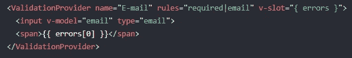
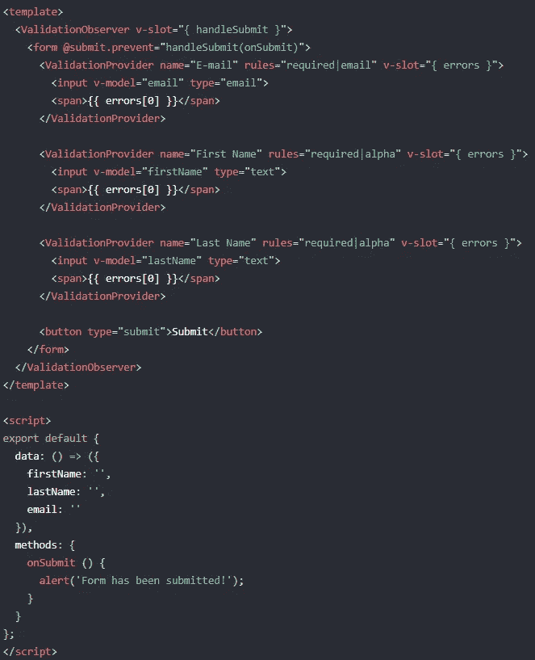
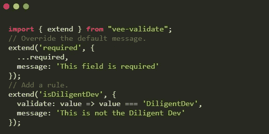

# Vue.js 表单验证

> 原文：<https://javascript.plainenglish.io/vuejs-form-validation-part-1-veevalidate-e1f960dacffd?source=collection_archive---------3----------------------->

## 第 1 部分:VeeValidate


VueJs Form Validation

在之前的一篇文章中，我讨论了创建表单有多痛苦。再加上表单验证，它真的变成了一个时间接收器。幸运的是，Vue 开发人员可以利用一些软件包来减轻这个过程的痛苦。

在这个由两部分组成的系列中，我们将特别关注 VueJs 表单验证。特别是，我们将看到两个最流行的验证包， [VeeValidate](https://logaretm.github.io/vee-validate/) 和 [Vuelidate](https://vuelidate.js.org/) 。

在第 1 部分中，我们将了解 VeeValidate。为了演示每个包，我们将看看如何在注册表单中使用它们。所以，让我们开始学习和编码吧！

# VeeValidate

## 装置

要安装 VeeValidate，请在 Vue 项目的根目录下打开一个终端，并运行以下命令:

```
npm install vee-validate --save
```

接下来，我们将把 VeeValidate 提供的 *ValidationObserver* 和 *ValidationProvider* 组件注册为 Vue 项目中的一个全局组件。在 src/main.js 中添加以下内容:

```
*import* { ValidationObserver } *from* "vee-validate";*import* { ValidationProvider } *from* 'vee-validate/dist/vee-validate.full.esm';*Vue.component*("ValidationProvider", ValidationProvider);
*Vue.component*("ValidationObserver", ValidationObserver);
```

我们单独导入 *ValidationProvider* 的原因是我们可以获得完整的规则包，而不必扩展每个规则。参见[他们的文档](https://logaretm.github.io/vee-validate/guide/rules.html#installing-all-rules)中的推理。

## 表单验证

**validation provider** 验证输入的方法是将其包装在 *ValidationProvider* 组件中，如下所示:



Validation Provider from [VeeValidate Docs](https://logaretm.github.io/vee-validate/guide/basics.html#validation-provider)

您将看到它需要以下内容:

*   名称—显示错误中的字段名称。这是可选的，如果指定，将采用输入名称。
*   规则—由 VeeValidate 提供的验证规则。点击查看完整列表[。](https://logaretm.github.io/vee-validate/guide/rules.html#rules)
*   v 型槽—哪里会出现错误。查看有错误的跨度[0]。

**validation observer** 为了处理一个表单，我们还需要像这样使用 *ValidationObserver* 组件:



Validation Observer from [VeeValidate Docs](https://logaretm.github.io/vee-validate/guide/forms.html#validate-before-submit)

你会看到它有一个带功能的 v 型槽。我们将这个函数包装在表单提交函数中，这样它将在表单提交之前触发验证。

## 覆盖和自定义验证

要覆盖现有规则或创建自定义规则，我们可以从 vee validate 导入扩展方法:



VeeValidate extend

## 注册表单

我们的注册表单将包括以下字段和验证:

*   名称—必需且唯一的字母(字母)
*   电子邮件—必需的有效电子邮件，
*   密码—必需，最小长度为 6，最大长度为 8
*   性别—必填
*   服务接受条款—必填

提交时，我们会将数据记录到控制台。我们还将使用 Bootstrap 来给我们一些样式。

## 组件化的论据

从上面的例子可以看出，将每个输入包装在一个 *ValidationProvider* 中会使模板膨胀。因此，可以提出一个有效的论点来将我们的输入组件化，以避免表单的膨胀。我的建议是制作可重用的输入组件。

# 视频教程

VeeValidate Video Tutorial

# vee 验证结论

VeeValidate 是一个强大的验证插件，可以帮助简化您的表单。您可以使用内置规则或覆盖现有规则，并轻松添加您的自定义规则。我强烈建议开发人员将他们的输入组件化，这样他们就不会膨胀他们的表单模板。

但是，总的来说，我认为它很容易使用和定制。在第 2 部分中，我将介绍 Vuelidate 验证插件。所以如果你还没有，一定要跟着我学。下次再见，祝编码愉快！