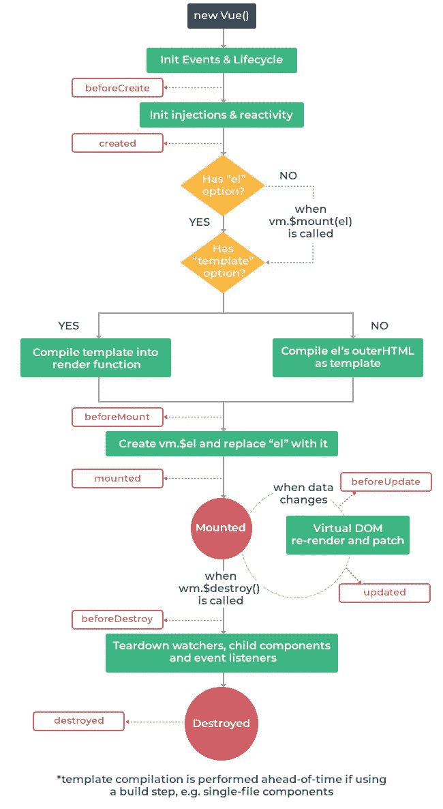

# Vue.js 生命周期挂钩

> 原文：<https://javascript.plainenglish.io/vuejs-lifecycle-hooks-7ddf74732b38?source=collection_archive---------8----------------------->


在本教程中，你将学习并理解 **Vue.js 生命周期挂钩**。您还将深入了解组件是如何在幕后创建和销毁的。

生命周期挂钩是几乎所有前端框架的入口点，很好地理解组件何时被创建、安装、更新和销毁对于理解库的反应性是必不可少的。

理解 Vue.js 中的生命周期挂钩相当容易。下图展示了 Vue.js 组件的整个生命周期。



观察生命周期挂钩在 [vue 模板](https://www.wrappixel.com/templates/category/vuejs-templates/)编译的不同阶段是如何变化的。

根据 Vue.js 文档，每个 Vue 实例在创建时都要经历一系列初始化步骤。—例如，它需要设置数据观察、编译模板、将实例挂载到 DOM，并在数据发生变化时更新 DOM。同时，它还运行名为**生命周期挂钩**的功能，让用户有机会在特定阶段添加自己的代码。

# Vue 创造了钩子

# 创建挂钩之前

beforeCreated 挂钩是初始化阶段的第一个挂钩，它在实例创建之前被触发，因此在这种状态下不会设置反应性。这意味着我们不能访问或更新数据。如果有来自后端 API 的数据，在 beforeCreated 钩子中调用它将返回 undefined。参见示例。

```
<script>
  export default {
    beforeCreated(){
      console.log(data);
      //This will return undefined 
    }
  }
</script>
```

# 创建的挂钩

创建组件时会触发创建的挂钩，在这里我们可以访问组件的数据并创建反应性。然而，模板和虚拟 DOM 还没有挂载到这个钩子中。请参见下面的示例:

```
<script>
  export default {
    data(){
      return{
        message: "I am learning Vue lifecycle hooks"
      }
    }, computed:{
      messageChange(){
        console.log(`This will look up to ${this.message} for changes`);
        return this.messages 
      }
    },

    created(){
      this.message = "now the message is changed";
      console.log(`messageChange will be updated since reactivity is present`);
    }
  }
</script>
```

# Vue 安装挂钩

# 安装前挂钩

beforeMount 挂钩在虚拟 DOM 的初始呈现和模板或呈现函数的编译之前被触发。不推荐在服务器端渲染时使用这个钩子，渲染后不能调用它。参见示例:

```
<script>
  export default {
    beforeMount(){
      console.log(`${this.el} is about to be mount`);
    }
</script>
```

# 安装钩

挂载的钩子全反应建立，模板，渲染 DOM (via。这个。$el)。

据报道，安装挂钩是最常用的生命周期挂钩。大多数人用它来获取组件的数据(我推荐使用**创建的钩子**)。参见示例:

```
<template>
  <p>Text inside a component</p>
</template><script>
  export default {
    mounted(){
      console.log(this.$el.textContent);
      //This will return the text from the template 
    }
</script>
```

# Vue 更新挂钩

每当组件使用的反应属性发生变化时，或者通过用户输入导致组件重新呈现时，都会触发更新挂钩。它们的更新钩子允许你挂钩到组件的**观察-计算-渲染循环**。

如果您想知道组件何时重新渲染，可以使用它。要定位反应组件的状态，请改为计算属性或观察器。

# 更新前挂钩

beforeUpdate 挂钩在组件重新呈现之前触发，它在组件中的数据发生变化时启动。这是在渲染之前跟踪反应组件状态的好地方。参见示例:

```
<script>
  export default {
    data(){
      n: 1,
    },

    beforeUpdate(){
      console.log(this.n) //sets the value of n to 300 after 1,500 seconds;
    },

    created(){
      setTimeOut(() => {
        this.n = 300
      }, 1500);
    }
</script>
```

# 更新的挂钩

在数据更改导致虚拟 DOM 被重新呈现和修补之后，更新的钩子被调用。当这个钩子被调用时，组件的 DOM 将被更新，所以您可以在这里执行依赖于 DOM 的操作。然而，在大多数情况下，你应该避免改变钩子内部的状态。为了对状态变化做出反应，通常最好使用一个 [**计算属性**](https://vuejs.org/v2/api/#computed) 或 [**观察器**](https://vuejs.org/v2/api/#watch) 来代替。

```
<template>
  <p ref="dom-element">{{name}}</p>
</template><script>
export default {
  data() {
    return {
      name: "Emmanuel Etukudo"
    }
  }, updated() {
    // Track update on the DOM element.
    console.log(this.$refs['dom-element'].textContent === this.name)
  }, created() {
    setTimeout(() => {
      this.name = "John Doe"
    }, 1000)
  }
}
</script>
```

# 破坏钩

销毁挂钩用于在组件被销毁时执行操作，例如移除基于组件的事件。当组件被从 DOM 中移除时，它们就会被删除。

# 销毁挂钩前

销毁 Vue 实例之前触发 beforeDestroy 挂钩。在这个阶段，实例仍然是完全正常的。

```
<script>
export default {
  data() {
    return {
      accessToken: localStorage.getItem('accessToken'),
    }
  },
 beforeDestroy() {
    // Remove the token.
    localStorage.removeItem('accessToken');
  },  
}
</script>
```

# 毁坏的钩子

销毁书是在销毁 Vue 实例后触发的。当这个钩子被调用时，Vue 实例的所有指令都被解除绑定，所有事件监听器都被移除，所有子 Vue 实例也都被销毁。

```
<script>
export default {
  destroyed() {
    console.log(this) // Nothing is left to log
  }
}
</script>
```

还有另外两个钩子没有在本文中捕获，它们是保持活动状态的钩子**激活** & **去激活。**你可以在 Vue 文档[网站](https://vuejs.org/v2/guide/instance.html)上查找。谢谢你的阅读，请留下你的评论，我会喜欢你的。