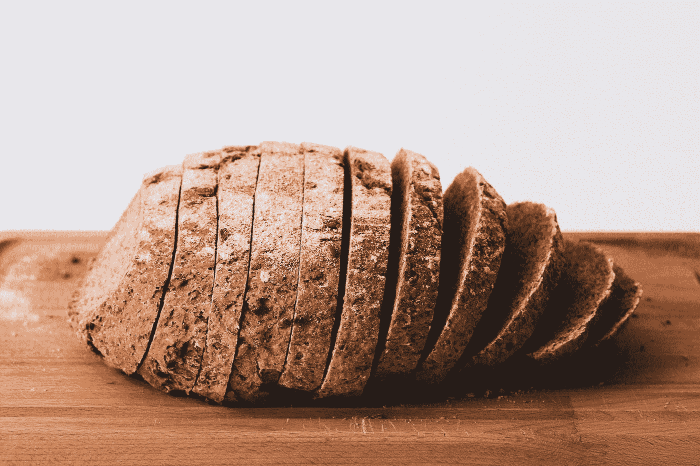

# 面包屑

> 原文：<https://javascript.plainenglish.io/vuetify-breadcrumbs-fd9a8ed5fb0d?source=collection_archive---------2----------------------->



Photo by [Jude Infantini](https://unsplash.com/@easy_emu?utm_source=medium&utm_medium=referral) on [Unsplash](https://unsplash.com?utm_source=medium&utm_medium=referral)

Vuetify 是一个流行的 Vue 应用程序 UI 框架。

在本文中，我们将了解如何使用 Vuetify 框架。

# 面包屑

组件让我们在页面上显示一个导航助手。

它可以接受一个材料图标图标或文字字符作为分隔符。

例如，我们可以写:

```
<template>
  <v-container>
    <v-row class="text-center">
      <v-col col="12">
        <v-breadcrumbs :items="items"></v-breadcrumbs>
      </v-col>
    </v-row>
  </v-container>
</template><script>
export default {
  name: "HelloWorld",
  data: () => ({
    items: [
      {
        text: "Dashboard",
        disabled: false,
        href: "breadcrumbs_dashboard",
      },
      {
        text: "Foo",
        disabled: false,
        href: "foo",
      },
      {
        text: "Bar",
        disabled: true,
        href: "bar",
      },
    ],
  }),
};
</script>
```

我们有带`items`道具的`v-breadcrumbs`组件。

道具接受一个包含有`text`、`disabled`和`href`道具的对象的数组。

`text`是链接文本。`disabled`是链接的禁用状态。

而`href`是链接的网址。

我们可以加一个`large`道具让它变大。

# 自定义分隔线

我们可以使用`divider`属性将分隔线更改为不同的图标或字符。

例如，我们可以写:

```
<template>
  <v-container>
    <v-row class="text-center">
      <v-col col="12">
        <v-breadcrumbs :items="items" divider="-"></v-breadcrumbs>
      </v-col>
    </v-row>
  </v-container>
</template><script>
export default {
  name: "HelloWorld",
  data: () => ({
    items: [
      {
        text: "Dashboard",
        disabled: false,
        href: "breadcrumbs_dashboard",
      },
      {
        text: "Foo",
        disabled: false,
        href: "foo",
      },
      {
        text: "Bar",
        disabled: true,
        href: "bar",
      },
    ],
  }),
};
</script>
```

添加`-`字符作为分隔符。

# 图标分隔线

我们可以通过编写以下内容添加一个图标作为面包屑分隔符:

```
<template>
  <v-container>
    <v-row class="text-center">
      <v-col col="12">
        <v-breadcrumbs :items="items">
          <template v-slot:divider>
            <v-icon>mdi-forward</v-icon>
          </template>
        </v-breadcrumbs>
      </v-col>
    </v-row>
  </v-container>
</template><script>
export default {
  name: "HelloWorld",
  data: () => ({
    items: [
      {
        text: "Dashboard",
        disabled: false,
        href: "breadcrumbs_dashboard",
      },
      {
        text: "Foo",
        disabled: false,
        href: "foo",
      },
      {
        text: "Bar",
        disabled: true,
        href: "bar",
      },
    ],
  }),
};
</script>
```

我们用我们选择的分频器填充`divider`插槽。

# 项目槽

`item`槽让我们以自定义格式显示项目。

例如，我们可以写:

```
<template>
  <v-container>
    <v-row class="text-center">
      <v-col col="12">
        <v-breadcrumbs :items="items">
          <template v-slot:item="{ item }">
            <v-breadcrumbs-item
              :href="item.href"
              :disabled="item.disabled"
            >{{ item.text.toUpperCase() }}</v-breadcrumbs-item>
          </template>
        </v-breadcrumbs>
      </v-col>
    </v-row>
  </v-container>
</template><script>
export default {
  name: "HelloWorld",
  data: () => ({
    items: [
      {
        text: "Dashboard",
        disabled: false,
        href: "breadcrumbs_dashboard",
      },
      {
        text: "Foo",
        disabled: false,
        href: "foo",
      },
      {
        text: "Bar",
        disabled: true,
        href: "bar",
      },
    ],
  }),
};
</script>
```

我们使用`item`槽属性获取面包屑项目，设置`href`并将面包屑文本格式化为槽中的大写字母。


Photo by [Kate Remmer](https://unsplash.com/@studioktr?utm_source=medium&utm_medium=referral) on [Unsplash](https://unsplash.com?utm_source=medium&utm_medium=referral)

# 结论

面包屑让我们可以轻松地在页面上添加导航。

喜欢这篇文章吗？如果有，通过 [**订阅我们的 YouTube 频道**](https://www.youtube.com/channel/UCtipWUghju290NWcn8jhyAw?sub_confirmation=true) **获取更多类似内容！**