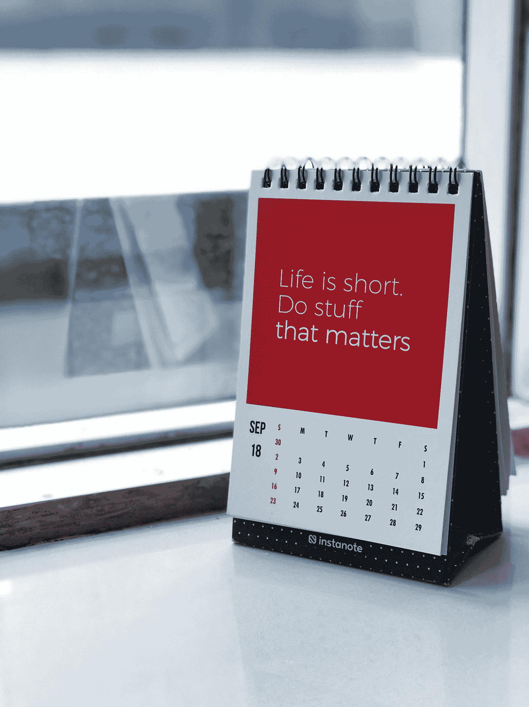

# Vuetify —日历

> 原文：<https://javascript.plainenglish.io/vuetify-calendar-58d0f02868bf?source=collection_archive---------3----------------------->


Photo by [Estée Janssens](https://unsplash.com/@esteejanssens?utm_source=medium&utm_medium=referral) on [Unsplash](https://unsplash.com?utm_source=medium&utm_medium=referral)

Vuetify 是一个流行的 Vue 应用程序 UI 框架。

在本文中，我们将了解如何使用 Vuetify 框架。

# 日历

`v-calendar`组件用于在不同种类的日历视图中显示信息。

它有全天或定时元素的插槽。

每周和每月视图有一个每天的时间段。

例如，我们可以写:

```
<template>
  <v-container>
    <v-row class="text-center">
      <v-col col="12">
        <v-sheet height="400">
          <v-calendar
            ref="calendar"
            :now="today"
            :value="today"
            :events="events"
            color="primary"
            type="week"
          ></v-calendar>
        </v-sheet>
      </v-col>
    </v-row>
  </v-container>
</template><script>
export default {
  name: "HelloWorld",
  data: () => ({
    today: "2020-01-08",
    events: [
      {
        name: "eat",
        start: "2020-01-07 09:00",
        end: "2020-01-07 10:00",
      },
      {
        name: "drink",
        start: "2020-01-10",
      },
      {
        name: "sleep",
        start: "2020-01-09 12:30",
        end: "2020-01-09 15:30",
      },
    ],
    mounted() {
      this.$refs.calendar.scrollToTime("08:00");
    },
  }),
};
</script>
```

我们添加了`v-calendar`组件，以我们想要的方式显示项目。

我们将`now`属性设置为我们想要显示的日期字符串。

`value`设置为相同的东西，它是选定的日期。

`events`道具有一个事件列表可以显示。

`type`有我们想要显示的日历视图类型。

`color`设置日历项目的颜色。

`events`数组包含带有事件名称的`name`属性的对象。

`start`和`end`有日历开始和结束日期。

`mounted`钩子调用`scrollToTime`方法让我们滚动到我们想要的时间。

# 每日视图

我们可以将日历视图更改为每日视图。

例如，我们可以写:

```
<template>
  <v-container>
    <v-row class="text-center">
      <v-col col="12">
        <v-sheet height="400">
          <v-calendar color="primary" type="day">
            <template v-slot:day-header="{ present }">
              <template v-if="present" class="text-center">Today</template>
            </template> <template v-slot:interval="{ hour }">
              <div class="text-center">{{ hour }} o'clock</div>
            </template>
          </v-calendar>
        </v-sheet>
      </v-col>
    </v-row>
  </v-container>
</template><script>
export default {
  name: "HelloWorld",
  data: () => ({}),
};
</script>
```

我们有带`v-calendar`组件的`v-sheet`组件。

我们普及了`header`槽来改变日期显示。

我们填充`interval`槽，以我们想要的方式显示时间。

# 时间

我们可以填充各种插槽来按照我们想要的方式格式化代码。

例如，我们可以写:

```
<template>
  <v-container>
    <v-row class="text-center">
      <v-col col="12">
        <v-sheet height="500">
          <v-calendar :now="today" :value="today" color="primary">
            <template v-slot:day="{ present, past, date }">
              <v-row class="fill-height">
                <template v-if="past && tracked[date]">
                  <v-sheet
                    v-for="(percent, i) in tracked[date]"
                    :key="i"
                    :title="category[i]"
                    :color="colors[i]"
                    :width="`${percent}%`"
                    height="100%"
                    tile
                  ></v-sheet>
                </template>
              </v-row>
            </template>
          </v-calendar>
        </v-sheet>
      </v-col>
    </v-row>
  </v-container>
</template><script>
export default {
  name: "HelloWorld",
  data: () => ({
    today: "2020-01-10",
    tracked: {
      "2020-01-09": [23, 45, 10],
      "2020-01-08": [10],
      "2020-01-07": [0, 78, 5],
      "2020-01-06": [0, 0, 50],
      "2020-01-05": [0, 10, 23],
      "2020-01-04": [2, 90],
      "2020-01-03": [10, 32],
      "2020-01-02": [80, 10, 10],
      "2020-01-01": [20, 25, 10],
    },
    colors: ["red", "green", "blue"],
    category: ["Development", "Meetings", "Slacking"],
  }),
};
</script>
```

`tracked`对象具有要显示的条形百分比数组。

我们可以用它来改变我们想要的宽度。

`color`道具设置颜色。

`title`设置条形的标题。

使条形并排显示。



Photo by [Manasvita S](https://unsplash.com/@manasvita?utm_source=medium&utm_medium=referral) on [Unsplash](https://unsplash.com?utm_source=medium&utm_medium=referral)

# 结论

我们可以用`v-calendar`组件显示日历。

它有每日、每周和每月视图。

喜欢这篇文章吗？如果有，通过 [**订阅我们的 YouTube 频道**](https://www.youtube.com/channel/UCtipWUghju290NWcn8jhyAw?sub_confirmation=true) **获取更多类似内容！**