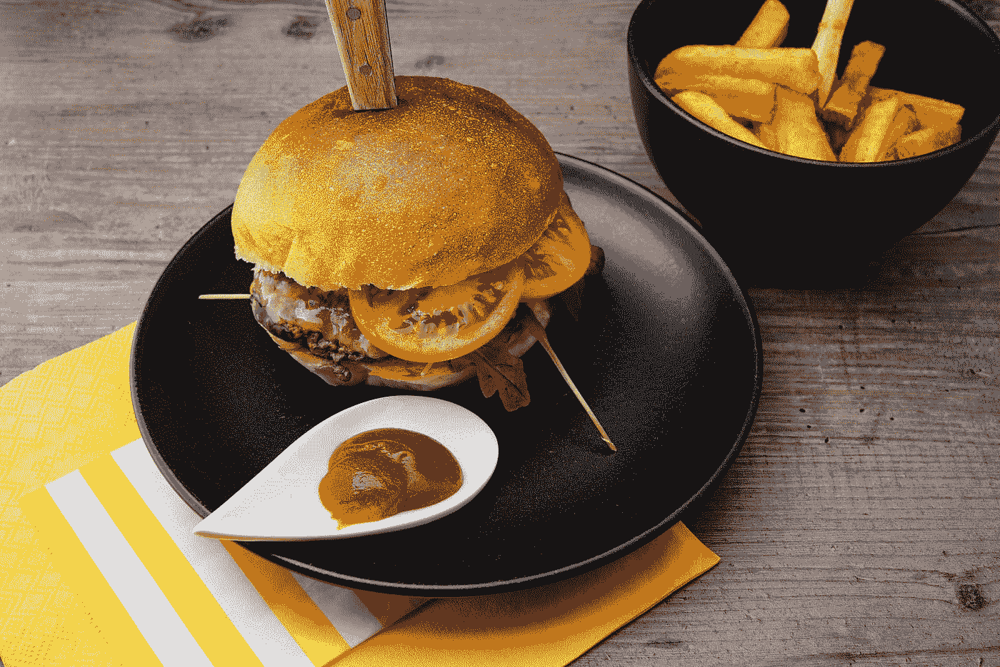

# 虚拟化—芯片和输入

> 原文：<https://javascript.plainenglish.io/vuetify-chips-and-inputs-bfa98acc4c8a?source=collection_archive---------5----------------------->


Photo by [Fabrice Thys](https://unsplash.com/@valentinmaya?utm_source=medium&utm_medium=referral) on [Unsplash](https://unsplash.com?utm_source=medium&utm_medium=referral)

Vuetify 是一个流行的 Vue 应用程序 UI 框架。

在本文中，我们将了解如何使用 Vuetify 框架。

# 可关闭的芯片

我们可以用`v-model`指令创建一个可关闭的印章。

例如，我们可以写:

```
<template>
  <v-container>
    <v-row>
      <v-col col="12">
        <v-chip
          v-if="chip"
          class="ma-2"
          close
          color="green"
          outlined
          @click:close="chip = false"
        >Success</v-chip>
      </v-col>
    </v-row>
  </v-container>
</template><script>
export default {
  name: "HelloWorld",
  data: () => ({
    chip: true,
  }),
};
</script>
```

我们监听`click:close`事件并将`chip`设置为`false`。

`v-if`指令控制芯片是否显示。

# 行动筹码

我们可以让芯片在我们点击它的时候做一些事情。

例如，我们可以写:

```
<template>
  <v-container>
    <v-row>
      <v-col col="12">
        <v-chip @click="blinds">
          <v-icon left>mdi-blinds</v-icon>Close blinds
        </v-chip>
      </v-col>
    </v-row>
  </v-container>
</template><script>
export default {
  name: "HelloWorld",
  data: () => ({}),
  methods: {
    blinds() {
      alert("Toggling Blinds");
    },
  },
};
</script>
```

我们通过在`blinds`方法上设置点击处理程序来监听`click`事件。

然后当我们点击它的时候我们运行这个方法。

# 选择筹码

我们可以在选择元件中使用芯片来显示选择的数据。

例如，我们可以写:

```
<template>
  <v-container>
    <v-row>
      <v-col col="12">
        <v-combobox
          v-model="chips"
          :items="items"
          chips
          clearable
          label="Your favorite hobbies"
          multiple
          solo
        >
          <template v-slot:selection="{ attrs, item, select, selected }">
            <v-chip
              v-bind="attrs"
              :input-value="selected"
              close
              @click="select"
              @click:close="remove(item)"
            >{{ item }}</v-chip>
          </template>
        </v-combobox>
      </v-col>
    </v-row>
  </v-container>
</template><script>
export default {
  name: "HelloWorld",
  data: () => ({
    chips: ["eat", "drink", "sleep"],
    items: ["walk", "read"],
  }),
  methods: {
    remove(item) {
      this.chips.splice(this.chips.indexOf(item), 1);
      this.chips = [...this.chips];
    },
  },
};
</script>
```

我们监听`click`事件来运行由`v-combobox`组件的`selection`插槽提供的`select`方法。

`v-combobox`是下拉组件。

此外，当我们单击芯片上的“x”时，我们会侦听`click:close`事件来删除项目。

# 自定义列表

我们可以在自定义列表中使用芯片。

为此，我们可以写:

```
<template>
  <v-container>
    <v-row>
      <v-col col="12">
        <v-card class="mx-auto" max-width="500">
          <v-container class="py-0">
            <v-row align="center" justify="start">
              <v-col v-for="(selection, i) in selections" :key="selection.text" class="shrink">
                <v-chip :disabled="loading" close @click:close="selected.splice(i, 1)">
                  <v-icon left v-text="selection.icon"></v-icon>
                  {{ selection.text }}
                </v-chip>
              </v-col> <v-col v-if="!allSelected" cols="12">
                <v-text-field
                  ref="search"
                  v-model="search"
                  full-width
                  hide-details
                  label="Search"
                  single-line
                ></v-text-field>
              </v-col>
            </v-row>
          </v-container> <v-divider v-if="!allSelected"></v-divider> <v-list>
            <template v-for="item in categories">
              <v-list-item
                v-if="!selected.includes(item)"
                :key="item.text"
                :disabled="loading"
                @click="selected.push(item)"
              >
                <v-list-item-avatar>
                  <v-icon :disabled="loading" v-text="item.icon"></v-icon>
                </v-list-item-avatar>
                <v-list-item-title v-text="item.text"></v-list-item-title>
              </v-list-item>
            </template>
          </v-list> <v-divider></v-divider> <v-card-actions>
            <v-spacer></v-spacer>
            <v-btn
              :disabled="!selected.length"
              :loading="loading"
              color="purple"
              text
              @click="next"
            >Next</v-btn>
          </v-card-actions>
        </v-card>
      </v-col>
    </v-row>
  </v-container>
</template><script>
export default {
  name: "HelloWorld",
  data: () => ({
    items: [
      {
        text: "nature",
        icon: "mdi-nature",
      },
      {
        text: "wine",
        icon: "mdi-glass-wine",
      },
      {
        text: "calendar",
        icon: "mdi-calendar-range",
      },
    ],
    loading: false,
    search: "",
    selected: [],
  }), computed: {
    allSelected() {
      return this.selected.length === this.items.length;
    },
    categories() {
      const search = this.search.toLowerCase(); if (!search) return this.items; return this.items.filter((item) => {
        const text = item.text.toLowerCase(); return text.indexOf(search) > -1;
      });
    },
    selections() {
      const selections = []; for (const selection of this.selected) {
        selections.push(selection);
      } return selections;
    },
  }, watch: {
    selected() {
      this.search = "";
    },
  }, methods: {
    next() {
      this.loading = true; setTimeout(() => {
        this.search = "";
        this.selected = [];
        this.loading = false;
      }, 2000);
    },
  },
};
</script>
```

当我们从`v-text-field`中选择项目时，我们将`v-chip`组件放在`v-col`中以对它们进行布局。

`v-text-field`让我们输入一些文本，下面的`v-list`将显示与我们输入的内容相匹配的项目。

`categories`是返回匹配项的计算属性。



Photo by [Wesual Click](https://unsplash.com/@wesual?utm_source=medium&utm_medium=referral) on [Unsplash](https://unsplash.com?utm_source=medium&utm_medium=referral)

# 结论

我们可以添加芯片来做不同的事情。

他们也可以在下拉。

喜欢这篇文章吗？如果有，通过 [**订阅我们的 YouTube 频道**](https://www.youtube.com/channel/UCtipWUghju290NWcn8jhyAw?sub_confirmation=true) **获取更多类似内容！**