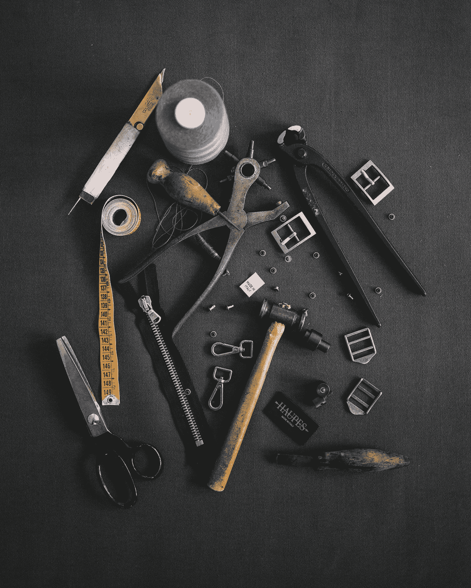

# 动态工具栏内容和系统栏

> 原文：<https://javascript.plainenglish.io/vuetify-dynamic-toolbar-content-and-system-bar-bee5e8e88926?source=collection_archive---------4----------------------->


Photo by [iMattSmart](https://unsplash.com/@imattsmart?utm_source=medium&utm_medium=referral) on [Unsplash](https://unsplash.com?utm_source=medium&utm_medium=referral)

Vuetify 是一个流行的 Vue 应用程序 UI 框架。

在本文中，我们将了解如何使用 Vuetify 框架。

# 带搜索的浮动工具栏

我们可以用 Vuetify 轻松添加一个浮动工具栏。

例如，我们可以写:

```
<template>
  <v-container>
    <v-row class="text-center">
      <v-col col="12">
        <v-card
          class="pa-4"
          flat
          height="300px"
          img="https://cdn.vuetifyjs.com/images/toolbar/map.jpg"
        >
          <v-toolbar dense floating>
            <v-text-field hide-details single-line></v-text-field> <v-btn icon>
              <v-icon>mdi-dots-vertical</v-icon>
            </v-btn>
          </v-toolbar>
        </v-card>
      </v-col>
    </v-row>
  </v-container>
</template><script>
export default {
  name: "HelloWorld",
  data: () => ({}),
};
</script>
```

我们在一个`v-card`中添加了`v-toolbar`。

`img`道具的值是背景图片的 URL。

`floating`道具会让它浮在卡片上面。

# 上下文动作栏

我们可以添加上下文动作栏，当采取某个动作时，它会发生变化。

例如，我们可以写:

```
<template>
  <v-container>
    <v-row class="text-center">
      <v-col col="12">
        <v-card max-width="500" class="mx-auto">
          <v-toolbar :color="selection.length ? 'grey darken-4' : 'deep-purple accent-4'" dark>
            <v-app-bar-nav-icon v-if="!selection.length"></v-app-bar-nav-icon>
            <v-btn v-else icon @click="selection = []">
              <v-icon>mdi-close</v-icon>
            </v-btn> <v-toolbar-title>{{ selection.length ? `${selection.length} selected` : 'App' }}</v-toolbar-title> <v-spacer></v-spacer> <v-scale-transition>
              <v-btn v-if="selection.length" key="export" icon>
                <v-icon>mdi-export-variant</v-icon>
              </v-btn>
            </v-scale-transition>
            <v-scale-transition>
              <v-btn v-if="selection.length" key="delete" icon>
                <v-icon>mdi-delete</v-icon>
              </v-btn>
            </v-scale-transition> <v-btn icon>
              <v-icon>mdi-dots-vertical</v-icon>
            </v-btn>
          </v-toolbar> <v-card-text>
            <v-select v-model="selection" :items="items" multiple label="Select an option"></v-select>
          </v-card-text>
        </v-card>
      </v-col>
    </v-row>
  </v-container>
</template><script>
export default {
  name: "HelloWorld",
  data: () => ({
    items: ["apple", "orange", "grape"],
    selection: []
  }),
};
</script>
```

我们有随着`selection`状态变化的`v-scale-transiton`分量。

`selection`状态由`v-select`组件控制。

我们还设置了带有`selection`变化的`v-toolbar-title`文本。

同样，当`selection`改变时，我们改变`color`道具。

因此，当我们从下拉列表中选择项目时，工具栏会发生变化。

# 系统栏

系统栏是另一种工具栏。

它看起来像 Android 手机上的系统栏。

要添加一个，我们使用`v-system-bar`组件:

```
<template>
  <v-container>
    <v-row class="text-center">
      <v-col col="12">
        <v-system-bar dark color="primary">
          <v-spacer></v-spacer>
          <v-icon>mdi-wifi-strength-5</v-icon>
          <v-icon>mdi-signal-cellular-outline</v-icon>
          <v-icon>mdi-battery</v-icon>
          <span>12:30</span>
        </v-system-bar>
      </v-col>
    </v-row>
  </v-container>
</template><script>
export default {
  name: "HelloWorld",
  data: () => ({}),
};
</script>
```

我们添加一个内部带有一些图标的`v-system-bar`组件。



Photo by [Haupes Co.](https://unsplash.com/@haupes?utm_source=medium&utm_medium=referral) on [Unsplash](https://unsplash.com?utm_source=medium&utm_medium=referral)

# 结论

我们可以添加一个系统栏，里面有一些图标和文本。

此外，当工具栏的状态改变时，我们可以让它改变。

喜欢这篇文章吗？如果有，通过 [**订阅我们的 YouTube 频道**](https://www.youtube.com/channel/UCtipWUghju290NWcn8jhyAw?sub_confirmation=true) **获取更多类似内容！**