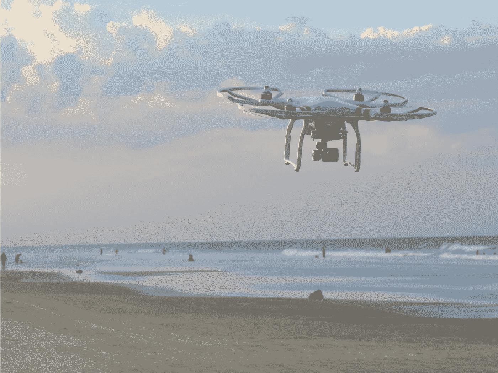

# 虚拟化—悬停

> 原文：<https://javascript.plainenglish.io/vuetify-hover-682d50f0a5b?source=collection_archive---------3----------------------->



Photo by [Matt Pritchard](https://unsplash.com/@matt_pritchard?utm_source=medium&utm_medium=referral) on [Unsplash](https://unsplash.com?utm_source=medium&utm_medium=referral)

Vuetify 是一个流行的 Vue 应用程序 UI 框架。

在本文中，我们将了解如何使用 Vuetify 框架。

# 盘旋

组件让我们处理任何组件的悬停状态。

例如，我们可以写:

```
<template>
  <v-container class="grey lighten-5">
    <v-row>
      <v-col>
        <v-hover v-slot:default="{ hover }">
          <v-card :elevation="hover ? 12 : 2" class="mx-auto" height="350" max-width="350">
            <v-card-text class="my-4 text-center title">Hover over me!</v-card-text>
          </v-card>
        </v-hover>
      </v-col>
    </v-row>
  </v-container>
</template>
<script>
export default {
  name: "HelloWorld",
  data: () => ({}),
};
</script>
```

用`v-hover`组件添加悬停功能。

我们可以给`v-hover`添加`disabled`道具来禁用悬停效果。

# 打开/关闭延迟

我们可以设置用`open-delay`和`close-delay`道具打开或关闭悬停效果时的延迟。

例如，我们可以写:

```
<template>
  <v-container class="grey lighten-5">
    <v-row>
      <v-col>
        <v-hover v-slot:default="{ hover }" open-delay="200">
          <v-card :elevation="hover ? 12 : 2" class="mx-auto" height="350" max-width="350">
            <v-card-text class="my-4 text-center title">Hover over me!</v-card-text>
          </v-card>
        </v-hover>
      </v-col>
    </v-row>
  </v-container>
</template>
<script>
export default {
  name: "HelloWorld",
  data: () => ({}),
};
</script>
```

设置 200 毫秒的打开延迟。

# 悬停列表

我们可以用`v-hover`组件制作一个悬停列表。

例如，我们可以写:

```
<template>
  <v-container class="grey lighten-5">
    <v-row>
      <v-col>
        <v-container class="pa-4 text-center">
          <v-row class="fill-height" align="center" justify="center">
            <template v-for="(item, i) in items">
              <v-col :key="i" cols="12" md="4">
                <v-hover v-slot:default="{ hover }">
                  <v-card :elevation="hover ? 12 : 2" :class="{ 'on-hover': hover }">
                    <v-img :src="item.img" height="225px">
                      <v-card-title class="title white--text">
                        <v-row class="fill-height flex-column" justify="space-between">
                          <p class="mt-4 subheading text-left">{{ item.title }}</p><div>
                            <p
                              class="ma-0 body-1 font-weight-bold font-italic text-left"
                            >{{ item.text }}</p>
                            <p
                              class="caption font-weight-medium font-italic text-left"
                            >{{ item.subtext }}</p>
                          </div>
                        </v-row>
                      </v-card-title>
                    </v-img>
                  </v-card>
                </v-hover>
              </v-col>
            </template>
          </v-row>
        </v-container>
      </v-col>
    </v-row>
  </v-container>
</template>
<script>
export default {
  name: "HelloWorld",
  data: () => ({
    items: [
      {
        title: "Title",
        text: "Text",
        subtext: "Subtext",
        img: "https://picsum.photos/200",
      },
      {
        title: "Title",
        text: "Text",
        subtext: "Subtext",
        img: "https://picsum.photos/200",
      },
      {
        title: "Title",
        text: "Text",
        subtext: "Subtext",
        img: "https://picsum.photos/200",
      },
    ],
    transparent: "rgba(255, 255, 255, 0)",
  }),
};
</script>
```

我们有 3 张幻灯片，每张都有自己的`v-card`组件。

它们在一个`v-hover`组件中，所以当我们的鼠标在方块上时，我们可以看到悬停效果。

# 过渡

我们可以为`v-hover`添加我们自己的过渡。

例如，我们可以写:

```
<template>
  <v-container class="grey lighten-5">
    <v-row>
      <v-col>
        <v-hover v-slot:default="{ hover }">
          <v-card class="mx-auto" color="grey lighten-4" max-width="600">
            <v-img :aspect-ratio="16/9" src="[https://cdn.vuetifyjs.com/images/cards/kitchen.png](https://cdn.vuetifyjs.com/images/cards/kitchen.png)">
              <v-expand-transition>
                <div
                  v-if="hover"
                  class="d-flex transition-fast-in-fast-out orange darken-2 v-card--reveal display-3 white--text"
                  style="height: 100%;"
                >$100.99</div>
              </v-expand-transition>
            </v-img>
            <v-card-text class="pt-6" style="position: relative;">
              <v-btn absolute color="orange" class="white--text" fab large right top>
                <v-icon>mdi-cart</v-icon>
              </v-btn>
              <div class="font-weight-light grey--text title mb-2">Perfect meal</div>
            </v-card-text>
          </v-card>
        </v-hover>
      </v-col>
    </v-row>
  </v-container>
</template>
<script>
export default {
  name: "HelloWorld",
  data: () => ({}),
};
</script><style>
.v-card--reveal {
  align-items: center;
  bottom: 0;
  justify-content: center;
  opacity: 0.5;
  position: absolute;
  width: 100%;
}
</style>
```

添加一个`v-expand-transition`来创建我们的悬停效果。

当我们悬停在图像上时，我们显示价格。

这些样式使覆盖文本居中且半透明。

# 结论

我们可以用`v-hover`组件添加悬停效果。

过渡是内置的，但我们也可以定制我们想要的。

喜欢这篇文章吗？如果有，通过 [**订阅我们的 YouTube 频道**](https://www.youtube.com/channel/UCtipWUghju290NWcn8jhyAw?sub_confirmation=true) **获取更多类似内容！**