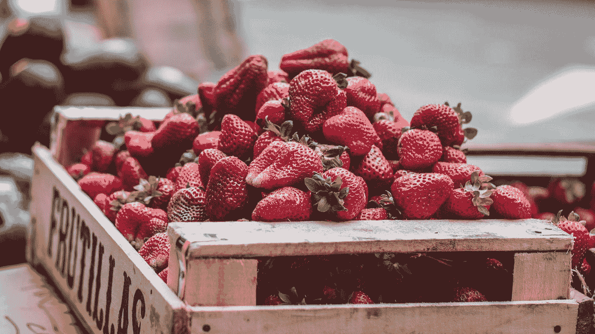

# Vuetify —输入和溢出按钮

> 原文：<https://javascript.plainenglish.io/vuetify-inputs-and-overflow-buttons-d107e5778c7a?source=collection_archive---------9----------------------->


Photo by [Marcin Jozwiak](https://unsplash.com/@marcinjozwiak?utm_source=medium&utm_medium=referral) on [Unsplash](https://unsplash.com?utm_source=medium&utm_medium=referral)

Vuetify 是一个流行的 Vue 应用程序 UI 框架。

在本文中，我们将了解如何使用 Vuetify 框架。

# 输入事件

输入可以监听图标的各种点击事件。

例如，我们可以写:

```
<template>
  <v-container>
    <v-row>
      <v-col col="12">
        <v-input
          :messages="['Messages']"
          append-icon="mdi-plus"
          prepend-icon="mdi-minus"
          @click:append="appendIconCallback"
          @click:prepend="prependIconCallback"
        >Default Slot</v-input>
      </v-col>
    </v-row>
  </v-container>
</template>
<script>
export default {
  name: "HelloWorld",
  data: () => ({
    text: "",
  }),
  methods: {
    appendIconCallback() {
      alert("append");
    },
    prependIconCallback() {
      alert("prepend");
    },
  },
};
</script>
```

我们用一些文本填充默认槽。

我们还有`click:append`和`click:prepend`监听器来分别监听左右图标的点击。

# 溢出按钮

我们可以用`v-overflow-btn`组件创建溢出按钮。

它让我们创建一个下拉菜单来显示项目并选择它们。

例如，我们可以写:

```
<template>
  <v-container>
    <v-row>
      <v-col col="12">
        <v-overflow-btn
          class="my-2"
          :items="dropdownItems"
          label="Overflow Btn"
          counter
          item-value="text"
        ></v-overflow-btn>
      </v-col>
    </v-row>
  </v-container>
</template>
<script>
export default {
  name: "HelloWorld",
  data: () => ({
    dropdownItems: [
      { text: "100%" },
      { text: "75%" },
      { text: "50%" },
      { text: "25%" },
      { text: "0%" },
    ],
  }),
};
</script>
```

我们有`v-overflow-btn`来创建一个下拉菜单。

`items`道具有物品。

`counter`显示所选项目的索引。

`label`有标签。

`item-value`属性具有要显示的`dropdownItems`条目的属性名。

# 有缺陷的

我们可以用`disabled`道具禁用溢出按钮:

```
<template>
  <v-container>
    <v-row>
      <v-col col="12">
        <v-overflow-btn
          class="my-2"
          :items="dropdownItems"
          label="Overflow Btn"
          counter
          disabled
          item-value="text"
        ></v-overflow-btn>
      </v-col>
    </v-row>
  </v-container>
</template>
<script>
export default {
  name: "HelloWorld",
  data: () => ({
    dropdownItems: [
      { text: "100%" },
      { text: "75%" },
      { text: "50%" },
      { text: "25%" },
      { text: "0%" },
    ],
  }),
};
</script>
```

# 密集溢出按钮

`dense`道具让溢出按钮变小。

例如，我们可以写:

```
<template>
  <v-container>
    <v-row>
      <v-col col="12">
        <v-overflow-btn
          class="my-2"
          :items="dropdownItems"
          label="Overflow Btn"
          counter
          dense
          item-value="text"
        ></v-overflow-btn>
      </v-col>
    </v-row>
  </v-container>
</template>
<script>
export default {
  name: "HelloWorld",
  data: () => ({
    dropdownItems: [
      { text: "100%" },
      { text: "75%" },
      { text: "50%" },
      { text: "25%" },
      { text: "0%" },
    ],
  }),
};
</script>
```

现在下拉列表应该更短了。

# 可编辑的

我们可以用`editable`道具编辑下拉列表。

例如，我们可以写:

```
<template>
  <v-container>
    <v-row>
      <v-col col="12">
        <v-overflow-btn
          class="my-2"
          :items="dropdownItems"
          label="Overflow Btn"
          counter
          editable
          item-value="text"
        ></v-overflow-btn>
      </v-col>
    </v-row>
  </v-container>
</template>
<script>
export default {
  name: "HelloWorld",
  data: () => ({
    dropdownItems: [
      { text: "100%" },
      { text: "75%" },
      { text: "50%" },
      { text: "25%" },
      { text: "0%" },
    ],
  }),
};
</script>
```

`editable`道具使溢出按钮的输入可编辑。



Photo by [Johnny Martínez](https://unsplash.com/@thisisjohnnym?utm_source=medium&utm_medium=referral) on [Unsplash](https://unsplash.com?utm_source=medium&utm_medium=referral)

# 结论

我们可以用 Vuetify 添加输入和溢出按钮。

喜欢这篇文章吗？如果有，通过 [**订阅我们的 YouTube 频道**](https://www.youtube.com/channel/UCtipWUghju290NWcn8jhyAw?sub_confirmation=true) **获取更多类似内容！**