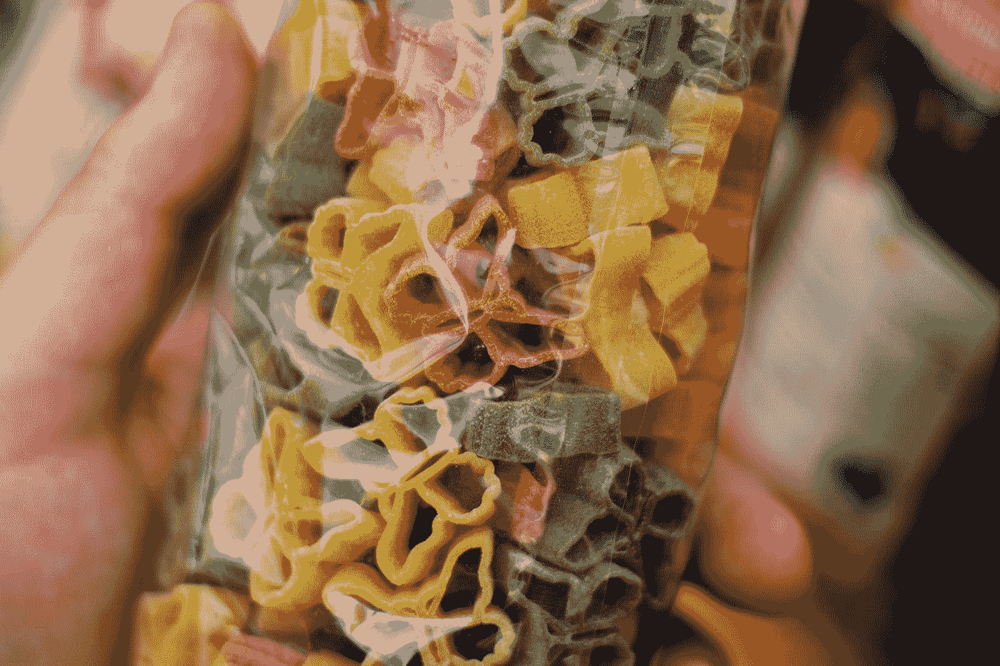

# 虚拟化—列出形状

> 原文：<https://javascript.plainenglish.io/vuetify-list-shapes-4b7ebcae4b25?source=collection_archive---------3----------------------->



Photo by [Frederic Köberl](https://unsplash.com/@internetztube?utm_source=medium&utm_medium=referral) on [Unsplash](https://unsplash.com?utm_source=medium&utm_medium=referral)

Vuetify 是一个流行的 Vue 应用程序 UI 框架。

在本文中，我们将了解如何使用 Vuetify 框架。

# 成型列表

我们可以改变列表项的形状。

例如，我们可以写:

```
<template>
  <v-row>
    <v-col cols="12">
      <v-card class="mx-auto" max-width="300" tile>
        <v-list shaped>
          <v-subheader>REPORTS</v-subheader>
          <v-list-item-group v-model="item" color="primary">
            <v-list-item v-for="(item, i) in items" :key="i">
              <v-list-item-icon>
                <v-icon v-text="item.icon"></v-icon>
              </v-list-item-icon>
              <v-list-item-content>
                <v-list-item-title v-text="item.text"></v-list-item-title>
              </v-list-item-content>
            </v-list-item>
          </v-list-item-group>
        </v-list>
      </v-card>
    </v-col>
  </v-row>
</template>
<script>
export default {
  name: "HelloWorld",
  data: () => ({
    item: 1,
    items: [
      { text: "Clock", icon: "mdi-clock" },
      { text: "Account", icon: "mdi-account" },
      { text: "Flag", icon: "mdi-flag" },
    ],
  }),
};
</script>
```

`shaped`道具使列表项在右侧以圆角显示。

# 密集项目

我们可以添加`dense`道具来增加物品的密度:

```
<template>
  <v-row>
    <v-col cols="12">
      <v-card class="mx-auto" max-width="300" tile>
        <v-list dense >
          <v-subheader>REPORTS</v-subheader>
          <v-list-item-group v-model="item" color="primary">
            <v-list-item v-for="(item, i) in items" :key="i">
              <v-list-item-icon>
                <v-icon v-text="item.icon"></v-icon>
              </v-list-item-icon>
              <v-list-item-content>
                <v-list-item-title v-text="item.text"></v-list-item-title>
              </v-list-item-content>
            </v-list-item>
          </v-list-item-group>
        </v-list>
      </v-card>
    </v-col>
  </v-row>
</template>
<script>
export default {
  name: "HelloWorld",
  data: () => ({
    item: 1,
    items: [
      { text: "Clock", icon: "mdi-clock" },
      { text: "Account", icon: "mdi-account" },
      { text: "Flag", icon: "mdi-flag" },
    ],
  }),
};
</script>
```

# 平的

`flat`道具让`v-list`物品变平:

```
<template>
  <v-row>
    <v-col cols="12">
      <v-card class="mx-auto" max-width="300" tile>
        <v-list flat>
          <v-subheader>REPORTS</v-subheader>
          <v-list-item-group v-model="item" color="primary">
            <v-list-item v-for="(item, i) in items" :key="i">
              <v-list-item-icon>
                <v-icon v-text="item.icon"></v-icon>
              </v-list-item-icon>
              <v-list-item-content>
                <v-list-item-title v-text="item.text"></v-list-item-title>
              </v-list-item-content>
            </v-list-item>
          </v-list-item-group>
        </v-list>
      </v-card>
    </v-col>
  </v-row>
</template>
<script>
export default {
  name: "HelloWorld",
  data: () => ({
    item: 1,
    items: [
      { text: "Clock", icon: "mdi-clock" },
      { text: "Account", icon: "mdi-account" },
      { text: "Flag", icon: "mdi-flag" },
    ],
  }),
};
</script>
```

# 全面的

我们可以用`rounded`道具让列表项四周都有圆角:

```
<template>
  <v-row>
    <v-col cols="12">
      <v-card class="mx-auto" max-width="300" tile>
        <v-list rounded>
          <v-subheader>REPORTS</v-subheader>
          <v-list-item-group v-model="item" color="primary">
            <v-list-item v-for="(item, i) in items" :key="i">
              <v-list-item-icon>
                <v-icon v-text="item.icon"></v-icon>
              </v-list-item-icon>
              <v-list-item-content>
                <v-list-item-title v-text="item.text"></v-list-item-title>
              </v-list-item-content>
            </v-list-item>
          </v-list-item-group>
        </v-list>
      </v-card>
    </v-col>
  </v-row>
</template>
<script>
export default {
  name: "HelloWorld",
  data: () => ({
    item: 1,
    items: [
      { text: "Clock", icon: "mdi-clock" },
      { text: "Account", icon: "mdi-account" },
      { text: "Flag", icon: "mdi-flag" },
    ],
  }),
};
</script>
```

# 结论

我们可以用 Vuetify 添加各种外观的列表。

喜欢这篇文章吗？如果有，通过 [**订阅我们的 YouTube 频道**](https://www.youtube.com/channel/UCtipWUghju290NWcn8jhyAw?sub_confirmation=true) **获取更多类似内容！**