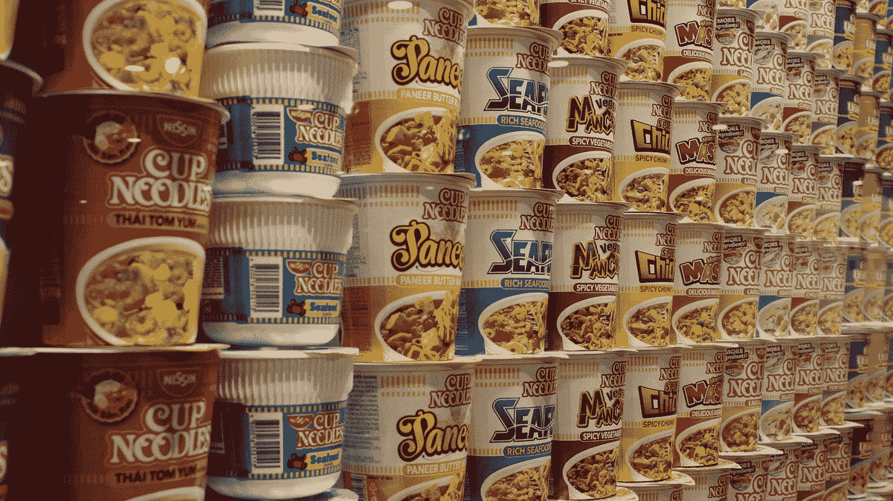

# 菜单和上下文菜单

> 原文：<https://javascript.plainenglish.io/vuetify-menus-and-context-menu-add3b5d98009?source=collection_archive---------14----------------------->



Photo by [Matt & Chris Pua](https://unsplash.com/@yo_puaaa?utm_source=medium&utm_medium=referral) on [Unsplash](https://unsplash.com?utm_source=medium&utm_medium=referral)

Vuetify 是一个流行的 Vue 应用程序 UI 框架。

在本文中，我们将了解如何使用 Vuetify 框架。

# 全面的

我们用`rounded`道具把菜单角弄圆。

例如，我们可以写:

```
<template>
  <v-row justify="space-around">
    <v-col cols="12">
      <v-menu rounded="rounded" offset-y>
        <template v-slot:activator="{ attrs, on }">
          <v-btn color="primary" class="white--text ma-8" v-bind="attrs" v-on="on">Menu</v-btn>
        </template> <v-list>
          <v-list-item v-for="item in items" :key="item.title" link>
            <v-list-item-title v-text="item.title"></v-list-item-title>
          </v-list-item>
        </v-list>
      </v-menu>
    </v-col>
  </v-row>
</template>
<script>
export default {
  name: "HelloWorld",
  data: () => ({
    items: [
      { title: "Click Me" },
      { title: "Click Me 2" },
      { title: "Click Me 3" },
    ],
  }),
};
</script>
```

我们将`rounded`道具设置为`rounded`，这样我们就可以有一个大菜单。

# 点击关闭

失去焦点时可以关闭菜单。

例如，我们可以写:

```
<template>
  <v-row justify="space-around">
    <v-col cols="12">
      <v-menu close-on-click>
        <template v-slot:activator="{ attrs, on }">
          <v-btn color="primary" class="white--text ma-8" v-bind="attrs" v-on="on">Menu</v-btn>
        </template> <v-list>
          <v-list-item v-for="item in items" :key="item.title" link>
            <v-list-item-title v-text="item.title"></v-list-item-title>
          </v-list-item>
        </v-list>
      </v-menu>
    </v-col>
  </v-row>
</template>
<script>
export default {
  name: "HelloWorld",
  data: () => ({
    items: [
      { title: "Click Me" },
      { title: "Click Me 2" },
      { title: "Click Me 3" },
    ],
  }),
};
</script>
```

点击`close-on-click`将关闭菜单。

# 无激活器的绝对位置

我们可以用绝对位置来放置菜单，而不需要组件来触发它。

例如，我们可以写:

```
<template>
  <v-row justify="space-around">
    <v-col cols="12">
      <div>
        <v-row class="flex" justify="center">
          <v-card
            :ripple="false"
            class="portrait"
            img="https://placekitten.com/600/600"
            height="300px"
            width="300px"
            @contextmenu="show"
          ></v-card>
        </v-row><v-menu v-model="showMenu" :position-x="x" :position-y="y" absolute offset-y>
          <v-list>
            <v-list-item v-for="(item, index) in items" :key="index">
              <v-list-item-title>{{ item.title }}</v-list-item-title>
            </v-list-item>
          </v-list>
        </v-menu>
      </div>
    </v-col>
  </v-row>
</template>
<script>
export default {
  name: "HelloWorld",
  data: () => ({
    showMenu: false,
    x: 0,
    y: 0,
    items: [
      { title: "Click Me" },
      { title: "Click Me 2" },
      { title: "Click Me 3" },
    ],
  }),
  methods: {
    show(e) {
      e.preventDefault();
      this.showMenu = false;
      this.x = e.clientX;
      this.y = e.clientY;
      this.$nextTick(() => {
        this.showMenu = true;
      });
    },
  },
};
</script>
```

我们有一张卡片，上面有`contextmenu`事件监听器来监听右击。

当我们右键单击该卡时，运行`show`方法。

我们将`showMenu`状态设置为`false`以清除现有菜单。

并设置`x`和`y`状态，这样我们就可以将菜单定位到右键单击完成的位置。

我们将`x`和`y`设置到`position-x`和`position-y`道具来设置菜单位置。

此外，我们需要`absolute`支柱使菜单位置处于绝对位置。

# 结论

我们可以使菜单变圆，并用 Vuetify 创建一个上下文菜单。

喜欢这篇文章吗？如果有，通过 [**订阅我们的 YouTube 频道**](https://www.youtube.com/channel/UCtipWUghju290NWcn8jhyAw?sub_confirmation=true) **获取更多类似内容！**