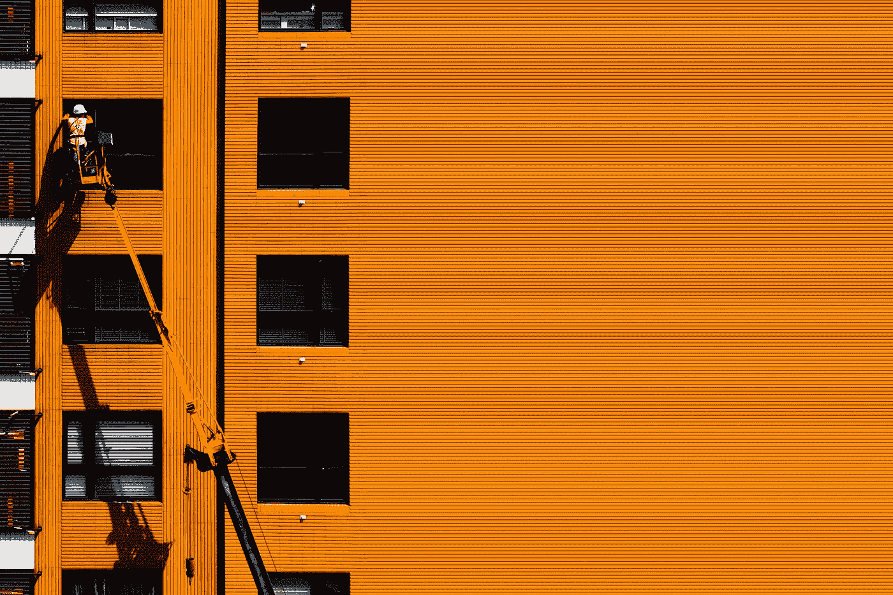

# 视差和颜色选择器

> 原文：<https://javascript.plainenglish.io/vuetify-parallax-and-color-picker-9ff38f3b7f7b?source=collection_archive---------12----------------------->



Photo by [Henry & Co.](https://unsplash.com/@hngstrm?utm_source=medium&utm_medium=referral) on [Unsplash](https://unsplash.com?utm_source=medium&utm_medium=referral)

Vuetify 是一个流行的 Vue 应用程序 UI 框架。

在本文中，我们将了解如何使用 Vuetify 框架。

# 视差高度

我们可以用`height`道具设置视差滚动的`height`。

例如，我们可以写:

```
<template>
  <v-parallax dark src="https://cdn.vuetifyjs.com/images/backgrounds/vbanner.jpg" height="300">
    <v-row align="center" justify="center">
      <v-col class="text-center" cols="12">
        <h1 class="display-1 font-weight-thin mb-4">Hello world</h1>
        <h4 class="subheading">Lorem ipsum dolor sit amet, consectetur adipiscing elit.</h4>
      </v-col>
    </v-row>
  </v-parallax>
</template><script>
export default {
  name: "HelloWorld",
  data: () => ({}),
};
</script>
```

# 颜色选择器

我们可以用`v-color-picker`组件添加一个颜色选择器。

`v-color-picker`组件使用`v-model`道具来控制显示的颜色。

例如，我们可以写:

```
<template>
  <v-container>
    <v-row>
      <v-col cols="12" md="4">
        <v-btn v-for="t in types" :key="t" class="my-4" block @click="type = t">{{ t }}</v-btn>
      </v-col>
      <v-col class="d-flex justify-center">
        <v-color-picker v-model="color"></v-color-picker>
      </v-col>
      <v-col cols="12" md="4">
        <v-sheet dark class="pa-4">
          <pre>{{ showColor }}</pre>
        </v-sheet>
      </v-col>
    </v-row>
  </v-container>
</template><script>
export default {
  name: "HelloWorld",
  data: () => ({
    types: ["hex", "hexa", "rgba", "hsla", "hsva"],
    type: "hex",
    hex: "#FF00FF",
    hexa: "#FF00FFFF",
    rgba: { r: 255, g: 0, b: 255, a: 1 },
    hsla: { h: 300, s: 1, l: 0.5, a: 1 },
    hsva: { h: 300, s: 1, v: 1, a: 1 },
  }),
  computed: {
    color: {
      get() {
        return this[this.type];
      },
      set(v) {
        this[this.type] = v;
      },
    },
    showColor() {
      if (typeof this.color === "string") return this.color; return JSON.stringify(
        Object.keys(this.color).reduce((color, key) => {
          color[key] = Number(this.color[key].toFixed(2));
          return color;
        }, {}),
        null,
        2
      );
    },
  },
};
</script>
```

我们有带`v-model`的`v-color`选择器组件来设置`color`状态。

我们用`computed`属性中的 setter 设置类型。

有不同种类的颜色选择器。

# 提货人高度

我们可以用`flat`和`elevation`道具改变拾色器的高度:

```
<template>
  <v-row justify="space-around" align="center">
    <v-color-picker v-model="picker" flat></v-color-picker> <v-color-picker v-model="picker" elevation="15"></v-color-picker>
  </v-row>
</template><script>
export default {
  name: "HelloWorld",
  data: () => ({
    picker: null,
  }),
};
</script>
```

`flat`使拾色器变平。

`elevation`设置拾色器的高度。

# 样本

我们可以添加`show-swatches`属性来显示用户可以从中选择的颜色样本的数组。

例如，我们可以写:

```
<template>
  <v-row justify="space-around">
    <v-color-picker class="ma-2" show-swatches></v-color-picker>
    <v-color-picker class="ma-2" :swatches="swatches" show-swatches></v-color-picker>
    <v-color-picker class="ma-2" show-swatches swatches-max-height="300px"></v-color-picker>
  </v-row>
</template><script>
export default {
  name: "HelloWorld",
  data: () => ({
    swatches: null,
  }),
};
</script>
```

我们添加了`show-swatches`道具来显示颜色样本。

# 结论

我们可以改变视差容器的高度，并用 Vuetify 添加颜色选择器。