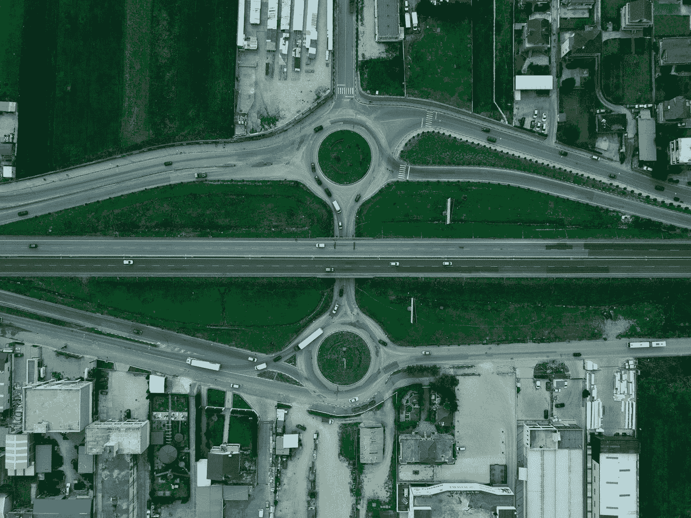

# 虚拟化—系统和导航栏

> 原文：<https://javascript.plainenglish.io/vuetify-system-and-navigation-bars-1aa9d3fd82d6?source=collection_archive---------7----------------------->


Photo by [freestocks](https://unsplash.com/@freestocks?utm_source=medium&utm_medium=referral) on [Unsplash](https://unsplash.com?utm_source=medium&utm_medium=referral)

Vuetify 是一个流行的 Vue 应用程序 UI 框架。

在本文中，我们将了解如何使用 Vuetify 框架。

# 系统栏熄灯效果

我们可以给我们的`v-system-bar`添加一个熄灯效果。

例如，我们可以写:

```
<template>
  <v-container>
    <v-row class="text-center">
      <v-col col="12">
        <v-card img="https://cdn.vuetifyjs.com/images/home/vuetify_layout2.svg" height="200px">
          <v-system-bar color="primary" lights-out>
            <v-spacer></v-spacer>
            <v-icon>mdi-wifi-strength-4</v-icon>
            <v-icon>mdi-signal-cellular-outline</v-icon>
            <v-icon>mdi-battery</v-icon>
            <span>12:30</span>
          </v-system-bar>
        </v-card>
      </v-col>
    </v-row>
  </v-container>
</template><script>
export default {
  name: "HelloWorld",
  data: () => ({}),
};
</script>
```

`light-out`道具使内容变成黑色。

我们可以添加`dark`道具，让内容文字变白:

```
<template>
  <v-container>
    <v-row class="text-center">
      <v-col col="12">
        <v-card img="https://cdn.vuetifyjs.com/images/home/vuetify_layout2.svg" height="200px">
          <v-system-bar color="primary" lights-out dark>
            <v-spacer></v-spacer>
            <v-icon>mdi-wifi-strength-4</v-icon>
            <v-icon>mdi-signal-cellular-outline</v-icon>
            <v-icon>mdi-battery</v-icon>
            <span>12:30</span>
          </v-system-bar>
        </v-card>
      </v-col>
    </v-row>
  </v-container>
</template><script>
export default {
  name: "HelloWorld",
  data: () => ({}),
};
</script>
```

# 窗闩

我们可以添加一个带有窗口控件和状态信息的`v-system-bar`窗口栏。

例如，我们可以写:

```
<template>
  <v-container>
    <v-row class="text-center">
      <v-col col="12">
        <v-system-bar window dark>
          <v-icon>mdi-message</v-icon>
          <span>100 unread messages</span>
          <v-spacer></v-spacer>
          <v-icon>mdi-minus</v-icon>
          <v-icon>mdi-checkbox-blank-outline</v-icon>
          <v-icon>mdi-close</v-icon>
        </v-system-bar>
      </v-col>
    </v-row>
  </v-container>
</template><script>
export default {
  name: "HelloWorld",
  data: () => ({}),
};
</script>
```

我们只是添加了`window`道具，让系统栏有一个黑色的背景。

# 底部导航

`v-bottom-navigation`组件是侧边栏的替代物。

它带有图标、文本和 shift 变量。

我们可以这样写来增加一个:

```
<template>
  <v-container>
    <v-row class="text-center">
      <v-col col="12">
        <v-bottom-navigation :value="activeBtn" color="purple lighten-1">
          <v-btn>
            <span>History</span>
            <v-icon>mdi-history</v-icon>
          </v-btn> <v-btn>
            <span>Favorites</span>
            <v-icon>mdi-heart</v-icon>
          </v-btn> <v-btn>
            <span>Map</span>
            <v-icon>mdi-map-marker</v-icon>
          </v-btn>
        </v-bottom-navigation>
      </v-col>
    </v-row>
  </v-container>
</template><script>
export default {
  name: "HelloWorld",
  data: () => ({
    activeBtn: undefined,
  }),
};
</script>
```

我们有一个`v-bottom-navigation`组件和 3 个`v-btn`组件来显示按钮。

# 生长

我们添加了`grow`道具来展开按钮，以填充可用空间:

```
<template>
  <v-container>
    <v-row class="text-center">
      <v-col col="12">
        <v-bottom-navigation :value="activeBtn" color="purple lighten-1" grow>
          <v-btn>
            <span>History</span>
            <v-icon>mdi-history</v-icon>
          </v-btn> <v-btn>
            <span>Favorites</span>
            <v-icon>mdi-heart</v-icon>
          </v-btn> <v-btn>
            <span>Map</span>
            <v-icon>mdi-map-marker</v-icon>
          </v-btn>
        </v-bottom-navigation>
      </v-col>
    </v-row>
  </v-container>
</template><script>
export default {
  name: "HelloWorld",
  data: () => ({
    activeBtn: undefined,
  }),
};
</script>
```



Photo by [Ani Kolleshi](https://unsplash.com/@anikolleshi?utm_source=medium&utm_medium=referral) on [Unsplash](https://unsplash.com?utm_source=medium&utm_medium=referral)

# 结论

我们可以用 Vuetify 在系统栏中添加效果。

此外，我们可以添加一个底部导航栏。

喜欢这篇文章吗？如果是这样，通过 [**订阅获取更多类似内容解码，我们的 YouTube 频道**](https://www.youtube.com/channel/UCtipWUghju290NWcn8jhyAw?sub_confirmation=true) **！**