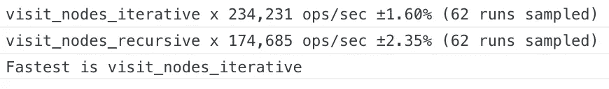

# 使用 JavaScript 访问网页中每个节点的两种方法

> 原文：<https://javascript.plainenglish.io/walking-the-dom-7a1123fb67da?source=collection_archive---------3----------------------->

## 漫步大教堂


Photo by [Rodion Kutsaev](https://unsplash.com/@frostroomhead?utm_source=medium&utm_medium=referral) on [Unsplash](https://unsplash.com?utm_source=medium&utm_medium=referral)

# 介绍

文档对象模型(DOM)是 HTML 文档的分层表示，可用于浏览器中运行的 JavaScript。DOM 将网页描述为节点树，节点树本身可以包含其他节点。文档的`html`节点包含一个`head`节点和一个`body`。反过来，每个都包含自己的一组节点，依此类推。

对这种结构的有用操作包括按顺序访问每个节点。例如，为了对页面使用的 HTML 元素进行分类，我们可以依次访问每个节点，跟踪我们遇到的元素。

在本文中，我将介绍两种解决这个一般性问题的方法。它们都使用了 [DOM 节点接口](https://developer.mozilla.org/en-US/docs/Web/API/Node)的以下属性:

*   `firstChild`
*   `nextSibling`

此外，出于将被阐明的原因，第二种方法利用了附加的属性:

*   `parentNode`

这两个示例都将利用回调函数，该函数将被视为占位符，用于处理您可能实际想要在每个节点上执行的任何工作。

# 递归的


Photo by [Mario Mesaglio](https://unsplash.com/@seimesa?utm_source=medium&utm_medium=referral) on [Unsplash](https://unsplash.com?utm_source=medium&utm_medium=referral)

我首先介绍递归方法，因为尽管从一般意义上来说这是一种不太为人所知的技术，但是在遍历 DOM 时，它通常是默认的。

## 一般递归

递归是计算机编程中的一个重要概念，可以开玩笑地定义为“参见:递归”。它指的是函数调用自身的行为，如下面计算数字阶乘的函数:

```
function **factorial**(n) {
    if (n == 0) return 1; else return n * **factorial**(n - 1);
}
```

这种函数通过有效地将它们的问题简化为平凡的基本情况来工作。在上面的例子中，基础案例是`n == 0`；0 的阶乘是 1。如果您对一个示例值执行这个函数(2 是最快和最有用的！)，它的工作原理很快就变得显而易见了。事实上，*递归揭示了它本身固有于‘阶乘’本身的定义中*，尽管也可以应用迭代方法。

## 递归和 DOM

对于 DOM，我们可以利用它的层次结构来应用递归方法。基本上，访问一个节点意味着应用我们的回调函数(做我们感兴趣的任何实际工作)，然后访问节点的第一个子节点(如果它有一个子节点)，然后访问节点的下一个兄弟节点(如果它有一个子节点)。

```
function **visit_nodes_recursive**(callback, node) {
    node = node || document;
    callback.call(null, node); if (node.firstChild)
        **visit_nodes_recursive**(callback, node.firstChild); if (node.nextSibling)
        **visit_nodes_recursive**(callback, node.nextSibling);
}
```

递归调用**以粗体**突出显示。用技术术语来说，这是一种[深度优先搜索](https://en.wikipedia.org/wiki/Depth-first_search)；实际上，这意味着我们的文档的节点是按照它们在文档的 HTML 源代码中出现的顺序被访问的。

# 重复的


Photo by [Brett Jordan](https://unsplash.com/@brett_jordan?utm_source=medium&utm_medium=referral) on [Unsplash](https://unsplash.com?utm_source=medium&utm_medium=referral)

程序员通常更熟悉迭代方法，因为它指的是执行一组指令的更明显的方式:我们重复一个过程直到完成。下面是节点访问函数的迭代版本:

```
function visit_nodes_iterative(callback, node) {
    node = node || document; do {
        callback.call(null, node); **node = node.firstChild || node.nextSibling || function() {
            while ((node = node.parentNode) && !node.nextSibling);
            return node ? node.nextSibling : null;
        }();**
    } while (node);
}
```

首先要注意的是，虽然两个版本的长度大致相同，但迭代方法更加复杂。如前所述，递归函数的一个主要优点是它通常可以降低复杂性。

这里所有的复杂性都在于用粗体字突出显示的部分**，该部分每次都围绕主`do ... while`循环推进“当前”节点。同样，使用深度优先的搜索顺序，这与递归方法非常相似:**

```
node = node.firstChild ||
```

如果当前节点有子节点，则移动到第一个子节点，否则:

```
node.nextSibling ||
```

移动到节点的下一个同级，如果它有一个同级的话。但是，如果它既没有子节点也没有兄弟节点，它实际上就是一个“死胡同”，有时被称为“叶”节点，与更广泛的“树”类比中的“分支”节点形成对比。

在这种情况下，我们需要“后退”并返回到我们*仍能*继续“前进”的节点。这是匿名函数调用执行的工作:

```
function() {
    while ((node = node.parentNode) && !node.nextSibling);
    return node ? node.nextSibling : null;
}();
```

在单行的`while`循环中，当前节点向上移动到它自己的父节点，但是一旦新节点有了兄弟节点(或者根本没有父节点，我们又回到了文档的最顶端)，循环就会终止。值得注意的是，我们只看兄弟姐妹，不看孩子，因为*我们已经在从孩子到父母的方向上旅行了*。一旦“回溯”完成，这个匿名函数要么返回它成功找到的下一个兄弟节点，要么返回一个`null`值来指示*没有*合适的节点可以继续——也就是说，我们已经到了文档的末尾。

同样，如果这不清楚，请尝试用一个示例 HTML 文件手动跟踪它:从文档级开始(它包含一个表示`html`元素的节点)，然后跟踪`node`如何被设置到`head`元素，然后是它的每个子元素，最后返回到`body`元素，依此类推。

# 标杆管理


Photo by [Marc-Olivier Jodoin](https://unsplash.com/@marcojodoin?utm_source=medium&utm_medium=referral) on [Unsplash](https://unsplash.com?utm_source=medium&utm_medium=referral)

每种方法都执行相同的工作量——访问 DOM 中的每个节点——但是有一种方法更容易理解:这是递归的一大胜利。然而，哪种方法是*更快*？为了解决这个问题，我们可以试着对问题进行推理，但是从测量一些结果开始更容易。

使用[基准库](https://benchmarkjs.com/)，我对一个简单文档的每个功能进行了测试，结果如下:



换句话说，迭代函数以每秒 23.4 万次运算的速度执行，而递归函数处理了 17.4 万次。迭代函数速度更快，但幅度不大。

# 结论


Photo by [Kelly Sikkema](https://unsplash.com/@kellysikkema?utm_source=medium&utm_medium=referral) on [Unsplash](https://unsplash.com?utm_source=medium&utm_medium=referral)

理解迭代和递归方法之间的区别是很重要的，特别是每一种方法做得最好。递归通常更直接，也更容易使用；如果其他人可能会阅读我们编写的代码，那么使用它似乎是一种好的方式！另一方面，迭代可能要复杂得多，因为它必须跟踪递归代表我们管理的状态。

然而，管理函数调用栈及其相关状态是有代价的，递归通常比迭代慢——但不一定慢很多。与以往一样，测试我们的代码以了解这些差异有多显著是很重要的，同样重要的是要认识到何时优化速度不是一个需求。

最后，DOM 是为每一种方法精心设计的。`firstNode`和`nextSibling`属性是我们遍历 DOM 所需要的全部，即使看起来我们在某个时候需要一个所有孩子的列表(碰巧的是，*也是*可用的！)

*这里展示的所有代码都可以在* [*的 github 资源库*](https://github.com/bobbykjack/walking-the-dom) 中找到。