# 如何构建一个 Chrome/Firefox 扩展来跟踪你的 Github 活动

> 原文：<https://javascript.plainenglish.io/walkthrough-the-github-activity-indicator-web-extension-7c220cc29337?source=collection_archive---------3----------------------->

我喜欢 Github 上的“令人敬畏的 XYZ”列表。它们通常提供了开发生态系统中最重要的库/主题的精彩摘要。然而，链接的存储库经常是孤立的，多年来没有任何活动发生。因此，我为 Firefox 和 Chrome[编写了一个小小的浏览器扩展](https://chrome.google.com/webstore/detail/github-activity-indicator/ppedpdikbacabbebipimhdcijkkdefkc?hl=en&authuser=0)[,它显示了多少天以来一个库没有被更改。它是免费和开源的——试试吧！](https://addons.mozilla.org/en-US/firefox/addon/github-activity-indicator/)

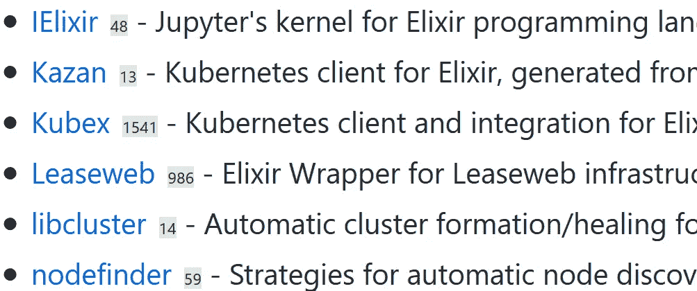

在本文中，我想浏览一下我的第一个 web 扩展的源代码并分享我的经验。

# Mozilla MDN 很棒

Mozilla [MDN 文档](https://developer.mozilla.org/en-US/docs/Mozilla/Add-ons/WebExtensions)非常棒。我是一个平庸的 Javascript 开发者，对浏览器扩展开发毫无经验。然而，该文档包含了快速启动和运行所需的几乎所有内容。

# 文件组织

该插件由我将在本文中讨论的以下相关文件组成:

`manifest.json`位于扩展的根文件夹中，包含重要的元数据:

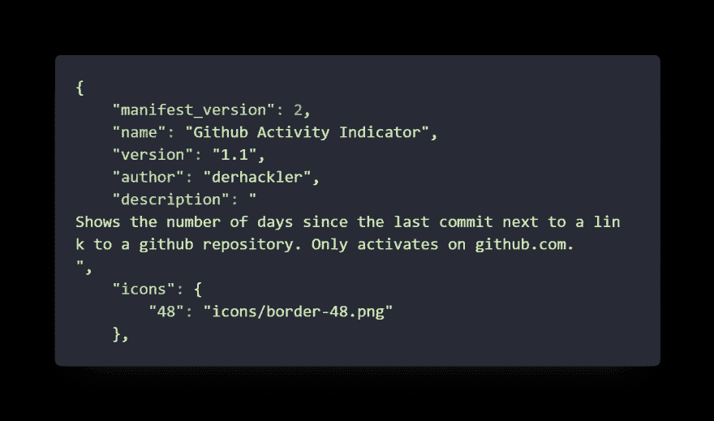

manifest.json — basic information

首先我描述我的扩展，并给它一个漂亮的图标。对于`version`字段，建议使用[语义版本](https://semver.org/)。

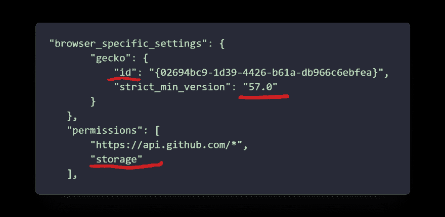

manifest.json — Firefox Setings + Plugin Permission Requests

对于 Firefox，需要一些额外的设置:

*   将`id`设置为 guid。即使在文档中它被声明为可选的，您也应该这样做。否则，您以后会遇到问题(例如，您无法访问本地存储)
*   将`strict_min_version`设置为最近的某个时间。否则，当您尝试访问早期版本中不可用的 API 时，将会收到警告。

注意，Chrome 会抱怨它不知道这个部分。我只是忽略了这个警告。

在`permissions`部分，你必须指定插件需要的权限。插件以高权限运行，所以只询问你真正需要的权限:

*   我请求访问 github api 子域中的所有页面。然后你可以使用`fetch`，CORS 不会妨碍你。
*   我还想访问本地存储，这样我就可以保存插件的设置。

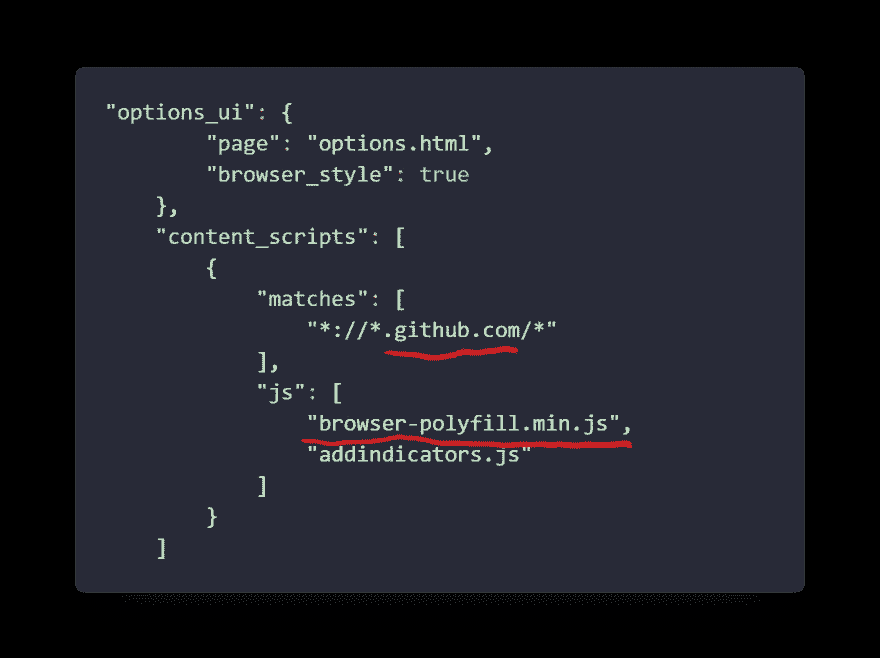

manifest.json —defining the settings page; injecting scripts on github.com

在`options_ui`中，您定义 html 页面，该页面将在插件的设置页面中呈现为 iframe。在我的插件中，它允许你设置一个自定义的 Github API 访问令牌。

`content_scripts`允许您将自定义 Javascript 注入任意页面:

**经验教训:**脚本的顺序很重要。首先，我在我的脚本后添加了 polyfill，我花了一段时间才弄明白为什么它不起作用。

# 履行

`addindicators.js`包含插件的实现。总的流程非常简单:

1.  启用或禁用调试日志
2.  从设置中获取 API 密钥或使用缺省值。
3.  找到 Github 库的所有链接
4.  组装一个 GraphQl 查询并查询 Github
5.  为每个存储库链接添加一个指示器

让我们看一些代码:

## 调试标志

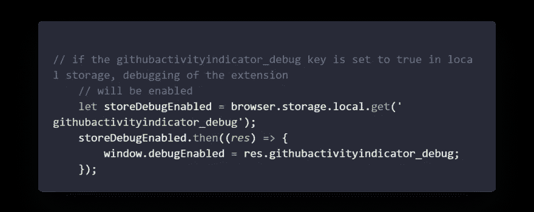

addindicators.js — enable or disable debugging

我检查浏览器本地存储中是否设置了调试标志，并相应地设置了一个全局变量。您稍后看到的所有`dlog`代码只是检查`debugEnabled`标志，或者将消息打印到控制台，或者不打印。

**经验教训** : `browser`只能在 Firefox 中使用，除非你使用 polyfill。

## 获取 API 令牌

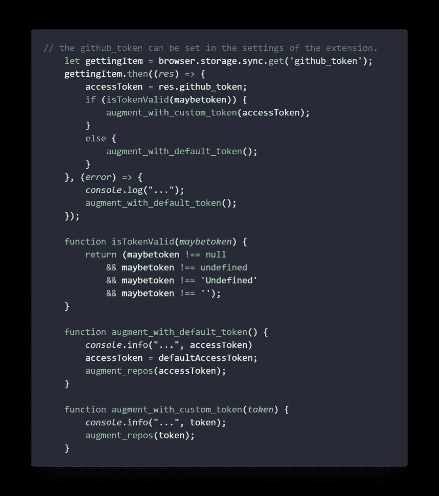

addindicators.js —getting a custom auth token or using the default

我花了惊人数量的代码从本地存储(通过设置对话框设置)获取令牌，或者使用默认令牌。非常欢迎改进建议！

需要注意一些事情:

*   我用`browser.storage.sync`代替`browser.storage.local`。这可确保令牌在用户设备间同步(如果已启用)。
*   在`isTokenValid`函数中，我还检查了字符串*‘未定义’*。我需要这样做，因为我在设置对话框实现中偷懒了...
*   **安全备注:**我为我的帐户创建了一个非特权 Github 令牌，我将它用作默认令牌。总的来说，这是一个可怕的安全罪，所以请不要在家里这样做。不跳可爱的 OAuth 舞，我就是找不到更方便的方法。
*   我的函数命名在整个代码库中既不一致也不自动化。很抱歉。

## 找到 Github 库的链接

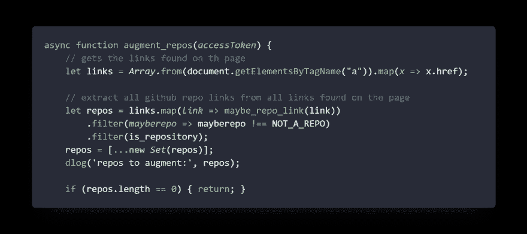

addindicators.js — find links to augment

首先，我通过`document.getElementsByTagName`获取页面上的所有链接，然后过滤掉所有不是 github 库链接的链接。

**经验教训:**乍一看`document.getElementsByTagName`好像是返回一个数组。您还可以使用 for 循环对其进行迭代，如下所示:

```
for(const x of document.getElementsByTagName('a')){ 
// do something 
}
```

但是，这不是一个真正的阵列，这就是为什么会失败:

```
// this will fail!! 
document.getElementsByTagName('a').map(x => x.href());
```

你得用`Array.from`把它改成数组。

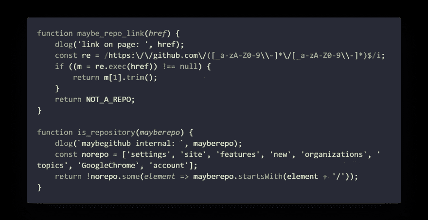

addindicators.js — checking if a link is a link to a repository

在`maybe_repo_link`中，我过滤出匹配*所有者/存储库*模式的 github urls。

许多 Github 内部链接匹配相同的模式，所以我编写了`is_repository`来捕捉至少更多的链接，以避免以后出现错误。

**经验教训:**起初，我试图像那样过滤内部 URL，但很恼火它不起作用:

```
// this does not work! 
norepo.forEach(x => { 
  if(mayberepo.startsWith(x)){ 
    return false; 
  }}); return true;
```

正如在 [MDN 文档](https://developer.mozilla.org/en-US/docs/Web/JavaScript/Reference/Global_Objects/Array/forEach)中非常清楚地描述的那样，如果您对触发副作用感兴趣的话，`forEach`是非常有用的。然而你不能打破这个循环。我的 return 语句被忽略，函数总是返回`true`。

## 通过 GraphQL 查询 Github

GraphQL 是一种访问你的 API 的语言。与 REST 相比，在定义单个调用中要查询什么以及响应中应该包含哪些数据方面，您有更多的灵活性。

我使用了 [Github GraphQL API](https://developer.github.com/v4/) ,因为它只需要一个 HTTP 调用就可以查询页面上所有存储库的信息:

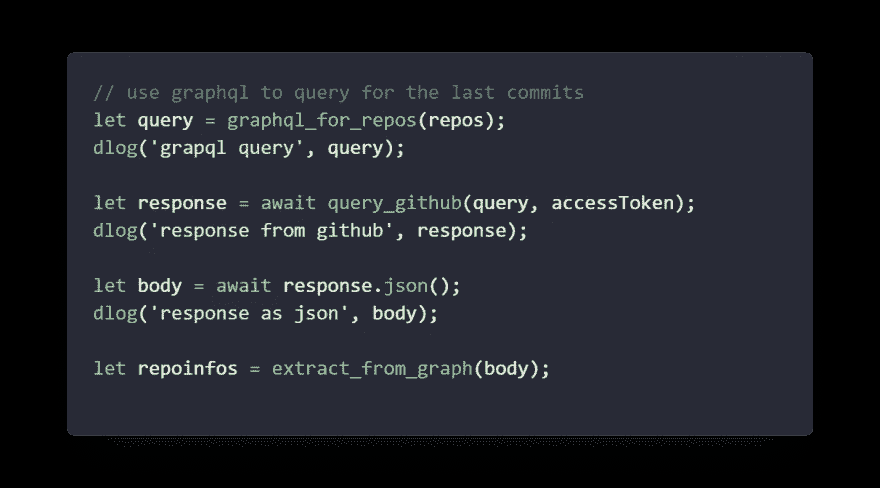

addindicators.js — getting the repository information via graphql

首先组装查询，然后查询 Github，最后从响应中提取信息。

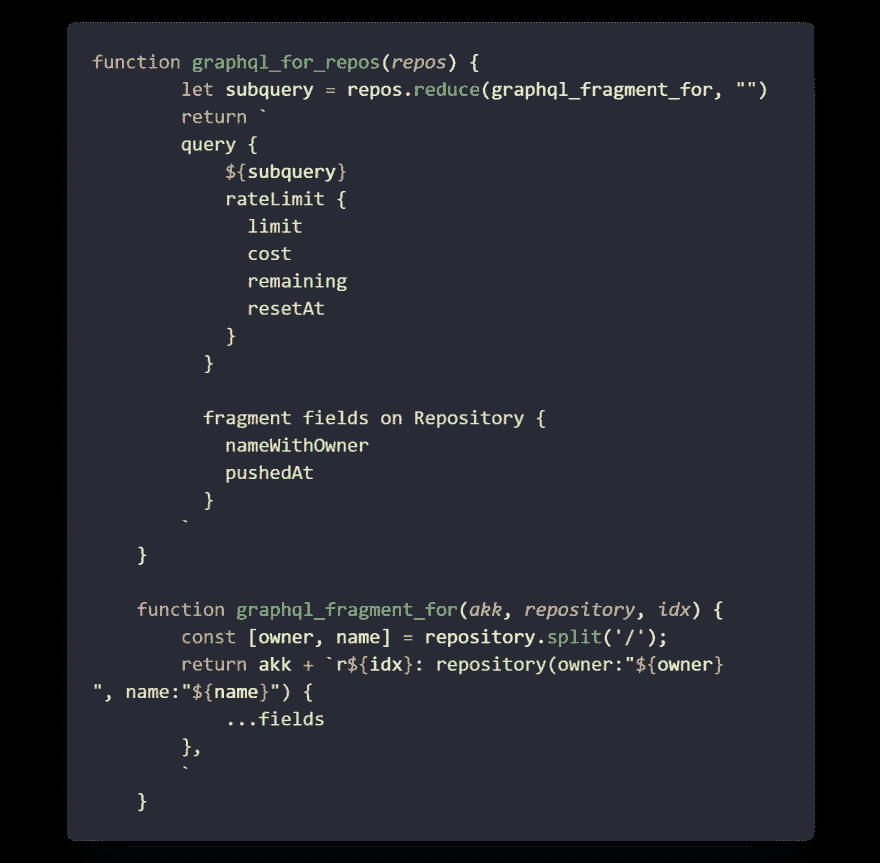

addindicators.js — building the graphql query

我使用一个 GraphQL 查询一次获取所有存储库的最后一个存储库推送日期。

在`graphql_fragment_for`中，我为单个存储库组装查询。为了拥有多个`repository`子句，我需要用一个任意的惟一名称作为它们的前缀。

注意`...fields`部分:这表明在这个位置应该插入名为“fields”的片段。片段有点像 makros，避免重复。

该函数的响应如下所示:

```
r0: repository(owner:"derhackler",name:"catexcel"){ ...fields },
```

**SECURITY_ALERT:** 我使用字符串串联来传入`owner`和`name`。这是危险的，一般来说是非常糟糕的想法。想想 SQL 注入，但只针对您的 API。GraphQL 支持应该使用的[变量](https://graphql.org/learn/queries/#variables)的概念。但是我不知道如何在我的场景中使用它们...

在`graphql_for_repos`中，我为存储库组装子查询。此外，我询问我还剩下多少 API 调用(用于调试目的)。

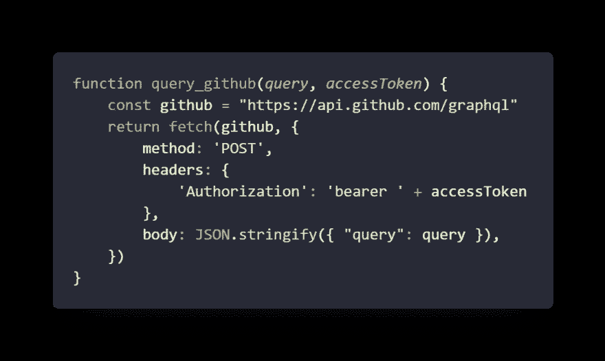

addindicators.js — executing the graphql query on github

实际的查询是对 Github 的 Graphql 端点的 HTTP POST。与 REST 相比，GraphQL APIs 通过单个 URL 公开。

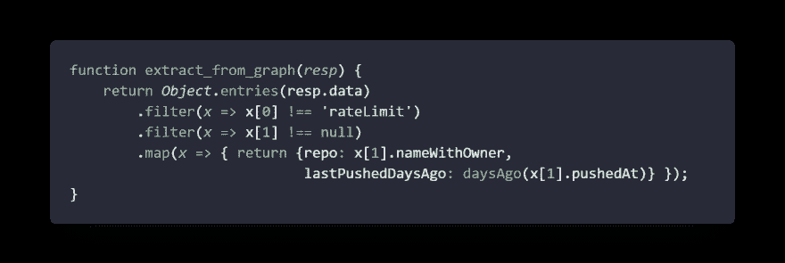

addindicators.js — extracting only valid responses

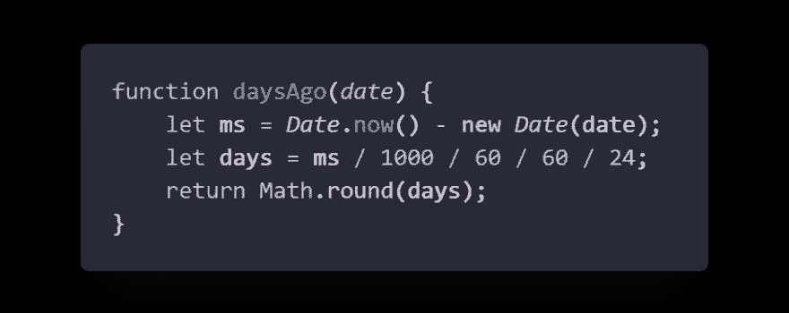

addindicators.js — calculate the number of days until today

在`extract_from_graph`中，我过滤掉所有找不到存储库数据的响应(并忽略它)，并将时间戳转换为天数，直到*现在是*。

## 扩充存储库链接

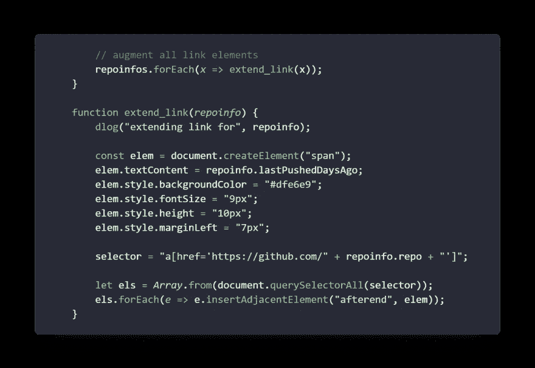

在最后一步中，我为每个存储库链接添加了一个小指示器。我没有使用最初查询的 DOM 元素，而是再次单独查询每个链接。我认为这更干净，因为原始元素可能已经消失了。

# 定论

*   编写浏览器扩展很有趣，而且出乎意料的轻松
*   写博客评论我自己的代码比写代码花的时间要长得多

*原载于 2019 年 10 月 23 日*[*https://dev . to*](https://dev.to/derhackler/walkthrough-the-github-activity-indicator-web-extension-pj2)*。*