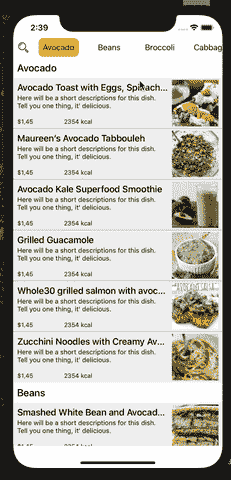
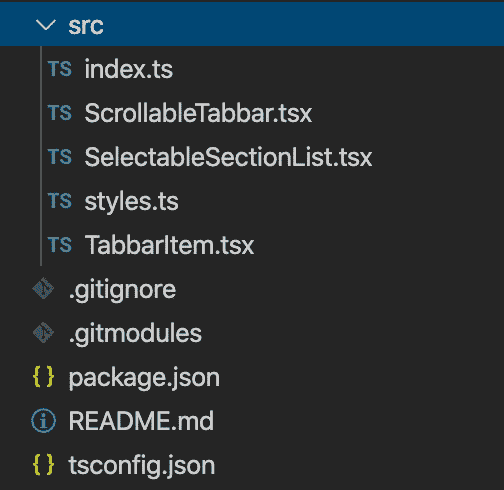
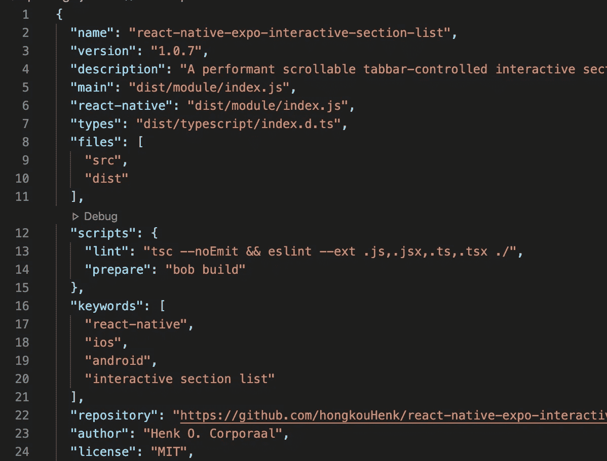
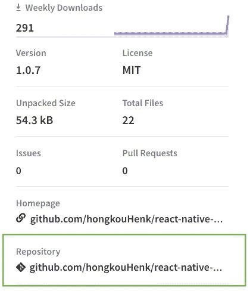

# 想发布你的第一个 React 原生 npm 包吗？这些是确切的步骤

> 原文：<https://javascript.plainenglish.io/want-to-publish-your-first-react-native-npm-package-these-are-the-exact-steps-64f965271cf8?source=collection_archive---------1----------------------->

## 如何通过 5 个清晰的步骤发布 React 原生 npm 包


Photo by [Paul Esch-Laurent](https://unsplash.com/@pinjasaur?utm_source=unsplash&utm_medium=referral&utm_content=creditCopyText) on [Unsplash](https://unsplash.com/s/photos/npm?utm_source=unsplash&utm_medium=referral&utm_content=creditCopyText)

他们说，制作自己的包装是展示自己作品的好方法。他们说，回馈社区可以增加你在就业市场上的机会。他们说，设计一个想法并发布一个其他人可以使用的产品有助于你成为一个更好的开发者。然而，发布您的第一个 React 原生 npm 包可能是一项艰巨的任务。

本周，经过数小时的反复试验，我终于发布了我的第一个 npm 包。而且现在回头看看流程，其实做起来还挺简单的。



My package imported in an example project

我发布的包提供了一个单独的定制组件，该组件提供了一个增强的 SectionList，其中包含一系列定制外观和感觉的选项。适用于 Expo 和 React 本地 Cli 项目的软件包**可以在[这里](https://github.com/hongkouHenk/react-native-expo-interactive-section-list)找到。但我明白，你是来指导的。所以让我们开始吧！**

**React 原生资源:**你是 React 原生开发者，并且一直在寻找资源来构建更好的应用吗？那么也许我可以让你有兴趣注册我的简讯。

# 构建您的资源

要构建一些其他人可以使用的东西，首先要创建一些你在自己的项目中使用过的东西。因此，构建 npm 包的起点是任何常规项目，它将候选组件、功能或资源用作常规导入。

```
import SelectableSectionList from ‘../src/SelectableSectionList’;
```

现在让我们假设您的候选人资源是完整的，用户友好的，并准备发布。下一步是建立一个新项目，它将成为你的 npm 包。

# 准备你的图书馆

您的包从一个以您的包名命名的新文件夹开始。在此文件夹中，从您的工作项目中复制包项目文件。确保只复制最少的必需文件和文件夹。



您的新项目至少应该包含:

*   一个 *src* 文件夹，它至少包含一个索引文件，从该文件中导出您的包的资源:

```
export { default as SelectableSectionList } from ‘./SelectableSectionList’;
```

*   一个 *package.json* 文件，去掉了您的包中没有使用的所有依赖项。在这里，重要的是要认识到:

***依赖关系*** *包括用户在您的软件包上运行 npm install 时自动安装的模块。*

***dev dependencies****包括用户在您的软件包上运行 npm install 时不会安装的模块，除非他们将— dev 选项分配给 install 命令。*

***对等依赖*** *包括必须由您的软件包用户手动安装的模块。运行时，如果缺少依赖项，它们会得到一个错误。*

此外，在您的 *package.json* 中，确保添加必要的‘名称’，‘版本’，‘描述’，‘作者’，‘许可证’和其他必需的信息。没有它，你的包裹可能会被拒绝。



Don’t worry about the ‘files’ and ‘scripts’ fields for now

*   项目的 ***tsconfig.json*** 文件，如果你的包是用 TypeScript 编写的。
*   一个 ***。gitignore* 文件。**
*   一个 ***README.md*** 文件，包含软件包信息和使用说明。
*   以及可选的 ESLint 和更漂亮的配置文件，如果适用于您的设置。

复制粘贴文件并进行必要的修改后，打开命令提示工具并运行 install 命令:

```
$ cd <your-package-folder> $ yarn install
```

# 与 bob 一起构建一个包模块

到目前为止，理解这一步需要的时间最多。

除非被编译成 React 本地库，否则你的库将毫无用处。此外，您的库的访问点将会不同，因为您不再使用 Expo 构建您的项目(如果是这样的话……)。此外，如果您的项目是用 TypeScript 编写的，那么从 TypeScript 和 JavaScript 项目中访问您的包就更好了。

手动设置这个对我们这些凡人来说有点难，但是经过一番搜索，我在这里找到了帮助和这里的。我注意到我使用的一些其他包包含对 bob 的引用，所以我决定 bob 将是帮助我完成这一步的一个好选择。

bob 的优点在于它提供了从头创建新项目和配置现有项目(如我们的项目)的工具:

**步骤 1** :将 bob 安装为 *devDependency*

```
yarn add --dev @react-native-community/bob
```

**第二步**:配置 bob

在您的 *package.json* 的底部添加以下内容:

```
“@react-native-community/bob”: { “source”: “src”, // your project files's main folder “output”: “dist”, // your chose output folder “targets”: [“module”, “typescript”] // typescript is optional}
```

*注意:如果您的项目不是 typescript 项目，您可以从您的“targets”字段发出“TypeScript”。*

**第三步:**将“bob build”脚本添加到您的 *package.json* 中:

```
“scripts”: { “prepare”: “bob build”}
```

**步骤 4:** 在你的*包. json* 中配置入口点

```
//... other fields“main”: “dist/module/index.js”,“module”: “dist/module/index.js”,“react-native”: “src/index.ts”,“types”: “dist/typescript/src/index.d.ts”,“files”: [ “dist/”, “src/”]
```

*注意:如果您的项目不是 TypeScript 项目，那么您可以发出“类型”字段。如果您的项目是 TypeScript 项目，发出“types”字段将导致警告消息。*

**第五步:**更新*。gitignore*

```
# generated files by bob
lib/
```

**第六步:**构建

在命令行工具内的项目文件夹中，运行:

```
$ yarn run prepare
```

# 测试您的库

您的库现在可以使用了，这意味着它可以安装在一个项目中，就像它已经是一个 npm 包一样。然而，在我们创建一个 npm 帐户并将包上传到存储库之前，让我们在一个示例项目中本地运行它，以确保一切都如预期的那样工作。

为此，我们将把我们的模块打包成一个*。tgz* 文件，并在我们的示例项目中安装它。

在包文件夹中，在命令行工具中运行以下命令:

```
$ npm pack
```

接下来，将软件包文件夹 cd 放入示例项目文件夹，并运行安装命令:

```
$ yarn install </package_location/package_name.tgz>
```

*注意:包裹位置指向您的。本地计算机上的 tgz 文件。*

您现在应该能够…

```
import Foo from ‘your-package-name’
```

…并运行您的示例项目。

# 发布您的库

一旦您的包成功运行，就该公开了。

虽然不是必须的，但大多数出版商决定在 Github 上发布软件包的源代码。您可能知道这个练习，但是简单地说，在您的 Github 帐户上创建一个新的存储库，并使用以下内容推送您的项目代码:

```
git initgit add .git commit -m “Initial commit”git remote add origin https://github.com/<username>/<package_name>.gitgit push -u origin master
```

现在，您可以在包的 npm 详细信息页面上添加对 github repo 的引用。这要求您对您的*包. json* 文件进行最后更改，添加:

```
“repository”: “https://github.com/<username>/<packge_name>"
```



You could also add your homepage in the same way…

接下来，是时候向 npm 发布了。为此，需要一个个人 npm 账户。您可以在[npmjs.com](https://www.npmjs.com/signup)手动完成，或者在命令行工具中运行以下命令并提供您的详细信息:

```
$ npm adduser
```

在运行发布命令之前，确保确认您的电子邮件地址，否则您的部署将失败。完成后，使用以下内容发布:

```
$ npm publish
```

您的软件包现已上线，可以从任何地方安装，包括:

```
$ npm install <project_name>or$ yarn install <project_name>
```

# 结论

按照上面的一系列步骤，发布 React Native 包变得非常容易。我花了几个小时发布我的第一个 npm React Native 包，所以我希望本文能帮助您节省时间，并激发您发布自己的 npm 包的积极性。如果你这样做了，一定要在评论中加一个链接！