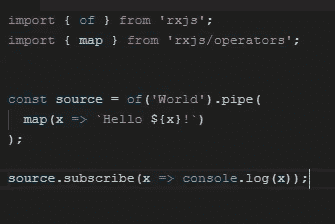
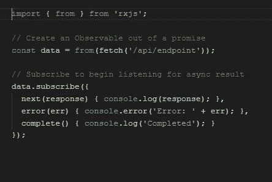
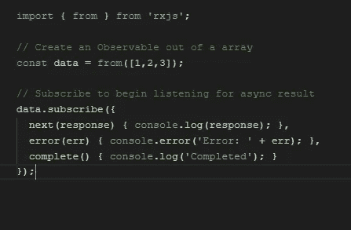
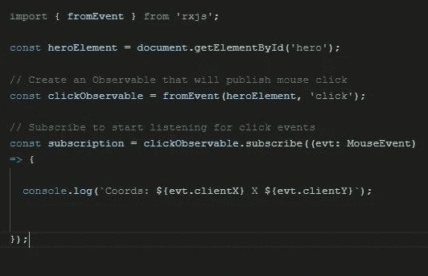
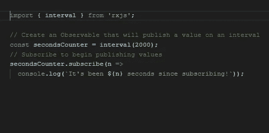

# 在 RxJS 中创建可观测量的方法

> 原文：<https://javascript.plainenglish.io/ways-to-create-observables-in-rxjs-9041e9bb0d08?source=collection_archive---------2----------------------->

## 这些是在 RxJS 中创建可观测量的一些常用方法。

## **RxJS 是什么？**

RxJS 是一个使用 Observables 进行反应式编程的库，使得编写异步或基于回调的代码更加容易。

它提供了一个核心类型，即[可观察的](https://rxjs-dev.firebaseapp.com/guide/observable)，卫星类型(观察者、调度器、主体)和受[数组#extras](https://developer.mozilla.org/en-US/docs/Web/JavaScript/New_in_JavaScript/1.6) 启发的操作符(映射、过滤、减少、每一个等等)，以允许将异步事件作为集合进行处理。( [RxJS 文档](https://rxjs.dev/guide/overview))。

## 什么是可观察的？

基本上，Observable 是多个值的惰性推送集合。它们提供了一个连续的通信渠道，在这个渠道中，随着时间的推移，可以发出多个数据值。

Angular 广泛使用 Observables，比如在 **HTTP 服务**和**事件系统中。**

RxJS 提供了许多可以用来创建可观测量的函数。

1.  使用功能中的

****

**2.使用功能中的**

********

****passing a promise to from function****

********

****passing an array of numbers to from function****

****3.使用 **fromEvent** 函数****

********

****Passing click event to fromEvent function****

****4.使用**区间**功能****

********

****Passing timer to interval function****

****这些是在 RxJS 中创建可观测量的一些常用方法。****