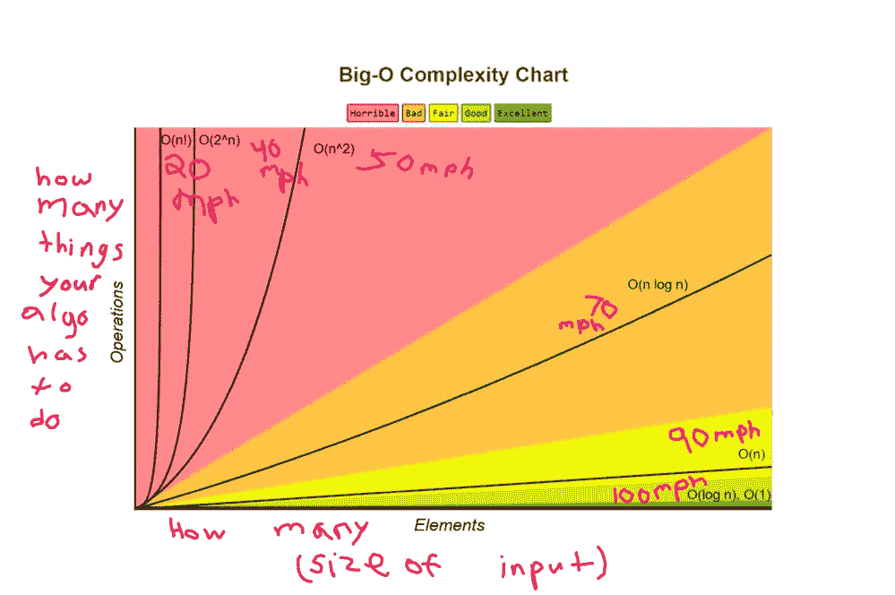

# 经典两和算法问题的求解方法及对 Big-O 的解释

> 原文：<https://javascript.plainenglish.io/ways-to-solve-the-classic-two-sum-algorithm-question-with-an-explanation-on-big-o-ba845b08001e?source=collection_archive---------4----------------------->


Keep reading to find out how this Ferrari applies to Big-O!

算法挑战和我最近成了最好的朋友。我这么说不是为了吹牛，也不是说我还是专家，只是想说我对它们的理解比上周更好了。回顾我的知识对比，我得出的结论是，只要开发人员以任何方式稳步增长，因为技术行业不断带来新的变化，那么如果他们正在寻找新的角色，他们就在正确的轨道上保持自己对团队或就业市场的价值。

除了阐明不断学习至关重要这一事实之外，本周我想更详细地解释三种不同的解决方案，这些方案解释了我在每个平台和每个 YouTube 视频上不断看到的最常见的算法问题；一直流行的二和问题。似乎有无数的博客写了如何解决这个问题，有些解释清楚，有些解释不太清楚。不管怎样，我想解释一下我自己的观点。

# Big-O 解释道

在我开始讨论解决方案之前，我想花点时间简要地谈谈 Big-O 符号以及我对它的理解，因为它适用于这样一种观点，即某些解决方案比其他解决方案更有效。

Big-O 基本上是一种衡量算法运行效率的方法，它在计算机中占用多少空间(内存),称为空间复杂度；它运行的速度，称为时间复杂度，这两者都与算法开始时的输入大小有关。

例如，假设我有两个算法，它们都应该接受数组作为数据结构，最后都必须返回一个修改过的数组。如果给定 5 个元素的大小作为每个元素的输入值，一个会比另一个运行得更快，但最终仍会产生相同的结果。我们可以说，运行速度更快的解决方案具有更好的时间复杂性，为了衡量这一点，我们应该从 Big-O 符号选项中选择一个值，为该解决方案贴上标签。最终我们会看到，由于它所接受的符号，它比其他算法运行得更有效。

从另一个角度来看，算法的 Big-O 符号就像一个速度计，它根据你驾驶的汽车类型来表示汽车的加速度。如果你开一辆樱桃红的法拉利，你会比一辆破旧的 90 年代本田思域开得更快。



A handy chart I’ve edited to simplify what it means to measure Big-O

我将为我的每个解决方案添加 Big-O 度量，因为它们是衡量每个算法效率的重要方式。我还应该补充一点，我将用 JavaScript 编写我的解决方案。

# 问题是

双和问题是这样一个问题:如果给定一个整数(数字)数组(如[1，2，3])和一个目标和数(如 5)，则返回一个元素的数组，这些元素的总和等于该目标和数。如果数组中没有两个数加起来是目标数，那么我们需要返回一个空数组；[].这带来了一个限制，即你不能只把一个数字加到它自己身上来求和。

# 解决方案 1。强力法

**方法总结:**首先，我给出的第一个解决方案将使用两个 for 循环来检查这些数字，看它们是否加起来是目标数字，然后将这两个数字推入一个空数组并返回，否则如果没有两个数字加起来，我将返回原来的空数组。

**如何求解:**我在下面命名了我的函数，并给了它两个合适的参数，给定的数组和它们相加后的目标数。

```
function twoNumberSum(array, targetSum) {
```

接下来，我设置了一个名为 answer 的变量，该变量将被赋值给一个空数组，我启动了一个 for 循环，该循环将从第一个元素开始(这就是为什么 I 等于 0 ),并继续一个接一个地查看数字(i++ ),直到它查看完数组中的所有元素(中间的条件；i < array.length).

```
function twoNumberSum(array, targetSum) {
     let answer = []
     for( i = 0; i < array.length ; i++){
```

Now I have started my second loop which will look at the number right next to whatever i represents the first time (j = i+1), each time increasing by one within the first loop (j++) until it looks through every number in the array (j

```
function twoNumberSum(array, targetSum) {
     let answer = []
     for( i = 0; i < array.length ; i++){
         for( j = i+1; j<array.length; j++){
```

It is time to write the condition which is going to check if the first element; array[i] adds to the second element; array[j] to equal the target sum number. If it does then push the two numbers into the array. After pushing the elements in there, return the answer which was set to an array in the first place to hold our answer.

```
function twoNumberSum(array, targetSum) {
     let answer = []
     for( i = 0; i < array.length ; i++){
         for( j = i+1; j<array.length; j++){
            if(array[i]+array[j]===targetSum){
              answer.push(array[i], array[j])
              return answer
            } 
          }
      }
```

To end this off we need some way to return an empty answer array if we don’t find two numbers that add up which is why we should add the last line here which says to return the array outside of the for loop.

```
function twoNumberSum(array, targetSum) {
     let answer = []
     for( i = 0; i < array.length ; i++){
         for( j = i+1; j<array.length; j++){
            if(array[i]+array[j]===targetSum){
              answer.push(array[i], array[j])
              return answer
            } 
          }
      }
   return answer
}
```

The Big-O notation of this solution would be O(n^2) for time complexity and O(1) for space complexity, which indicates that it is not a very efficient solution for how fast it solves the problem.

# Solution 2\. Hash Method

**方法总结:**这个解决方案最终会生成一个迷你字典，这是一个 JavaScript 对象，它会将数组中的数字放入这个字典中。然后，如果 for 循环从我们的字典中找到的数字加上我们的数字等于目标和，它将返回两个数字作为一个数组。

**如何解决:**对于这个解决方案，我以与第一个解决方案相同的方式开始，这次添加了一个等于空 JavaScript 对象或散列的变量集，暂时是一本空书。

```
function twoNumberSum(array, targetSum) {
  let numbersObject = {}
```

然后，我们开始我们的 for of 循环，因为我们通过数组来检查每个元素，不要与通过对象的 for 循环相混淆。总之，数字这个词是一个变量，代表数组中的每个数字。

```
function twoNumberSum(array, targetSum) {
  let numbersObject = {}
  for (const number of array){
```

我现在将设置一个名为 numberWeAreChecking 的变量，该变量被分配给我们的目标总和减去我们所在的数字。

```
function twoNumberSum(array, targetSum) {
  let numbersObject = {}
  for (const number of array){
     let numberWeAreChecking = targetSum — number
```

为了编写检查我们要检查的数字是否存在于我们的对象中的条件，我写了下面的代码。如果找到了，那就意味着目标和是缺少的那个数，这就是为什么我们要把那个数和我们在 for 循环中检查的另一个数一起返回到一个数组中。

```
function twoNumberSum(array, targetSum) {
  let numbersObject = {}
  for (const number of array){
     let numberWeAreChecking = targetSum — number
     if ( numberWeAreChecking in numbersObject){
         return [numberWeAreChecking, number]
```

否则，在所有其他情况下，我们希望将我们的数字添加到我们的字典中，并将其赋值为 true。随着 for 循环的运行，我们的字典随着 set 中的每个数字等于 true 而增长，直到它满足 numberWeAreChecking 变量操作。为了更直观地解释这个概念，每次 else 语句运行时，字典可能会从看起来像{}变成{1:true，2:true}，这意味着 1 和 2 都存在。

```
function twoNumberSum(array, targetSum) {
  let numbersObject = {}
  for (const number of array){
     let numberWeAreChecking = targetSum — number
     if ( numberWeAreChecking in numbersObject){
         return [numberWeAreChecking, number]
      }else{
        numbersObject[number]=true
```

for 循环在遍历完所有数字后停止运行，所以一旦它检查完所有数字，它将退出 for 循环，这就是为什么下一行返回一个空数组。JavaScript 函数一旦遇到 return 关键字就停止运行，如果 if 条件不满足，它永远不会遇到 return 关键字。因此，在 for 循环完成后，它最终会在这里命中 return 关键字，返回一个空数组。

```
function twoNumberSum(array, targetSum) {
  let numbersObject = {}
  for (const number of array){
     let numberWeAreChecking = targetSum — number
     if ( numberWeAreChecking in numbersObject){
         return [numberWeAreChecking, number]
      }else{
        numbersObject[number]=true
      }
   }
  return [];
}
```

根据 Big-O 符号，这个解具有 O(n)表示时间和 O(n)表示空间的符号。这意味着它在速度方面比第一种解决方案好，但在空间方面不如第一种，因为它需要额外的空间来存储 JavaScript 对象中的所有内容。

# **解决方案 3。排序方法**

**方法总结:**该解决方案将集中于对数字进行排序，并使用左右指针系统来最终找到加起来达到目标总和的数字。右边的指针指向一个整数，左边的指针指向数组中相对两边的另一个整数。

每次循环检查这些数字的总和是否等于目标总和时，左指针或右指针将根据所指向的两个数字的总和是大于还是小于目标总和而相应移动。

**如何解决:**解决方案从命名开始，并接受与前两个解决方案相同的输入。然后使用排序方法从最小到最大对数字进行排序。

```
function twoNumberSum(array, targetSum) {
 array.sort(function(a, b){return a-b})
```

这里定义了三个变量，代表最左侧和最右侧的索引。所有数组从左侧的第 0 个索引开始，从最后一个数字开始倒数的任何数字首先出现，表示最右侧的数字。然后，如果我们找不到任何两个数字相加得到单词 answer 所代表的目标，那么一个空数组将再次保存我们的答案。

```
function twoNumberSum(array, targetSum) {
 array.sort(function(a, b){return a-b})
 let leftPointer = 0
 let rightPointer = array.length-1
 let answer = []
```

现在是时候使用一个循环从头开始遍历我们的每个数字，并编写一个 if 条件，该条件表示如果左指针指向的任何数字加上右指针指向的任何数字加起来达到目标和，则在一个数组中返回这两个数字。

```
function twoNumberSum(array, targetSum) {
 array.sort(function(a, b){return a-b})
 let leftPointer = 0
 let rightPointer = array.length-1
 let answer = []
 for(i=0; i<array.length; i++){
   if (array[leftPointer] + array[rightPointer]===targetSum){
      return [array[leftPointer], array[rightPointer]]
```

如果这个条件不满足，这意味着我们还没有找到我们的答案，所以程序将跳转到下一个 else if 语句，该语句指出，如果这些数字相加的结果小于目标和，则将左边的指针向右移动。因为这些数字已经排序，这将使我们的结果下一次循环运行更大，这将使它更接近目标总数。

否则，下一个 else if 条件将运行，如果它发现结果大于目标和数，则相反，这将使结果在相反方向上更接近目标和。

```
function twoNumberSum(array, targetSum) {
 array.sort(function(a, b){return a-b})
 let leftPointer = 0
 let rightPointer = array.length-1
 let answer = []
 for(i=0; i<array.length; i++){
   if (array[leftPointer] + array[rightPointer]===targetSum){
      return [array[leftPointer], array[rightPointer]]
   } else if (array[leftPointer] + array[rightPointer] <targetSum) {
    leftPointer++

   } else if (array[leftPointer] + array[rightPointer] >targetSum){
   rightPointer — 
   }
```

关闭东西，如果循环找不到答案，它将返回一个空数组。

```
function twoNumberSum(array, targetSum) {
 array.sort(function(a, b){return a-b})
 let leftPointer = 0
 let rightPointer = array.length-1
 let answer = []
 for(i=0; i<array.length; i++){
   if (array[leftPointer] + array[rightPointer]===targetSum){
      return [array[leftPointer], array[rightPointer]]
   } else if (array[leftPointer] + array[rightPointer] <targetSum) {
    leftPointer++

   } else if (array[leftPointer] + array[rightPointer] >targetSum){
   rightPointer — 
   }
}
 return answer
}
```

此解决方案的 Big-O 符号将最终被定义为时间为 O(nlog(n))，空间为 O(1)，这意味着此解决方案在空间方面比第二个解决方案好，但在速度方面比第二个解决方案差。然而，就时间复杂度而言，它仍然优于第一种解决方案。

两个和问题本身是一个常见的算法问题，我在网上随处可见，在技术访谈中也经常遇到，这就是为什么我认为用我描述的三种方法解释如何解决它是有用的。

我希望这对于试图理解解决这个问题的每种方法或试图理解 Big-O 的人是有用的。如果你还没有理解它，我会鼓励你继续尝试，因为理解这些概念从长远来看将使你受益。

换句话说，对我来说，这个问题是我以后理解更复杂的算法问题的垫脚石，因为它奠定了算法解决方案的基础。我致力于做更多的事情和学习更多的东西，以保持软件开发领域的持续增长，这也是我认为每个开发人员都应该渴望继续做的事情。有了对算法的更好理解，我们马上就能写出我们的 Big-O Ferrari 函数！

