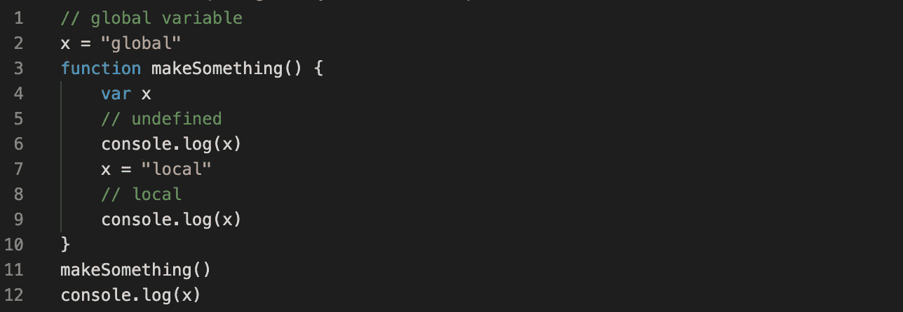

# 我们需要尽量减少 JavaScript 中全局变量的使用

> 原文：<https://javascript.plainenglish.io/we-need-to-minimize-the-use-of-global-variables-in-javascript-cafd5dc69b79?source=collection_archive---------4----------------------->

## 如何以及为什么在 JavaScript 中避免全局变量



Minimize the use of global variables in JavaScript

# JavaScrip 如何管理作用域？

在 JavaScript 语言中，有两种类型的作用域:

*   全球范围
*   局部范围

JavaScript 使用函数来管理范围。函数内部定义的变量在局部范围内，在函数外部不可用。而在函数外部定义的变量在全局范围内。每个函数在被调用时都会创建一个新的作用域。

> 请记住，每个函数在被调用时都会创建一个新的作用域。

# 全局变量的问题是

全局变量很容易被其他脚本覆盖。例如，当应用程序的两个独立部分使用相同的名称但不同的目的定义全局变量时。

例如，网页包含非页面开发人员编写的代码也很常见。

*   第三方 JavaScript 库
*   来自第三方用户跟踪和分析脚本的代码
*   不同种类的部件、徽章和按钮
*   来自广告合作伙伴的脚本

# **JavaScript 中如何避免**全局变量？

## 示例 1

考虑下面的例子。`result`未经声明就被使用。这可能是问题的来源。

```
function multiply(x, y) {
    //anti-pattern: implied a global variable    
    **result = x * y**
    return result
}
```

经验法则是总是用`var`声明变量。

```
function multiply(x, y) {
    **var result = x * y**
    return result
}
```

## 示例 2

另一个创建隐含全局变量的例子是将赋值作为`var`声明的一部分进行链接。在下面的例子中，a 是本地的，但是 b 变成了全局的。

```
function makeSomething() {
    //anti-pattern: don't use 
    **var a = b = 0**
    ...
}
```

重写如下代码。a 和 b 都是本地的。

```
function makeSomething() {
    **var a, b**
    a = b = 0
    ...
}
```

## **例 3**

属性可以用 delete 操作符删除，而变量不能。

> 请记住，属性可以用 delete 操作符删除，而变量不能。

无法删除使用`var`创建的全局。

```
var x = 10
delete x
**<< false**
```

不使用`var`创建的隐含全局变量可以被删除，不管是否在函数内部创建。

```
x = 10
delete x
**<< true**function makeSomething() {
    y= 20
}
delete y
**<< true**
```

## **例 4**

你使用一个变量，然后在函数中进一步声明它。看一下这个例子。

```
x = "global" // global variable
function makeSomething() { console.log(x) // undefined
    var x = "local"
    console.log(x) // local
}
makeSomething()
**console.log(x)**
<< undefined
<< local
**<< global**
```

> 在 JavaScript 中，它使我们能够在函数中的任何地方拥有多个`var`语句，它们的行为就好像变量是在函数的顶部声明的一样。

实际上，上面的代码片段就像下面这样。x 变量在函数的顶部声明，但是 x 的值仍然设置在当前位置。

```
x = "global" // global variable
function makeSomething() {
    **var x**
    console.log(x) // undefined
    x = "local
    console.log(x) // local
}
makeSomething()
console.log(x)
<< undefined
<< local
<< global
```

全局变量并不坏，甚至不是一个安全问题，但它不应该覆盖另一个变量的值。

感谢阅读😘，再见👋，别忘了👏最多 50 次并跟随！