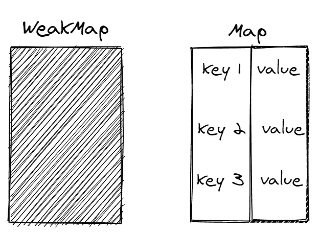
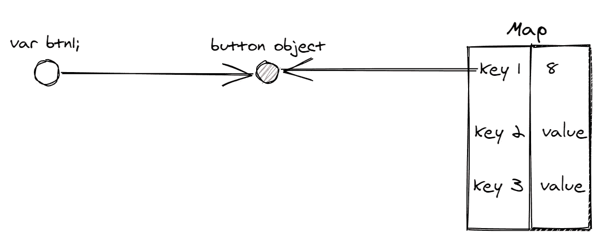
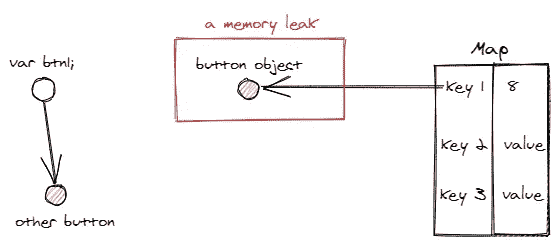
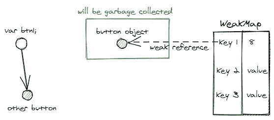

# WeakMaps:插图

> 原文：<https://javascript.plainenglish.io/weakmaps-illustrated-8169ce4764bb?source=collection_archive---------1----------------------->

`WeakMap`是 ES6 推出的系列之一。你应该麻烦或者只是在所有事情上使用`Map`？

简短的回答是，您可能应该这样做，因为`WeakMap`提供了一种方便的方法来扩展一个对象，而不需要修改它或者干扰垃圾收集。

垃圾收集什么？这有什么关系？在本帖中，我们将讨论`WeakMap`，它的用例，以及 Google Polymer 项目的一个真实用例。

到这篇文章结束时，你应该明白:

1.  `WeakMap`的重要性质
2.  与`Map`的区别
3.  何时使用`WeakMap`

# 地图对地图

**一个** `**WeakMap**` **只是一个** `**Map**` **，有 3 个重要区别:**

1.  键必须是对象
2.  键被弱引用
3.  `WeakMap`是一个黑盒，没有办法检索出密钥或者`WeakMap`的大小

A WeakMap is a black-box, we cannot access its values without the keys

我们不能循环访问`WeakMap`键和对象，我们只能在有键的情况下使用`get(key)`方法访问它的值。这对于管理对象中的私有数据非常有用。

**这些是** `**WeakMap**` **方法:**

1.  `get(key)`
2.  `set(key, value)`
3.  `delete(key)`
4.  `has(key)`

这么多限制，为什么不直接用`Map`？问题是，在`Map`上存储一个对象可能会阻止对象的垃圾收集并导致内存泄漏。`WeakMap`防止仅使用*弱*参考。

让我们看一些具体的用例，这会给我们更多的线索。

# 用例

`WeakMap`最常见的用例是在一个对象上存储额外的数据。

## 假设我们在 DOM 上有一堆按钮，我们想记录每个按钮被用户按了多少次。

**使用一个** `**Map**`

我们可以将按钮对象作为一个键存储在一个`Map`中，并跟踪次数作为它的值。但是，一旦我们不再需要按钮对象，这将导致内存泄漏，也许过一会儿，我们将从 DOM 或其他地方删除按钮。

在代码中，它看起来像这样:

1.  我们在`btn1`中获得了对按钮对象的引用
2.  我们初始化`Map`并将点击计数存储为`0`
3.  每点击一次，我们就增加`Map`中的点击计数

让我们画一些图来更好地理解这里发生的事情。

The references to the button object

我们将有一个引用按钮对象的`btn1`变量。这个引用可以用来监听它的点击事件。我们还有我们的`Map`,它维护了对`btn1`的引用作为它的键。

**过了一段时间，我们不再需要这个按钮，也不再维护对它的引用。**垃圾收集器现在可以收集这个对象，为其他按钮释放更多宝贵的空间。但是看看我们得到了什么，一个*内存泄漏*！垃圾收集器无法释放对象，因为我们的`Map`仍然维护着对按钮的引用。

Our btn1 no longer references our button object, but the Map still references it!

> 你们中的一些人可能想知道为什么我们不在重新分配我们的`btn1`之前清除这个键。这听起来很简单，但必须记住手动管理引用可能容易出错，并引入一些精神开销！更好的选择是使用`WeakMap`。

# WeakMap 前来救援

`WeakMap`通过维护对对象的“弱”引用来防止内存泄漏问题。这使我们能够存储点击计数，而无需修改按钮对象或导致垃圾收集问题。

Garbage collector collects the button object because there is no strong references

在代码中，这将类似于:

我们只改变第二行初始化`WeakMap`而不是`Map`，简单！

# 外卖

**A** `**WeakMap**` **简单地允许我们*存储与某个对象相关的额外数据*，而无需修改它或担心内存管理！**

这种需要存储额外数据的场景经常出现，例如:

**缓存中:**

上面的函数计算了`basket`数组中所有商品的总价。记住*数组也是对象*，所以它可以作为键存储在`WeakMap`中！

**跟踪 DOM 变化:**

我们还可以存储 DOM 节点的附加信息，而无需修改它们。事实上， [Google Polymer 项目](https://github.com/Polymer)使用`WeakMap` s 来跟踪 DOM 节点的编辑、删除和更改！

**存储类的私有数据:**

由于`WeakMap`也是黑盒，我们也可以用它来存储类和对象的私有数据。但是这是一个不太常见的用例，在 JavaScript 中还有许多其他管理私有数据的方法。

**这里的经验法则是，每当你需要跟踪一个对象的额外数据或行为时，但是:**

1.  您不想修改或附加对象的附加属性
2.  你不想担心内存管理

就用`WeakMap`！

如果你想了解更多关于`WeakMap`和`WeakSet`的信息，看看这些有用的文章:

1.  [JavaScript 信息:WeakMap 和 WeakSet](https://javascript.info/weakmap-weakset)
2.  [管理类中的私有数据](https://2ality.com/2016/01/private-data-classes.html)
3.  [MDN 文档:WeakMap](https://developer.mozilla.org/en-US/docs/Web/JavaScript/Reference/Global_Objects/WeakMap)

我希望这有助于你下次需要扩展一个对象。感谢阅读！

## **简明英语 JavaScript**

喜欢这篇文章吗？如果有，通过 [**订阅获取更多类似内容解码，我们的 YouTube 频道**](https://www.youtube.com/channel/UCtipWUghju290NWcn8jhyAw) **！**