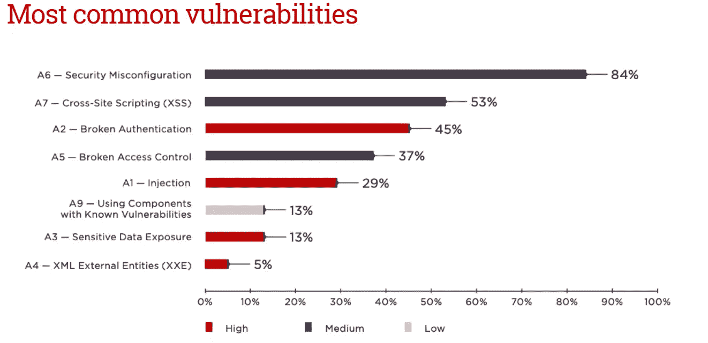

# 每个开发人员都必须了解的 Web 应用程序安全最佳实践

> 原文：<https://javascript.plainenglish.io/web-application-security-best-practices-881e3cfde2a1?source=collection_archive---------3----------------------->

## 如何保护您的 web 应用程序免受网络攻击

Photo by [sebastiaan stam](https://unsplash.com/@sebastiaanstam?utm_source=medium&utm_medium=referral) on [Unsplash](https://unsplash.com?utm_source=medium&utm_medium=referral)

如今，网络应用无疑是商业和日常生活的一个重要方面。作为这种日益流行的结果，这些 web 应用程序的安全性是非常值得关注的。然而，在开发过程中，开发人员经常忽视或未能充分考虑到 web 应用的安全风险。

根据 [2021 Edgescan 漏洞统计报告](https://info.edgescan.com/vulnerability-stats-report-2021)，50%的内部 web 应用程序漏洞被归类为高风险或重大风险。它还发现，面向互联网的应用程序中有 32%的漏洞也构成了高风险或重大风险。

所以，开发人员应该总是尽量让他们的应用程序安全。在本文中，我将讨论 web 应用程序中可能存在的主要漏洞以及避免这些漏洞的最佳做法。

# OWASP 十大品牌

开发人员不是安全专家，这就是为什么像开放 Web 应用程序安全项目(OWASP)十大清单这样的汇编可以帮助他们。每隔几年，OWASP 就会发布有关广泛的网络、云和安全问题的详细分析、指导和警告。下面是 2019 年发生的最常见的 OWASP 十大漏洞图表。

*Screenshot of* [Web Applications vulnerabilities and threats: statistics for 2019](https://www.ptsecurity.com/ww-en/analytics/web-vulnerabilities-2020/#id2) *by Author*

从图表中，您可以看到 2019 年最常见的 Web 应用程序漏洞是由于安全配置错误造成的。跨站点脚本(XSS)和身份验证失败也是非常常见的漏洞。让我们看看开发人员应该采取什么措施来避免和最小化这些漏洞。

然而，其中一些威胁已经改变了他们在 2021 年的排名。以下是 OWASP 发布的十大威胁新列表。

What’s changed in the Top 10 for 2021

# 遵循最佳实践防止访问控制中断

## 在服务器端处理访问控制

访问控制只有在可信的服务器端代码或无服务器 API 中实现时才有效。这是因为攻击者将无法修改访问控制检查或元数据。

## 默认拒绝

谈到访问控制，一个好的经验法则是给予所有用户、程序或进程尽可能少的特权访问。例如，默认情况下，所有应用程序用户都应该被拒绝访问应用程序资源，只有被请求的用户才被授予查看、访问和修改它们的权限。请记住，如果应用程序的代码在处理访问控制请求时引发错误或异常，则访问控制应该始终被拒绝。

# 使用 SSL (HTTPS)加密

安全套接字层(SSL)是一种用于在 web 服务器和 web 浏览器之间建立加密链接的技术。这确保了在浏览器和网络服务器之间传输的信息是保密的。在传输敏感信息(如信用卡信息和个人数据)以及使用用户身份验证时，您必须始终使用 SSL 加密。

# 保护 Cookies

> 每五个测试的应用程序中就有一个包含允许黑客攻击用户会话的漏洞，例如没有 HttpOnly 和 Secure 标志的敏感 cookies。

大多数 web 应用程序使用 cookies 来存储不同类型的用户会话信息。然而，开发人员经常忘记在这些 cookies 上设置安全和 HttpOnly 标志。默认情况下，这些标志不为真，因此必须将其显式设置为真。当使用安全标志时，cookie 将仅通过 HTTPS 发送。因此，黑客将无法读取 cookie 数据。使用 HttpOnly 标志时，JavaScript 将无法读取 cookie。所以它将阻止 XSS 的袭击。

# 编码和转义不受信任的数据

不可信数据可以是用户输入或控制其值的任何东西。编码和转义是用于阻止注入攻击的防御技术。编码，也称为输出编码，是通过将特殊字符翻译成对我们的应用程序没有危险的不同形式来完成的。

例如，当写入 HTML 页面时，将`<`字符翻译成`&lt;`字符串。大多数 web 框架都包含了针对某些字符的 HTML 转义方法。

上下文输出编码是阻止 XSS 所需的关键安全编程技术。攻击者使用 XSS 将客户端脚本注入用户查看的网页。用于在 web 应用程序中构建安全用户界面的不同编码类型包括 HTML 元素编码、HTML 属性编码、JavaScript 编码、CSS 编码和 URL 编码。你可以从 [OWASP XSS 预防备忘单](https://cheatsheetseries.owasp.org/cheatsheets/Cross_Site_Scripting_Prevention_Cheat_Sheet.html)中学习如何使用它们。

# 输入验证

开发人员必须始终验证用户输入，以便只有格式正确的数据才能通过 web 应用程序工作流。您应该始终在客户端和服务器端验证输入，因为攻击者很容易绕过客户端验证。

验证时，检查数据是否符合预期的形式，并且在可接受的范围内。虽然输入验证有助于防止一些攻击，但它并不总是确保数据安全，因为一些输入，如电子邮件地址，可能包含 SQL 注入攻击或有效的 URL 可能包含 XSS 攻击。这就是为什么我们需要使用编码和转义等方法。

# 使用安全的身份验证方法

在 OWASP 前十名中，身份验证被破坏排名第二。因此，作为开发人员，我们需要采取强有力的措施来防止这种情况。许多开发人员都会同意，单一因素身份验证早已过时。因此，在开发您的 web 应用程序时，请始终使用多因素身份验证。始终限制用户尝试身份验证的次数。否则，攻击者将能够暴力破解凭据并访问 web 应用程序。

诸如 [Crashtest 安全套件](https://crashtest-security.com/)、 [HDiv](https://hdivsecurity.com/) 、 [Immuniweb Discovery](https://www.immuniweb.com/products/discovery/) 和 [Acunetix](https://www.acunetix.com/) 之类的工具可用于防止、检测和修复被破坏的认证漏洞。

# 结论

在本文中，我讨论了一些保护 web 应用程序免受网络攻击的最佳实践。

最后，我建议使用像 [OWASP 依赖检查](https://github.com/jeremylong/DependencyCheck)和 [Retire 这样的工具。JS](https://github.com/retirejs/retire.js/) 识别项目依赖关系，并检查任何第三方代码库中任何已知的、公开披露的漏洞。本文到此为止。我希望这能帮助你使你的 web 应用程序更加安全。

感谢您的阅读，祝您编码愉快！

# 参考

*   [网络应用漏洞与威胁:2019 年统计](https://www.ptsecurity.com/ww-en/analytics/web-vulnerabilities-2020/#id2)
*   [喷射理论](https://owasp.org/www-community/Injection_Theory)
*   [跨站点脚本防御备忘单](https://cheatsheetseries.owasp.org/cheatsheets/Cross_Site_Scripting_Prevention_Cheat_Sheet.html)