# 使用 Chart.js 实现基于 Web 的可视化

> 原文：<https://javascript.plainenglish.io/web-based-visualization-with-chart-js-7aa5af9102cd?source=collection_archive---------7----------------------->

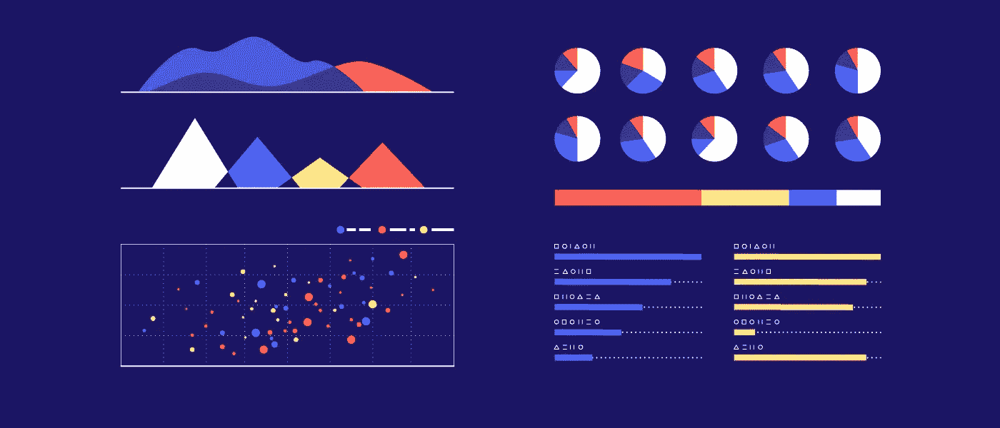

Data Visualization ~ [Column Five](https://www.google.com/url?sa=i&url=https%3A%2F%2Fwww.columnfivemedia.com%2Fhow-to-data-visualization-report-design&psig=AOvVaw3Z16z6lepnDi8f58JFHjpm&ust=1590450841097000&source=images&cd=vfe&ved=0CAIQjRxqFwoTCPi2mOHYzekCFQAAAAAdAAAAABAD)

## 数据可视化 JavaScript 库简介

大家好，欢迎来到本教程，开始学习 Chart.js。在这里，您将了解到:

*   什么是数据可视化
*   为什么需要数据可视化
*   什么是 Chart.js
*   为什么要使用 Chart.js 进行数据可视化
*   最后，如何使用 Chart.js 进行数据可视化

就在我们开始之前，

# 开始工作需要知道什么？

我什么都不会说，除了你的 PC，一个文本编辑器，一个浏览器，和一些 HTML，CSS，JavaScript 的知识。

一旦你有了这些，你就可以开始了。让我们开始吧！

# 什么是数据可视化？

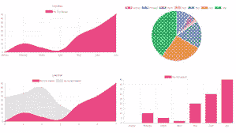

Charts I [Creativeblog](https://www.google.com/imgres?imgurl=https%3A%2F%2Fcdn.mos.cms.futurecdn.net%2FS5bicwPe8vbP9nt3iwAwwi.jpg&imgrefurl=https%3A%2F%2Fwww.creativebloq.com%2Fhow-to%2Fuse-chartjs-to-turn-data-into-interactive-diagrams&tbnid=t7iXqW9RIrVs9M&vet=12ahUKEwjhy9D0i-jpAhW_AmMBHRl5BpcQMygCegUIARCcAg..i&docid=qLrvlU6mzTPFuM&w=1406&h=791&q=chart%20js&ved=2ahUKEwjhy9D0i-jpAhW_AmMBHRl5BpcQMygCegUIARCcAg)

> 数据可视化是数据的图形表示。它包括生成图像，这些图像将所表示的数据之间的关系传达给图像的观看者。这种通信是通过在可视化的创建中使用图形标记和数据值之间的系统映射来实现的。

这可以说是传达从数据中获得的信息的一种更好的方式。使用醒目而简单的图像，信息更容易理解，并且几乎毫不费力地无缝传递。

# 为什么要数据可视化？

你可能会问‘为什么这很重要？’或者“我们为什么不直接以表格形式查看数据呢？".我认为这很重要，有几个原因。

数据可视化非常重要，因为:

*   这使得发现数据中的趋势比必须通过数据行来发现它们更容易，就像在一个 50，000 行的表中计数男性和女性的数量一样。
*   与浏览数据行相比，它使信息更容易理解。饼图让你一眼就能知道两个变量中较大的一个。
*   它简化了最复杂的数据集，任何数据都可以放入一个小饼图中。

以及许多其他原因。

# 什么是 Chart.js？

Chart.js | [Chart.js](http://chartjs.org)

> Chart.js 是一个用于数据可视化的免费开源 JavaScript 库，它支持 8 种图表类型:条形图、折线图、面积图、饼图(圆环图)、气泡图、雷达图、极坐标图和散点图。

# 为什么选择 Chart.js？

嗯，有相当多的理由你应该使用 Chart.js 进行可视化。

*   Chart.js 是一个免费的开源库，这意味着你可以在任何时候使用它，想用多少就用多少，想用多久就用多久，你甚至可以为改进它做出贡献
*   Chart.js 非常容易安装和使用，因为它使用 HTML canvas 来呈现可视化。
*   Chart.js 让您创建令人惊叹的可视化效果。

# 深入研究代码:制作饼图

用 Chart.js 制作可视化非常容易，因为它使用 HTML 画布来保存其图形或图表。

Chart.js 作为 javascript 库有两种安装方式，使用 npm(节点包管理器)，建议高级 JavaScript 用户使用，

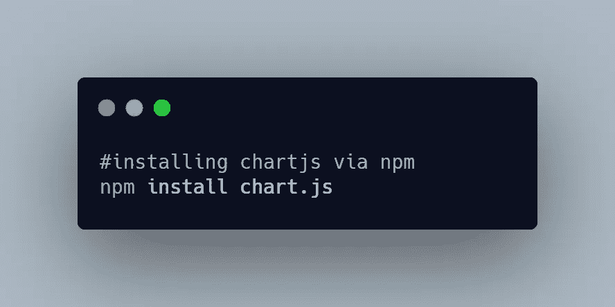

或者使用 CDN，我将在本教程中使用，因为它非常容易使用。

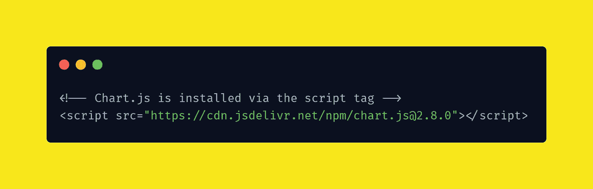

现在你差不多准备好了。我们现在需要做的就是用画布创建我们的 HTML 页面，图表将在这里显示。

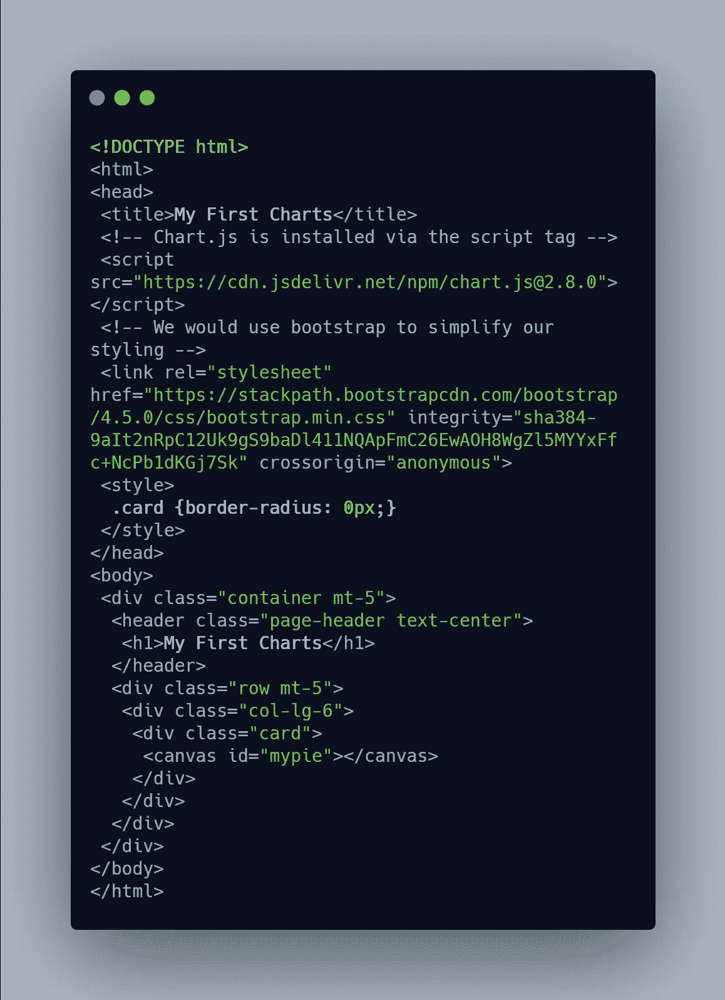

现在你已经准备好了你的第一个图表，请注意页面上 bootstrap 的使用，它用于使页面响应更快，看起来更好，同时节省时间和精力。

接下来，您创建一个 ***chart.js*** 文件(名称不必与我的相同)。创建的文件将包含所有的 JavaScript 代码，使 HTML 代码整洁易读。

现在，在安装了 chart.js 库之后，链接到新的 *chart.js* 文件，如下所示:

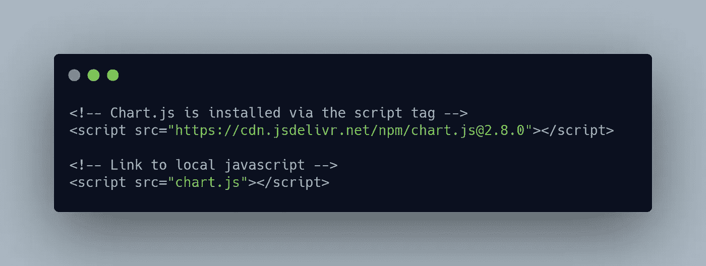

> javascript 文件应该链接在页面的底部

因此，在我们的 chart.js 中，我们首先选择目标元素 canvas(图表将安装在这里)。

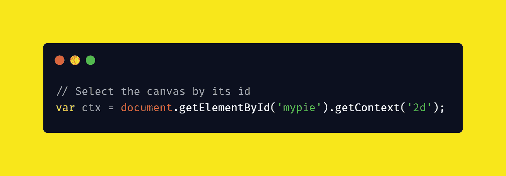

## 创建新图表

Chart.js 使用 javascript 类，因此创建一个新图表需要实例化一个新类(由于 CDN 链接，我们只能访问这个类)。

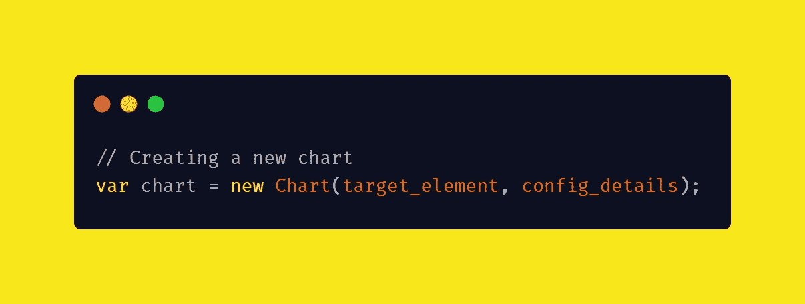

## 仔细看看代码

***target_element*** 是我们打算在其上挂载图表的 HTML 元素。在我们的例子中，我们已经得到了这个元素，并把它赋给了一个变量，现在我们可以很容易地引入这个变量。所以我们的代码现在看起来像这样:

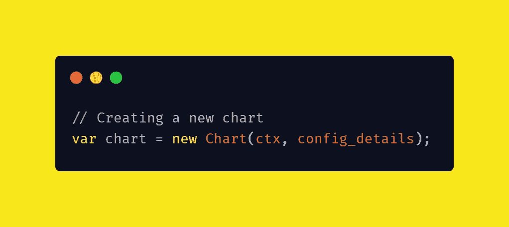

我们只使用 ***ctx*** 因为它是我们给目标 HTML 元素 canvas 的名字。此外，我们引入画布( ***ctx*** )是因为画布上下文对象包含 chart.js 将用来在画布上可视化表示数据的方法和函数。

**我们的大部分工作将在***config _ details***部分进行，我们从陈述类型开始。**

**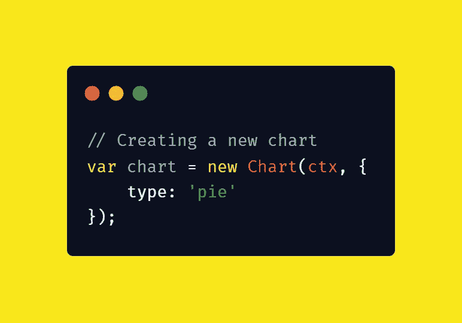**

**在这里，我将类型设置为 pie，但是，这只是 chart.js 拥有的许多类型中的一种。其他类型有****线条******雷达、******区域*** 等等。***

***现在我们移动设置 ***数据*** 用于可视化。数据作为具有所需属性(标签和数据集)的对象传递。***

***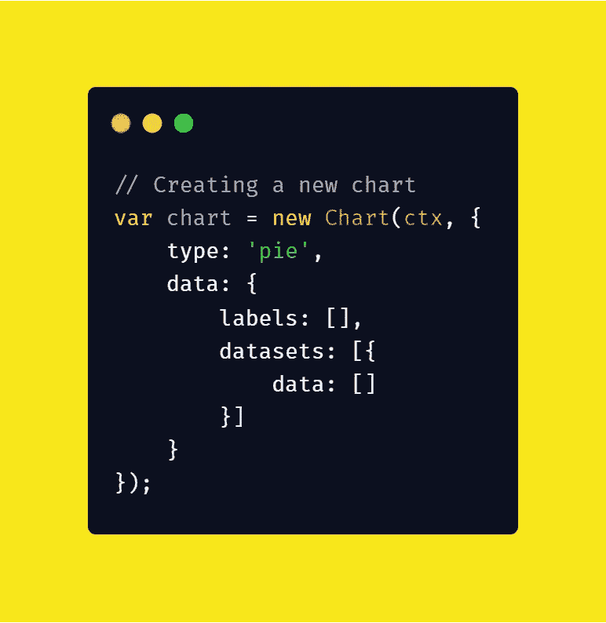***

******数据*** 对象的两个属性都是数组(如预期的那样)并且对应( ***标签*** 的长度应该与 ***数据集*** 中对象的 ***数据*** 数组的长度相匹配)。因此，对于每个标签，它都与一些数据相匹配。***

***我们用一些样本数据做一个饼状图，可能是一年第一季度一个月出生的孩子数量。所以我们有 3 个月，这意味着我们的饼图中有 3 个扇区，我们需要 3 个标签来对应我们将给出的 3 个月的数据。***

***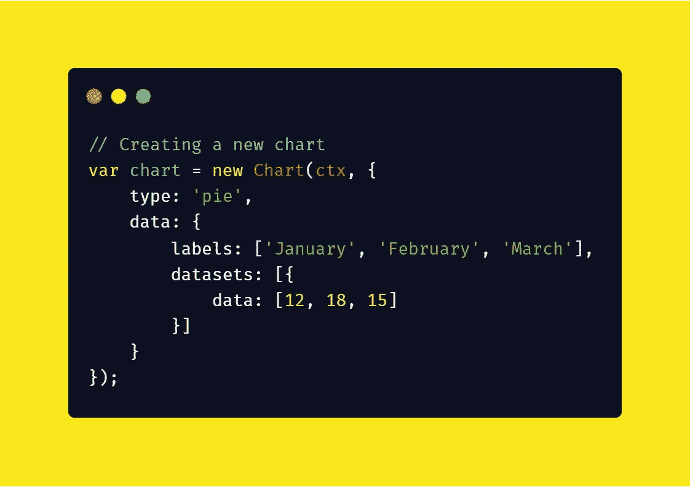***

***现在你有了它，你的第一个基于网络的数据可视化在一些非常简单的步骤中完成，即使图表看起来有点不像你预期的那样。我猜你希望它更丰富多彩。***

***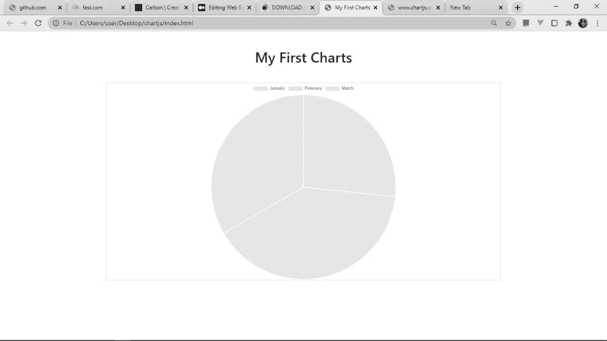***

***我们会用多几行让它看起来更好。继续读🚀。***

***我们可以从为每个部分指定背景颜色开始。***

***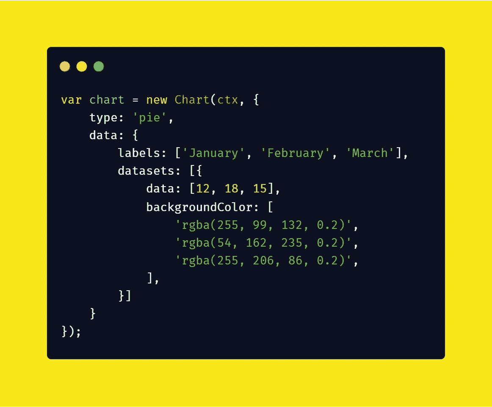***

***有了这个更新的代码，我们应该有一个更加丰富多彩的图表。***

***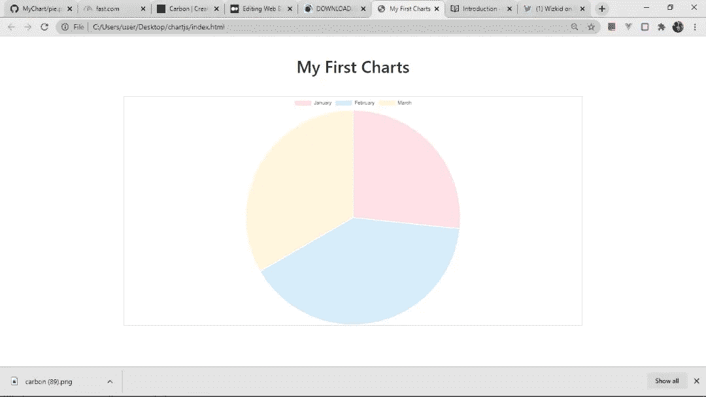***

***This looks more like it. 😊***

***此外，你可能已经注意到，悬停在任何部门弹出一个小工具提示，告诉数量。很酷，不是吗？***

***你可以指定更多的特性，比如边框颜色和宽度。Chart.js 为您提供了应有的灵活性。***

# ***摘要***

***至此，您一定已经了解了很多关于数据可视化和 Chart.js 的知识，并且一定非常熟悉使用 Chart.js。如果您想了解更多信息，请阅读官方文档[此处](https://www.chartjs.org/docs/latest/charts/doughnut.html)。***

# ***结束了***

***如果你有任何问题或相关的好建议，请在评论区留下。***

***要阅读更多我的文章或关注我的作品，你可以通过 [LinkedIn](https://www.linkedin.com/in/idris-aweda-zubair-5433121a3/) 和 [Twitter](https://twitter.com/AwedaIdris) 与我联系。又快又简单，还免费！***