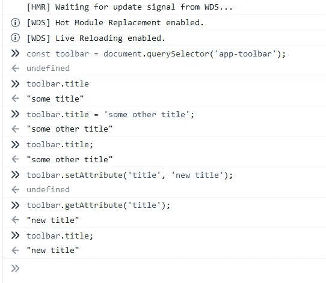
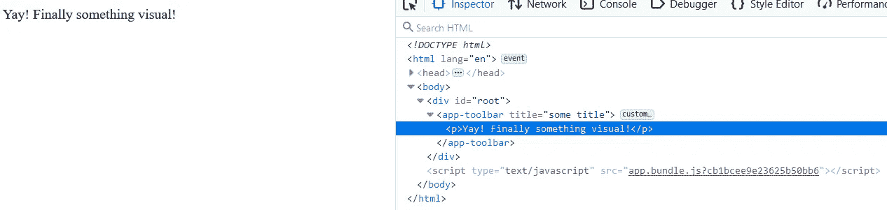
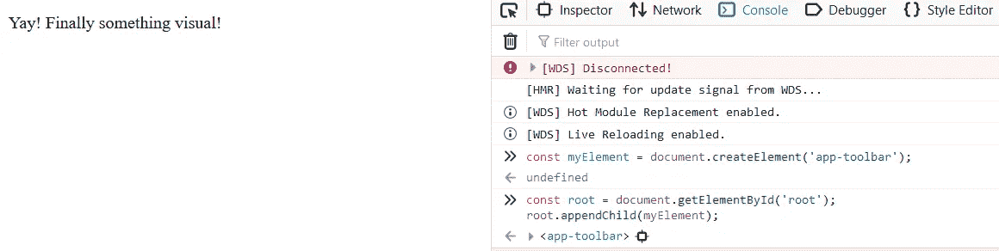
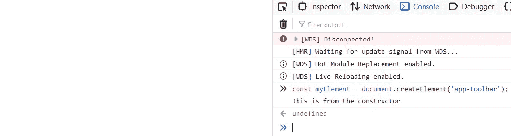
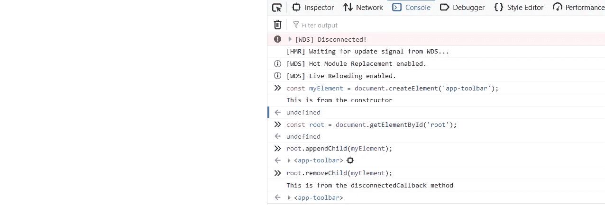
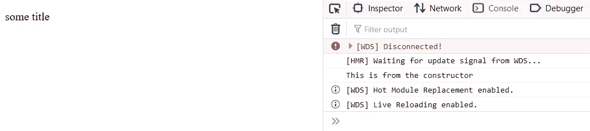
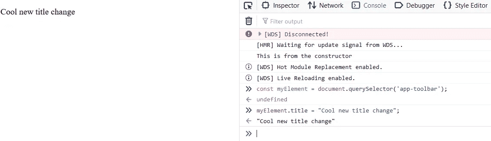
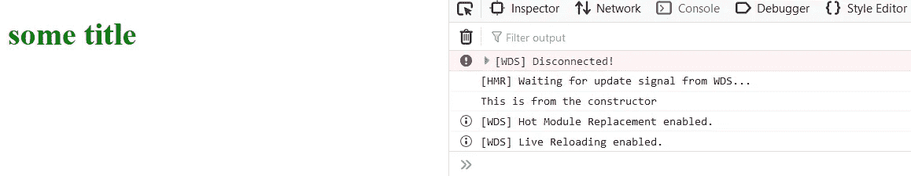
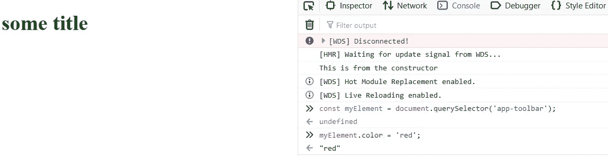
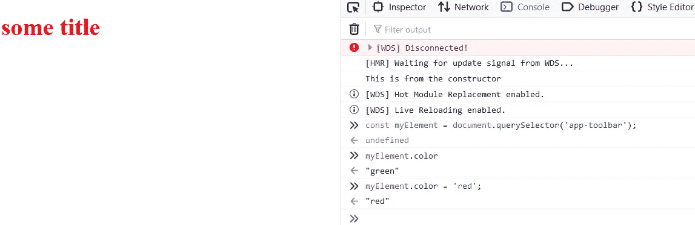

# Web 组件速成班(自定义元素)

> 原文：<https://javascript.plainenglish.io/web-components-crash-course-7c0df961a8b7?source=collection_archive---------1----------------------->

## 第 1 部分:定制元素


Photo by [Ryoji Iwata](https://unsplash.com/@ryoji__iwata?utm_source=unsplash&utm_medium=referral&utm_content=creditCopyText) on [Unsplash](https://unsplash.com/s/photos/puzzle?utm_source=unsplash&utm_medium=referral&utm_content=creditCopyText)

# 介绍

市面上比较流行的框架有几个，分别是 Angular，React 和 Vue。这些框架在执行不同任务的方式上有所不同，但它们都有一个共同点。它们都使用*组件*作为 UI 的基本构建模块。做前端开发时很容易陷入框架的土地，因为它们经常被新兵训练营和其他在线课程所推销。完全有可能在不使用这些框架的情况下为您的 web 应用程序创建组件。几乎所有的现代浏览器都提供了一套被称为 *web 组件*的本地 API。

**注意:** *你可以通过从* [***这里***](https://github.com/Haseeb90/web-components-crash-course) *克隆 Git 库来跟随本文中的代码示例。克隆存储库后，运行* `npm install` *来设置项目。*

# Web 组件 API

在处理 web 组件时，有三种主要的技术可以让您开发和发布可重用的 UI 组件:

*   **自定义元素:**这个 API 允许你创建新的 DOM 元素，类似于`<input>`、`<article>`、`<footer>`等。
*   [**HTML 模板**](https://medium.com/javascript-in-plain-english/web-components-crash-course-b0a2feb11be1) **:** *(链接)*****`<template>`允许您保留未呈现但稍后将在 JavaScript 中使用的内容****
*   ****[](https://medium.com/@haseebkhan_90/web-components-crash-course-shadow-dom-803183fcfabc)****:***【链接】*是一种非常有用的技术，可以让你的组件与外部应用程序隔离开来。如果您计划在 NPM 上发布您的 web 组件以与其他开发人员共享，这将非常有用。******

******注意:** *这三项技术涉及的内容很多，所以我将按照上面的顺序把它分成三篇独立的文章。*****

# ****自定义元素****

****自定义元素允许您创建自定义 HTML 标签。这是您将创建的任何 web 组件的核心。以下是自定义元素的外观:****

```
**<app-toolbar></app-toolbar>**
```

****当你用自定义元素 API 创建一个标签时，你**必须**使用至少两个用连字符`-`分隔的单词。这样做的原因是每个单词标签都是针对 W3C 的，这个规则帮助浏览器区分自定义元素和 W3C 定义的标签。****

****要创建自定义元素，您只需创建一个从`HTMLElement`基类扩展而来的类，如下所示:****

```
**// app-toolbar.component.jsexport default class AppToolbar extends HTMLElement {
  // logic for your component...
}**
```

****浏览器有一个组件注册表，它跟踪浏览器能够理解的有效标签。要在 HTML 文件中使用该组件，您必须首先将其添加到**浏览器组件注册表**。将我们的组件添加到浏览器组件注册表意味着将标记名连接到一个定制元素类。你应该这么做:****

```
**// app.js
import AppToolbar from './app-toolbar.component.js';customElements
  .define('app-toolbar', AppToolbar);**
```

******注意:** *你不需要在一个单独的文件中完成，你可以在一个文件中完成所有的工作，但是这种方式保持了你的组件逻辑的整洁，并且允许你在一个单独的位置将所有的定制组件添加到注册表中。*****

****一旦将自定义元素添加到浏览器组件注册表中，就可以在 HTML 文件中使用标记，如下所示:****

```
**...
<body>
  <div id="root">
    <app-toolbar></app-toolbar>
  </div>
</body>
...**
```

****如果你已经克隆了 [Git repo](https://github.com/Haseeb90/web-components-crash-course) 并且在主分支上，运行命令`npm run serve`，你不会看到任何太令人兴奋的东西。您实际上根本看不到任何东西，因为我们还没有向组件添加任何逻辑、模板或样式。****

## ****属性以及如何管理它们****

******注:** *如果您想了解本节及其示例，请切换到管理属性分支* `git checkout managing-attributes`****

****web 组件有很多优点，但最突出的一点是它们可以用于任何框架和任何应用程序，无论是新的还是旧的。为了实现这一点，您创建的定制元素需要与原生 HTML 元素具有相同的 API。这意味着，如果您想要向您的自定义元素添加一个属性，它应该像任何其他属性一样易于管理。以`<input>`元素为例，您可以通过 HTML、带有`element.getAttribute(…)`和`element.setAttribute(…, …)`的 DOM API 以及属性访问`element.value = ‘someValue’;`来添加和修改属性。这里有一个例子:****

```
**<input id='someId' type='text' value='someValue'/>const element = document**.getElementById**('someId');**element**.**setAttribute**('value', 'someOtherValue');
const value = **element.getAttribute**('value');console.log(value); //'someOtherValue'
**element.value =** 'brandNewValue';
const newValue = **element.value**;
console.log(newValue); //'brandNewValue'**
```

****这些方法中的每一个都做同样的事情，它们设置或获取属性值并保持同步，因此无论您使用什么方式获取或设置属性，它总是返回预期的*同步*值。在向自定义元素添加属性时，我们需要记住这条规则。****

****让我们在工具栏示例中添加一些属性。打开 src 目录中的`toolbar.component.js`,添加以下代码****

```
**export default class AppToolbar extends HTMLElement {
  get title() {
    return this.getAttribute('title');
  }

  set title(value){
    this.setAttribute('title', value);
  }
}**
```

****准备就绪后，对`index.html`进行以下更改****

```
**<app-toolbar title="some title"></app-toolbar>**
```

****现在，如果您还没有，运行`npm run serve`，在您的浏览器控制台中，您应该能够获得并设置`app-toolbar`元素的标题属性。****

********

****We’re able to get and set the title attribute with the same API as any other native element.****

****我们添加到自定义元素类中的`getter`和`setter`只是由`HTMLElement`类提供的`setAttribute()`和`getAttribute()`方法的包装器，因此设置属性的三种方式会自动同步。现在，您可以通过`markup`，使用`setAttribute()`或使用类上的`setter`来设置属性。****

******注意:** *在我们的自定义元素类中，我们使用* `this.getAttribute()` *和* `this.setAttribute()` *来表示自定义元素* `this` *所指的是元素本身，即我们正在创建的元素。*****

****HTML 属性的一个限制是它们是字符串。如果你想设置一个不是字符串的属性，你必须先把它转换成字符串。当您将组件发布给其他人在他们的应用程序中使用时，这种约束是很好的，因为您不知道他们将使用什么数据类型。但是，您编写的许多组件可能是为您的私人应用程序编写的，它们可能不会公开发布供公众使用。在这种情况下，您可以只使用 setter 来设置属性，而不必先将其转换为字符串。****

# ****组件生命周期挂钩****

******注意:** *如果您想了解本节及其示例，请切换到生命周期挂钩分支* `git checkout lifecycle-hooks`****

****有四个主要的生命周期挂钩，你会在日常生活中看到，其中一个并没有真正使用很多。它们如下:****

*   ****`connectedCallback`:用于监听你的组件何时被添加到 DOM 中****
*   ****`constructor`:用于设置状态，在元素附加到 DOM 之前调用****
*   ****`disconnectedCallback`:用于当你的组件从 DOM 中移除时进行清理****
*   ****`attributeChangedCallback`:用于监听组件的属性变化****
*   ****`adoptedCallback`:不常用，但是当你的组件移动到不同的文档时会调用它。****

****这些方法是构建从定制组件到整个应用程序的基本构件，因此，了解它们如何工作、何时被调用以及如何有效地使用它们是一个好主意。****

## ****ConnectedCallback 方法****

****`connectedCallback`方法是你渲染 DOM 的地方，你也可以在这里调用 Ajax。****

****让我们将这个方法添加到我们一直在构建的 AppToolbar 中。下面是它的样子:****

```
**// toolbar.component.jsexport default class AppToolbar extends HTMLElement {
  ...
  connectedCallback() {
    this.innerHTML = '<p>Yay! Finally something visual!</p>';
  }
}**
```

****如果您还没有，从您的终端运行`npm run serve`。当浏览器打开时，您应该会看到浏览器上的文本。****

********

****`connectedCallback` set the innerHTML of our element****

****但是什么时候调用`connectedCallback`方法呢？当我们的元素`<app-toolbar>`被附加到 DOM 时，它被调用。为了证明这一点，让我们做一个小实验。打开`index.html`文件，删除以下位:****

```
**<app-toolbar title="some title"></app-toolbar>**
```

****保存并刷新浏览器。您会看到一个完全空白的页面，如果您检查该页面，您会看到我们的脚本标记仍然在那里。这意味着我们仍然完全定义了我们的组件，我们仍然把它放在浏览器组件注册表中，但是因为它没有附加到 DOM，所以它不会运行。现在，在浏览器控制台中执行以下操作:****

```
**const myElement = document.createElement('app-toolbar');**
```

****嗯……屏幕上还是什么都没有。这是因为我们已经创建了元素，但是还没有将它附加到 DOM 中。仍然在浏览器控制台上，执行以下操作:****

```
**const root = document.getElementById('root');
root.appendChild(myElement);**
```

****它被附加到 DOM 上，现在我们看到了我们所期望的****

********

****The connectedCallback() only runs when the element is attached to the DOM****

## ****构造函数方法****

****构造函数通常是你想要为你的组件设置某种状态的地方。通常避免在构造函数中调用 Ajax，因为这会增加测试的难度。一般来说，你只是想在这里做初始设置，避免做任何“工作”。****

****正如本节开始时提到的，构造函数在`connectedCallback`方法之前被调用。让我们用上面的例子来证明这一点。在`toolbar.component.js`文件中添加构造函数:****

```
**export default class AppToolbar extends HTMLElement {
  constructor() {
    super();
    console.log('This is from the constructor');
  }
  ...
  connectedCallback() {
    this.innerHTML = '<p>Yay! Finally something visual!</p>';
  }
}**
```

******注意:** *如果你在定义自己的构造函数，你必须在里面的第一行调用* `super();` *，这样* `HTMLElement` *构造函数首先运行。*****

****在您的浏览器上，您仍然会看到一个空白屏幕。同样，我们的脚本标签在那里，这意味着它正在运行，但是我们没有实例化该元素，也没有将它附加到 DOM。因此，结果我们什么也没看到。在浏览器控制台中，执行以下操作:****

```
**const myElement = document.createElement('app-toolbar');**
```

****您应该会看到控制台日志被打印出来，但是窗口上没有任何元素。****

********

****document.createElement() instantiates your element and runs the constructor****

## ****disconnectedCallback 方法****

****当元素从 DOM 中移除时，将调用此方法。在这里，您将清除任何状态、事件处理程序以及任何您不再需要的东西。有两个主要的原因可以解释为什么当元素不再存在于 DOM 中时，您需要进行清理。首先，您不希望您不需要的代码继续被执行。第二，它给了垃圾收集器一个运行的机会。所以，如果不小心，未使用的变量和事件将继续消耗内存。要将`disconnectedCallback`方法添加到我们的示例中，打开`src/toolbar-component/toolbar.component.js`并在`AppToolbar`类中添加以下位:****

```
**disconnectedCallback() {
  console.log('This is from the disconnectedCallback method');
}**
```

****要在操作中看到这一点，请在浏览器控制台中执行以下操作:****

```
**const myElement = document.createElement('app-toolbar');
const root = document.getElementById('root');root.appendChild(myElement);root.removeChild(myElement);**
```

****当您执行`root.appendChild(myElement);`时，您会看到它出现在窗口中；当您执行`root.removeChild(myElement);`时，它会消失，并在控制台中打印消息。****

********

****The disconnectedCallback() method gets called when an element is removed from the DOM.****

## ****attributeChangedCallback 方法****

****对于与该方法相关的示例，让我们将自定义元素添加回`index.html`文件，并更改我们的`connectedCallback`方法来渲染标题。****

```
**// index.html
<app-toolbar title="some title"></app-toolbar>// toolbar.component.js
export default class AppToolbar extends HTMLElement {
  ...
  connectedCallback() {
    this.innerHTML = `<p>{this.title}</p>`;
  }
  ...
}**
```

****你应该看看这样的东西****

********

****connectedCallback sets the innerHTML to the value provided by the title attribute.****

****一切都准备好了，让我们开始吧。此时，您在浏览器中看到的是页面的初始渲染。`title`属性通过标记设置在我们的自定义元素上，我们通过获取值并将其设置为元素的`innerHTML`来显示它。但是，如果属性在初始渲染后发生变化，会发生什么？我们该如何处理？正如您现在可能已经猜到的，我们将使用`attirbuteChangedCallback`在元素的整个生命周期中跟踪属性的任何变化。这个方法，就像它的名字一样，在我们元素的属性每次改变时都会被调用。让我们对示例组件进行必要的更改，看看会是什么样子。****

```
**export default class AppToolbar extends HTMLElement { constructor() {
    super();
    console.log('This is from the constructor');
    **this.parah = document.createElement('p');**
  } **static get observedAttributes() {
    return ['title'];
  }** get title() {
    return this.getAttribute('title');
  } set title(value) {
    this.setAttribute('title', value);
  } **connectedCallback() {
    this.parah.textContent = this.title;
    this.appendChild(this.parah);
  }** disconnectedCallback() {
    console.log('This is from the disconnectedCallback method');
  } **attributeChangedCallback(name, oldValue, newValue) {
    if (name === 'title') {
      this.parah.textContent = newValue;
    }
  }** }**
```

****这就是我们的自定义元素类在变化后的样子。保存更改，并在浏览器控制台中执行以下操作:****

```
**const myElement = document.querySelector('app-toolbar');
myElement.title = "Cool new title change";**
```

****您应该马上看到我们元素的文本发生了变化****

********

****The attributeChangeCallback() detected the change in the title attribute and updated the DOM****

****让我们多谈一点这个方法本身以及它是如何工作的。在类的顶部，我们定义了一个名为`observedAttributes`的新静态 getter，它返回一个数组。这个 getter 返回您希望观察变化的属性数组，因此有了自定义名称`observedAttributes`。为了看到这一点，让我们向组件添加另一个属性。首先，让我们修改我们的`index.html`来拥有新的属性。****

```
**// index.html
<app-toolbar title="some title" **color="green"**></app-toolbar>**
```

****现在，我们必须在组件类中为这个新属性添加一个 getter 和 setter。当我们这样做的时候，让我们把它作为一种风格应用到我们的段落中。组件类现在应该看起来像这样。****

```
**export default class AppToolbar extends HTMLElement {
  constructor() {
    super();
    console.log('This is from the constructor');
    this.parah = document.createElement('p');
  } ... **get color() {
    return this.getAttribute('color');
  }** **set color(value) {
    this.setAttribute('color', value);
  }** connectedCallback() {
    this.parah.textContent = this.title;
    **this.parah.style.color = this.color;**
    this.appendChild(this.parah);
  }

  ...
}**
```

****当你刷新你的浏览器时，你应该看到应用的样式，文字应该是绿色的。这是我们最初的渲染:****

********

****Initial render****

****现在，我们还没有将我们的`color`属性添加到`observedAttributes`的列表中，但是让我们修改`attributeChangedCallback`来跟踪变化并应用它们，就像这样****

```
**export default class AppToolbar extends HTMLElement {
  ...
  static get observedAttributes() {
    return ['title'];
  }
  ...
  attributeChangedCallback(name, oldValue, newValue) {
    if (name === 'title') {
      this.heading.textContent = newValue;
    }
    **if (name === 'color') {
      this.heading.style.color = newValue;
    }**
  }
}**
```

****当我们试图通过 API 改变颜色时，你认为会发生什么？颜色会变吗？让我们看看:****

********

****Attributes not atted to the observedAttributes array won’t be detected in attributeChangedCallback method****

****风格没变。这是因为没有添加到列表`observedAttributes`中的属性不会被`attributeChangedCallback`方法选取。让我们将它添加到列表中，然后重试。****

```
**export default class AppToolbar extends HTMLElement {
  ...
  static get observedAttributes() {
    **return ['title', 'color'];**
  }
  ...
  attributeChangedCallback(name, oldValue, newValue) {
    if (name === 'title') {
      this.heading.textContent = newValue;
    }
    if (name === 'color') {
      this.heading.style.color = newValue;
    }
  }
}**
```

********

****Once added to the list of observedAttributes the changes are detected and applied as specified****

****因此，有了这个证明，无论何时你想要跟踪一个属性的变化，你必须首先把它添加到`observedAttributes`列表中，然后在`attributeChangedCallback`回调中处理这个变化。****

# ****结论****

****到目前为止，您应该已经了解了定制元素的基础知识****

*   ****如何用 getters 和 setters 管理属性****
*   ****如何以及何时使用组件的不同生命周期挂钩****

****在这篇文章中，我们没有太多的接口可以使用，我们主要关注类和如何管理组件。在下一篇文章中，我将讨论模板以及如何使用它们为你构建的组件提供布局。****

****如果你喜欢这篇文章，请分享给你的朋友，并期待下一篇！****

****直到下一次，和平！****