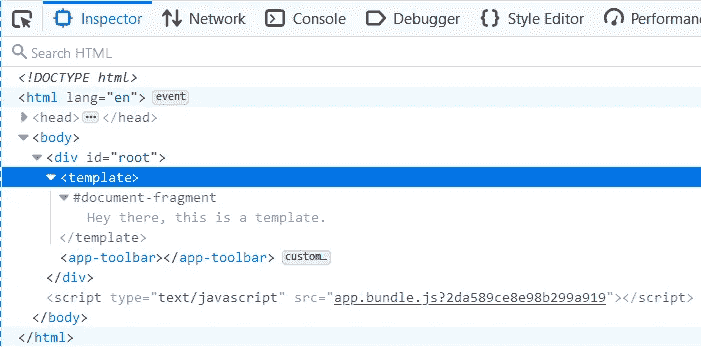
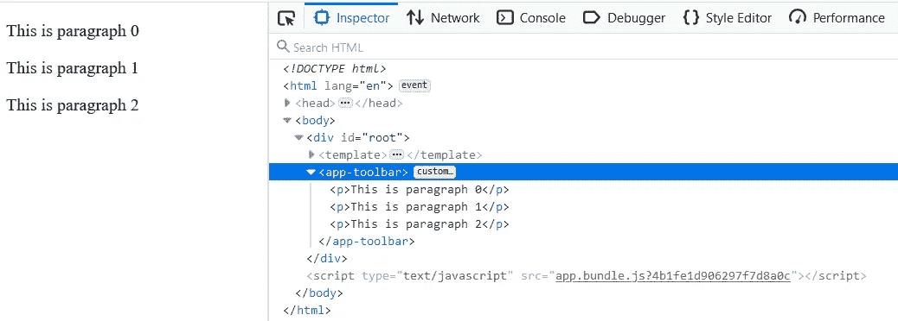
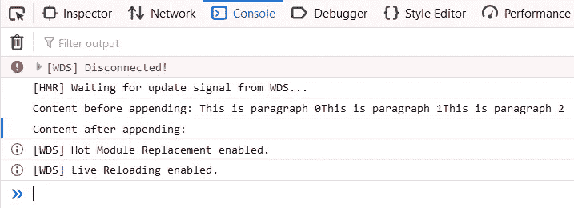
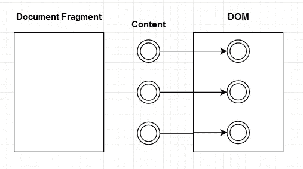
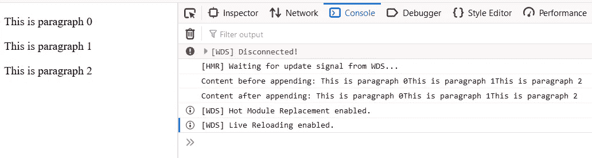
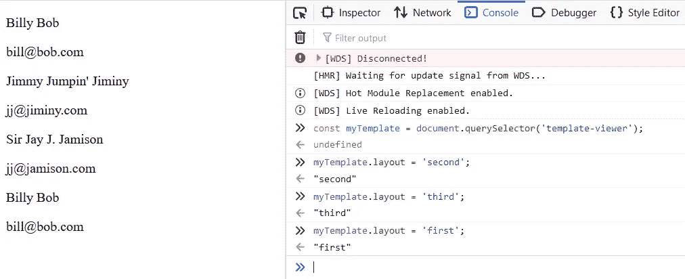
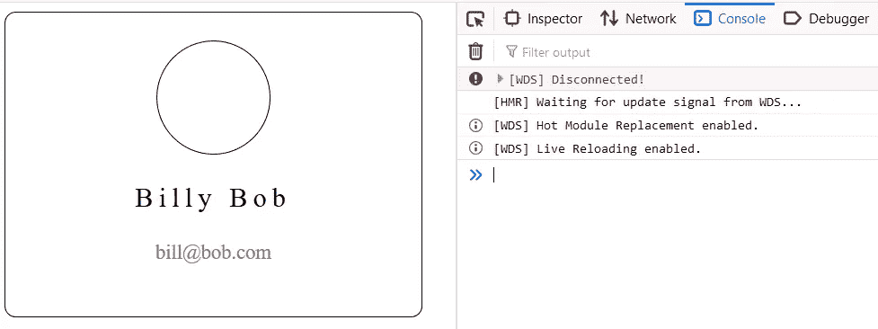
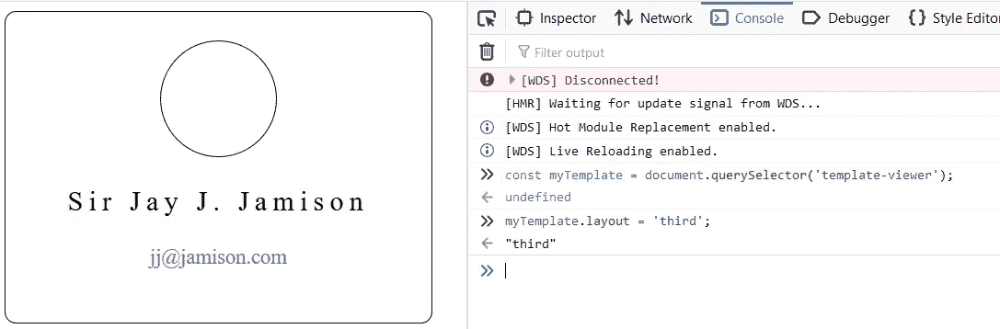
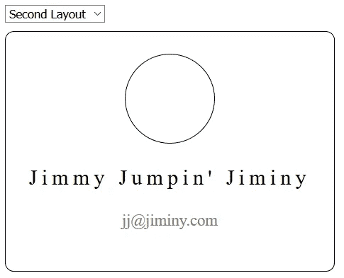

# Web 组件速成班(模板)

> 原文：<https://javascript.plainenglish.io/web-components-crash-course-b0a2feb11be1?source=collection_archive---------6----------------------->

## 第 2 部分:模板


Photo by [Ryoji Iwata](https://unsplash.com/@ryoji__iwata?utm_source=unsplash&utm_medium=referral&utm_content=creditCopyText) on [Unsplash](https://unsplash.com/s/photos/puzzle?utm_source=unsplash&utm_medium=referral&utm_content=creditCopyText)

# 介绍

[这个三部分系列的第 1 部分介绍了定制元素](https://medium.com/javascript-in-plain-english/web-components-crash-course-7c0df961a8b7?source=friends_link&sk=918d3ee449edf0c3c626c6dccf9a5867)。特别是，我们如何处理属性，以及如何/何时利用元素生命周期的不同阶段。

在本帖中，我们将关注**模板**，它们是如何工作的，如何最大限度地利用它们，一些陷阱以及我们使用模板的不同方式。最后，我们将使用自定义元素和模板知识创建一个迷你模板查看器应用程序。

**注意:** *你可以通过从* [***这里***](https://github.com/Haseeb90/web-components-crash-course) *克隆 Git 库来跟随本文中的代码示例。克隆存储库后，运行* `npm install` *来设置项目。一旦一切都设置好了，切换到起始模板分支*

`git checkout starting-templates`

# 预模板

在我们开始讨论什么是模板以及如何使用模板之前，让我们先来看看在第 1 部分中向 DOM 呈现元素的几种方法。

## createElement API

以编程方式创建 DOM 节点有许多不同的技术。其中之一就是使用`document.createElement` API 如下:

```
const root = document.getElementById('root');const container = document.createElement('div');
const heading = document.createElement('h1');
heading.innerHTML = 'I am a heading!';container.appendChild(heading);
root.appendChild(container);
```

正如你所猜测的，如果我们对所有的元素都这样做，特别是如果我们要创建大型的节点嵌套层次结构，那么这将会变得非常难看和难以维护。

## 串并置

另一种方法是用字符串表示 HTML，就像这样:

```
const root = document.getElementById('root');
root.innerHTML = '<div><h1>I am a heading!</h1></div>';// or...
root.innerHTML = 
  '<div>' +
    '<h1>' +
      'I am a heading!' +
    '</h1>' +
  '</div>';
```

这也会变得相当糟糕。第一种方法是将 HTML 放在一行中，这似乎对一些小的东西很好，但是如果我们想要的 HTML 有几行呢？很难读懂。第二种方法是连接，格式很好，但是必须添加`+`还是很烦人。最重要的是，如果我们在标记中犯了错误，我们的 IDE 将无法给我们帮助。

## 模板文字

在 ES6 中，我们介绍了模板字面语法。这由反勾(```)字符表示，而不是像我们一直使用的传统字符串那样用单引号(`‘`)或双引号(`“`)表示。模板文字允许我们在字符串中有新的行，也允许在字符串中插入变量。下面是一个例子，说明我们如何给 innerHTML 分配模板文本:

```
const headingText = 'I am a heading!';const root = document.getElementById('root');
root.innerHTML = `<div>
  <h1> ${headingText} </h1>
</div>`;
```

`${}`语法允许我们将值直接放在字符串中，而不必像处理常规字符串那样使用`+`。同样，这比普通的字符串好，甚至更好，但是这不允许我们使用 IDE 的能力来帮助我们写标记。

# 模板

想一想，到目前为止，我们一直用字符串或模板文字在 JavaScript 文件中添加标记，甚至用`createElement`在 DOM API 中添加标记。如果我们有一个设计师团队来编写我们的 HTML 会怎么样？我们会将该标记复制粘贴到我们的`.js`文件中，并修改它以得到我们想要显示的值吗？

处理这个问题的最好方法是分离关注点。我们的自定义元素类不应该担心 HTML 的结构，也不应该关心 CSS。我们应该将 HTML 标记放在一个`.html`文件中，将 CSS 放在一个`.css`文件中，将定制元素及其逻辑放在一个`.js`文件中。

## <template></template>

标签本身非常简单，因为它提供了一种保存不呈现在 DOM 中的 HTML 的方法。您可以将这个标签放在页面上的任何地方，这没有关系，因为我们可以使用 JavaScript 获取模板的内容，并将该内容放在另一个要呈现的元素中。

**注意:** *如果你克隆了 Git repo，通过* `git checkout starting-templates`切换到 starting-templates 分支

让我们从添加一个模板到我们的`index.html`文件开始

```
// index.html
...
<body>
  <div id="root">
    **<template>
      Hey there, this is a template.
    </template>**
    <app-toolbar></app-toolbar>
  </div>
</body>
...
```

完成更改后，运行`npm run serve`。当浏览器打开时，你什么也看不到。这是为什么呢？嗯，让我们看看开发者工具，看看 HTML 是什么样子的



The template tag consists of a document-fragment that has our content inside.

模板就在那里，如果我们展开它看看里面有什么，我们会看到一个`document-fragment`，在片段内部我们会看到我们的内容。

让我们更深入地了解一下`document-fragment`是什么以及它是如何工作的。

## 文件碎片

为了理解什么是文档片段以及它们是如何工作的，让我们来看一个例子。打开名为`toolbar.component.js`的文件，并在`AppToolbar`类中添加以下位

```
connectedCallback() {
  **const fragment = document.createDocumentFragment();** for (let i = 0; i < 3; i++) {
    const paragraph = document.createElement('p');
    paragraph.innerText = `This is paragraph ${i}`;
    **fragment.appendChild(paragraph);**
  }
  **this.appendChild(fragment);**
}
```

在上面的代码中，我们

*   创建了一个文档片段
*   向片段追加子元素
*   最后，将片段作为子元素添加到我们的自定义元素中

当您运行`npm run serve`时，您应该会看到类似如下的内容:



The contents of the document-fragment was added directly to our custom element without having to first create a containing element.

这里发生了什么？我们的文档片段的内容被直接添加到我们的自定义元素中，而不必先创建一个包含元素。

然而，使用模板和文档片段有一个“陷阱”。一旦将片段的内容添加到 DOM 中，片段本身就变成了空的，也就是说，它不再包含内容。如果我们在将片段添加到 DOM 之前和之后做一个控制台日志，我们可以看到:

```
connectedCallback() {
  const fragment = document.createDocumentFragment(); for (let i = 0; i < 3; i++) {
    const paragraph = document.createElement('p');
    paragraph.innerText = `This is paragraph ${i}`;
    fragment.appendChild(paragraph);
  } **console.log(`Content before appending: ${fragment.textContent}`);**
  this.appendChild(fragment);
  **console.log(`Content after appending: ${fragment.textContent}`);**
}
```



Content of the fragment is lost after being added to the DOM

在这个例子中，您可以看到，一旦文档片段被添加到 DOM 中，它就失去了它的内容。

这意味着我们可以使用模板和文档片段一次，而**只能使用一次！**



Document-Fragments lose their content once added to the DOM

任何后续尝试都将导致内容为空。这似乎有点没用，对吧？为什么你要大费周章才能用一次？你不会的。为了有效地使用模板和片段，您必须首先克隆内容。通常在其他例子中，您会看到内容是这样被克隆的:

```
connectedCallback() {
  const fragment = document.createDocumentFragment(); for (let i = 0; i < 3; i++) {
    const paragraph = document.createElement('p');
    paragraph.innerText = `This is paragraph ${i}`;
    fragment.appendChild(paragraph);
  }console.log(`Content before appending: ${fragment.textContent}`);
  **const clone = fragment.cloneNode(true);**
  this.appendChild(**clone**);
  console.log(`Content after appending: ${fragment.textContent}`);
}
```

我们不再将片段附加到自定义元素上，而是添加了它的一个克隆。如果您继续执行并做出了这一更改，您应该会在浏览器和控制台中看到如下内容:



The fragment retains its content and we’re able to display the clone on the DOM

因为我们克隆了片段并添加了克隆，所以片段保留了它的内容，我们也能够在屏幕上显示内容。

这就是模板可重用的原因。现在，每当我们需要使用模板时，我们只需首先克隆它的内容，然后将克隆的内容添加到 DOM 中。

**注意:** `cloneNode(true)` *当传入* `true` *时，意味着我们要对正在克隆的节点做一个* ***深度克隆*** *。这是常见的情况，因为我们希望确保克隆与我们拥有的模板完全相同。*

# 活生生的例子

**注意:** *如果您正在跟随，您可以通过运行* `git checkout templates-example` *切换到模板-示例分支，从起点开始，或者您可以跳转到* `templates-example-final` *分支来查看示例的完成版本。*

让我们用自定义元素和模板的知识来创建一些东西。我们要创建的非常简单，但它将涵盖我们到目前为止所学的内容。我们将有一个模板选项的选择下拉列表来查看，我们将呈现所选的选项。

我们将从向模板查看器定制元素添加一个属性开始。让我们称这个属性为布局，当这个属性改变时，我们想要克隆和渲染正确的布局。因此，打开`template-viewer.component.js`并添加以下位:

```
export default class TemplateViewer extends HTMLElement {

  static get observedAttributes() {
    return ['layout'];
  } get layout() {
    return this.getAttribute('layout');
  } set layout(value) {
    this.setAttribute('layout', value);
  } attributeChangedCallback(name, oldValue, newValue) {
    if (name === 'layout') {
      const template = document.getElementById(**newValue**);
      const clone = template.**content**.cloneNode(true);
      this.appendChild(clone);
    }
  }
}
```

很简单，没有什么我们以前没有涉及过的。在`attributeChangedCallback` 方法中，我们将通过 id 检索一个元素，并将`newValue`用作 id。然后我们获取模板的内容并克隆它，最后将克隆添加到我们的定制元素中。现在在你的`index.html`中添加以下内容:

```
<template-viewer **layout="first"**></template-viewer>
```

这样一来，让我们创建一些模板。

```
<template **id="first"**>
  <div class="container">
    <div class="circle">
      <!-- image place holder -->
    </div> <div class="name-container">
      <p class="name">Billy Bob</p>
      <p class="email">billy@bob.com</p>
    </div>
  </div>
</template><template **id="second"**>
  <div class="container">
    <div class="circle">
      <!-- image place holder -->
    </div> <div class="name-container">
      <p class="name">Jimmy Jumpin' Jiminy</p>
      <p class="email">jj@jiminy.com</p>
    </div>
  </div>
</template><template **id="third"**>
  <div class="container">
    <div class="circle">
      <!-- image place holder -->
    </div> <div class="name-container">
      <p class="name">Sir Jay J. Jamison</p>
      <p class="email">jj@jamison.com</p>
    </div>
  </div>
</template>
```

我已经给每个模板分配了 id。这样，当我们选择一个新的模板来查看时，我们可以通过 id 来获取模板。看到没，开始说得通了:)。

如果我们现在看一下我们的浏览器，从控制台改变属性，我们可以看到它像预期的那样工作。



Every time we change the attribute the correct template gets added to the DOM.

每当我们改变自定义元素的`layout`属性时，正确的模板就会被添加到 DOM 中。

但是我们不想追加一个新的，我们只想替换它。所以让我们现在就做出改变。在自定义元素类中进行以下更改。

```
attributeChangedCallback(name, oldValue, newValue) {
    if (name === 'layout') {
      **this.innerHTML = '';**
      const template = document.getElementById(newValue);
      const clone = template.content.cloneNode(true);
      this.appendChild(clone);
    }
  }
```

这样做的目的是，每当`layout`属性改变时，我们清除自定义元素的`innerHTML`，然后追加正确的模板。这样，我们只显示一个模板。现在，如果我们再次尝试，它会像我们期望的那样工作。


Changing the attribute clears out the innerHTML of the element and then appends the correct template that we want to view.

太好了！让我们添加一些样式，而我们在这一点上。在根文件夹中创建一个名为`styles.css`的新文件，并添加以下内容。

```
.container {
  width: 350px;
  height: 250px;
  border: solid 1px black;
  border-radius: 10px;
  padding: 10px;
  text-align: center;
}.circle {
  width: 100px;
  height: 100px;
  border: solid 1px black;
  border-radius: 100px;
  margin: 15px auto;
}.name {
  font-size: 24px;
  letter-spacing: 5px;
}.email {
  font-size: 18px;
  color: gray;
}
```

因为我们已经将 webpack 设置为将 css 文件作为模块导入，所以我们可以在我们的`app.js`文件*(或任何 js 文件)*中执行以下操作，webpack 会自动将样式表添加到我们的`index.html`文件中

```
// app.jsimport TemplateViewer from './template-viewer/template-viewer.component';**import styles from '../styles.css';**if (!customElements.get('template-viewer')) {
  customElements.define('template-viewer', TemplateViewer);
}
```

保存项目并查看您的浏览器。



With the styles added we can now see the templates.

添加了样式后，我们可以看到模板了。嗯，我们以前也可以看到它，但现在它只是看起来很漂亮。让我们通过控制台再次尝试更改`layout`属性，看看一切看起来如何。



Changing the layout attribute loads the correct template with the styles applied.

改变`layout`属性加载正确的模板并应用样式。这太棒了！我们能够按需加载模板，并用样式呈现它们。现在样式是全局应用的，这意味着如果我们想让其他组件拥有。容器类看起来应该是一样的。在本系列的下一部分中，当我们讨论 Shadow DOM 时，我们将对此进行更深入的探讨。但是，现在，这很好。

让我们添加一个下拉菜单，这样我们就不必通过控制台手动更改`layout`属性。将以下内容添加到您的`index.html`中。

```
...
<div id="root">
  **<select id="template-selector" style="margin-bottom: 10px;">
    <option value="first">First Layout</option>
    <option value="second">Second Layout</option>
    <option value="third">Third Layout</option>
  </select>**
  <template-viewer layout="first"></template-viewer>
...
```

有了这些，我们可以在`template-selector`上添加一个*事件监听器*来监听变更事件。当 change 事件被触发时，我们希望将自定义元素上的`layout`属性的值更改为从`template-selector`中选择的值。将以下内容添加到`app.js`

```
...
const templateSelector = document.getElementById('template-selector');
const templateViewer = document.querySelector('template-viewer');templateSelector.**addEventListener**('change', (event) => {
  const valueSelected = **event.target.value**;
  **templateViewer.layout = valueSelected;**
});
```

在这方面，我们正在做以下事情

*   通过 id 获取选择元素
*   *获取我们的自定义元素*
*   *向 select 元素添加一个*事件监听器*，并监听“*变更*事件*
*   *当事件被触发时，我们捕获它并获得目标元素的*值属性**
*   *将自定义元素的*布局属性*设置为触发事件的元素的值。*

*保存更改并在浏览器中查看签出。当您选择想要查看的模板时，它会被加载。*

**

*Selecting a layout from the dropdown should change the template you’re viewing.*

# *结论*

*在这篇文章中，我们讨论了*

*   *创建不可伸缩模板的方法，即字符串连接和 createElement API*
*   *关注点分离，将 html、css 和 js 放在不同的文件中。*
*   *模板标签以及如何使用它*
*   *关于文档片段及其工作方式的详细信息。同时要记住，文档片段在被添加到 DOM 后会丢失其内容，除非被克隆。*
*   *一个活生生的例子展示了我们对定制元素和使用模板的综合知识。*

*在这个系列的下一篇也是最后一篇文章中，我将讨论阴影 DOM。*

*如果你喜欢这篇文章，请分享给你的朋友，并期待下一篇！*

*直到下一次，和平！*