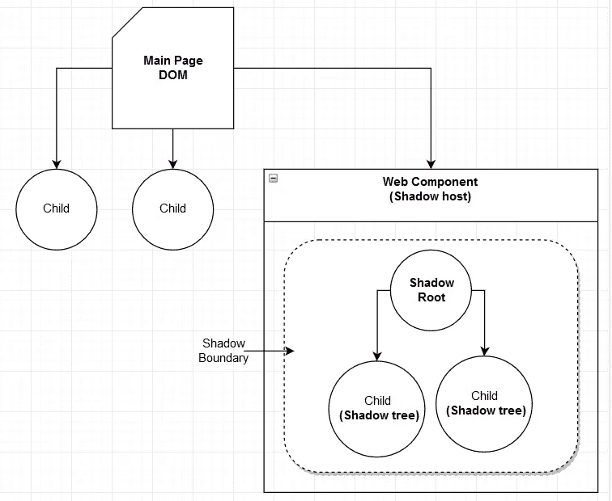
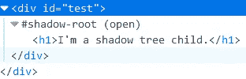
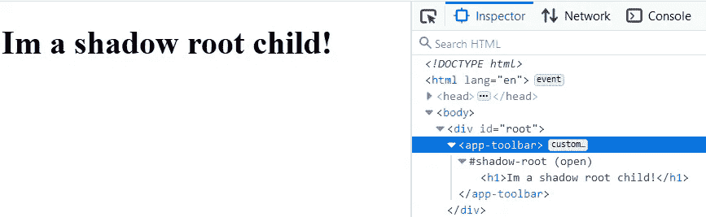
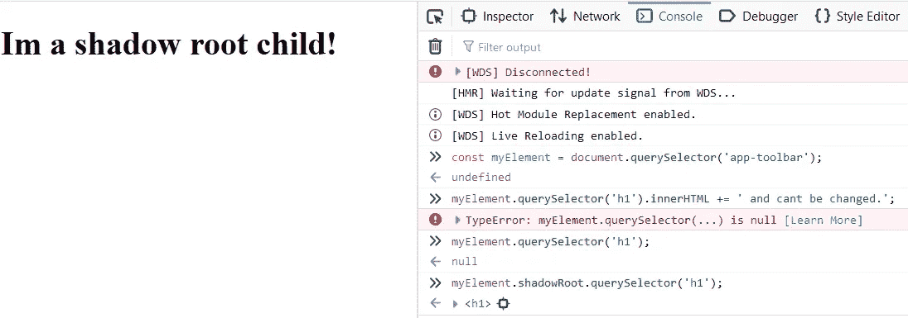
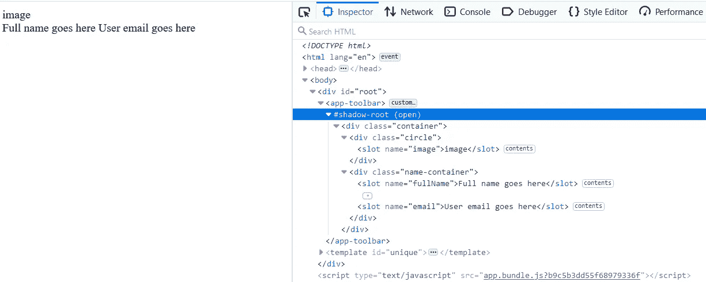
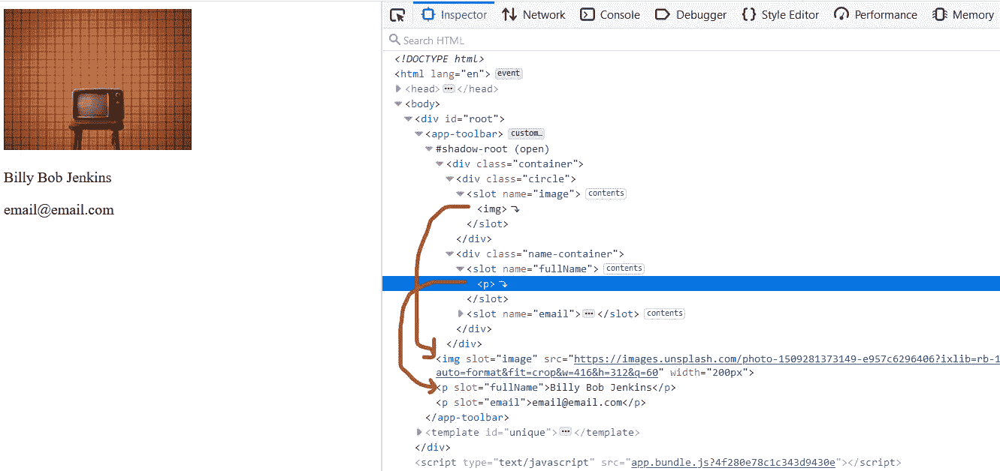
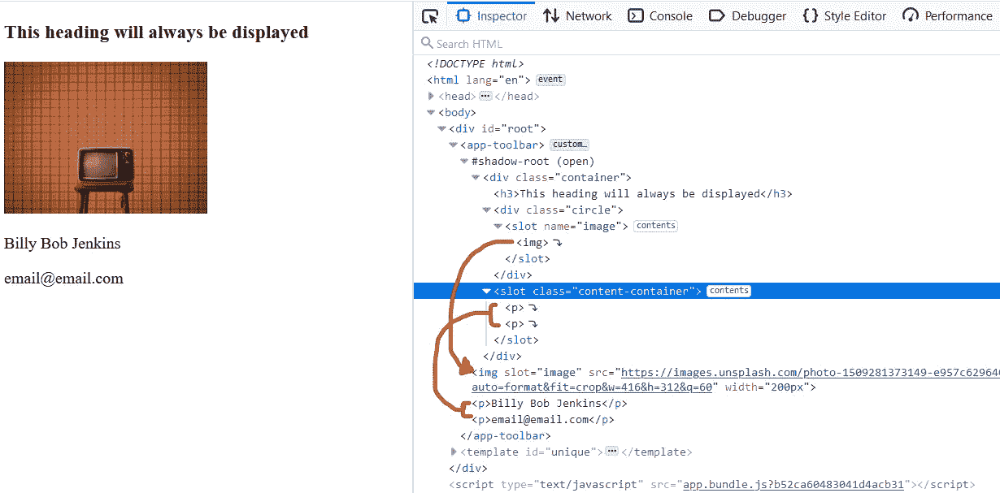
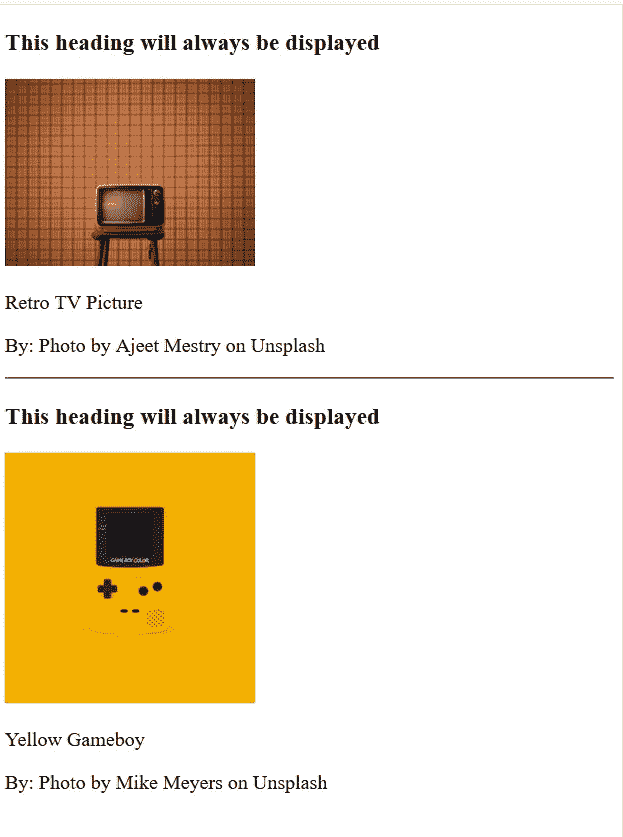

# Web 组件速成班(影子 DOM)

> 原文：<https://javascript.plainenglish.io/web-components-crash-course-shadow-dom-803183fcfabc?source=collection_archive---------4----------------------->

## 第 3 部分:阴影 DOM


Photo by [Ryoji Iwata](https://unsplash.com/@ryoji__iwata?utm_source=unsplash&utm_medium=referral&utm_content=creditCopyText) on [Unsplash](https://unsplash.com/s/photos/puzzle?utm_source=unsplash&utm_medium=referral&utm_content=creditCopyText)

这是 Web 组件系列的第三部分，也是最后一部分。您可以通过以下链接找到第一部分和第二部分:

*   [第 1 部分:定制元素](https://medium.com/javascript-in-plain-english/web-components-crash-course-7c0df961a8b7)
*   [第二部分:模板](https://medium.com/javascript-in-plain-english/web-components-crash-course-b0a2feb11be1)

**注意:** *你可以通过从* [***这里***](https://github.com/Haseeb90/web-components-crash-course) *克隆 Git 库来跟随本文中的代码示例。克隆存储库后，运行* `npm install` *来设置项目。这个 repo 也包含前面部分的代码。*

# 介绍

影子 DOM 是 Web 组件的三个规范之一，它负责封装。它从页面的其余部分封装了 CSS 和 DOM。有了它，您就可以创建完全隔离的 web 组件，而不会干扰它们所添加到的页面的 CSS 或 DOM，因此您可以设计它们的样式，并使它们的外观和行为完全符合您的需要，而无需考虑或破坏页面上的其他组件。

# 术语

在我们深入研究 Shadow DOM 及其工作原理之前，让我们先来了解一些讨论时会听到的基本术语

*   **影子根:**包含单独 DOM 的文档片段
*   **影子树:**影子根里面的 DOM
*   **影子主机:**影子根/树的父节点。因为我们是从 Web 组件的角度来讨论这个问题的，所以这将是您创建的自定义元素。但是，它也可以是除自定义元素之外的任何其他元素。
*   **Shadow boundary:** 将它视为自定义元素内部的边界，但在 shadow root 之外。如果我们想从自定义元素的影子树中访问任何东西，我们必须跨越这个边界。

这是它的草图:



Diagram of the Shadow DOM and its components

# 影子王国

在我们看实现之前，我想澄清一件事，那就是，影子 DOM 并不严格绑定到 web 组件。您可以在您有权访问的任何元素上创建一个影子 DOM。这里有一个例子，假设你有一个带`id=”test”`的`div`，你也可以在这个 div 中创建一个阴影 DOM。这是你如何做的语法。

```
// .html file
<div id="test"></div>// Get the shadow host
const **shadowHost** = document.getElementById('test');// attach shadow and get a reference to it
const **shadowRoot** = shadowHost.attachShadow(**{mode: 'open'}**);// create a regular element
const **shadowTreeEl** = document.createElement('h1');
shadowTreeEl.innerText = 'I\'m a shadow tree child';// attach the element to the shadow root
**shadowRoot.appendChild**(shadowTreeEl);
```

为了更好地理解这段代码，请花点时间回过头来阅读上一节中的术语，并查看图表。现在，如果我们看一下创建的 DOM，我们会看到类似这样的内容:



Inspection of the DOM shows the Shadow Root

让我们一步一步地看代码，但是请记住，我们仍然在讨论 Shadow DOM 规范，并且还没有在我们的自定义元素中实现它。

*   首先，我们得到一个元素的引用，我们希望它成为我们的影子根的宿主。
*   然后，我们使用参数`{mode: 'open'}` 将影子根连接到我们的主机。我们将在这篇文章的后面更详细地讨论这个问题，但是现在，只需要知道它是一个必需的参数，并且`mode`的值可以是`'open'`或者`'closed'`。
*   我们使用`createElement` API 创建一个元素，并将它附加到我们的影子根。请注意，这很可能是我们正在添加到影子根的模板的内容。

## 好吧，但什么是真正的？

如果你还记得第 2 部分的[，在那里我们讨论了模板](https://medium.com/javascript-in-plain-english/web-components-crash-course-b0a2feb11be1)，我们讨论了任何模板的基础都是一个`document-fragment`，它是一个完全独立的 DOM。嗯，影子根也是一个文档片段，这意味着影子根也是一个单独的 DOM。它与页面的其余部分不是同一个 DOM。从所有这些中得到的重要收获是，您在文档片段中处理一个新的 DOM。但是，与我们用模板讨论的文档片段不同，这个片段被呈现到 DOM 中。

## 使用带有自定义元素的阴影 DOM

说了这么多，做了这么多，让我们看看如何将它添加到我们的自定义元素中。

```
export default class AppToolbar extends HTMLElement {
  constructor() {
    super();
    **this.attachShadow({ mode: 'open' });**
  }
}
```

仅此而已！很简单，对吧？如果您还记得[第 1 部分，其中我们讨论了定制元素，](https://medium.com/javascript-in-plain-english/web-components-crash-course-7c0df961a8b7)所指的是元素本身，因此我们不必像在前面的例子中那样单独获取对影子主机的引用。突出显示的代码做了几件事:

*   它在您的定制元素中创建一个*影子根*，使您的定制元素成为*影子宿主*
*   它还会在您的类中自动创建一个名为`**this.shadowRoot**`的新属性

一旦创建完毕，我们可以使用`this.shadowRoot`来访问我们的元素属性，就像`innerHTML`一样

```
export default class AppToolbar extends HTMLElement {
  constructor() {
    super();
    this.attachShadow({ mode: 'open' });
  }

  **connectedCallback() {
    this.shadowRoot.innerHTML = `
      <h1>
        Im a shadow root child!
      </h1>
    `;
  }**
}
```

让我们检查一下 DOM，看看我们得到了什么:



With this change we’ve encapsulated our DOM and made it independent.

通过这一更改，我们现在已经封装了自定义元素的 DOM，并使其独立。现在，如果我们尝试查询我们的`h1`标签，我们会得到一个错误。大概是这样的:



Access to the shadow tree directly is denied. We have to access the shadow tree elements through the shadow root

不允许直接访问影像树元素。为了访问影子树元素，我们必须通过影子根。**影根的内部元素和风格就是这样封装的，不受外界影响。**

## 关闭模式({ mode: 'closed' })

我不打算详细说明这一点，主要是因为你不应该也不会使用它。如果你对为什么不应该感到好奇，我认为谷歌在解释为什么不应该使用封闭模式方面做得更好。以下是他们在这个链接中给出的总结:

*   人为的安全感。
*   封闭模式**阻止你的定制元素代码访问它自己的影子 DOM** 。
*   **对于最终用户来说，封闭模式降低了组件的灵活性**。

如果你浏览了那个链接，现在应该很清楚了，封闭模式在大多数情况下是不值得麻烦的。

# 阴影 DOM 和<slot>标签</slot>

**注意:***`<slot>`*标签只对* ***阴影 DOM*** *有效。**

*`<slot>`标签在某种意义上类似于`<template>`标签，它不会被呈现到 DOM 中。它允许我们有一个放置内容的占位符，所以我们不是从它那里复制内容，而是自动将内容放入其中。他们是替换里面内容的目标。*

***注意:** *如果您正在跟踪并克隆了回购，请切换到分支* `**shadow-dom-slots**` *来看看这是如何工作的。不要忘记运行* `**npm run serve**` *在你的浏览器中查看作品。**

## *具有名称属性的插槽*

*属性是我们如何引用任何给定的槽。假设您有一个模板，您想在其中放置插槽，它看起来是这样的:*

```
*<template id="unique">
  <div class="container">
    <div class="circle">
      **<slot name="image">image</slot>**
    </div>
    <div class="name-container">
      **<slot name="fullName">Full name goes here</slot>
      <slot name="email">User email goes here</slot>**
    </div>
  </div>
</template>*
```

*那么，我们如何将内容插入到`**<slot>**`标签中呢？由于插槽只适用于影子 DOM，我们首先必须创建影子根。如果你跟着做，这些变化可以在`**toolbar.component.js**`中找到。*

```
*export default class AppToolbar extends HTMLElement {

  constructor() {
    super();
    **this.attachShadow({ mode: 'open' });**
  } connectedCallback() {
    const template = document.getElementById('unique');
    const templateClone = template.content.cloneNode(true);
    **this.shadowRoot.appendChild(templateClone);**
  }
}*
```

*在上面的代码中，*

*   *我们将一个阴影根附加到我们的自定义元素上。请记住，当我们以这种方式附加阴影 DOM 时，它会自动在我们的自定义元素上创建一个名为`**shadowRoot**`的新属性*
*   *我们正在获取模板的内容并克隆它*
*   *然后使用自动创建的属性`**this.shadowRoot**`将该模板附加到我们的影子根*

*让我们看看不做任何其他事情会是什么样子。*

**

*Without defining the content that goes into the slots, the default content is rendered.*

*在没有定义进入插槽的内容的情况下，呈现默认内容。但是还记得我之前提到的吗？插槽允许我们在它们的位置插入内容，我们可以通过它的`**name**`属性引用任何给定的插槽。只需在自定义元素标记中添加标记就可以做到这一点。为此，打开`**index.html**`并执行以下操作。*

```
*...
**<app-toolbar>**
  
  </img> <p **slot="fullName"**>Billy Bob Jenkins</p>
  <p **slot="email"**>email@email.com</p>
**</app-toolbar>**
...*
```

*在我们的自定义元素标签中，我们添加了标记，并告诉每个元素应该呈现在哪个槽中。让我们看看它现在是什么样子*

**

*The contents of the slot get replaced with the tags we defined.*

*槽 get *的内容被我们定义的标签*替换，即*标签被插入到槽*中。我们通过将*插槽属性*添加到每个标签并将值设置为我们之前定义的*插槽名称*来告知应该在哪里呈现哪个标签。*

## *没有名称的插槽*

*具有名称属性的槽*是您想要呈现特定内容的特定位置，没有名称属性*的槽*充当一个总括位置。**

*假设您有一个模板，您想在其中一致地显示某些内容，而其余的内容是在某个动作时动态加载的。有许多方法可以做到这一点，但一种方法是使用插槽*(没有名称标签)*。让我们通过修改前面的例子来更深入地了解这一点*

```
*<template id="unique">
  <div class="container">
    **<h3>This heading will always be displayed</h3>**
    <div class="circle">
      **<slot name="image">image</slot>**
    </div>
    **<slot class="content-container"></slot>**
  </div>
</template>*
```

*在这里，我们使用两种类型的插槽来演示两者可以协同工作。第一个标签为`**name="image"**`的槽我们已经讲过了。然而，第二个 slot 标记没有 name 属性，所以它将作为我们在自定义元素标记中放置的所有内容的集合。`**h3**`是为了证明槽外的内容不会改变。*

*让我们对我们的自定义元素进行更改，然后看看更改是什么样子的:*

```
*...
<app-toolbar>
  
  </img> **<p>Billy Bob Jenkins</p>
  <p>email@email.com</p>**
</app-toolbar>
...*
```

*随着插槽属性*从两个`**p**`标签中移除*，它们现在将在没有名称属性的插槽中呈现。*

**

*The image still is rendered in the correct slot and the remainder of the content is rendered in the second slot.*

*这很棒，因为现在我们可以呈现自定义元素的多个版本，每个版本中包含不同的内容！*

```
*...
<app-toolbar>
  
  </img> **<p>Retro TV Picture</p>
  <p>By: Photo by** [**Ajeet Mestry**](https://unsplash.com/@ajeetmestry?utm_source=unsplash&utm_medium=referral&utm_content=creditCopyText) **on** [**Unsplash**](https://unsplash.com/wallpapers/design/retro?utm_source=unsplash&utm_medium=referral&utm_content=creditCopyText)**</p>**
</app-toolbar><hr><app-toolbar>
  
  </img> **<p>Yellow Gameboy</p>
  <p>By: Photo by** [**Mike Meyers**](https://unsplash.com/@mike_meyers?utm_source=unsplash&utm_medium=referral&utm_content=creditCopyText) **on** [**Unsplash**](https://unsplash.com/wallpapers/design/retro?utm_source=unsplash&utm_medium=referral&utm_content=creditCopyText)**</p>**
</app-toolbar>
...*
```

*这是它的样子。*

**

*Using just one template with slots we can render dynamic content*

# *结论*

*在这篇文章中，我们讨论了*

*   *影子 DOM 使用的术语*
*   *如何将阴影根附加到任何元素以及自定义元素*
*   *影子 DOM 保护它的内部 DOM 不被意外访问*
*   *阴影 DOM 的打开和关闭模式*
*   *插槽标签及其工作原理*

*嗯，就这些。如果您完成了这三个部分，那么您应该对用于制作 web 组件的三种技术有很好的理解。你应该对你所获得的知识有足够的信心去开始创建 web 组件。*

*如果你喜欢这个系列，请随意在社交媒体上与你的同伴分享，也可以随意提出任何问题。*

*干杯！*