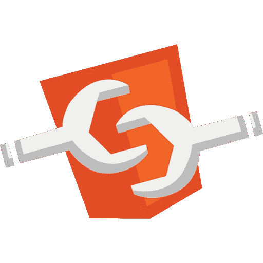
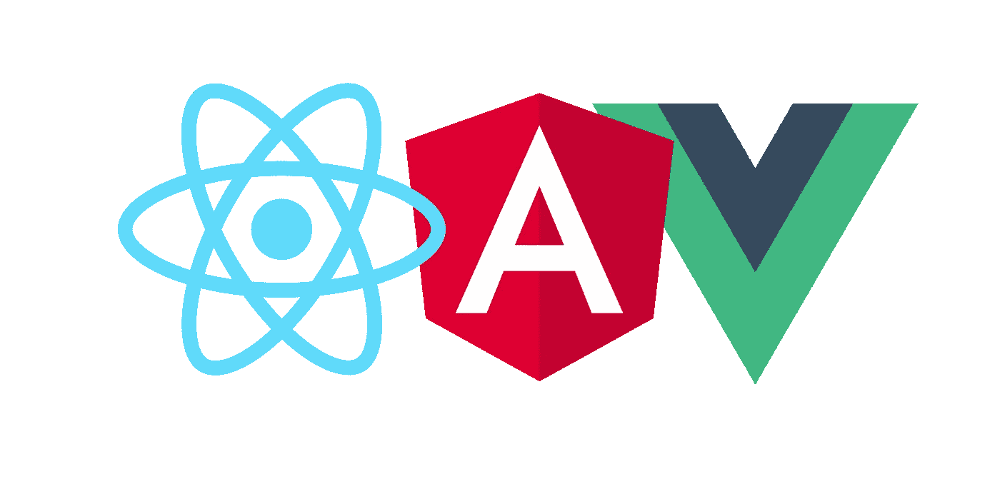
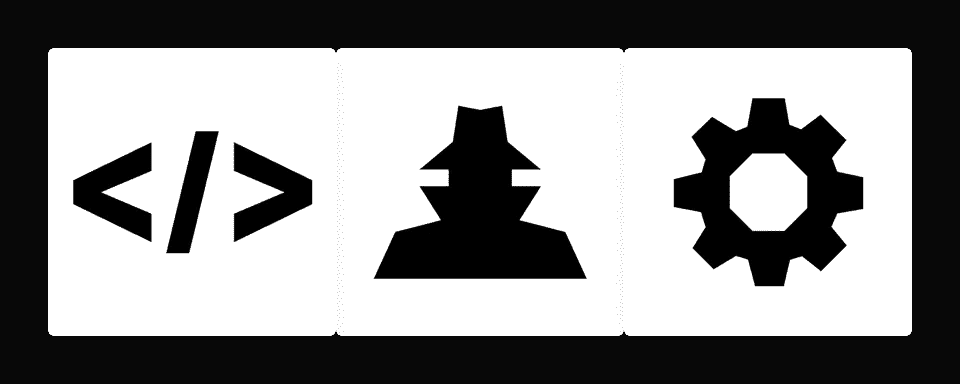
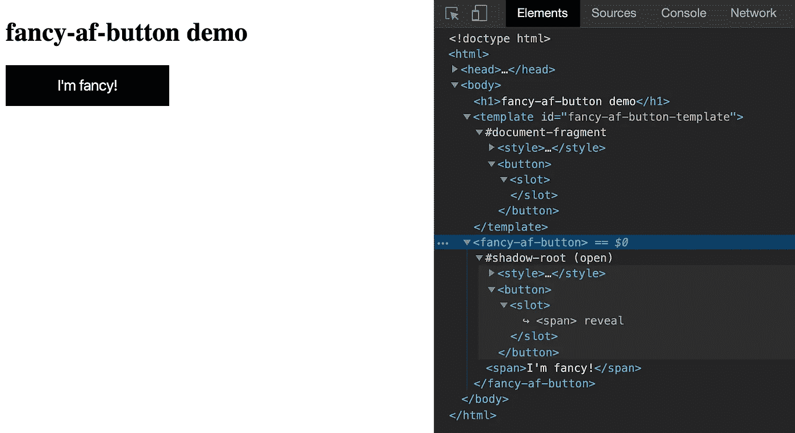
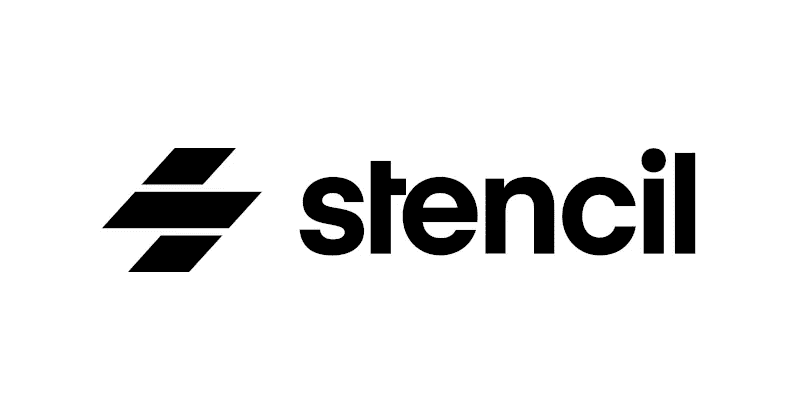
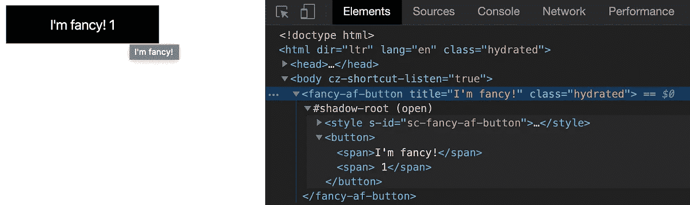

# Web 组件和模板 JS 介绍(带代码示例)

> 原文：<https://javascript.plainenglish.io/web-components-introduction-and-in-practice-596d46463e19?source=collection_archive---------2----------------------->

# 现代网络开发

现代 web 应用程序开发主要由这些流行技术主导: *React、Angular 或 Vue。*

与当时普通方法或技术相比，它们给 web 应用程序开发带来了很多优势；虚拟 DOM、反应式数据绑定、JSX 等特性。成了必备品。

它们的一个共同点是它们都是基于组件的，也就是说，它们允许我们将 UI 作为组件来创建。这种基于组件的应用程序开发为我们提供了:

*   封装，即关注点的分离，支持抽象
*   HTML-地狱管理
*   可组合和可重用的模块化架构

除了所有这些优势之外，我们仍然发现有些情况难以用前面提到的技术解决，例如:

## 如果

*   需要创建各种框架消费的组件？
*   将代码从一个框架迁移到另一个框架？
*   需要组件级样式封装吗？

为了有效应对以上场景，引入**的 *Web 组件。***

# Web 组件:简介

> W3C 标准，用于创建与框架无关的本地组件，具有真正风格的封装

Web 组件(WC)由以下 3 个主要 API 组成:

## 自定义元素

创建新的 HTML 标签或扩展现有的 HTML/自定义标签

## 阴影 dom

启用组件级封装，即限定范围的 HTML 和样式

## HTML 模板

允许编写不呈现的 HTML 片段(用于组成自定义元素)

正如他们所说，代码胜过千言万语，让我们使用 web 组件 api 创建一个简单的按钮。

WC button demo: template and custom-element usage code snippet

WC button demo: custom-element definition and shadow-dom code snippet

上面的代码由 chrome 渲染如下:

WC button demo: Chrome render

> Shadow-root，即 shadow DOM 子树的根节点，完全封装了下面的样式，不允许它流向全局空间，反之亦然。

> **浏览器支持**
> 最新版本的 *Chrome、Safari、Firefox* 支持以上所有 API。边缘的支撑正在到来(当边缘移动到*铬*)。对于互联网浏览器，将不得不使用多边形填充。

现在有了稳定的 web 组件 api ( *v1* )和广泛的浏览器支持 *Web 组件*提供了一个创建 UI 组件的机会。

尽管如此，本地 *web 组件*开发可能不会在我们的开发伙伴或团队经理中流行，因为存在以下挑战:

## 如果

*   需要反应式数据绑定吗？
*   需要现代网络开发功能，如 JSX，虚拟 Dom，预渲染支持等。？
*   想要我们的组件类型安全吗？
*   想减少使用 *vanilla-js* 的样板？

为应对上述情况，引入**模板 JS *。***

# 模板 JS:简介

> *Stencil 是一个生成 Web 组件的编译器，由 Ionic Framework 团队开发*

模板具有以下特性

*   虚拟 DOM
*   异步渲染(受 React Fiber 启发)
*   反应式数据绑定
*   以打字打的文件
*   JSX

然后生成内置了这些特性的基于标准的 Web 组件。(*直接引用 stenciljs.com 文件*)

同样，由于代码比 1000 字更有价值，让我们创建与*模板组件*相同的按钮 web 组件(另外添加了一个点击计数，显示在按钮标题旁边，以演示反应数据绑定)。

Stencil button component demo

Stencil button component demo: Chrome render

该模具组件。 *tsx* 文件被编译为本地 web 组件，如下所示:

Stencil button component demo: Stencil compiled WC

由于这是一个本地 web 组件，它可以用于任何框架或库。

还有其他一些值得研究的库，它们也提供了编写 web 组件的不同方法。像下面这样:

*   [元素](https://lit-element.polymer-project.org/)
*   [滑板](https://skatejs.netlify.com/)

# 其他资源:

*   [https://developer.mozilla.org/en-US/docs/Web/Web_Components](https://developer.mozilla.org/en-US/docs/Web/Web_Components)
*   [https://stenciljs.com/docs/introduction](https://stenciljs.com/docs/introduction)
*   [https://slides . com/vaibhav-Kumar/we B- components-web hack-2019-12-17](https://slides.com/vaibhav-kumar/web-components-webhack-2019-12-17/)
*   [https://github.com/mdn/web-components-examples](https://github.com/mdn/web-components-examples)
*   [https://www.webcomponents.org/](https://www.webcomponents.org/)
*   [https://developers . Google . com/web/fundamentals/we B- components](https://developers.google.com/web/fundamentals/web-components)
*   [https://lit-element.polymer-project.org/](https://lit-element.polymer-project.org/)
*   [https://skatejs.netlify.com/](https://skatejs.netlify.com/)