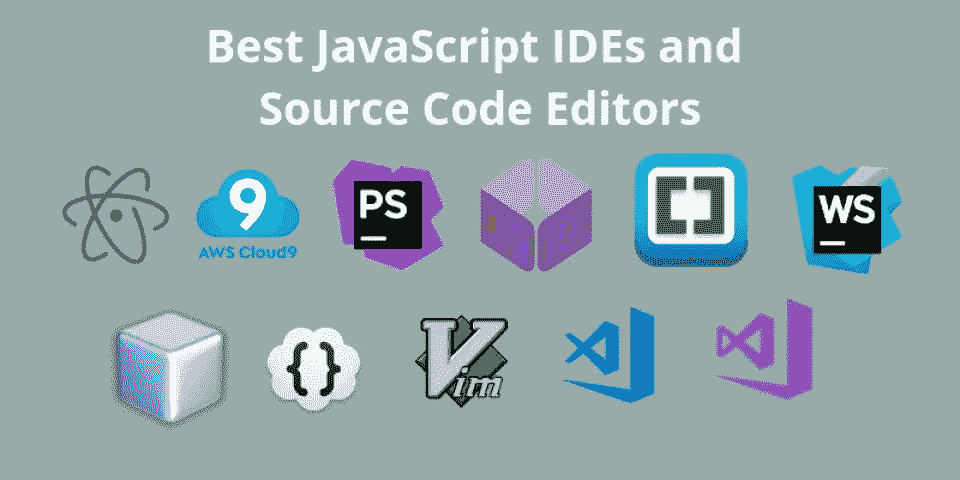

# 2020 年与 2010 年的网络发展

> 原文：<https://javascript.plainenglish.io/web-development-2020-vs-2010-c40c8d98d57f?source=collection_archive---------3----------------------->

与十年前相比，web 开发的变化非常快，事实完全令人震惊。我的意思是，一个网络开发者现在制作移动应用、桌面应用、后端 API、游戏等等。十年前，当我们谈论成为一名 web 开发人员时，我们通常指的是编写 HTML、JavaScript 和 CSS 代码并制作酷网站的人。虽然你有 C#或 Java spring，但事实上的模式是 JavaScript 和 PHP。你知道吗，就连脸书也是用 PHP 和 JavaScript 编写的！老马克是一名 PHP 开发人员。

web developer a decade ago

# 十年前的网络开发

感谢如果你是一个新的开发者，因为相信我！十年前，你可能会讨厌 web 开发！首先，现在如果你是网络开发人员，对 JavaScript 有很好的了解，你不仅可以制作简单的前端网站，还可以从后端 API 到移动应用，你可以用 JavaScript 做很多事情。

然而，就在十年前，你还没有 React、Angular 或 Node 以及 npm 包来帮助你。这是 LAMP Stack 的时代，PHP 和 JavaScript 是王者，当时 JavaScript 并不太好，而且很慢。现代的 ES6+充满了如此多的酷技术，并且高度优化，为您提供如此多的支持。对于前端，我们过去有 JQuery 库(尽管我们有 ES6+很酷的特性，但仍有许多人使用它&我相信它是不需要的)，对于服务器端，PHP 是领先的。

## 2010 年客户端 JS 框架的到来

2010 年是这么多很酷的框架进入 web 开发领域的一年。十年前占主导地位的现代 JavaScript 客户端框架和库的祖先如下:

*   KnockoutJS(发布日期:2010 年 7 月 5 日)
*   AngularJS(发布日期:2010 年 10 月 20 日)
*   BackboneJS(发布日期:2010 年 10 月 13 日)
*   下划线(发布日期:2009 年 10 月 28 日)
*   JQuery(发布日期:2006 年 8 月 26 日)

React、Angular 和 Vue 将在 2020 年主导市场，但 10 年前并非如此。Knockout、AngularJS 和 backbone 是后起之秀，是开发者的最爱。

MEAN / MERN 堆栈是 2020 年的主导堆栈，但十年前，LAMP 堆栈("**L "**Linux—"**A "**Apache—"**M**" MySQL—"**P**" PHP)席卷了整个社区。这就是我们的老朋友马克·扎克伯格第一次从宿舍把脸书建回来的方法。

然而，在 2010 年底，随着客户端框架的推出，事情开始发生变化，AngularJS 领导着所有的框架，因为它是由 Google 提供支持的，并且是我的第一个框架爱好者。

## Node.js 的诞生——JS 的游戏规则改变者🔥

我认为这是 JavaScript 历史上最重要的一天，谷歌的一些人采用了 chrome V8 引擎并独立运行，从而诞生了最强大的 JavaScript 引擎——NodeJS。

因为 Node.js，我们可以做很多事情，从开发移动应用程序到桌面应用程序，再到游戏开发。没有 Node.js，Web Development 2020 就不可能实现，因为它不仅仅限于构建健壮的 API，还具有做更多事情的能力。

Node.js 不同于传统的可用选项，因为它是一个单线程，对于 I/O 密集型应用程序来说非常强大。Node.js 在性能、速度、安全性和可靠性方面处于领先地位。

节点包模块允许开发人员将他们的库或函数作为一个模块发布，任何 Node.js 开发人员都可以使用，因此出现了模块开发平台——NPM——节点包模块。

NPM 有超过 100 万个软件包可供开发者轻松使用和开发应用。Node.js 被许多顶级公司使用，初创公司或新公司都在使用 Node.js 构建他们的服务器端解决方案。

# 跨平台开发比较

Cross-Platform development Comparison

有 React native 或 Flutter 的酷孩子需要学习传说是如何做到的。事实上，2010 年是诺基亚塞班手机年，大部分应用程序都是基于 Java 塞班操作系统的。Android 是市场上的新产品，而苹果的 iPhone 只面向当时的富人。

## 历史课——回到 2010 年的手机操作系统

History of mobile phones

一点历史课！首先是手机，然后是智能手机，接着是 iPhones，之后安卓操作系统改变了智能手机的含义。让我带你回到 2010 年，看看移动市场是什么感觉。

我曾经拥有诺基亚 N95，这是当时领先的手机，人们对 N95 的摄像头非常着迷。回到我们的主题，Android 和 iOS 在当时还是婴儿，而 Symbian 是当时领先的操作系统。

然而，2010 年被认为是 Symbian 移动操作系统的衰落之年，2010 年后，Android 成为领先的智能手机操作系统

*   Symbian 操作系统——发布日期:1998 年——2010 年市场份额= **33.51%**
*   *安卓* —发布日期:2008 年 9 月 23 日—2010 年用户= **27.51%**
*   *iOS* —发布日期:1998 年—2010 年用户= **15.89%**
*   黑莓操作系统——发布日期:1999 年——2010 年用户= **14.69%**
*   Windows Mobile —发布日期:2000 年—2010 年用户数= **3.01%**
*   Bada OS —发布日期:2010 年 8 月 19 日—2010 年用户= **1.29%**
*   palm OS——发布日期:1993 年——2010 年用户= **0.40%**

因此，从上面的统计数据中，你可以看到在 2010 年跨平台开发的市场实际上还非常年轻，尽管到 2011 年初，Android 操作系统通过击败 Symbian 操作系统成为移动领域的领先操作系统。

因此，Android 和 iOS 是年轻的操作系统，当时没有跨平台的解决方案。虽然后来，Cordova 在 2011 年推出，然后是 C#社区的 Xamarin。

Sencha: HTML5 Mobile Framework 是第一个通过 web 视图提供跨平台功能的框架，更像 Ionic Framework。

# 代码编辑器

现在，超过 80%的 web 开发是通过 Visual Studio 代码、Atom 和 Sublime Text 完成的，但在 2010 年并非如此。但是，我们有一些选项仍然被像 NotePad++这样的人使用，我强烈建议不要使用，因为它已经非常过时了，会让你回到现代代码编辑器所能提供的水平。

让我惊讶的是，崇高文本的第一版在那个时候已经可以使用了。看看 2010 年之前可供开发者使用的编辑器

*   崇高文本 1(发布日期:2008 年)
*   Visual Studio 2010
*   Adobe Dreamweaver(所见即所得编辑器)
*   记事本++(发布日期:2003 年 11 月 25 日)

如果没有现代的编辑器，开发简单的网站一定很难。Sublime Text 3 在 2014 年确实很好，但 VSCode 改变了标准。当时最好的工具是 Visual Studio 2010，大多数程序员用它来开发 C#应用程序的网站。

即使在那个时候，对于非程序员来说，你也有 Wix 和 Weebly。

> 有趣的事实:Bootstrap 版本 1 于 2011 年推出。想象一个 2010 年前没有引导的世界，尽管 SASS 是可用的

# 2010 年的源代码管理工具

Source Controls

想象一下，如果没有你最喜欢的源代码控制平台，也就是没有 GitHub、Gitlab、BitBucket 等的世界，你会怎样编码？那一定很难，但是你知道吗，Git 是在 2005 年发布的，而 BitBucket 和 GitHub 是在 2007 年发布的，尽管它们在当时并不流行。让我们看看对比

*   SVN(阿帕奇颠覆)
*   比特桶— 2008 年
*   GitHub — 2008 年
*   水银的
*   TortoiseGit
*   乔治— 2006 年
*   SourceForge — 1999 年

# 2010 年在线网络开发社区

Online programming

如果你在 2010 年之前使用过互联网，你一定知道它主要集中在允许有相同兴趣的人聊天的在线社区和论坛上。那时有很多平台可用，甚至我们自己最喜欢的 StackOverflow 也可用。

*   StackOverflow — 2008
*   现场点— 1999 年
*   w3 学校— 1998 年
*   Udemy — 2010 年末
*   GitHub — 2008 年
*   雅虎——1995 年
*   Reddit.com——2005 年 6 月

大部分信息是分散的，但是 StackOverflow 在 2010 年有所增加。

# 结论

如果你看看十年前的 web 开发，你会发现在这么短的时间内，很多东西都发生了巨大的变化。我们现在在 npm 上有数百万个可重用的包，巨大的社区支持，许多新的框架，CSS 框架的设计指南，像 webpack 等编译器，单元测试框架，跨平台技术，有数百个插件的酷编辑器，像 AWS，GC 这样的云服务提供商增长了很多，我的意思是有这么多要感谢的，这都是由于创新和辛勤工作的社区，使 web 开发变得轻而易举。