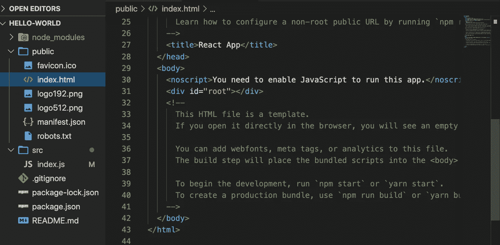
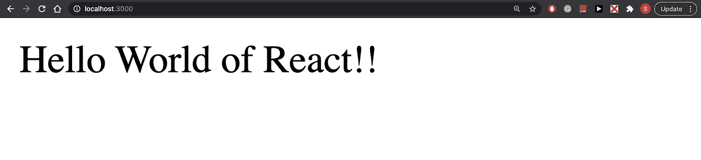
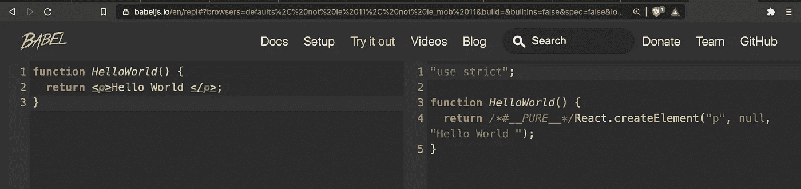
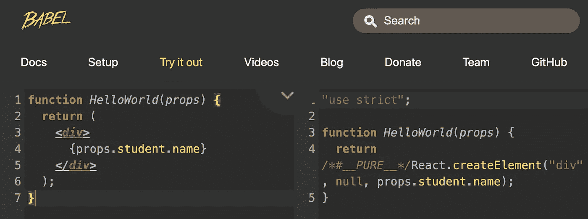
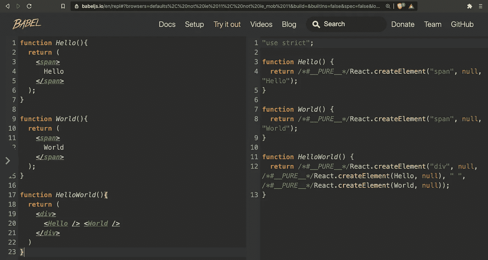
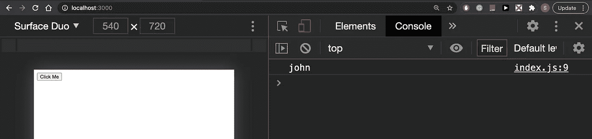

# React 中的 Web 开发:功能组件:简介、HelloWorld 和 JSX

> 原文：<https://javascript.plainenglish.io/web-development-in-react-functional-based-component-introduction-helloworld-and-jsx-313212d6fcc2?source=collection_archive---------10----------------------->

## React 和 JavaScript 教程

## 第 1 部分:我们将研究功能组件如何在 React 中工作


React 是 JavaScript 中最著名的库，在过去几年中，它的需求增长非常快。

**环境设置**

我们将使用 VS studio 代码编辑器和 MAC 操作系统。如果你使用的是其他操作系统，在大多数情况下，你不会面临任何不同。唯一的区别是安装了一些包，所以只需进入各自的文档，你应该很好。

## 工具

*   NPM
*   节点. js
*   网页浏览器
*   [React-开发者工具](https://github.com/facebook/react-devtools/)
*   VS 代码文本编辑器

# HelloWorld

安装了 node 和 npm 之后，我们就可以编写第一段代码了。

## 第一步:

转到您喜欢的文件夹，键入以下命令

```
$ create-react-app hello-world
$ cd hello-world
```

在 VS 代码中打开此项目。在 hello-world 目录下，您将拥有以下结构


在 src 文件夹中，我们有这些文件。我们有 index.js，在这个文件下我们呈现 App.js

我们将在后面看到这些文件是如何工作的。现在，我们将删除 src 文件夹中的所有内容，并从头开始。

您可以选择并删除这些文件，或者只运行此命令

```
$ rm -rf src/*$ touch **src/index.js**
```

## 第二步:

在 src/index.js 文件中添加以下代码

# JSX

如果你以前从未见过这种代码，这就是 [JSX](https://reactjs.org/docs/introducing-jsx.html) 。我们将函数 HelloWorld 声明为任何 JS 函数。我们内部有一个返回函数，里面有< div >标签。这种 JS 和 HTML 的奇怪组合，使得 React 如此有趣，而且相对来说更容易使用。就像 HTML 标签一样，我们可以使用这个函数，并像使用自定义标签一样使用它(在 React 的情况下是一个自定义函数)。我们不能像 ES5 一样使用<脚本>标签。

> 第 1，2 行:我们导入 React 和 ReactDOM
> 
> 第 4 行:我们声明了一个函数，这是一个 JSX，它只是从 React 返回一条语句“Hello World！!'
> 
> 第 12 行:我们在 index.html 文件中的#root 标签中呈现这个函数，如下所示。



现在，你很清楚这些标签是如何工作的，在普通 JS 的帮助下，我们可以用 HTML 呈现我们的功能组件。太酷了！！！

要运行，只需键入以下命令

```
npm start
```



# 深入挖掘反应

JSX 看起来非常类似于 HTML(准确地说是 XHTML)。上面第 12 行中的 ReactDOM.render 方法有两个参数，第一个是组件或 React 元素，以及你想在哪里进行渲染(在我们的例子中，index.html 里面有#root 标签)。

```
ReactDOM.render([your React Element/Component], [DOM element])
```

你注意到的另一件事是，React 的 HTML 标签没有引号。因此，很明显，React 不是以 HTML 的形式接受和放置这些元素，而是以另一种不同的方式。事实上，很多事情都在幕后进行，在巴别塔的帮助下，我们可以看到正在发生的事情。JSX 实际上创建了 DOM 元素，然而，在 JSX 的帮助下，这变得非常容易。

## JSX 编译成 JS



go [here](https://babeljs.io/en/repl#?browsers=defaults%2C%20not%20ie%2011%2C%20not%20ie_mob%2011&build=&builtIns=false&spec=false&loose=false&code_lz=GYVwdgxgLglg9mABACQKYBt1wOpwE7oAmAFAJSIDeAUIonqlCHkgDwAOAfGpnIrgYUQsA9JwDcVAL5A&debug=false&forceAllTransforms=false&shippedProposals=false&circleciRepo=&evaluate=false&fileSize=false&timeTravel=false&sourceType=module&lineWrap=true&presets=env%2Creact%2Cstage-2&prettier=false&targets=&version=7.12.7&externalPlugins=) to see the code

现在，我们可以看到代码的魔鬼。我的意思是右侧有点难以理解，但请记住它只是一个简单的函数(HelloWorld())，对于复杂的逻辑，我们不想使用普通的 JS 来创建、更新和其他操作，React 看起来更容易和直观。这就是我们使用 React 的原因。

React.createElement 函数的签名:

```
React.createElement(
   string|element,
   [propsObject],
   [children...]
)
```

HTML 标记放在 string|element 部分的内部，或者任何组件(HelloWorld)也可以放在那里。propsObject 和 children 是可选的。



with the help of props, we can move data around

如果我们把程序的 Hello 和 World 部分分开，Babel 会把它转换成这样:

> 提示:功能组件总是返回单个元素。如您所见，Hello 函数返回一个 span 标记，与 World 函数相同。HelloWorld 函数返回一个 div 标签。我们可以使用 fragment 或 div 标签来返回功能组件的值。



# JSX 境内的 JavaScipt

我们将创建一个简短的程序，看看如何在 JSX 使用 JS。我们的程序很短，当我们按下按钮时，它只会记录名字。

## 示例 1:在 React 的功能组件中创建一个按钮

> 第 1 行:导入 ReactDOM。
> 
> 第 2 行:我们创建了一个名为 HelloWorld 的功能组件。
> 
> 第 5 行:返回语句
> 
> 第 6 行:div 标签开始
> 
> 第 7 行:我们创建了一个按钮，并有一个事件处理程序 onClick，它在每次点击时运行。这个 onClick 函数在每次点击时打印 john 这个名字。
> 
> 第 15 行:ReactDOM.render 函数有两个参数，第一个是 HelloWorld 组件，另一个是# root DOM 元素。



## 到目前为止我们学到了什么？

首先，我们用 create-react-app 创建了我们的程序，并学习了 app 的结构。我们删除了 src 文件夹里的所有文件，从头开始。我们创建了一个 index.js 文件，将 React 代码放入其中。然后我们了解了什么是 JSX，以及 HTML 和 JS 在 JSX 是如何工作的。在那之后，我们创建了第一个应用程序，当我们按下 Click Me 按钮时，它同时使用 JSX 和 JS 来打印一个人的名字。

我们将在未来的教程中回到基础，因为一个强大的基础是必要的，以容纳即将到来的重要主题。下期教程再见:)

你可以在我的 YouTube 频道上找到更多关于编程的教程，科技与萨兰，[https://www.youtube.com/channel/UCOHJCOprtOf4caI50lJlHSQ](https://www.youtube.com/channel/UCOHJCOprtOf4caI50lJlHSQ)

马修·T·雷德在 [Unsplash](https://unsplash.com/t/nature?utm_source=unsplash&utm_medium=referral&utm_content=creditCopyText) 上的照片