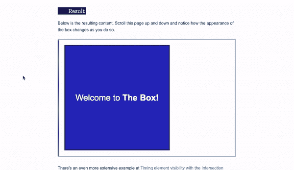
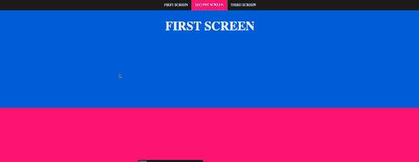
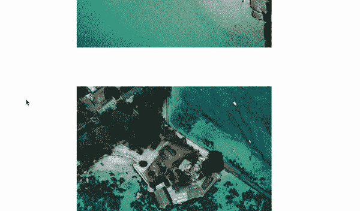
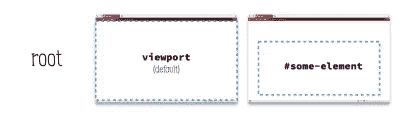
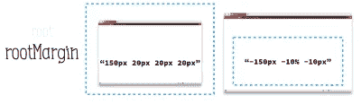
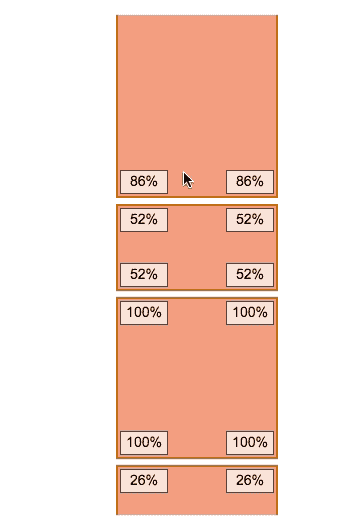
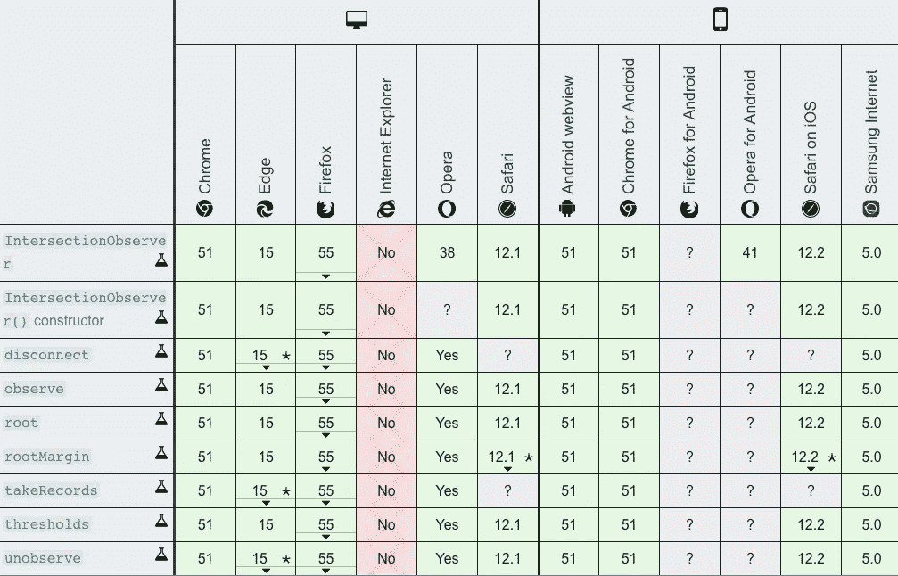

# 使用交叉点观察器 API 的网页优化

> 原文：<https://javascript.plainenglish.io/web-optimization-using-intersection-observer-api-68367c4bf9ee?source=collection_archive---------2----------------------->

## 使用示例学习交叉点观察器 API


## 用例子深入学习

isInterSecting 属性:检测被观察元素在框架中是否可见

# 接口:

## 示例 1:根据相交率更改背景颜色



## 示例 2:当前部分的突出显示



## 示例 3:图像惰性加载



# 为什么？什么？怎么会？

## 什么是懒装？

随着图像成为网络上最流行的内容类型，网站的页面加载时间很容易成为一个问题

*   延迟加载图像意味着异步加载网站上的图像——也就是说，只有当上面的内容出现在浏览器的视窗中时，它们才会被完全加载
*   这意味着如果用户不一直向下滚动，位于页面底部的图像甚至不会被加载
*   例如， [medium](https://medium.com/) 使用延迟加载:将页面的该部分滚动到视图中会触发用全分辨率照片替换占位符

## 为什么要在意懒装？

*   **用户体验；**快速加载 DOM 可以让用户留下来享受增强的用户体验
*   **节省带宽**；加载某些只在视口内可见的图像意味着节省带宽；大多数用户，尤其是那些通过移动设备和慢速连接访问网络的用户将从中受益

## 什么是交叉点观察器 API

根据 [MDN](https://developer.mozilla.org/en-US/docs/Web/API/Intersection_Observer_API) 的说法，交集观察器 API 提供了一种异步观察目标元素与祖先元素或顶层文档视窗交集变化的方法

换句话说，`IntersectionObserver`异步观察一个元素与另一个元素的重叠

## 为什么选择交叉点观察器 API

在名为 [*的文章中描述了 5 种以上的延迟加载图片的方法，5 种延迟加载图片以提高网站性能的方法*](https://www.sitepoint.com/five-techniques-lazy-load-images-website-performance/) *。*

出于以下原因，我将把重点放在由交叉点观察器 API 实现的延迟加载上

*   根据 MDN 的说法，交叉点观察器 API 目前(截至 2020 年 6 月)处于**工作草案**的状态，并且很可能在不久的将来成为 JavaScript 的新标准
*   交集观察者 API 非常强大，易于实现；`intersectionObserver`在内部完成大多数困难的计算
*   交叉点观察器 API 非常兼容浏览器；大多数浏览器在其最新版本中都支持它；如果没有，可以使用多填充物

## 观察者与事件

常规事件和观察者之间的区别在于，默认情况下，前者对事件的每一次发生都作出同步**反应，影响主线程的响应，而后者应该异步**反应**而不会对性能产生太大影响**

Observer 的异步特性导致几个可观察对象同时被传递给一个回调函数。因此，这个回调函数不应该期望一个条目，而应该期望一个`Array`条目

[一篇关于回调实践的好文章](https://medium.com/javascript-in-plain-english/google-javascript-technical-interview-7a20accd6ddf)

## 如何计算交集

**1。所有区域都被识别为矩形**

交叉点观察器 API 考虑的所有区域都是矩形；形状不规则的元素被认为占据了包围元素所有部分的最小矩形

**2。根与根边缘的交点**

**根**

`root`是用于观察的根元素。默认情况下，`root`是浏览器的**视窗**，但实际上可以是 DOM 中的任何元素(类似于`document.getElementByID('your-element'))`

****重要**** *你要观察的元素多“活”在* `*root*` *的 DOM 树*



**根缘**

`rootMargin`定义`root`元素周围的边距，当`root`的尺寸没有提供足够的灵活性时，该边距会扩展或收缩“捕捉帧”

该配置值的选项与 CSS 中的`margin`类似，例如`rootMargin: '50px 20px 10px 40px'`(上、右、下、左)



**3。阈值**

交叉点观察器 API 使用**阈值，而不是报告目标元素可见程度的每一个微小变化。**当您创建一个观察者时，您可以提供一个或多个数值来表示可见的目标元素的百分比

然后，API 只报告跨越这些阈值的可见性变化

例如:

**第一个框**非常敏感，因为它对可见性的每个百分点都有一个**阈值**，例如

```
[0.00, 0.01, 0.02, 0.03, ... , 1.00]
```

而**最后一个框**的反应性较低，因为其每 25%的可见度具有**阈值**:

```
0%, 25%, 50% etc...
```



## 创建交叉点观察器

```
let **options** = { **// (1)**root: document.querySelector('#scrollArea'),rootMargin: '0px',threshold: 1.0
}let **callback** = (entries, observer) => { **// (2)**entries.forEach(entry => {});}; let observer = new IntersectionObserver(**callback // (2)**, **options // (1)** );
```

现在我们应该给`IntersectionObserver`实际的元素去观察

这仅仅通过将元素传递给`observe()`函数来实现

```
const img = document.getElementById('image-to-observe');
observer.observe(image);
```

**关于观察元素**有几点需要注意

*   如果将`root`设置为 DOM 中的一个元素，那么观察到的元素应该位于`root`的 DOM 树中
*   `IntersectionObserver`一次只能接受一个要素进行观察，不支持批量供应进行观察。如果你需要观察几个元素(比如说一个页面上的几个图像)，你必须迭代所有的元素并分别观察它们

```
const images = document.querySelectorAll('img');
images.forEach(image => {
  observer.observe(image);
});
```

**浏览器兼容性**

`Intersection Observer API`具有相当好的浏览器兼容性；它对除 IE(互联网浏览器)之外的所有浏览器都有很好的服务



# 通过示例深入学习

## **isInterSecting 属性:检测观察到的元素在框架中是否可见**

`isIntersecting`是指示所观察的元素当前是否与“捕捉帧”相交的便利属性

当然，我们可以通过观察`intersectionRect`(如果这个矩形不是 0 x 0，那么元素与“捕捉帧”相交)来获得这个信息，但是为我们预先计算这个是非常方便的

下面的代码片段显示了一个回调，该回调使用`isintersecting`、`intersectionRatio`属性记录元素从不与根相交转变为至少 75%相交的次数

## 接口

**intersecionobserver**

交集观察者 API 的主要介面。每个观察者可以异步地观察一个或多个目标元素与共享的祖先元素之间或与它们的顶层`Document`的视口的交集中的变化

**intersectionobserver renty**

描述目标元素与其根容器之间在特定转换时刻的交集。它只能通过两种方式获得；

1.  对`IntersectionObserver`回调的输入
2.  通过调用`IntersectionObserver.takeRecords()`

## **例 1:根据交点率改变背景颜色**


**HTML**

**CSS**

它对元素进行了布局，并确定了`background-color`和`border`属性可以参与 CSS 转换，当元素变得或多或少模糊时，我们将使用它们来影响对元素的更改

**JavaScript**

设置:

创建交叉点观察点:

构建阈值比率数组:

处理交叉点变化:

## 示例 2:当前部分的突出显示

让我们用`IntersectionObserver`代替`scroll`事件。在这个例子中，我们应该根据文档的滚动位置突出显示当前部分


**HTML**

简单的导航`navbar`和`div`的 HTML 标记。`data-ref`指向每个`div`的`id`，例如，

```
data-ref="first-screen" --> <div id="first-screen"> 
...
data-ref="third-screen" --> <div id="third-screen">
```

**CSS**

CSS 给出了`min-height`和`background-color`来区分每个`div` s

**JavaScript**

`IntersectionObserver`配置，适用于所有类名为`screen`的`div`

`intersectionHandler`处理器逻辑

```
function intersectionHandler(entry) {

  const currentlyActive = document.querySelector('nav li.active');
  const shouldBeActive = 
    document.querySelector('nav li[data-ref=' + id + ']');
```

## 示例 3:图像惰性加载


**HTML**

一堆图像缠绕着`image-container` & `image-wrapper`类

```
<div class="image-container">
    <div class="image-wrapper">
     ... 
    </div>
</div>
```

**CSS**

`lazyload`具有基本过渡效果的类

```
.lazyload {
  opacity: 0;
  width: 100%;
  height: 360px;
  transition: opacity 0.5s ease;
  vertical-align: middle;
}
.lazyload.loaded {
  opacity: 1;
  height: auto;
}
```

**JavaScript**

未提供具体的`config`；因此，

…(如上所述)

`root`是用于观察的根元素。默认情况下，`root`是浏览器的**视窗**，但实际上可以是 DOM 中的任何元素(类似于`document.getElementByID('your-element'))`

…

当`div`为`intersecting`时

```
if (entry.isIntersecting) { ... }
```

然后添加一个类名`loaded`

```
entry.target.classList.add('loaded');
```

## 摘要

在现代浏览器中有很好的支持，并且易于使用


**的好处**的好处`**IntersectionObserver**`

*   `IntersectionObserver`是一个异步非阻塞 API
*   `IntersectionObserver`在`scroll`或`resize`活动中替代昂贵的听众
*   `IntersectionObserver`遵循其他观察者的结构模式，所以理论上，如果你熟悉其他观察者的工作方式，应该很容易理解

> 享受用`IntersectionObserver` API 编码的乐趣！

## **简单英语的 JavaScript**

喜欢这篇文章吗？如果有，通过 [**订阅我们的 YouTube 频道**](https://www.youtube.com/channel/UCtipWUghju290NWcn8jhyAw) **获取更多类似内容！**


Photo by [KOBU Agency](https://unsplash.com/@kobuagency?utm_source=medium&utm_medium=referral) on [Unsplash](https://unsplash.com?utm_source=medium&utm_medium=referral)